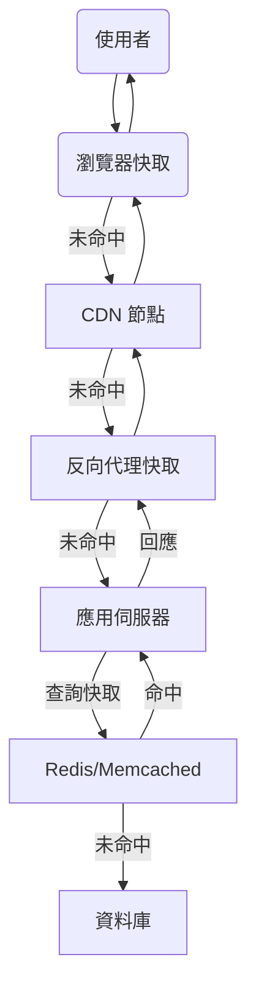

# Cache、CDN、Redis、Memcached 與快取策略原理與實務

## 1. Cache 理論解釋

### 什麼是 Cache？
Cache（快取）是一種用於暫存資料的技術，目的是加速資料存取、減少延遲與降低後端負載。常見於 CPU、作業系統、資料庫、Web 應用等多層架構。

### Cache 的層級
- **客戶端快取**：如瀏覽器快取
- **CDN（內容傳遞網路）**：分散式節點快取靜態內容
- **反向代理快取**：如 Nginx、Varnish
- **應用層快取**：如 Redis、Memcached
- **資料庫快取**：如查詢結果快取

---

## 2. CDN、Redis、Memcached 原理與比較

### CDN（Content Delivery Network）
- **原理**：將靜態內容（圖片、影片、JS、CSS）分散至全球節點，使用者請求時由最近節點回應，降低延遲與原伺服器壓力。
- **適用場景**：靜態資源、全球用戶、流量高峰。

### Redis
- **原理**：基於記憶體的 Key-Value 資料庫，支援多種資料結構（String、Hash、List、Set、Sorted Set），具備持久化、複寫、叢集等功能。
- **優點**：高效能、支援複雜資料結構、支援持久化。
- **缺點**：單執行緒（但效能極高）、資料量受限於記憶體。

### Memcached
- **原理**：分散式記憶體物件快取系統，僅支援簡單 Key-Value（String）。
- **優點**：極高效能、分散式擴展容易、架構簡單。
- **缺點**：不支援持久化、資料結構單一、不支援複雜操作。

### Redis vs Memcached
| 項目         | Redis                  | Memcached           |
|--------------|-----------------------|---------------------|
| 資料結構     | 多樣（String, Hash等）| 單一（String）      |
| 持久化       | 支援                  | 不支援              |
| 分散式       | 支援（Cluster）        | 支援                |
| 效能         | 極高                  | 極高                |
| 適用場景     | 需複雜操作/持久化     | 單純快取            |

---

## 3. Cache Strategies（快取策略）

### LRU（Least Recently Used，最近最少使用）
- **原理**：淘汰最久未被存取的資料。
- **適用場景**：資料存取有明顯熱區，近期資料重複率高。

### LFU（Least Frequently Used，最少使用次數）
- **原理**：淘汰存取次數最少的資料。
- **適用場景**：資料熱度長期穩定，熱門資料存取頻率高。

### 其他策略
- **FIFO**：先進先出
- **TTL**：存活時間到期自動淘汰

### 策略比較
| 策略 | 優點 | 缺點 | 適用情境 |
|------|------|------|----------|
| LRU  | 實作簡單，適合熱資料 | 熱點變化快時效果差 | 熱點明顯 |
| LFU  | 熱點穩定時效果佳 | 複雜度較高，冷資料可能長存 | 熱點穩定 |
| FIFO | 實作最簡單 | 不考慮資料熱度 | 資料週期性強 |
| TTL  | 控制資料新鮮度 | 可能提前淘汰熱資料 | 資料需定期更新 |

---

## 4. 架構圖解

### Cache 層級與命中流程



---

## 5. 真實世界配置範例

### Redis 設定（LRU 策略）

```conf
# redis.conf 片段
maxmemory 2gb
maxmemory-policy allkeys-lru
```
說明：設定最大記憶體 2GB，並採用全域 LRU 淘汰策略。

---

### Nginx 反向代理快取

```nginx
proxy_cache_path /var/cache/nginx levels=1:2 keys_zone=my_cache:10m max_size=1g inactive=60m use_temp_path=off;

server {
    location / {
        proxy_cache my_cache;
        proxy_pass http://backend;
        proxy_cache_valid 200 302 10m;
        proxy_cache_valid 404      1m;
        add_header X-Cache-Status $upstream_cache_status;
    }
}
```
說明：設定快取路徑、大小、過期時間，並於回應標頭顯示快取狀態。

---

## 6. 架構師實務建議與 Trade-off 分析

### 實務建議
- **多層快取設計**：結合 CDN、反向代理、應用層快取，提升命中率與效能。
- **依據資料特性選擇策略**：如熱點資料多選 LRU，熱度穩定選 LFU。
- **監控與調整**：定期監控命中率、延遲、資源使用，動態調整快取策略與容量。
- **資料一致性考量**：快取資料需考慮過期、失效與主資料同步機制。

### Trade-off 分析
- **效能 vs. 一致性**：快取可提升效能，但資料可能非即時最新，需設計失效機制。
- **記憶體成本 vs. 命中率**：增加快取容量可提升命中率，但硬體成本上升。
- **複雜度 vs. 維運性**：多層快取架構提升效能，但系統維運與除錯難度增加。
- **資料新鮮度 vs. 快取壽命**：TTL 設定需平衡資料新鮮度與快取命中率。

---

## 7. 結論

快取技術是現代高效能系統不可或缺的一環，合理設計多層快取、選擇合適策略並兼顧效能與一致性，能大幅提升系統表現與用戶體驗。