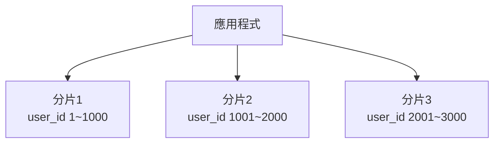
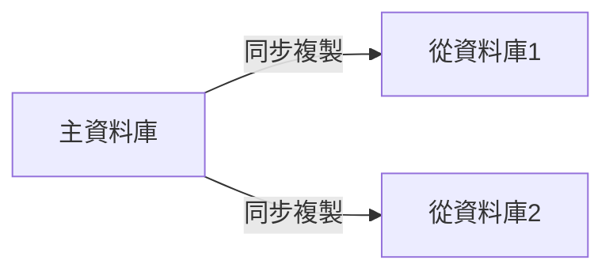
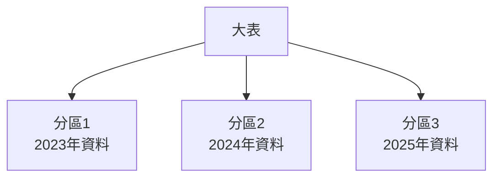

# 資料庫選擇：SQL vs NoSQL、Sharding、Replication、Partitioning

---

## 1. SQL vs NoSQL 比較與選擇理論解釋

### SQL（關聯式資料庫）

- **資料結構**：表格（Table）、行（Row）、欄位（Column），資料模式（Schema）嚴謹。
- **查詢語言**：使用結構化查詢語言（SQL）。
- **一致性**：強調 ACID（原子性、一致性、隔離性、持久性）特性。
- **適用場景**：
  - 資料結構明確、關聯性強的應用（如金融、ERP）。
  - 需要複雜查詢、交易一致性的系統。

### NoSQL（非關聯式資料庫）

- **資料結構**：文件型（Document）、鍵值型（Key-Value）、列族型（Column Family）、圖型（Graph）等，彈性高。
- **查詢語言**：多樣，依資料庫類型而異。
- **一致性**：多採用最終一致性（Eventual Consistency），強調可擴展性與高可用性。
- **適用場景**：
  - 大數據、高併發、資料結構多變的應用（如社群、IoT、即時分析）。
  - 需要橫向擴展（Scale-out）能力的系統。

### 比較表

| 項目         | SQL（關聯式）         | NoSQL（非關聯式）         |
|--------------|----------------------|---------------------------|
| 資料模式     | 嚴謹（Schema）       | 彈性（Schema-less）       |
| 一致性       | 強一致性（ACID）      | 最終一致性（BASE）        |
| 擴展性       | 垂直擴展（Scale-up）  | 水平擴展（Scale-out）     |
| 查詢能力     | 複雜、多表關聯        | 單表/單集合為主           |
| 適用場景     | 金融、交易、ERP等     | 社群、IoT、大數據         |

### 選擇建議

- **SQL 適合**：資料結構穩定、需要嚴格一致性與複雜交易的系統。
- **NoSQL 適合**：資料結構多變、需高擴展性與高可用性的應用。

---

## 2. Sharding、Replication、Partitioning 原理與圖解

### Sharding（分片）

- **定義**：將資料依某種規則（如 user_id、地區）分散存放於多個資料庫或伺服器。
- **目的**：解決單一資料庫容量與效能瓶頸，提升橫向擴展能力。
- **常見分片策略**：範圍分片（Range）、雜湊分片（Hash）、清單分片（List）。



### Replication（複製）

- **定義**：將資料同步複製到多個節點（主從、主主）。
- **目的**：提升可用性、讀取效能與容錯能力。
- **類型**：
  - 主從複製（Master-Slave）：一主多從，寫入集中於主節點，讀取可分散。
  - 主主複製（Master-Master）：多主節點可同時寫入，需解決衝突。



### Partitioning（分區）

- **定義**：將單一資料表依某欄位分割成多個邏輯區塊，仍在同一資料庫內。
- **目的**：提升查詢效能、管理大型資料表。
- **常見分區方式**：範圍分區、清單分區、雜湊分區。



---

## 3. 真實世界配置範例

### MySQL 分片與複製設定片段

**主從複製（Master-Slave）設定：**

主節點（my.cnf）：
```ini
server-id=1
log-bin=mysql-bin
```
從節點（my.cnf）：
```ini
server-id=2
relay-log=relay-bin
```
複製指令：
```sql
CHANGE MASTER TO MASTER_HOST='主機IP', MASTER_USER='replica', MASTER_PASSWORD='密碼', MASTER_LOG_FILE='mysql-bin.000001', MASTER_LOG_POS=4;
START SLAVE;
```

**分區範例：**
```sql
CREATE TABLE orders (
  id INT,
  order_date DATE
) PARTITION BY RANGE (YEAR(order_date)) (
  PARTITION p2023 VALUES LESS THAN (2024),
  PARTITION p2024 VALUES LESS THAN (2025)
);
```

### MongoDB Sharding 設定片段

**啟用分片：**
```shell
sh.enableSharding("mydb")
sh.shardCollection("mydb.users", { "user_id": 1 })
```

**Replica Set 範例：**
```shell
rs.initiate(
  {
    _id: "rs0",
    members: [
      { _id: 0, host: "mongo1:27017" },
      { _id: 1, host: "mongo2:27017" },
      { _id: 2, host: "mongo3:27017" }
    ]
  }
)
```

---

## 4. 架構師實務建議與 trade-off 分析

### 架構師建議

- **需求導向**：根據業務需求選擇資料庫類型與架構，避免過度設計。
- **擴展性規劃**：預留橫向擴展（Sharding）、高可用（Replication）與效能優化（Partitioning）彈性。
- **監控與備援**：設置監控、定期備份，確保資料安全與可用性。
- **資料一致性**：根據應用需求選擇強一致性或最終一致性，並設計補償機制。

### Trade-off 分析

| 技術         | 優點                                   | 缺點/挑戰                                 |
|--------------|----------------------------------------|-------------------------------------------|
| Sharding     | 水平擴展、分散壓力                     | 跨分片查詢困難、分片規則需謹慎規劃         |
| Replication  | 高可用、讀取效能提升                   | 寫入延遲、同步衝突、資料一致性挑戰         |
| Partitioning | 單表效能提升、管理方便                 | 分區規則需規劃、維護複雜                   |
| SQL          | 強一致性、複雜查詢、成熟生態           | 擴展性有限、Schema 變更較困難              |
| NoSQL        | 高擴展性、彈性結構、適合大數據         | 一致性弱、複雜查詢有限、學習曲線           |

---

## 結論

資料庫選擇與架構設計需依據實際業務需求、資料特性與未來擴展性規劃，綜合考量 SQL/NoSQL、Sharding、Replication、Partitioning 等技術，並評估其 trade-off，才能打造穩健且可持續發展的系統。