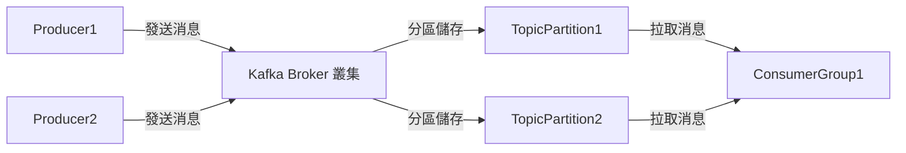
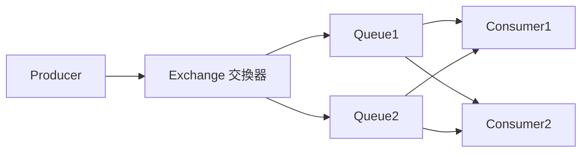
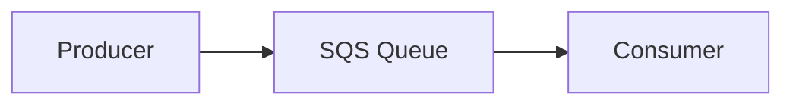
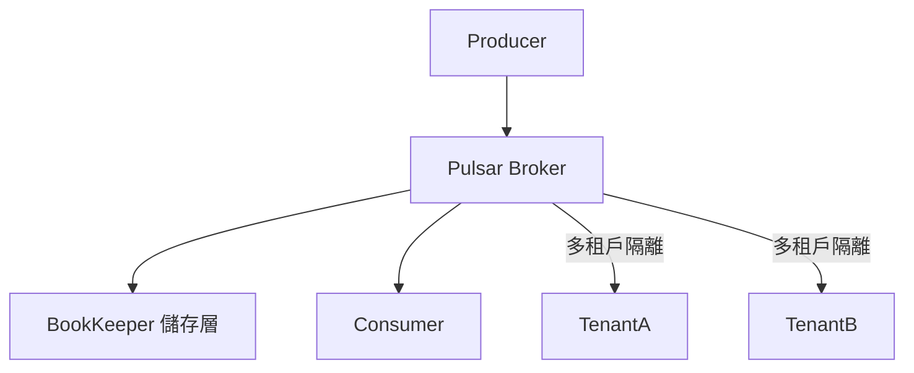

# 消息隊列理論與主流方案比較：Kafka、RabbitMQ、SQS、Pulsar

## 1. 消息隊列理論解釋

消息隊列（Message Queue, MQ）是一種異步通訊機制，允許系統中的不同元件透過發送與接收消息來解耦、削峰填谷、提升可用性與擴展性。常見應用場景包括：事件驅動架構、任務分發、流量削峰、資料同步等。

### 核心概念
- **Producer（生產者）**：發送消息到隊列的應用。
- **Consumer（消費者）**：從隊列接收並處理消息的應用。
- **Broker（代理/中介）**：負責存儲、路由、分發消息的伺服器。
- **Topic/Queue**：消息分類或通道，決定消息流向。

---

## 2. Kafka、RabbitMQ、SQS、Pulsar 原理與比較

| 特性         | Kafka                                   | RabbitMQ                              | AWS SQS                                | Pulsar                                 |
|--------------|-----------------------------------------|---------------------------------------|----------------------------------------|----------------------------------------|
| 類型         | 分散式日誌/流處理                       | AMQP 消息代理                         | 雲端託管消息隊列                       | 分散式流平台                           |
| 傳遞語意     | 至少一次、可配置                        | 至少一次、可配置                      | 至少一次、最多一次                     | 至少一次、可配置                       |
| 持久化       | 強（磁碟為主，支援高吞吐）              | 強（磁碟/記憶體，支援事務）           | 強（雲端持久化）                        | 強（分層存儲，支援熱/冷資料）          |
| 順序保證     | 分區內有序                              | 隊列內有序                            | 無法保證全局順序                       | 分區內有序                             |
| 延展性       | 高（分區橫向擴展）                      | 中（叢集可擴展但有瓶頸）              | 高（雲端自動擴展）                      | 高（分離計算與儲存，彈性擴展）         |
| 消費模式     | Pull（主動拉取）                        | Push（主動推送）                      | Pull                                   | Pull/Push 皆支援                       |
| 典型場景     | 日誌收集、流處理、大數據管道            | 任務分發、即時訊息、事務處理          | 雲端服務整合、簡單隊列需求              | 多租戶、雲原生、混合流/隊列場景        |
| 管理便利性   | 需自行維運                              | 需自行維運                            | 雲端全託管，無需維運                    | 需自行維運（雲端服務逐漸成熟）         |
| 生態系       | 豐富（Kafka Connect、Streams 等）       | 豐富（多語言、插件）                  | AWS 生態整合                           | 新興，支援多協議（Kafka、AMQP等）      |

---

## 3. 架構圖解

### Kafka 訊息流動架構


### RabbitMQ 系統架構


### AWS SQS 基本架構


### Pulsar 多租戶分層架構


---

## 4. 真實世界配置範例

### Kafka 範例設定（server.properties 節錄）
```properties
broker.id=1
log.dirs=/tmp/kafka-logs
zookeeper.connect=localhost:2181
num.partitions=3
log.retention.hours=168
```

### RabbitMQ 範例設定（rabbitmq.conf 節錄）
```ini
listeners.tcp.default = 5672
default_user = guest
default_pass = guest
loopback_users.guest = false
vm_memory_high_watermark = 0.4
```

### AWS SQS 建立隊列（AWS CLI 範例）
```bash
aws sqs create-queue --queue-name my-queue --attributes VisibilityTimeout=60
```

### Pulsar 範例設定（broker.conf 節錄）
```properties
zookeeperServers=localhost:2181
bookkeeperMetadataServiceUri=zk+hierarchical://localhost:2181/ledgers
managedLedgerDefaultEnsembleSize=3
brokerServicePort=6650
```

---

## 5. 架構師實務建議與 Trade-off 分析

### 選型建議
- **Kafka**：適合高吞吐、流處理、大數據場景。需注意維運複雜度與硬體資源需求。
- **RabbitMQ**：適合事務性、即時性要求高的任務分發。支援多種協議與複雜路由，但在高吞吐下易成瓶頸。
- **AWS SQS**：雲端原生、無須維運，適合簡單隊列需求或雲端服務整合，但功能彈性較低。
- **Pulsar**：適合多租戶、混合流/隊列、雲原生架構。彈性高但生態尚在發展中。

### Trade-off 分析
- **維運成本**：SQS最低，Kafka/Pulsar最高（需自行維運叢集），RabbitMQ中等。
- **擴展性**：Kafka/Pulsar最佳，RabbitMQ有限，SQS依賴 AWS。
- **功能彈性**：Pulsar > Kafka > RabbitMQ > SQS。
- **生態系統**：Kafka最成熟，Pulsar新興但快速成長，RabbitMQ穩定，SQS依賴 AWS 生態。

### 實務建議
- 評估業務需求（吞吐、延遲、可靠性、維運能力）。
- 若需高吞吐與流處理，優先考慮 Kafka 或 Pulsar。
- 若需複雜路由與協議支援，RabbitMQ 較佳。
- 若團隊維運能力有限或偏好雲端，SQS 是首選。
- Pulsar 適合多租戶、混合場景或需支援多協議的雲原生架構。

---

## 6. 參考資料

- [Apache Kafka 官方文件](https://kafka.apache.org/documentation/)
- [RabbitMQ 官方文件](https://www.rabbitmq.com/documentation.html)
- [AWS SQS 官方文件](https://docs.aws.amazon.com/sqs/)
- [Apache Pulsar 官方文件](https://pulsar.apache.org/docs/)
