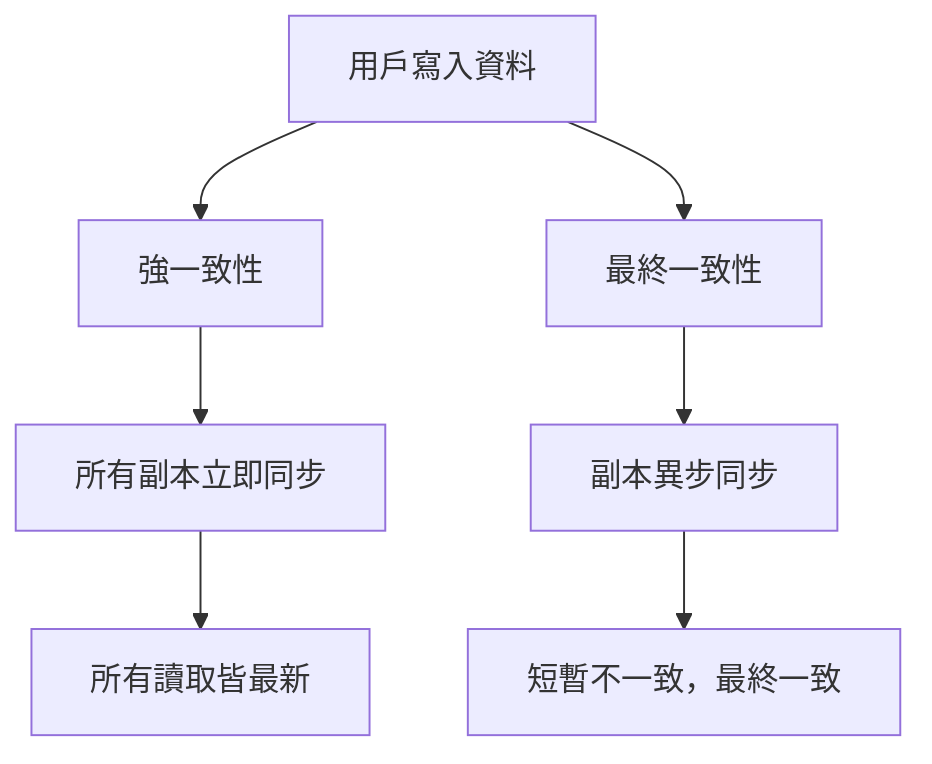
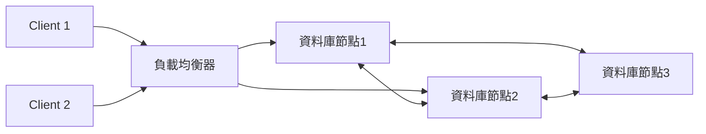

# 資料一致性與分散式系統

## 1. 資料一致性理論與分散式系統挑戰

在分散式系統中，資料一致性（Consistency）是指多個節點或副本間資料狀態的一致性。常見一致性模型如下：

- **強一致性（Strong Consistency）**
  每次寫入後，所有讀取都能立即看到最新的資料。常見於單一資料庫或同步複寫架構。
  優點：資料不會出現不同步。
  缺點：延遲高、可用性受限，難以擴展。

- **弱一致性（Weak Consistency）**
  系統不保證所有節點隨時一致，資料可能短暫不同步。
  優點：高可用性、低延遲。
  缺點：資料可能暫時不一致。

- **最終一致性（Eventual Consistency）**
  系統最終會達到一致，但在短時間內可能不同步。常見於分散式資料庫、NoSQL。
  優點：高可用性、易於擴展。
  缺點：資料短暫不一致，需應用層處理衝突。

### 分散式系統挑戰

- **網路延遲與分區**：網路不可靠，訊息可能延遲或遺失。
- **節點故障**：部分節點失效時，如何維持服務與資料一致性。
- **資料同步**：多副本間如何同步資料，避免衝突。
- **CAP/PACELC 定理**：一致性、可用性、分區容忍性三者不可兼得，需根據需求取捨。

---

## 2. 架構圖解

### 一致性模型比較

### 分散式系統架構範例

---

## 3. 真實世界範例

- **分散式資料庫（如 Cassandra、DynamoDB）**
  採用最終一致性，資料寫入後會異步同步到其他節點，適合高可用、橫向擴展需求。

- **跨區同步（如多地區雲端資料同步）**
  例如 AWS S3 跨區複寫，資料會在不同地區間最終同步，確保災難復原與高可用。

- **強一致性應用（如金融交易系統）**
  需確保每筆交易資料即時一致，通常採用同步複寫或分散式鎖機制。

---

## 4. 架構師實務建議與 Trade-off 分析

- **根據業務需求選擇一致性模型**
  - 金融、訂單等需強一致性，犧牲部分可用性與效能。
  - 社群、日誌等可接受短暫不一致，選擇最終一致性以提升可用性與擴展性。

- **設計時考慮 CAP/PACELC 定理**
  - 分區容忍性（P）通常不可避免，需在一致性（C）與可用性（A）間取捨。
  - 若系統需高可用，則一致性需妥協，反之亦然。

- **資料同步策略**
  - 重要資料可採同步複寫，降低資料遺失風險。
  - 非關鍵資料可用異步複寫，提升效能。

- **應用層補償機制**
  - 最終一致性下，應用層需設計補償邏輯（如重試、衝突解決）。

- **監控與告警**
  - 建立完善監控，及時發現資料不一致或同步延遲問題。

---

## 參考資料

- [CAP Theorem](https://en.wikipedia.org/wiki/CAP_theorem)
- [Amazon Dynamo Paper](https://www.allthingsdistributed.com/files/amazon-dynamo-sosp2007.pdf)
- [PACELC Theorem](https://en.wikipedia.org/wiki/PACELC_theorem)