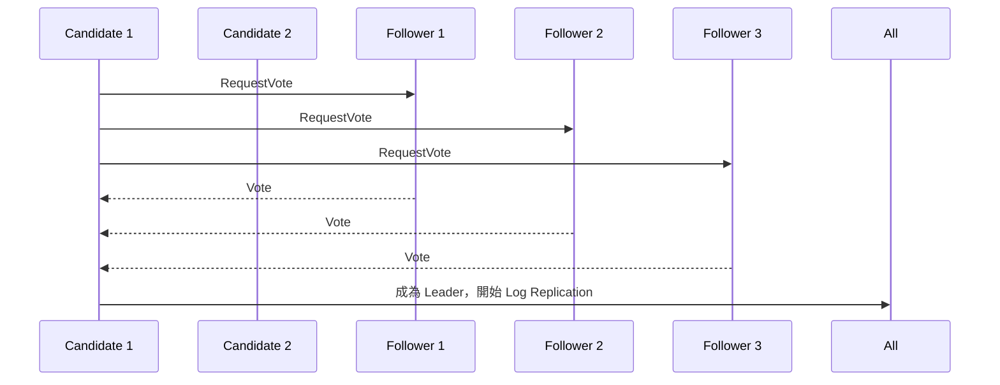
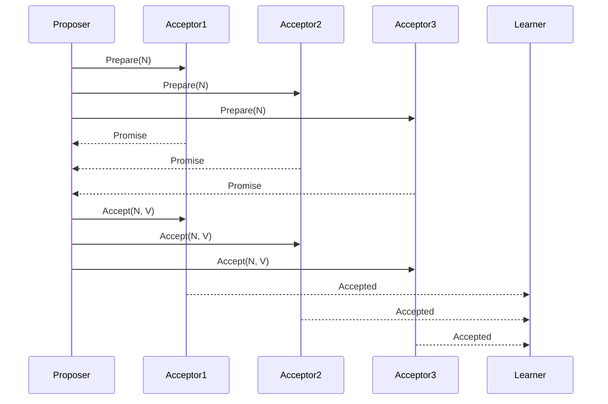
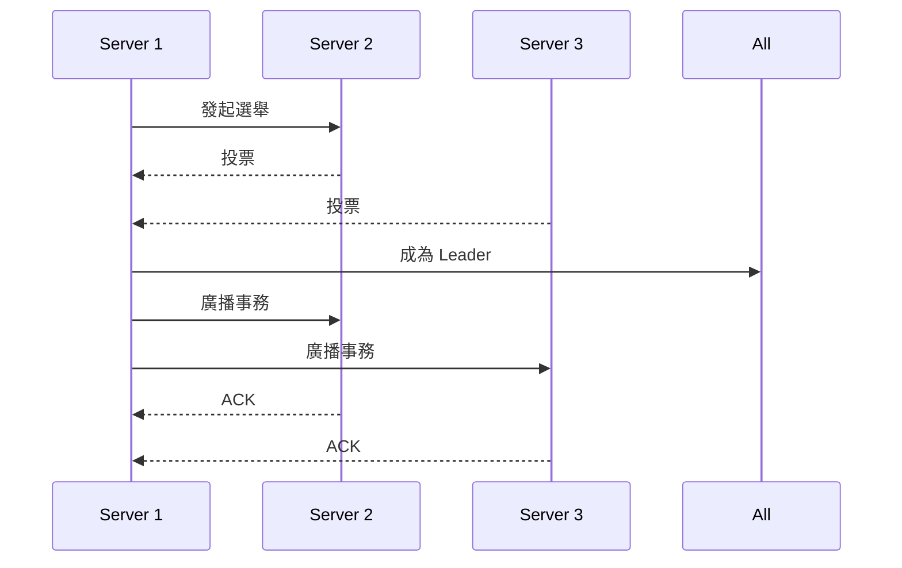

# Leader Election 與 Consensus 理論

分散式系統中，**Leader Election（領袖選舉）**是指在多個節點中選出一個負責協調工作的節點（Leader），以避免衝突並提升效率。**Consensus（共識）**則是指多個節點在面對網路延遲、節點故障等情況下，如何就某個值或狀態達成一致。這兩者是分散式系統設計的核心，確保資料一致性與高可用性。

## 為何需要 Leader Election 與 Consensus？

- **避免腦裂（Split-brain）**：多個節點同時認為自己是 Leader，導致資料不一致。
- **提升效率**：集中協調，減少衝突。
- **容錯性**：即使部分節點失效，系統仍可運作。

---

# Raft、Paxos、ZAB 原理與比較

## 1. Paxos

- **原理**：Paxos 是一種針對分散式系統設計的共識演算法，強調安全性與正確性。其流程分為 Proposer、Acceptor、Learner 三種角色，透過提案、投票、學習三階段達成共識。
- **特點**：理論嚴謹、容錯性高，但實作複雜，難以理解與維護。
- **適用場景**：需要極高一致性保證的分散式系統，如 Google Chubby。

## 2. Raft

- **原理**：Raft 強調易於理解與實作，將共識過程分為 Leader Election、Log Replication、Safety 三部分。所有寫入操作都由 Leader 處理，Follower 複製日誌，若 Leader 故障則重新選舉。
- **特點**：結構清晰、易於實作與除錯，廣泛應用於現代分散式系統。
- **適用場景**：如 etcd、Consul、TiKV 等。

## 3. ZAB（Zookeeper Atomic Broadcast）

- **原理**：ZAB 是 Zookeeper 專用的共識協議，結合 Leader Election 與原子廣播。Leader 負責處理所有寫入，Follower 同步狀態，確保順序一致性。
- **特點**：針對 Zookeeper 的需求設計，強調順序一致性與高可用。
- **適用場景**：Zookeeper 叢集管理、分散式鎖、協調服務。

---

# 架構圖解

## 1. Raft 選舉與共識流程

## 2. Paxos 共識流程

## 3. ZAB 選舉與同步流程

---

# 真實世界範例

- **Zookeeper（ZAB）**：用於分散式協調、分散式鎖、服務註冊中心。
- **etcd（Raft）**：Kubernetes 主要元件，負責儲存叢集狀態。
- **Consul（Raft）**：服務發現與配置管理。
- **Google Chubby（Paxos）**：Google 內部分散式鎖服務。
- **分散式資料庫**：如 TiKV（Raft）、CockroachDB（Raft）、Spanner（Paxos）。

---

# 架構師實務建議與 Trade-off 分析

## 1. 選擇協議時的考量

- **一致性 vs. 可用性**：Paxos 強調一致性，Raft 與 ZAB 在可用性與一致性間取得平衡。
- **實作難易度**：Raft 易於理解與維護，Paxos 理論複雜，ZAB 針對特定場景最佳化。
- **擴展性**：Raft 與 ZAB 適合中小規模叢集，Paxos 理論上可擴展但實作困難。
- **延遲與效能**：Raft 與 ZAB 延遲較低，Paxos 因多輪投票延遲較高。

## 2. Trade-off 舉例

- **Raft**：適合需要高可用、易於維護的系統（如 etcd、Consul），但 Leader 故障時會有短暫不可用。
- **Paxos**：適合極高一致性需求，但開發與維護成本高。
- **ZAB**：適合需要順序一致性與高可用的協調服務（如 Zookeeper），但僅適用於特定應用。

## 3. 架構師建議

- **選擇協議時，應根據業務需求、團隊能力、系統規模與一致性需求綜合考量。**
- **如無特殊需求，建議優先考慮 Raft，因其易於理解、社群資源豐富。**
- **若需與 Zookeeper 整合，則 ZAB 為唯一選擇。**
- **極端一致性需求下可考慮 Paxos，但需評估開發維護成本。**

---

# 參考資料

- [Raft 官方論文](https://raft.github.io/raft.pdf)
- [Paxos Made Simple](https://lamport.azurewebsites.net/pubs/paxos-simple.pdf)
- [Zookeeper 官方文件](https://zookeeper.apache.org/doc/current/zookeeperOver.html)
- [etcd 官方文件](https://etcd.io/docs/)
- [Google Chubby Paper](https://research.google/pubs/pub27897/)