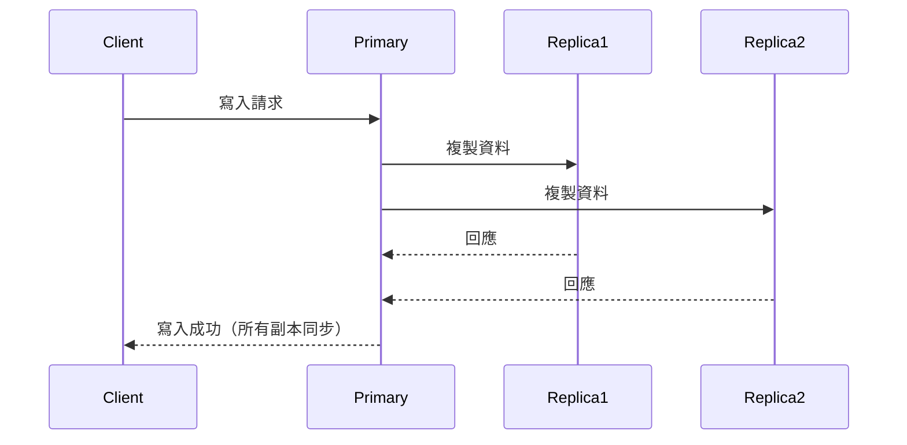
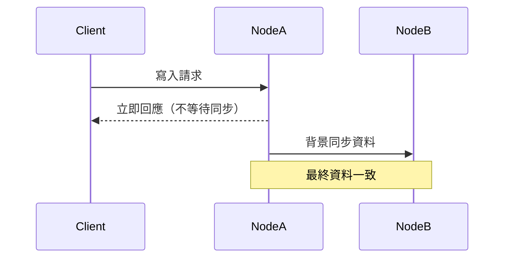

# 一致性模型理論與實務：強一致性、最終一致性、Quorum

## 1. 一致性模型理論解釋與比較

### 強一致性（Strong Consistency）
- **定義**：每次讀取都能獲得最新（最後一次成功寫入）的資料。系統對外呈現如同單一副本的效果。
- **優點**：資料永遠不會過時，對於金融、交易等場景非常重要。
- **缺點**：延遲較高，系統可用性受限，分散式環境下難以實現。

### 最終一致性（Eventual Consistency）
- **定義**：系統允許短暫的不一致，但最終所有副本都會趨於一致。常見於高可用、分散式 NoSQL 系統。
- **優點**：高可用性、低延遲，適合大規模分散式系統。
- **缺點**：短時間內可能讀到舊資料，應用需能容忍暫時不一致。

### Quorum 一致性
- **定義**：透過多數決（Quorum）機制決定操作是否成功。常見於分散式資料庫（如 Cassandra、DynamoDB）。
- **運作方式**：寫入與讀取需達到一定數量節點（如 N 個節點中，寫入 W、讀取 R，需滿足 $W + R > N$）。
- **優點**：可在一致性與可用性間彈性調整，提升容錯能力。
- **缺點**：參數設計需謹慎，否則可能犧牲一致性或可用性。

### 比較表

| 模型         | 一致性強度 | 可用性 | 延遲 | 適用場景           |
|--------------|------------|--------|------|--------------------|
| 強一致性     | 高         | 低     | 高   | 金融、交易         |
| 最終一致性   | 低         | 高     | 低   | 社交、快取、訊息   |
| Quorum一致性 | 中         | 中     | 中   | 分散式資料庫       |

---

## 2. 架構圖解

### 強一致性流程



### 最終一致性流程



### Quorum 投票機制

```mermaid
graph TD
    A[Client] -->|寫入請求| Q1[節點1]
    A -->|寫入請求| Q2[節點2]
    A -->|寫入請求| Q3[節點3]
    Q1 -->|回應| A
    Q2 -->|回應| A
    Q3 -->|回應| A
    subgraph Quorum
        Q1
        Q2
    end
    Note over Quorum: 達到 Quorum 即成功
```

---

## 3. 真實世界範例

### Cassandra
- **一致性等級**：可設定 `ONE`、`QUORUM`、`ALL` 等。
    - `QUORUM`：寫入/讀取需超過半數節點回應，平衡一致性與可用性。
    - `ONE`：只需一個節點回應，延遲低但一致性弱。
- **應用**：根據業務需求調整一致性與可用性。

### DynamoDB
- **一致性選項**：
    - 預設為最終一致性（Eventual Consistency）。
    - 可選強一致性（Strongly Consistent Read），但延遲較高。
- **Quorum 機制**：底層採用 Quorum 來確保資料可靠性。

### MongoDB
- **一致性模式**：
    - 預設為最終一致性（Primary-Secondary）。
    - 可透過 `readConcern`、`writeConcern` 調整一致性強度。

---

## 4. 架構師實務建議與 Trade-off 分析

### 實務建議
- **評估業務需求**：金融、交易等需強一致性；社交、快取可用最終一致性。
- **彈性調整**：利用 Quorum 參數（如 Cassandra 的 W、R 值）根據 SLA 動態調整。
- **監控與告警**：監控一致性延遲、資料同步狀態，及時發現異常。

### Trade-off 分析
- **一致性 vs 可用性**：CAP 定理指出兩者難以兼得，需根據場景取捨。
- **延遲 vs 資料新鮮度**：強一致性保證資料新鮮但延遲高，最終一致性則相反。
- **系統複雜度**：Quorum 機制需設計良好，避免參數設置不當導致資料不一致或可用性下降。

---

## 參考資料
- [Amazon DynamoDB 官方文件](https://docs.aws.amazon.com/zh_tw/amazondynamodb/latest/developerguide/HowItWorks.ReadConsistency.html)
- [Cassandra Consistency Level](https://cassandra.apache.org/doc/latest/cassandra/dml/dmlConfigConsistency.html)
- [MongoDB Read and Write Concerns](https://www.mongodb.com/docs/manual/reference/read-concern/)