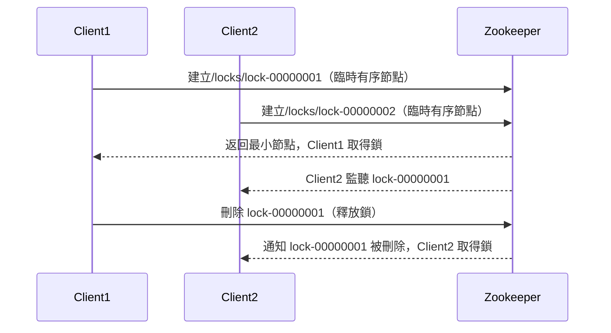
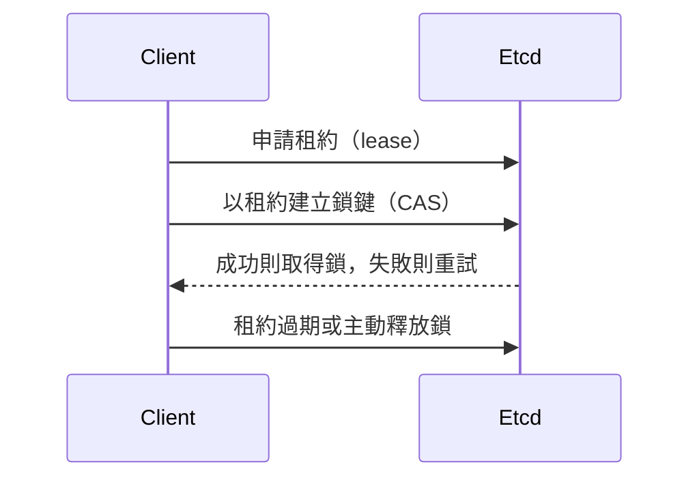
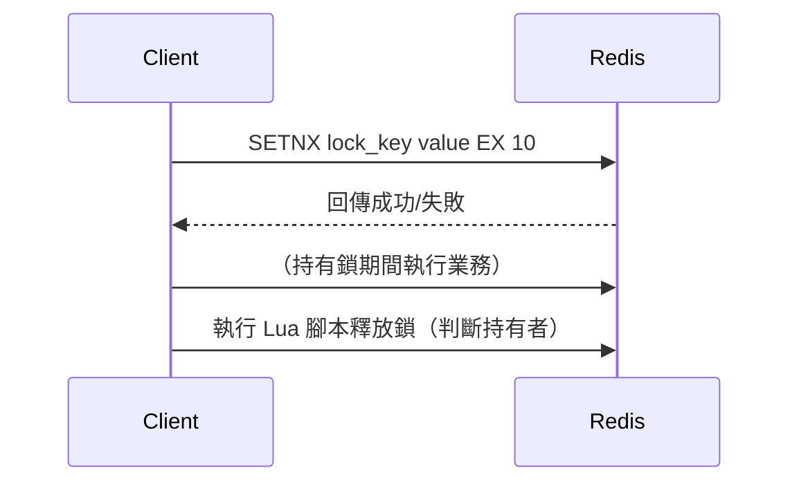

# 分散式鎖：Zookeeper、Etcd、Redis 實作原理與比較

## 一、分散式鎖理論解釋

分散式鎖（Distributed Lock）是為了解決多個分散式系統節點間對共享資源的互斥訪問問題。其核心目標是確保同一時刻只有一個節點能取得資源鎖，避免競爭條件（Race Condition）與資料不一致。

### 分散式鎖需滿足的特性
- **互斥性**：同一時間只有一個客戶端持有鎖。
- **死鎖避免**：鎖必須能自動過期或釋放，避免死鎖。
- **容錯性**：部分節點失效時，鎖服務仍可正常運作。
- **可重入性（視需求）**：同一客戶端可重複取得鎖。
- **高可用性與一致性**：鎖的狀態需在多節點間一致。

---

## 二、Zookeeper、Etcd、Redis-based 實作原理與比較

### 1. Zookeeper 分散式鎖原理

- 利用 Zookeeper 的 **臨時節點（Ephemeral Node）** 與 **有序節點（Sequential Node）**。
- 客戶端在指定目錄下建立臨時有序節點，取得最小序號者獲得鎖。
- 釋放鎖時刪除節點，其他客戶端監聽上一個節點的刪除事件，依序競爭鎖。
- 具備強一致性（ZAB 協議），適合高一致性需求場景。

### 2. Etcd 分散式鎖原理

- 基於 Etcd 的 **租約（Lease）** 與 **原子操作（Compare-And-Swap, CAS）**。
- 客戶端申請租約，並嘗試以 CAS 操作建立鎖鍵，成功則取得鎖。
- 鎖會綁定租約，租約過期自動釋放鎖，避免死鎖。
- 具備強一致性（Raft 協議），適合雲原生、Kubernetes 等場景。

### 3. Redis-based 分散式鎖原理

- 常見實作有 **SETNX + EXPIRE** 或 **Redlock 演算法**。
- 客戶端用 SETNX 嘗試建立鎖鍵，成功則取得鎖，並設置過期時間。
- 釋放鎖時需判斷持有者，避免誤刪（通常用 Lua 腳本保證原子性）。
- Redis 為 AP 系統，單點 Redis 容易因主從延遲導致鎖失效，Redlock 可提升容錯但仍有爭議。

---

### 4. 三者比較表

| 特性         | Zookeeper                | Etcd                    | Redis-based           |
|--------------|--------------------------|-------------------------|-----------------------|
| 一致性       | 強一致性                 | 強一致性                | 最終一致性（AP）      |
| 容錯性       | 高（多節點）             | 高（多節點）            | 低（單點/主從）       |
| 死鎖處理     | 臨時節點自動釋放         | 租約自動過期            | 過期時間/Redlock      |
| 性能         | 中                       | 中                      | 高                    |
| 適用場景     | 高一致性、分布式協調     | 雲原生、K8s、配置中心   | 高性能、低一致性需求  |

---

## 三、架構圖解

### 1. Zookeeper 分散式鎖流程



### 2. Etcd 分散式鎖流程



### 3. Redis 分散式鎖流程



---

## 四、真實世界範例

### 1. Redis 分散式鎖 Lua 腳本

```lua
-- 釋放鎖時需判斷持有者，避免誤刪
if redis.call("get", KEYS[1]) == ARGV[1] then
    return redis.call("del", KEYS[1])
else
    return 0
end
```

### 2. Zookeeper Ephemeral Node 範例（Python）

```python
from kazoo.client import KazooClient

zk = KazooClient(hosts='127.0.0.1:2181')
zk.start()
node_path = zk.create("/locks/lock-", ephemeral=True, sequence=True)
# 取得最小序號節點即獲得鎖
# 釋放鎖：zk.delete(node_path)
zk.stop()
```

### 3. Etcd 分散式鎖（Python）

```python
import etcd3

etcd = etcd3.client()
lease = etcd.lease(10)  # 10秒租約
lock_key = "mylock"
if etcd.transaction(
    compare=[etcd.transactions.create(lock_key) == 0],
    success=[etcd.transactions.put(lock_key, "owner", lease)],
    failure=[]
):
    print("取得鎖")
# 釋放鎖：lease.revoke()
```

---

## 五、架構師實務建議與 Trade-off 分析

### 1. 選型建議

- **Zookeeper/Etcd** 適合需要強一致性、分布式協調（如分布式排程、主選舉等）場景。
- **Redis** 適合高性能、低一致性要求（如分散式限流、非關鍵資源鎖），但需注意單點故障與主從延遲問題。
- **Redlock** 適合多 Redis 節點部署，但仍有理論爭議，建議僅用於對一致性要求不極高的場景。

### 2. Trade-off 分析

- **一致性 vs. 性能**：Zookeeper/Etcd 保證強一致性但性能較 Redis 低，Redis 性能高但一致性較弱。
- **可用性 vs. 複雜度**：Zookeeper/Etcd 架構較複雜，需維護多節點叢集，Redis 部署簡單但容錯性較低。
- **死鎖處理**：Zookeeper/Etcd 透過臨時節點/租約自動釋放，Redis 需設置合理過期時間並用 Lua 腳本防止誤刪。

### 3. 實務注意事項

- 分散式鎖僅適用於跨節點協調，單機可用本地鎖。
- 鎖粒度設計需謹慎，過細會影響效能，過粗會降低併發。
- 需監控鎖服務健康狀態，避免鎖服務異常導致業務阻塞。
- 釋放鎖時務必驗證持有者，防止誤釋放。

---

## 參考資料

- [ZooKeeper 官方文件](https://zookeeper.apache.org/doc/current/recipes.html#sc_recipes_Locks)
- [etcd 官方文件](https://etcd.io/docs/v3.5/dev-guide/api_concurrency_reference_v3/)
- [Redis 分散式鎖官方建議](https://redis.io/topics/distlock)
- [Redlock 演算法論證](https://martin.kleppmann.com/2016/02/08/how-to-do-distributed-locking.html)
