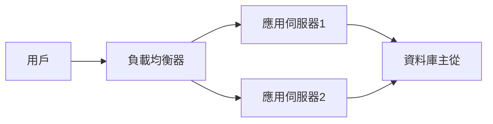
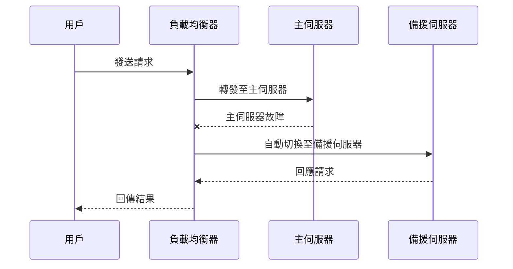

# 高可用（HA）與容錯（FT）設計

## 1. 理論解釋與常見設計模式

### 高可用（High Availability, HA）
高可用指的是系統能夠在大多數時間內持續運作，最大化服務可用性，將停機時間降至最低。常用指標為可用性百分比（如 99.99% uptime）。

### 容錯（Fault Tolerance, FT）
容錯則是指系統在部分元件發生故障時，仍能維持正常運作，不會導致整體服務中斷。容錯設計強調自動偵測、隔離與恢復故障。

### 常見設計模式
- **冗餘（Redundancy）**：關鍵元件多份部署，避免單點故障（SPOF）。
- **故障轉移（Failover）**：當主要元件失效時，自動切換至備援元件。
- **心跳監控（Heartbeat）**：持續監控元件狀態，及時發現異常。
- **自動恢復（Self-healing）**：系統能自動重啟或替換故障元件。
- **分區隔離（Partitioning）**：將系統分割，避免單一故障影響全域。

---

## 2. 架構圖解

### 冗餘架構範例

- **說明**：用戶請求經由負載均衡器分發至多台應用伺服器，後端資料庫採主從架構，提升可用性與容錯能力。

### 故障切換流程

- **說明**：主伺服器故障時，負載均衡器自動將流量導向備援伺服器，確保服務不中斷。

---

## 3. 真實世界範例

### 雙活（Active-Active）架構
- 兩個或多個資料中心同時對外提供服務，彼此同步資料，任何一方故障時，另一方可無縫承接流量。
- **應用**：跨區域雲端服務、全球 CDN、分散式資料庫（如 Cassandra）。

### 主備（Active-Passive）架構
- 一個主節點處理所有請求，備援節點待命，主節點故障時自動切換。
- **應用**：傳統資料庫主從、Redis Sentinel、Zookeeper Ensemble。

### 雲端 HA/FT 實踐
- **AWS Multi-AZ**：資料庫自動跨可用區部署，單一 AZ 故障時自動切換。
- **GCP Regional Managed Instance Group**：自動在多區域部署 VM，失效自動補足。
- **Kubernetes**：Pod ReplicaSet、Node 自動修復、Service 負載均衡。

---

## 4. 架構師實務建議與 Trade-off 分析

### 實務建議
- **明確定義可用性目標**：根據業務需求設定 SLA（如 99.9%、99.99%）。
- **避免單點故障**：所有關鍵元件（如 DB、LB、網路）皆需冗餘。
- **自動化監控與告警**：即時發現並處理異常。
- **定期演練故障切換**：驗證設計有效性。
- **資料一致性考量**：跨區域冗餘時，需平衡一致性與可用性。

### Trade-off 分析
- **成本 vs 可用性**：高可用與容錯設計需投入更多硬體、網路與維運成本。
- **複雜度 vs 穩定性**：架構越複雜，維護與故障排查難度提升。
- **一致性 vs 可用性**：分散式系統下，強一致性會降低可用性（參考 CAP 定理）。
- **延遲 vs 容錯能力**：跨區域冗餘會增加網路延遲，但提升容錯能力。

---

## 結論

高可用與容錯設計是現代系統架構不可或缺的一環。架構師需根據實際業務需求，選擇合適的設計模式與技術，並持續優化監控、演練與自動化機制，才能在成本、複雜度與可用性間取得最佳平衡。