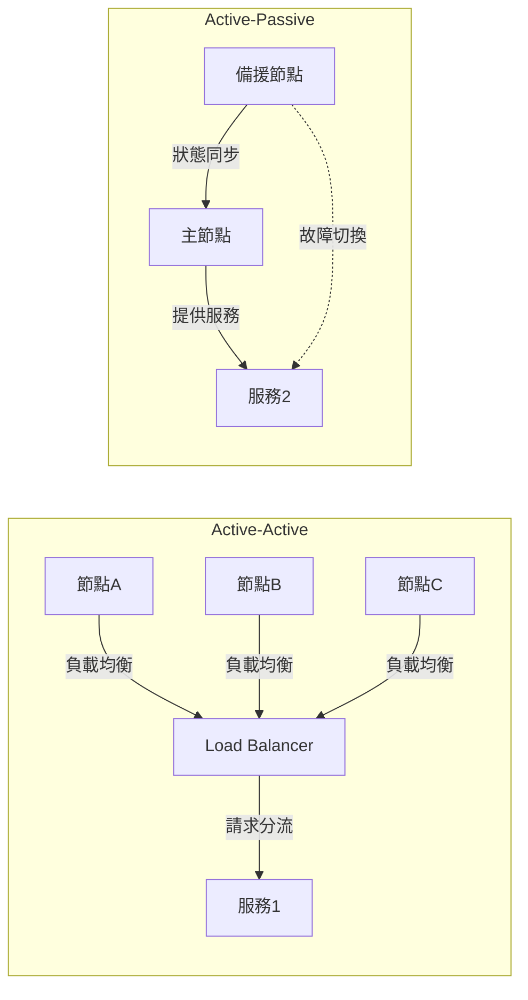
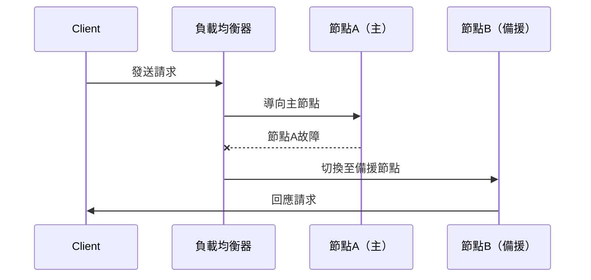

# 冗餘設計：Active-Active 與 Active-Passive

## 1. 冗餘設計理論解釋

冗餘設計（Redundancy Design）是高可用系統的核心，透過多重備援組件確保單點故障不會導致整體服務中斷。常見冗餘模式有 Active-Active（雙活/多活）與 Active-Passive（主備），兩者在運作方式、切換流程及適用場景上各有差異。

### Active-Active（雙活/多活）

- **定義**：多個節點同時對外提供服務，彼此間可分擔流量與負載。
- **特點**：
  - 所有節點皆為「主」角色，無明確主備之分。
  - 可提升資源利用率與系統吞吐量。
  - 任一節點故障時，流量自動分散至其他節點，無需人工切換。
- **適用場景**：
  - 需高可用與高擴展性的服務（如 Web 伺服器、API Gateway）。
  - 讀多寫少、可接受最終一致性的資料庫或快取系統。

### Active-Passive（主備）

- **定義**：一個主節點（Active）對外服務，備援節點（Passive）僅在主節點故障時接手。
- **特點**：
  - 備援節點平時不處理流量，僅同步狀態。
  - 切換時需進行主備轉換（Failover），過程可能有短暫中斷。
  - 實現簡單，適合狀態一致性要求高的場景。
- **適用場景**：
  - 關鍵資料庫、交易系統等需強一致性的服務。
  - 容忍短暫切換延遲的應用。

### 差異比較

| 項目           | Active-Active                | Active-Passive              |
|----------------|-----------------------------|-----------------------------|
| 資源利用率     | 高                          | 低（備援閒置）              |
| 切換時間       | 幾乎無縫                    | 需 failover，可能有延遲     |
| 一致性         | 易實現最終一致性            | 易實現強一致性              |
| 複雜度         | 較高（需處理同步/衝突）     | 較低                        |
| 適用場景       | 高可用、可容忍短暫不一致    | 關鍵資料、強一致性需求      |

---

## 2. 架構圖解

### 冗餘架構示意

### 切換流程（Failover）

---

## 3. 真實世界範例

### 雙活資料中心（Active-Active Data Center）

- 兩個地理分散的資料中心同時對外服務，流量可依地理位置或負載分配。
- 任一資料中心故障時，流量自動導向另一中心，實現業務不中斷。
- 例：全球性電商網站、跨區域 API 服務。

### 主備資料庫（Active-Passive Database）

- 一主一備架構，主資料庫處理所有請求，備庫僅同步資料。
- 主庫故障時，備庫自動升級為主庫，恢復服務。
- 例：金融交易系統、銀行核心帳務資料庫。

### 雲端服務的多區部署

- AWS RDS、Azure SQL 等支援多區域主備部署，提升資料可靠性與可用性。

---

## 4. 架構師實務建議與 Trade-off 分析

### 實務建議

- **評估業務需求**：根據服務可用性、資料一致性、預算等需求選擇合適冗餘模式。
- **測試切換流程**：定期演練 failover，確保切換流程自動化且可靠。
- **監控與告警**：即時監控節點狀態，異常時自動通知與切換。
- **資料同步策略**：Active-Active 需設計衝突解決與同步機制，Active-Passive 則需確保同步延遲可接受。

### Trade-off 分析

| 考量面向     | Active-Active                         | Active-Passive                      |
|--------------|--------------------------------------|-------------------------------------|
| 成本         | 較高（所有節點皆需資源）             | 較低（備援資源可彈性調度）           |
| 複雜度       | 高（需處理同步、衝突、分流）         | 低（主備切換較單純）                 |
| 可用性       | 極高（單點故障不影響服務）           | 高（但切換時有短暫中斷風險）         |
| 一致性       | 最終一致性為主，需設計衝突解決       | 強一致性較易實現                    |
| 維運挑戰     | 需嚴謹測試同步與分流策略             | 需確保備援切換流程無誤               |

### 綜合建議

- 關鍵業務、強一致性需求建議採用 Active-Passive。
- 高流量、可容忍短暫不一致性服務可考慮 Active-Active。
- 可混合設計（如多活主備混合），兼顧可用性與一致性。
- 持續監控與自動化切換是高可用架構的關鍵。

---