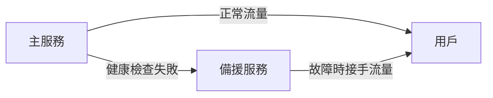
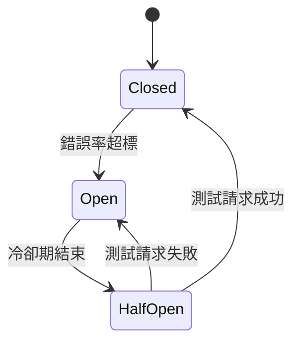
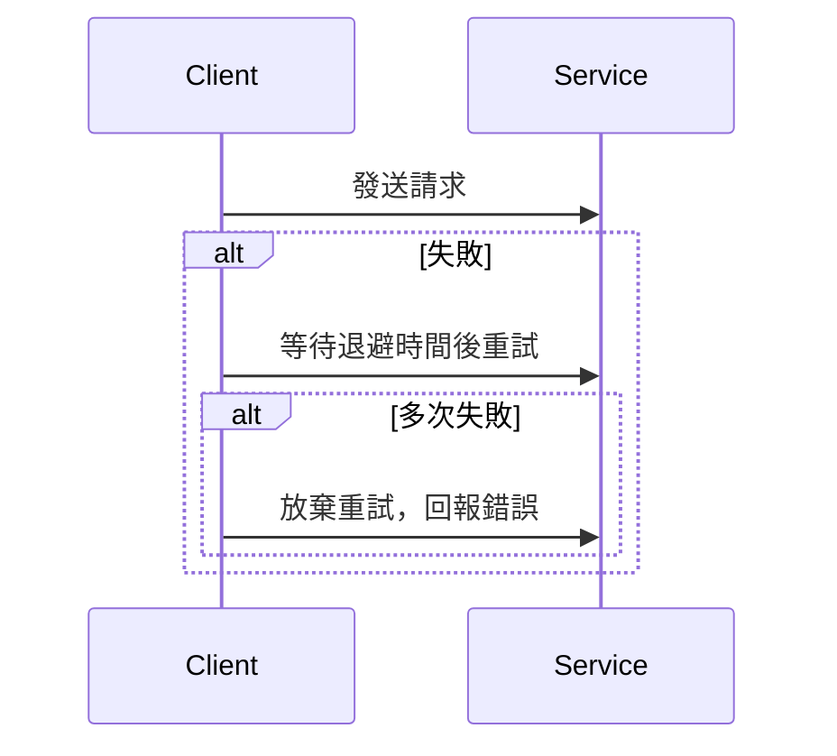

# Failover、Circuit Breaker、Retry/Backoff 理論與設計模式

---

## 1. 理論解釋與設計模式

### 1.1 Failover（故障切換）

**定義**：當系統元件發生故障時，自動將流量或服務切換至備援系統，以確保服務不中斷。
**設計模式**：
- 主備（Active-Passive）：主系統失效時，備系統接手。
- 雙活（Active-Active）：多個系統同時提供服務，任一失效時其餘繼續承擔流量。
- 自動偵測與切換：透過健康檢查（Health Check）自動判斷切換時機。

### 1.2 Circuit Breaker（斷路器）

**定義**：防止系統在下游服務異常時持續發送請求，避免雪崩效應。
**設計模式**：
- **Closed（關閉）**：正常通行，監控錯誤率。
- **Open（開啟）**：錯誤率過高時，暫停請求一段時間。
- **Half-Open（半開）**：經過冷卻期，允許部分流量測試服務是否恢復。

### 1.3 Retry/Backoff（重試與退避）

**定義**：當請求失敗時，重新嘗試並適當延遲，避免瞬間大量重試造成壓力。
**設計模式**：
- 固定間隔重試（Fixed Interval）
- 指數退避（Exponential Backoff）
- 帶抖動的退避（Exponential Backoff with Jitter）

---

## 2. 架構圖解

### 2.1 故障切換（Failover）

### 2.2 斷路器狀態流轉（Circuit Breaker）

### 2.3 重試與退避流程（Retry/Backoff）

---

## 3. 真實世界範例

- **Hystrix（Netflix）**：Java 斷路器與隔離庫，實現 Circuit Breaker、Fallback、Bulkhead 等模式。
- **Spring Cloud Circuit Breaker**：支援多種斷路器實作（如 Resilience4j、Hystrix）。
- **Kubernetes Probe**：Liveness/Readiness Probe 可用於自動偵測 Pod 健康狀態，實現 Failover。
- **AWS ELB/ALB**：內建健康檢查與自動流量切換。
- **gRPC Retry Policy**：支援重試與退避策略。

---

## 4. 架構師實務建議與 Trade-off 分析

### 4.1 實務建議

- **Failover**：務必設計自動化健康檢查與切換機制，並定期演練切換流程。
- **Circuit Breaker**：設定合理的錯誤率閾值與冷卻時間，避免誤判導致服務不可用。
- **Retry/Backoff**：重試次數與退避策略需根據下游服務特性調整，避免加劇故障。

### 4.2 Trade-off 分析

| 機制         | 優點                                   | 缺點/風險                         |
|--------------|----------------------------------------|------------------------------------|
| Failover     | 提升可用性、減少單點故障               | 切換延遲、資料同步一致性挑戰       |
| Circuit Breaker | 防止雪崩、保護下游服務               | 參數設置不當可能導致誤判           |
| Retry/Backoff | 增加暫時性錯誤的容錯能力               | 過度重試可能加重下游壓力           |

### 4.3 綜合建議

- 三者應搭配使用，提升系統韌性。
- 需根據業務需求與流量特性調整參數。
- 定期監控與調整，避免「自動化」反而成為風險來源。

---
