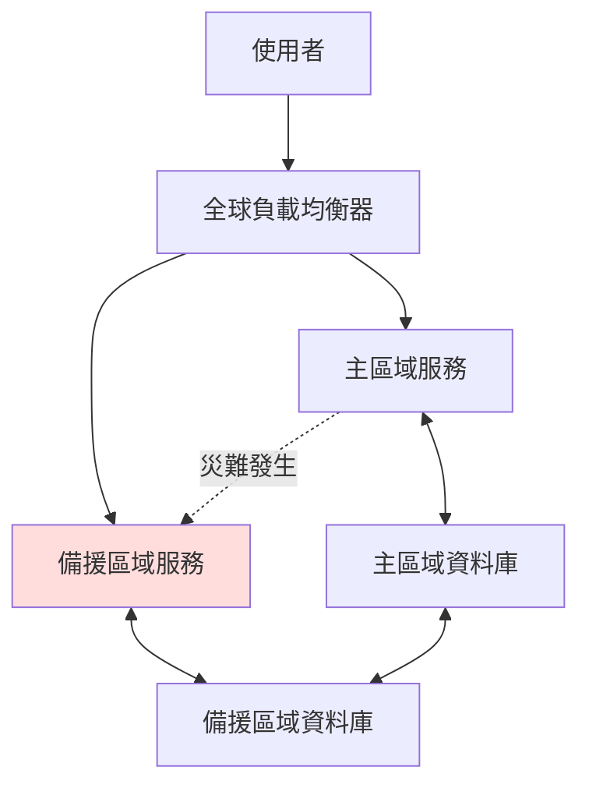

# Multi-Region 部署策略與容災設計

## 1. Multi-Region 部署與容災（DR）理論解釋

### 什麼是 Multi-Region 部署？
Multi-Region 部署指的是將系統的關鍵服務、資料與基礎設施，分散部署於多個地理區域（Region），以提升可用性、容錯能力與災難復原（Disaster Recovery, DR）能力。

### 容災（Disaster Recovery, DR）目標
- **RTO（Recovery Time Objective）**：系統從災難發生到恢復服務所需的最大時間。
- **RPO（Recovery Point Objective）**：系統可容忍的最大資料遺失時間點。

### 常見 Multi-Region 容災設計模式

| 模式         | 說明                                       | 優點                   | 缺點                   |
|--------------|--------------------------------------------|------------------------|------------------------|
| 主從（Active-Passive） | 一個主區域處理流量，備援區域僅於主區域失效時啟用 | 架構簡單、成本較低      | 切換需時、RTO較高       |
| 主主（Active-Active）   | 多個區域同時處理流量，資料同步                | 高可用、RTO/RPO低       | 架構複雜、同步挑戰      |
| 冷備（Cold Standby）    | 備援區域平時不啟動，災難時才啟動               | 成本最低                | RTO/RPO高、恢復慢       |
| 熱備（Hot Standby）     | 備援區域持續同步資料，隨時可切換               | RTO/RPO較低             | 成本較高                |

---

## 2. 架構圖解

### 跨區同步與切換流程

- **全球負載均衡器**：根據健康狀態自動導流至可用區域。
- **資料同步**：主區域與備援區域間持續同步資料。
- **自動切換**：主區域失效時，流量自動切換至備援區域。

---

## 3. 真實世界範例

### AWS 跨區部署

- **服務**：Amazon Route 53（全球 DNS）、Global Accelerator、RDS Multi-Region、S3 Cross-Region Replication
- **實踐**：
  - 使用 Route 53 進行健康檢查與自動導流
  - RDS 支援跨區同步，S3 支援跨區複製
  - RTO 可達數分鐘，RPO 取決於同步頻率

### GCP 跨區部署

- **服務**：Cloud Load Balancing、Spanner（全球分布式資料庫）、Cloud Storage 多區域
- **實踐**：
  - Cloud Load Balancer 自動導流
  - Spanner 實現強一致性與低 RPO
  - RTO/RPO 依服務設計可達數秒至數分鐘

### Azure 跨區部署

- **服務**：Azure Traffic Manager、Geo-Redundant Storage（GRS）、Cosmos DB 多區域寫入
- **實踐**：
  - Traffic Manager 進行流量分配
  - Cosmos DB 支援多區域同步與自訂一致性
  - RTO/RPO 依設計可調整

---

## 4. 架構師實務建議與 Trade-off 分析

### 實務建議

- **明確定義 RTO/RPO**：根據業務需求設計容災等級，避免過度設計造成資源浪費。
- **測試切換流程**：定期演練跨區切換，確保自動化流程可靠。
- **資料一致性策略**：根據應用需求選擇強一致性或最終一致性，避免跨區同步延遲造成資料衝突。
- **自動化監控與告警**：即時偵測異常並自動切換，縮短故障恢復時間。

### Trade-off 分析

| 考量面向         | Active-Active           | Active-Passive         | Cold/Hot Standby        |
|------------------|------------------------|------------------------|-------------------------|
| 成本             | 高                     | 中                     | 低                      |
| 架構複雜度       | 高                     | 中                     | 低                      |
| RTO/RPO          | 最低                   | 中                     | 最高                    |
| 資料一致性挑戰   | 高                     | 低                     | 低                      |
| 維運難度         | 高                     | 中                     | 低                      |

- **Active-Active** 適合高可用、低延遲需求，但需投入較多資源與維運成本。
- **Active-Passive** 適合大多數企業，兼顧成本與可用性。
- **Cold/Hot Standby** 適合預算有限或非關鍵系統。

---

## 結論

Multi-Region 部署與容災設計是現代分散式系統不可或缺的一環。選擇合適的架構模式，明確定義 RTO/RPO，並落實自動化監控與切換，才能在災難發生時保障業務持續運作。