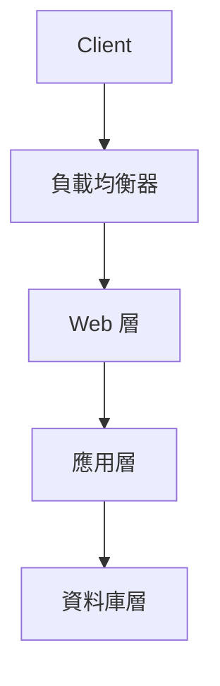
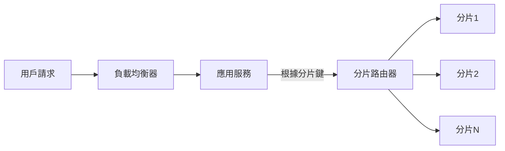

# 18. 可擴展性設計

## 一、可擴展性設計理論與常見設計模式

### 1. 可擴展性（Scalability）定義
可擴展性指的是系統在面對負載增加時，能夠透過增加資源（如伺服器、儲存、網路頻寬等）來維持或提升效能的能力。良好的可擴展性設計能確保系統隨著需求成長而平滑擴展，避免瓶頸。

### 2. 常見可擴展性設計模式

- **分層架構（Layered Architecture）**
  將系統劃分為不同層級（如表示層、業務邏輯層、資料存取層），每層專注於單一職責，便於獨立擴展與維護。

- **分片（Sharding）**
  將資料或服務依照某種規則（如用戶ID、地區）切分至不同的分片（Shard），每個分片可獨立擴展，常用於資料庫、快取等。

- **無狀態服務（Stateless Service）**
  服務不保存用戶狀態，所有請求皆可由任一節點處理，便於橫向擴展（scale-out），常見於 RESTful API、微服務架構。

- **負載均衡（Load Balancing）**
  透過負載均衡器將流量分配至多個後端節點，避免單點過載，提升整體吞吐量。

- **快取（Caching）**
  將熱資料緩存在記憶體或分散式快取系統，減少資料庫壓力，加速回應。

- **消息隊列（Message Queue）**
  將請求非同步化，解耦前後端，提升系統彈性與可擴展性。

---

## 二、常見可擴展性架構圖解

### 1. 分層架構（Layered Architecture）

### 2. 分片流程（Sharding）

---

## 三、真實世界範例

### 1. 大型網站（如 Facebook、Twitter）

- **分層設計**：前端伺服器處理靜態內容，應用伺服器處理業務邏輯，後端資料庫分片儲存用戶資料。
- **分片與複製**：用戶資料依用戶ID分片，熱門資料複製多份以提升讀取效能。
- **無狀態服務**：API 伺服器無狀態，任一請求可由任一節點處理，方便自動擴展。
- **快取與 CDN**：靜態資源透過 CDN 全球分發，動態資料使用 Redis/Memcached 快取。

### 2. 雲端服務（如 AWS、Google Cloud）

- **自動擴展（Auto Scaling）**：根據流量自動調整伺服器數量。
- **分散式資料庫**：如 Amazon DynamoDB、Google Spanner，支援分片與多區域部署。
- **服務無狀態化**：Lambda、Cloud Functions 等 FaaS 服務，天然無狀態，易於大規模擴展。

---

## 四、架構師實務建議與 Trade-off 分析

### 1. 實務建議

- **預留擴展空間**：設計初期即考慮橫向擴展（scale-out），避免過度依賴單一大型主機（scale-up）。
- **服務無狀態化**：盡量將狀態外移（如 session 存於 Redis），提升服務彈性。
- **分片規則設計**：選擇合理的分片鍵，避免資料傾斜（hotspot）。
- **監控與自動化**：建立完善監控，結合自動擴展機制，及時應對流量變化。
- **分層解耦**：各層間介面明確，便於獨立擴展與維護。

### 2. Trade-off 分析

- **一致性 vs. 可擴展性**：分片與分散式架構常需在資料一致性與可擴展性間取捨（如 CAP 定理）。
- **複雜度提升**：分片、無狀態、分層等設計雖提升可擴展性，但也增加系統複雜度與維運成本。
- **成本考量**：橫向擴展需更多硬體資源與網路頻寬，需評估效益與成本。
- **延遲問題**：跨分片、跨區域存取可能增加延遲，需設計快取與就近存取策略。

---

## 五、結語

可擴展性設計是大型系統成功的關鍵。需根據實際需求選擇合適的設計模式，並持續監控與調整，才能在效能、成本與維運間取得最佳平衡。