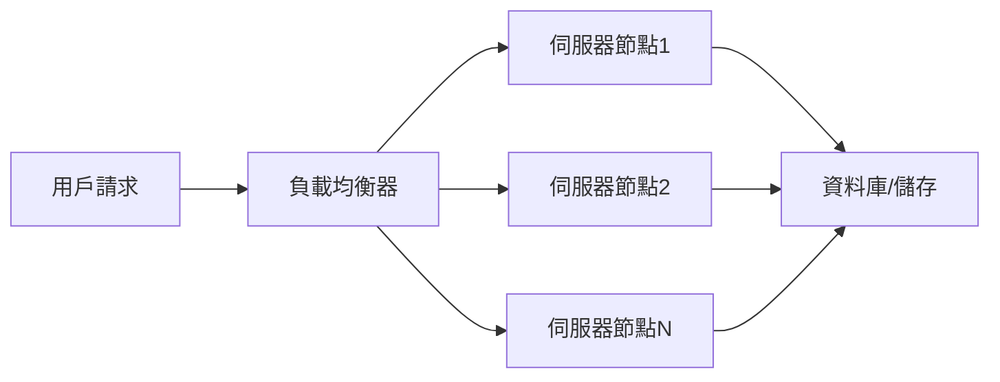

# 水平擴展（Scale Out）與垂直擴展（Scale Up）

## 一、理論解釋與比較

### 水平擴展（Scale Out）
- **定義**：透過增加多台伺服器或節點，將負載分散到多個實體或虛擬機器上，以提升整體系統處理能力。
- **特點**：
  - 可彈性擴充，理論上無上限（受限於架構與管理複雜度）。
  - 常用於分散式系統、Web 伺服器集群、NoSQL 資料庫等。
  - 需搭配負載均衡、資料分片、同步機制等設計。

### 垂直擴展（Scale Up）
- **定義**：透過提升單一伺服器的硬體資源（如 CPU、記憶體、儲存空間），以增加單一節點的處理能力。
- **特點**：
  - 擴展速度快，無需改變應用架構。
  - 受限於硬體規格與成本，存在物理上限。
  - 適合單體應用、資料庫等對單一節點效能要求高的場景。

### 比較

| 項目         | 水平擴展（Scale Out）         | 垂直擴展（Scale Up）         |
| ------------ | ---------------------------- | ---------------------------- |
| 擴展方式     | 增加節點數量                 | 增加單一節點資源             |
| 成本         | 初期較高，長期可控           | 初期較低，長期昂貴           |
| 彈性         | 高，易於動態調整             | 低，受限於硬體規格           |
| 容錯性       | 高，單點故障影響小           | 低，單點故障風險高           |
| 複雜度       | 高，需處理分散式挑戰         | 低，架構簡單                 |
| 適用場景     | 分散式系統、大型網站         | 單體應用、資料庫             |

---

## 二、架構圖解

### 1. 水平擴展流程圖

### 2. 垂直擴展流程圖

---

## 三、真實世界範例

### 1. Web 伺服器集群（水平擴展）
- **情境**：電商網站流量激增，單一伺服器無法負荷。
- **解決方案**：部署多台 Web 伺服器，前端加設負載均衡器（如 Nginx、HAProxy），將請求分散至多個節點，提升可用性與擴展性。

### 2. 資料庫升級（垂直擴展）
- **情境**：關聯式資料庫查詢效能不足。
- **解決方案**：升級資料庫伺服器硬體（如增加 CPU、記憶體、SSD），提升單一節點效能，無需更動應用程式架構。

### 3. 混合應用
- **情境**：初期以垂直擴展快速應對需求，當單一節點達到極限後，轉向水平擴展，將資料分片或服務拆分，實現更大規模的擴展。

---

## 四、架構師實務建議與 Trade-off 分析

### 架構師建議
- **初期建議**：可先採用垂直擴展，快速滿足效能需求，降低開發與維運複雜度。
- **長期規劃**：隨著業務成長，應預留系統水平擴展的彈性，避免單點瓶頸。
- **設計原則**：系統設計時應考慮可擴展性、容錯性與維運成本，選擇最適合當下與未來需求的擴展策略。

### Trade-off 分析

| 面向         | 水平擴展（Scale Out）         | 垂直擴展（Scale Up）         |
| ------------ | ---------------------------- | ---------------------------- |
| 成本         | 初期投入高，長期可分攤       | 硬體升級成本高，易遇上限     |
| 維運         | 複雜，需自動化與監控         | 簡單，單點維護               |
| 容錯         | 高，單點故障不影響全局       | 低，單點故障風險大           |
| 彈性         | 高，可隨需擴充               | 低，擴展受限                 |
| 技術門檻     | 高，需分散式設計經驗         | 低，傳統 IT 經驗即可         |

### 實務建議
- **短期效益**：垂直擴展適合快速解決效能瓶頸，部署簡單。
- **長期彈性**：水平擴展適合應對大規模成長，提升系統彈性與可用性。
- **混合策略**：多數大型系統會先垂直擴展，達到硬體極限後再水平擴展，兼顧成本與彈性。

---

## 結論

水平擴展與垂直擴展各有優缺點，選擇時需根據業務需求、預算、技術能力與未來成長性綜合考量。良好的系統設計應預留彈性，隨時可根據實際情況調整擴展策略，確保系統穩定與可持續發展。