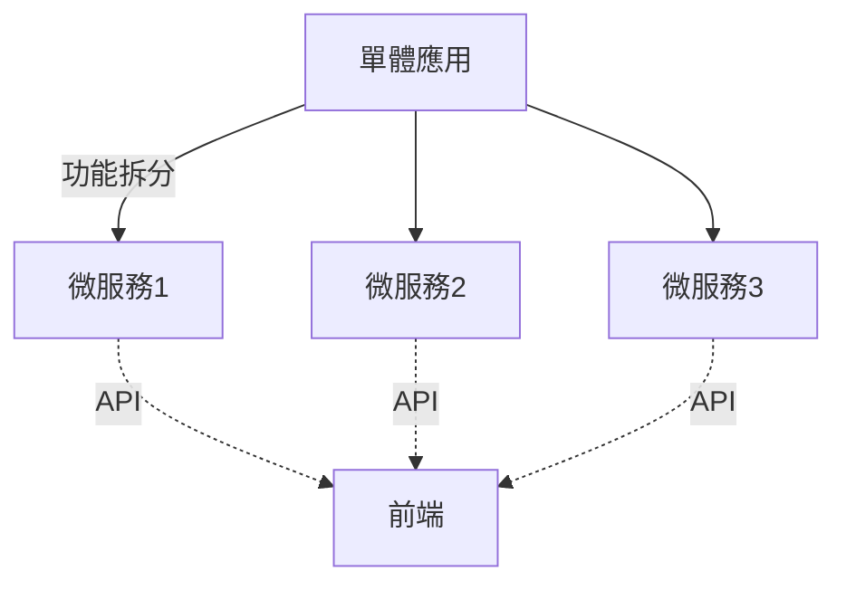
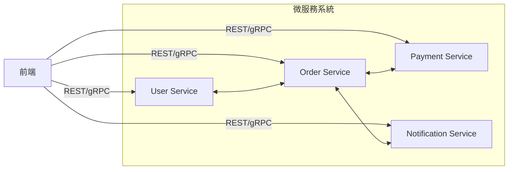

# 微服務（Microservices）與單體（Monolith）架構理論解釋與比較

## 一、架構理論解釋

### 單體架構（Monolithic Architecture）
單體架構是將所有功能模組（如用戶管理、訂單處理、支付等）整合在同一個應用程式中。所有元件共用同一個程式碼庫、部署單元與資料庫。開發、測試、部署相對簡單，適合初創或小型專案。

**優點：**
- 部署簡單，開發初期上手快
- 測試容易，整體一致性高
- 性能優化較直接

**缺點：**
- 隨著規模增長，程式碼複雜度提升，維護困難
- 單點故障風險高
- 難以彈性擴展（只能整體擴展）
- 技術選型受限（難以混用多種語言/框架）

---

### 微服務架構（Microservices Architecture）
微服務架構將應用拆分為多個小型、自治的服務，每個服務專注於單一業務功能，獨立開發、部署、擴展。服務間透過 API（如 REST、gRPC、消息隊列）通訊。

**優點：**
- 易於彈性擴展（可針對單一服務擴展）
- 各服務可獨立部署、升級、維護
- 技術異質性高（可依需求選擇最佳技術棧）
- 容錯性佳，單一服務失效不影響全局

**缺點：**
- 架構與運維複雜度高（需服務註冊、發現、監控、日誌聚合等）
- 分散式系統帶來的資料一致性、網路延遲、故障處理等挑戰
- 測試與除錯困難
- 初期開發成本較高

---

## 二、架構圖解

### 架構演進示意

### 微服務拆分範例

---

## 三、真實世界範例

### 1. 大型網站架構演進
以 Amazon 為例，早期採用單體架構，隨著業務擴展，單體應用變得難以維護與擴展。Amazon 逐步將單體拆分為數百個微服務，每個團隊負責特定服務，實現高效協作與彈性擴展。

### 2. 微服務落地經驗
某金融科技公司初期採用單體架構，隨著用戶數成長，單體應用部署頻繁失敗、維護困難。轉型微服務後，將帳戶、交易、通知等功能拆分為獨立服務，部署頻率提升，故障範圍縮小，團隊可獨立開發與維運。

---

## 四、架構師實務建議與 Trade-off 分析

### 適用時機
- **單體架構適用於：**
  - 初創、小型專案
  - 團隊規模小，需求變動頻繁
  - 追求快速 MVP 上線

- **微服務架構適用於：**
  - 業務規模大、團隊多、需求穩定
  - 需高可用、彈性擴展
  - 技術異質性需求高

### Trade-off 分析

| 項目         | 單體架構                  | 微服務架構                |
|--------------|--------------------------|---------------------------|
| 開發速度     | 初期快，後期慢            | 初期慢，後期快             |
| 維護性       | 規模小易維護，後期困難    | 易於維護、分工明確         |
| 部署         | 一次性部署                | 可獨立部署                 |
| 擴展性       | 整體擴展                  | 單一服務可獨立擴展         |
| 容錯性       | 單點故障風險高            | 局部故障不影響全局         |
| 技術選型     | 受限                      | 彈性高                     |
| 運維複雜度   | 低                        | 高                         |
| 測試除錯     | 容易                      | 較困難                     |

### 架構師建議

- **不要為了微服務而微服務。** 若團隊尚未具備分散式系統設計、運維能力，貿然導入微服務反而增加風險。
- **從單體出發，隨業務成長逐步拆分。** 先確保單體架構穩定，再根據瓶頸與團隊能力逐步微服務化。
- **重視自動化測試、CI/CD、監控、日誌。** 微服務落地需完善的自動化與監控體系支撐。
- **明確服務邊界與責任。** 避免服務間耦合過高，確保服務自治性。

---

## 結論

單體與微服務架構各有優缺點，選擇需依據團隊規模、業務需求、技術能力與未來發展彈性。架構師應審慎評估 trade-off，選擇最適合當下與未來發展的架構路徑。