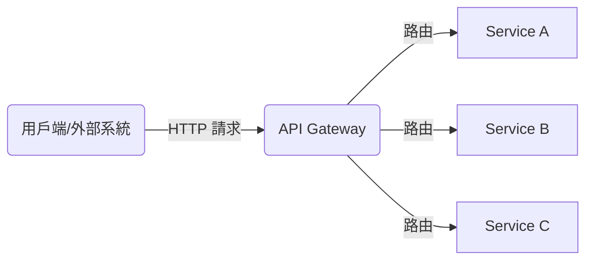
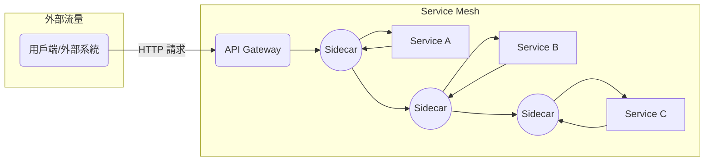

# API Gateway 與 Service Mesh 理論解釋與比較

## 一、理論解釋

### API Gateway

API Gateway 是微服務架構中常見的入口點，負責處理所有進入系統的外部請求。它通常提供路由、認證、流量控制、負載均衡、API 聚合、日誌與監控等功能。API Gateway 將外部流量統一管理，簡化客戶端與後端服務的互動。

**主要功能：**
- 路由與反向代理
- 認證與授權
- 請求/回應轉換
- 流量限制與熔斷
- 日誌與監控

### Service Mesh

Service Mesh 是一種專注於服務間（Service-to-Service）通訊治理的基礎設施層。它通常以 sidecar 代理（如 Envoy）注入每個服務實例，負責服務間的流量管理、服務發現、負載均衡、認證、加密、觀察性（如 tracing、metrics）等。

**主要功能：**
- 服務間流量路由與負載均衡
- 服務間認證與加密（mTLS）
- 流量控制（如金絲雀發布、A/B 測試）
- 觀察性（分散式追蹤、metrics、日誌）
- 故障注入與重試

---

## 二、API Gateway 與 Service Mesh 架構圖解

### 1. API Gateway 架構與流量路徑

**說明：**
所有外部請求先經過 API Gateway，再由 Gateway 根據路由規則分發至後端服務。API Gateway 負責統一入口、認證、流量控管等。

---

### 2. Service Mesh 架構與流量治理

**說明：**
Service Mesh 於每個服務旁注入 Sidecar Proxy，所有服務間流量皆經過 Sidecar，實現細緻的流量治理、加密、監控等功能。API Gateway 仍可作為外部入口。

---

## 三、真實世界範例

### API Gateway 範例

- **Kong**：開源、高效能 API Gateway，支援插件式擴充（認證、流控、日誌等）。
- **NGINX**：常用於反向代理與 API Gateway，具備高效能與靈活配置。
- **AWS API Gateway**：雲端託管服務，整合 Lambda、IAM 等 AWS 生態系。

### Service Mesh 範例

- **Istio**：功能最完整的 Service Mesh，支援流量治理、mTLS、觀察性、策略控制等。
- **Linkerd**：輕量級 Service Mesh，強調易用性與效能。
- **Consul Connect**：HashiCorp 產品，結合服務發現與 Mesh 功能。
- **AWS App Mesh**：AWS 雲端原生 Service Mesh，整合 AWS 生態。

---

## 四、架構師實務建議與 Trade-off 分析

### 何時選擇 API Gateway？

- 僅需統一外部流量入口、簡化客戶端與後端互動。
- 服務間通訊需求單純，無需複雜治理。
- 系統規模較小或初期階段，維運成本需低。

### 何時選擇 Service Mesh？

- 服務數量多，服務間通訊複雜，需細緻治理。
- 需實現服務間 mTLS 加密、細緻流量控管、分散式追蹤等。
- 需動態流量管理（如金絲雀、A/B 測試）、自動化治理。

### Trade-off 分析

| 項目             | API Gateway                         | Service Mesh                           |
|------------------|-------------------------------------|----------------------------------------|
| 部署複雜度       | 低                                  | 高（需 Sidecar、控制平面）             |
| 功能範圍         | 外部流量管理                        | 服務間流量治理                         |
| 學習曲線         | 低                                  | 高                                     |
| 維運成本         | 低                                  | 高                                     |
| 彈性與細緻度     | 中                                  | 高                                     |
| 故障影響範圍     | 單點（Gateway）                     | 分散（Sidecar，控制平面故障影響大）    |
| 適用場景         | 小型/中型系統，外部 API 管理        | 大型微服務，服務間治理需求高           |

### 架構師建議

- **初期微服務建議先導入 API Gateway，待服務數量與複雜度提升後，再評估 Service Mesh。**
- **Service Mesh 適合治理需求高、團隊具備容器與自動化運維能力的組織。**
- **兩者可並存：API Gateway 管理外部流量，Service Mesh 管理內部服務流量。**
- **導入 Service Mesh 前，需評估團隊學習曲線、維運負擔與效益。**

---

## 結論

API Gateway 與 Service Mesh 各有定位與適用場景。API Gateway 著重於外部流量入口與 API 管理，Service Mesh 則專注於服務間流量治理與觀察性。架構設計時應根據系統規模、治理需求、團隊能力等因素，選擇最適合的方案，並可考慮兩者結合以發揮最大效益。