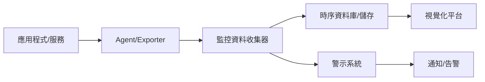
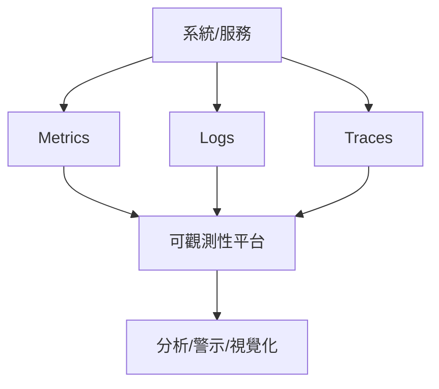

# 監控（Monitoring）與可觀測性（Observability）

---

## 一、理論解釋與設計模式

### 1. 監控（Monitoring）
監控是指對系統、服務、基礎設施等進行持續性資料收集、分析與警示，目的是及早發現異常、故障或效能瓶頸。監控通常聚焦於已知的指標（如 CPU、記憶體、流量、延遲等），並根據預設規則進行告警。

**常見設計模式：**
- 指標型監控（Metrics-based Monitoring）
- 日誌型監控（Log-based Monitoring）
- 事件型監控（Event-based Monitoring）
- 黑箱/白箱監控（Black-box/White-box Monitoring）

### 2. 可觀測性（Observability）
可觀測性是一種系統設計理念，強調從外部輸出（如指標、日誌、追蹤）推斷系統內部狀態。可觀測性不僅僅是監控，更強調系統在未知問題發生時，能夠快速定位根因。

**可觀測性三大支柱：**
- 指標（Metrics）：量化數據，如 QPS、延遲、資源使用率
- 日誌（Logs）：事件記錄，便於追蹤與審計
- 追蹤（Traces）：分散式請求鏈路追蹤，分析請求流向與瓶頸

**設計模式：**
- 可觀測性優先設計（Observability-First Design）
- 分層監控（Layered Monitoring）
- 事件驅動觀測（Event-driven Observability）

---

## 二、架構圖解

### 1. 監控資料流架構

### 2. 可觀測性三大支柱

---

## 三、真實世界範例

### 1. Prometheus + Grafana
- **Prometheus**：開源時序型監控系統，支援多種 exporter，適合微服務架構。
- **Grafana**：強大的視覺化平台，與 Prometheus 整合展示各種監控儀表板。

### 2. ELK Stack（Elasticsearch, Logstash, Kibana）
- **Elasticsearch**：分散式搜尋與分析引擎，儲存與查詢日誌資料。
- **Logstash**：資料收集與轉換工具，支援多種來源。
- **Kibana**：視覺化與分析平台，提供日誌查詢與儀表板。

### 3. Jaeger
- **Jaeger**：分散式追蹤系統，支援 OpenTracing 標準，協助分析請求鏈路與效能瓶頸。

### 4. 綜合實踐
- 微服務架構常見組合：Prometheus + Grafana（監控）、ELK（集中日誌）、Jaeger（追蹤），三者整合提升可觀測性。

---

## 四、架構師實務建議與 Trade-off 分析

### 1. 實務建議
- **可觀測性優先設計**：系統設計初期即納入可觀測性考量，避免事後補強困難。
- **分層監控**：從基礎設施、平台到應用層皆需監控，確保全方位掌握。
- **自動化告警與降噪**：設計合理的告警規則，避免過多誤報造成疲勞。
- **資料留存與隱私**：依據法規與需求設計資料留存週期與存取權限。

### 2. Trade-off 分析
| 項目 | 優點 | 缺點 |
|------|------|------|
| 指標型監控 | 輕量、即時、易於告警 | 難以追蹤複雜問題根因 |
| 日誌型監控 | 詳細記錄、便於審計 | 資料量大、查詢效能挑戰 |
| 追蹤型監控 | 跨服務請求分析、定位瓶頸 | 實作複雜、效能負擔 |
| 集中式 vs 分散式監控 | 易於管理、統一視覺化 | 單點故障風險、擴展性挑戰 |
| 開源 vs 商用方案 | 彈性高、成本低 | 維運負擔、功能完整度 |

---

## 五、結論

監控與可觀測性是現代分散式系統不可或缺的基石。良好的可觀測性設計能大幅提升系統穩定性、可維運性與故障回復速度。架構師應根據業務需求、技術棧與團隊能力，選擇合適的工具與設計模式，並持續優化監控與可觀測性架構。