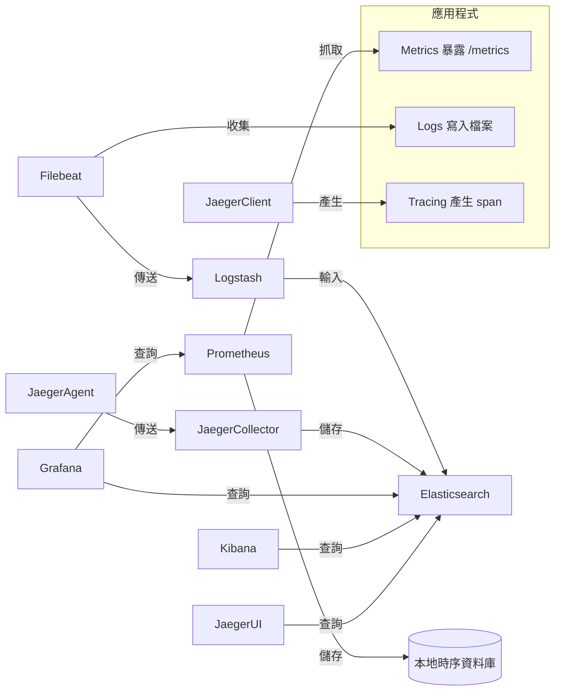

# 24. 工具：Prometheus、Grafana、ELK、Jaeger

## 目錄
1. 工具理論與架構解釋
    - Prometheus
    - Grafana
    - ELK Stack
    - Jaeger
2. 配置與組合範例
3. 架構圖解（Mermaid）
4. 架構師實務建議與 Trade-off 分析

---

## 1. 工具理論與架構解釋

### 1.1 Prometheus

**理論基礎：**
Prometheus 是一套開源的監控與警報系統，採用 pull-based 的資料收集方式，專注於時序型資料（Time Series Data）。其核心理念為「每個服務都暴露自己的 metrics，Prometheus 定期抓取並儲存」。

**架構組成：**
- **Prometheus Server**：負責定時抓取（scrape）目標服務的 metrics。
- **Exporter**：將應用程式或系統指標轉換為 Prometheus 可讀格式（如 node_exporter、blackbox_exporter）。
- **Alertmanager**：處理警報規則與通知。
- **Pushgateway**：支援短命或批次任務主動推送 metrics。
- **本地儲存**：以高效壓縮方式儲存時序資料。

---

### 1.2 Grafana

**理論基礎：**
Grafana 是一套開源的資料視覺化平台，支援多種資料來源（如 Prometheus、Elasticsearch、InfluxDB 等），可用於建立動態儀表板與警報。

**架構組成：**
- **Data Source Plugin**：連接不同資料來源。
- **Dashboard**：可自訂的視覺化面板。
- **Alerting**：支援多種警報條件與通知方式。
- **User Management**：權限與團隊管理。

---

### 1.3 ELK Stack（Elasticsearch, Logstash, Kibana）

**理論基礎：**
ELK Stack 是一套開源日誌收集、儲存與分析平台，適合大規模日誌與非結構化資料的搜尋與分析。

**架構組成：**
- **Elasticsearch**：分散式搜尋與分析引擎，負責儲存與查詢資料。
- **Logstash**：資料收集、轉換與傳送管道，支援多種輸入/輸出來源。
- **Kibana**：資料視覺化與查詢介面。
- **Beats**（常見擴充）：輕量級資料收集代理（如 Filebeat、Metricbeat）。

---

### 1.4 Jaeger

**理論基礎：**
Jaeger 是一套開源分散式追蹤系統，協助分析微服務架構下的請求流、延遲瓶頸與依賴關係。

**架構組成：**
- **Client Library**：嵌入應用程式，負責產生追蹤資料（span）。
- **Agent**：本地收集追蹤資料，批次傳送至 Collector。
- **Collector**：接收並處理追蹤資料，寫入後端儲存。
- **Query Service**：提供查詢 API。
- **UI**：視覺化追蹤資料。

---

## 2. 配置與組合範例

### 2.1 監控、日誌、追蹤整合範例

- **監控（Metrics）**：應用程式暴露 `/metrics`，由 Prometheus 定時抓取，Grafana 連接 Prometheus 呈現儀表板。
- **日誌（Logs）**：應用程式將日誌寫入檔案，由 Filebeat 收集傳送至 Logstash，Logstash 處理後寫入 Elasticsearch，Kibana 負責查詢與視覺化。
- **追蹤（Tracing）**：應用程式整合 Jaeger Client，產生追蹤資料，經 Jaeger Agent/Collector 儲存於 Elasticsearch，Kibana 或 Jaeger UI 查詢。

#### 範例組合流程
1. 應用程式同時暴露 metrics、寫入 logs、產生 tracing。
2. Prometheus 抓取 metrics，Grafana 呈現。
3. Filebeat 收集 logs，經 Logstash 處理後進入 Elasticsearch，Kibana 呈現。
4. Jaeger 收集 tracing，儲存於 Elasticsearch，Kibana/Jaeger UI 查詢。

---

## 3. 架構圖解（Mermaid）

### 3.1 全觀架構圖

---

## 4. 架構師實務建議與 Trade-off 分析

### 4.1 實務建議

- **分層部署**：建議將監控、日誌、追蹤服務分層部署，避免單點故障影響全域可觀測性。
- **資料保留策略**：時序資料與日誌量大，需規劃資料保留與歸檔策略，避免儲存成本失控。
- **權限與安全**：敏感資料應加強存取控制，避免未授權查詢。
- **資源規劃**：Prometheus、Elasticsearch 等需充足資源，建議預留高 IOPS 儲存與記憶體。
- **警報整合**：Alertmanager 可與 Slack、Email 整合，提升事件響應效率。
- **跨工具關聯**：可考慮 Grafana 連接多種資料源，實現 metrics、logs、tracing 整合視覺化。

### 4.2 Trade-off 分析

| 工具/方案         | 優點                                   | 缺點/限制                                 |
|------------------|--------------------------------------|------------------------------------------|
| Prometheus       | 易於部署、社群活躍、支援多 exporter   | 長期儲存需外掛、分散式支援有限             |
| Grafana          | 視覺化彈性高、支援多資料源            | 警報功能較進階需付費版                    |
| ELK Stack        | 日誌搜尋強大、彈性高                  | 資源消耗大、維運複雜                      |
| Jaeger           | 分散式追蹤、與 OpenTracing 相容        | 需修改應用程式、資料量大時查詢效能需優化   |
| 整合部署         | 全面可觀測性、跨域關聯分析            | 維運複雜度高、需統一權限與資源規劃         |

---

## 參考資料

- [Prometheus 官方文件](https://prometheus.io/docs/)
- [Grafana 官方文件](https://grafana.com/docs/)
- [Elastic 官方文件](https://www.elastic.co/guide/en/elastic-stack-get-started/current/get-started-elastic-stack.html)
- [Jaeger 官方文件](https://www.jaegertracing.io/docs/)
