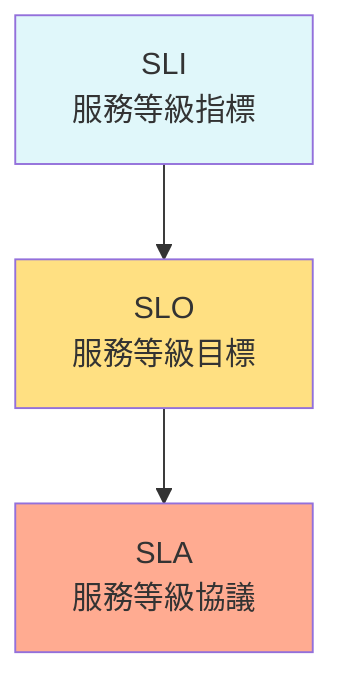
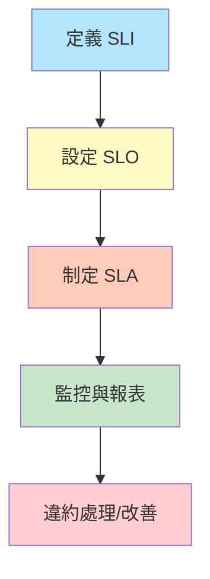

# SLA、SLO、SLI 定義與設計模式

## 一、理論解釋與設計模式

### 1. SLI（Service Level Indicator，服務等級指標）
SLI 是用來量化服務品質的指標，通常以百分比或數值呈現。例如：API 成功率、回應時間、可用性等。SLI 是觀察服務運作狀態的基礎。

### 2. SLO（Service Level Objective，服務等級目標）
SLO 是針對 SLI 設定的目標值，代表服務應達到的品質標準。例如：「99.9% 的請求在 200ms 內完成」。SLO 是內部管理與營運的依據。

### 3. SLA（Service Level Agreement，服務等級協議）
SLA 是與客戶簽訂的正式協議，明確規範服務品質標準（通常以 SLO 為基礎），並定義未達標時的賠償或補救措施。SLA 屬於法律合約層級。

#### 設計模式
- **指標驅動設計**：先定義 SLI，再設定 SLO，最後制定 SLA。
- **分層目標**：內部 SLO 可比 SLA 更嚴格，確保有緩衝空間。
- **可觀測性整合**：SLI 必須可被監控系統自動量測，並與告警、報表整合。

---

## 二、架構圖解

### 1. 指標關係圖

### 2. 服務等級流程圖

---

## 三、真實世界範例

### 1. 雲端服務 SLA 範例（以 AWS EC2 為例）

- **SLA**：AWS EC2 保證 99.99% 月可用性。若未達標，客戶可申請服務費用抵免。
- **SLO**：內部設定 99.995% 可用性，確保有緩衝。
- **SLI**：每月服務可用分鐘數 / 總分鐘數。

### 2. SLO 設定範例

- **API 回應時間 SLO**：99% 請求於 300ms 內完成。
- **資料庫查詢成功率 SLO**：99.95% 查詢成功。

### 3. SLI 計算範例

假設 1 個月內 API 請求總數為 $N$，其中成功且於 300ms 內完成的請求數為 $S$，則：

$$
SLI = \frac{S}{N} \times 100\%
$$

例如：一個月 1,000,000 筆請求，990,000 筆符合條件，則 SLI = 99%。

---

## 四、架構師實務建議與 Trade-off 分析

### 1. 實務建議

- **SLI 必須可量測且自動化**：選擇可被監控系統（如 Prometheus、Grafana）自動收集的指標。
- **SLO 設定需考慮業務需求與技術可行性**：過高會導致運維壓力，過低則無法保障用戶體驗。
- **SLA 訂定需與法務、商業部門協作**：避免承諾超出能力範圍，並明確違約處理方式。
- **持續監控與回顧**：定期檢視 SLI/SLO 達成率，必要時調整目標。

### 2. Trade-off 分析

- **嚴格 SLO/SLA vs. 運維成本**：SLO/SLA 越嚴格，所需資源與備援越多，成本上升。
- **可用性 vs. 新功能發布速度**：高可用性要求下，變更需更嚴謹，可能降低開發敏捷度。
- **內部 SLO 與外部 SLA 差距設計**：適當留有緩衝，避免一旦出現小幅異常即違約。

---

## 五、參考資料

- [Google SRE Book - SLO/SLA/SLI](https://sre.google/sre-book/service-level-objectives/)
- [AWS EC2 SLA](https://aws.amazon.com/tw/ec2/sla/)
- [Prometheus 官方文件](https://prometheus.io/docs/introduction/overview/)