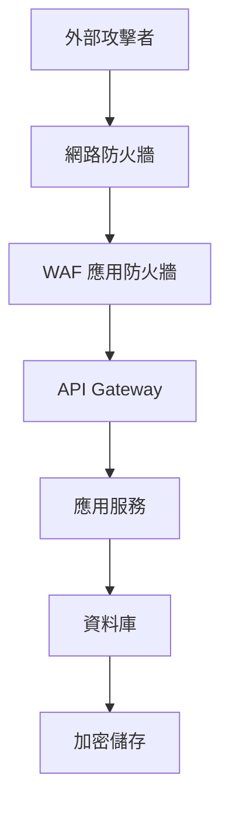
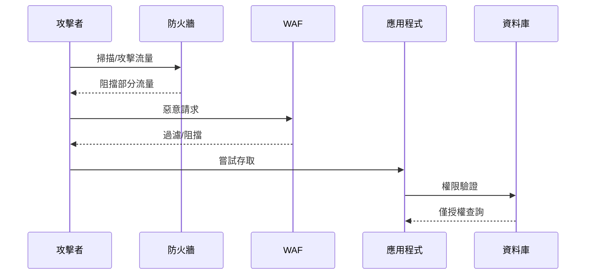
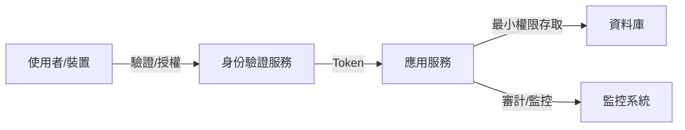

# 26. 安全性設計

## 1. 安全性設計理論解釋與常見設計模式

### 1.1 安全性設計理論

現代系統設計中，安全性（Security）是不可或缺的一環。安全性設計的目標在於預防、偵測與回應各種潛在威脅，確保系統的機密性（Confidentiality）、完整性（Integrity）與可用性（Availability），即所謂的 CIA 三要素。

### 1.2 常見安全設計模式

#### 1.2.1 層層防禦（Defense in Depth）

- **定義**：以多層次的安全防護措施，降低單一防線失守時的風險。
- **實踐**：如網路防火牆、應用層驗證、資料加密、存取控制等多重機制。

#### 1.2.2 最小權限原則（Principle of Least Privilege, PoLP）

- **定義**：每個使用者、系統元件僅被授予完成任務所需的最小權限。
- **實踐**：限制帳號權限、細緻的 RBAC（Role-Based Access Control）設計、API 權限分級。

#### 1.2.3 零信任架構（Zero Trust Architecture, ZTA）

- **定義**：預設所有網路流量皆不可信，無論內部或外部，皆需驗證與授權。
- **實踐**：強制身份驗證、多因子認證（MFA）、微分段（Micro-segmentation）、持續監控。

#### 1.2.4 其他常見模式

- **Fail-Safe Defaults**：預設拒絕存取，僅允許明確授權的操作。
- **Separation of Duties**：關鍵操作需多方參與，避免單點失誤或惡意行為。
- **Audit & Monitoring**：持續記錄與監控系統行為，及早發現異常。

---

## 2. 架構圖解

### 2.1 層層防禦架構圖

### 2.2 攻擊路徑與防護層級

### 2.3 Zero Trust 架構圖

---

## 3. 真實世界範例

### 3.1 企業安全架構

- **多層防護**：外部有防火牆與 WAF，內部網段分隔，敏感資料加密儲存。
- **權限控管**：AD/LDAP 整合，細緻的 RBAC，重要操作需多重審核。
- **監控與稽核**：SIEM 系統集中日誌，異常行為即時警示。

### 3.2 雲端安全設計

- **VPC 隔離**：不同服務部署於獨立 VPC，僅開放必要端口。
- **IAM 管理**：雲端資源以最小權限原則配置 IAM Policy。
- **加密與金鑰管理**：資料傳輸與儲存全程加密，金鑰集中管理（如 AWS KMS）。

### 3.3 常見攻擊防禦配置

- **DDoS 防護**：流量清洗服務、CDN 緩衝。
- **SQL Injection 防禦**：參數化查詢、WAF 過濾。
- **XSS/CSRF 防禦**：輸入驗證、Token 驗證、HTTPOnly Cookie。

---

## 4. 架構師實務建議與 Trade-off 分析

### 4.1 安全性與可用性

- **建議**：安全措施不可過度影響系統可用性，需平衡防護與用戶體驗。
- **Trade-off**：如多因子認證提升安全，但可能降低用戶便利性。

### 4.2 安全性與效能

- **建議**：加密、審計等機制會增加系統負擔，需評估效能瓶頸。
- **Trade-off**：資料全程加密雖安全，但可能影響查詢速度。

### 4.3 實務建議

- **持續風險評估**：定期檢視威脅模型與防護措施。
- **自動化安全部署**：利用 IaC（Infrastructure as Code）自動化安全配置，降低人為疏失。
- **教育訓練**：提升團隊安全意識，減少社交工程攻擊風險。
- **事件回應計畫**：建立明確的資安事件處理流程，縮短回應時間。

---

## 5. 結論

安全性設計需貫穿系統全生命週期，從需求、設計、開發、部署到維運皆需納入考量。唯有持續優化與落實安全設計，才能有效降低風險，保障企業與用戶的利益。