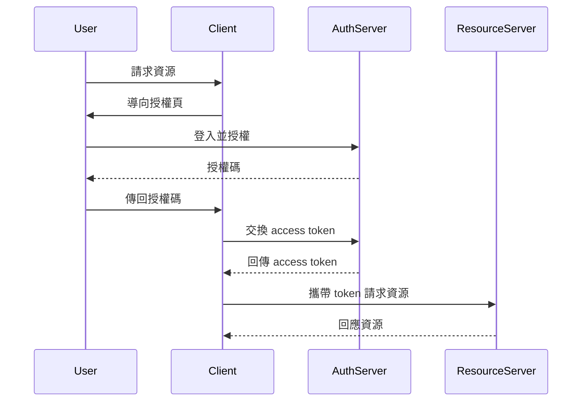
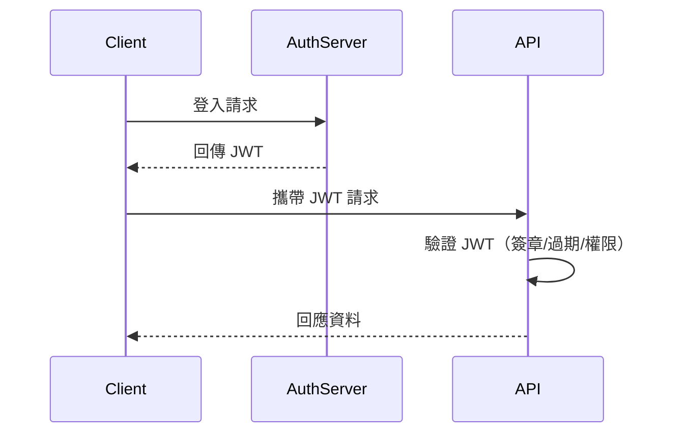
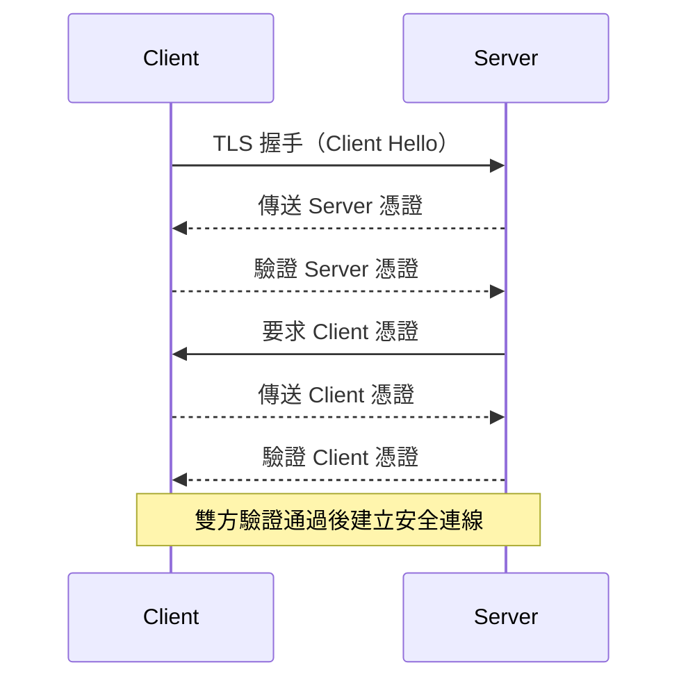

# 身份驗證與授權：OAuth2、JWT、mTLS

## 1. 理論解釋

### 1.1 身份驗證（Authentication）vs 授權（Authorization）

- **身份驗證（Authentication）**：確認使用者「是誰」。常見方式如帳號密碼、OTP、憑證等。
- **授權（Authorization）**：確認已驗證的使用者「能做什麼」。例如：A 使用者能否讀取/寫入某資源。

| 項目         | 身份驗證 (Authentication) | 授權 (Authorization) |
|--------------|--------------------------|---------------------|
| 目的         | 識別身份                  | 賦予權限            |
| 問題         | 你是誰？                  | 你能做什麼？        |
| 時機         | 先進行                    | 後進行              |

---

### 1.2 常見設計模式

#### OAuth2

- 一種授權框架，允許第三方應用存取使用者資源而不暴露密碼。
- 支援多種授權流程（Authorization Code、Client Credentials、Implicit、Resource Owner Password Credentials）。

#### JWT（JSON Web Token）

- 一種自包含的 Token 格式，常用於身份驗證與授權資訊傳遞。
- 由 Header、Payload、Signature 組成，可攜帶用戶資訊與權限。

#### mTLS（Mutual TLS）

- 雙向 TLS 認證，伺服器與客戶端皆需提供憑證。
- 強化雙方身份驗證，常用於高安全性 API 通訊。

---

## 2. 架構圖解

### 2.1 OAuth2 授權流程



---

### 2.2 JWT 驗證流程



---

### 2.3 mTLS 雙向認證



---

## 3. 真實世界範例

### 3.1 OAuth2 Provider 設定（以 Google 為例）

```ini
# 設定 redirect URI
REDIRECT_URI=https://yourapp.com/oauth2/callback

# 設定 client id/secret
CLIENT_ID=xxxx.apps.googleusercontent.com
CLIENT_SECRET=yyyy
```

```http
GET https://accounts.google.com/o/oauth2/v2/auth?
    client_id=xxxx.apps.googleusercontent.com
    &redirect_uri=https://yourapp.com/oauth2/callback
    &response_type=code
    &scope=openid%20email%20profile
```

---

### 3.2 JWT Token 範例

```json
{
  "alg": "HS256",
  "typ": "JWT"
}
.
{
  "sub": "1234567890",
  "name": "John Doe",
  "iat": 1516239022,
  "exp": 1516242622,
  "role": "admin"
}
.
HMACSHA256(
  base64UrlEncode(header) + "." +
  base64UrlEncode(payload),
  secret
)
```

---

### 3.3 Nginx mTLS 配置範例

```nginx
server {
    listen 443 ssl;
    server_name api.example.com;

    ssl_certificate /etc/nginx/certs/server.crt;
    ssl_certificate_key /etc/nginx/certs/server.key;

    ssl_client_certificate /etc/nginx/certs/ca.crt;
    ssl_verify_client on;

    location / {
        proxy_pass http://backend;
    }
}
```

---

## 4. 架構師實務建議與 Trade-off 分析

### 4.1 安全性

- **OAuth2**：減少密碼暴露風險，適合第三方授權，但需防止 CSRF、Token 洩漏。
- **JWT**：自包含、無狀態，易於橫向擴展，但需妥善管理密鑰與過期時間，避免 Replay Attack。
- **mTLS**：最高等級身份驗證，防止中間人攻擊，但憑證管理較複雜。

### 4.2 易用性

- **OAuth2**：用戶體驗佳，支援多平台，但實作較複雜。
- **JWT**：前後端分離友善，Token 攜帶簡單，但無法主動失效（需設計黑名單）。
- **mTLS**：用於服務間通訊佳，對終端用戶不友善。

### 4.3 可擴展性

- **OAuth2**：適合大規模應用，支援多種授權流程。
- **JWT**：無狀態設計，易於橫向擴展。
- **mTLS**：適合微服務間高安全需求，但大規模憑證管理需自動化工具輔助。

### 4.4 綜合建議

- 公開 API 建議採 OAuth2 + JWT，兼顧安全與擴展性。
- 內部微服務建議採 mTLS 強化安全。
- 密鑰與憑證管理建議自動化（如 Vault、Cert-Manager）。
- 定期檢討權限設計，避免權限過大或過細造成管理困難。

---
