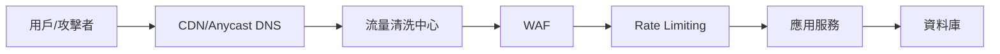
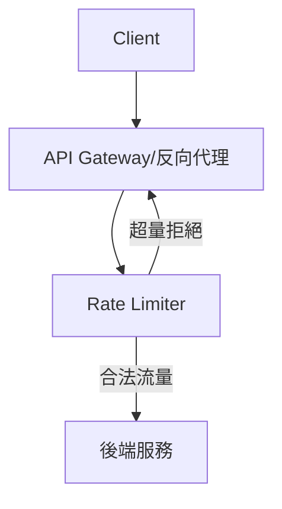

# DDoS 防禦、Rate Limiting、WAF 理論與實務

## 一、理論解釋與常見設計模式

### 1. DDoS（分散式阻斷服務攻擊）防禦
- **定義**：DDoS 攻擊是指大量分散的惡意流量同時攻擊目標服務，導致資源耗盡、服務癱瘓。
- **常見防禦層級**：
  - **網路層（L3/L4）**：阻擋異常流量（如 SYN Flood、UDP Flood）。
  - **應用層（L7）**：針對 HTTP/HTTPS 請求的攻擊（如 Slowloris、HTTP Flood）。
- **設計模式**：
  - **流量清洗（Scrubbing Center）**
  - **Anycast DNS 分流**
  - **黑洞路由（Blackhole Routing）**
  - **速率限制（Rate Limiting）**
  - **自動擴展（Auto Scaling）**

### 2. Rate Limiting（速率限制）
- **定義**：限制單位時間內單一來源或 API 的請求次數，防止濫用與資源耗盡。
- **常見演算法**：
  - **Token Bucket**
  - **Leaky Bucket**
  - **Fixed Window Counter**
  - **Sliding Window Log/Counter**
- **設計模式**：
  - **全域限制**：針對整體服務流量。
  - **用戶/來源 IP 限制**：針對單一用戶或 IP。
  - **API 路徑限制**：針對特定 API。

### 3. WAF（Web Application Firewall）
- **定義**：WAF 於應用層過濾、監控 HTTP 流量，防禦 SQL Injection、XSS、CSRF 等攻擊。
- **設計模式**：
  - **正則規則過濾（Rule-based Filtering）**
  - **行為分析（Behavioral Analysis）**
  - **黑名單/白名單**
  - **自動學習（Machine Learning）**

---

## 二、架構圖解

### 1. 防禦層級與流量過濾流程



### 2. Rate Limiting 策略示意



---

## 三、真實世界範例

### 1. 雲端防禦服務
- **AWS Shield/AWS WAF**：自動偵測並防禦大規模 DDoS，結合 WAF 提供自訂規則。
- **Cloudflare**：全球 Anycast 網路，提供 DDoS 防禦、WAF、Rate Limiting。
- **Google Cloud Armor**：針對 L3-L7 攻擊防禦，支援自訂規則。

### 2. Nginx Rate Limiting 設定範例

```nginx
http {
  limit_req_zone $binary_remote_addr zone=one:10m rate=1r/s;

  server {
    location /api/ {
      limit_req zone=one burst=5 nodelay;
      proxy_pass http://backend;
    }
  }
}
```
- **說明**：每個 IP 每秒最多 1 次請求，突發最多 5 次，超過則立即拒絕。

### 3. WAF 規則配置範例（ModSecurity）

```apache
SecRule REQUEST_HEADERS:User-Agent "sqlmap" "id:1001,deny,status:403,msg:'SQLMap Detected'"
SecRule ARGS "@rx select.+from" "id:1002,deny,status:403,msg:'SQL Injection Pattern'"
```
- **說明**：阻擋常見自動化工具與 SQL Injection 攻擊。

---

## 四、架構師實務建議與 Trade-off 分析

### 1. 安全性 vs. 效能
- **安全性提升**：多層防禦（CDN、Scrubbing、WAF、Rate Limiting）可大幅降低攻擊風險。
- **效能影響**：每層防禦都會增加延遲與資源消耗，需評估流量峰值與服務等級需求。

### 2. 誤判率（False Positive）平衡
- **嚴格規則**：可有效阻擋攻擊，但易誤傷正常用戶。
- **寬鬆規則**：降低誤判但可能放行部分攻擊。
- **建議**：結合監控與自動調整，並針對高風險 API 或路徑加強防禦。

### 3. 維運與擴展性
- **自動化調整**：建議採用動態調整策略（如自動擴展、動態 Rate Limit）。
- **雲端服務**：可快速擴展防禦能力，減少自建維運負擔。

### 4. 綜合建議
- **多層次防禦**：結合網路層、應用層與行為分析。
- **持續監控**：即時調整規則，快速響應新型攻擊。
- **定期演練**：模擬 DDoS 攻擊，驗證防禦有效性。

---

## 參考資料
- [AWS Shield 官方文件](https://docs.aws.amazon.com/waf/latest/developerguide/ddos-overview.html)
- [Cloudflare DDoS Protection](https://www.cloudflare.com/ddos/)
- [Nginx Rate Limiting](https://nginx.org/en/docs/http/ngx_http_limit_req_module.html)
- [OWASP ModSecurity Core Rule Set](https://coreruleset.org/)