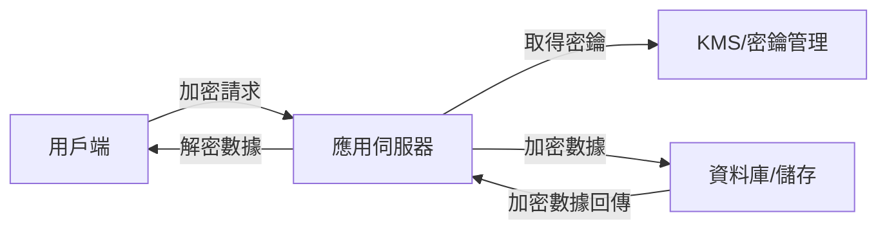
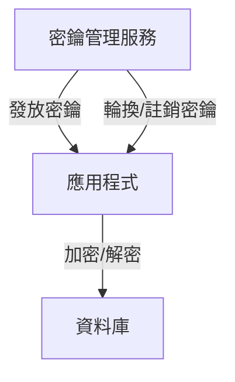
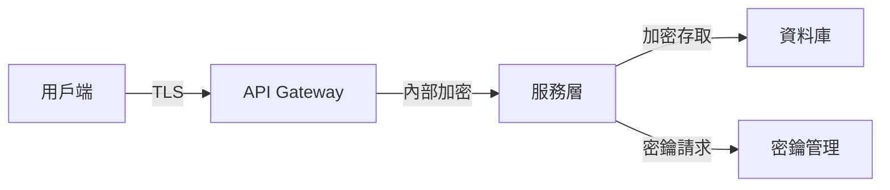

# 數據加密與隱私設計

## 1. 理論解釋

### 靜態加密（Data at Rest Encryption）
靜態加密指的是將儲存在磁碟、資料庫等靜態媒介上的數據進行加密，防止未授權存取。例如：磁碟全盤加密、資料庫欄位加密。

### 傳輸加密（Data in Transit Encryption）
傳輸加密確保數據在網路傳輸過程中不被竊聽或竄改。常見協議如 TLS/SSL，能保障用戶端與伺服器間的資料安全。

### 端到端加密（End-to-End Encryption, E2EE）
端到端加密確保資料從發送端到接收端全程加密，中間節點無法解密內容。常見於即時通訊、雲端儲存等場景。

### 隱私保護原則
- **資料最小化**：僅收集必要資訊。
- **目的限制**：資料僅用於特定目的。
- **存取控制**：嚴格限制誰可存取資料。
- **可審計性**：所有存取與操作皆有紀錄。
- **合規性**：遵循 GDPR、CCPA 等法規。

---

## 2. 常見設計模式

- **TLS/SSL**：網路傳輸加密協議，保障資料傳輸安全。
- **AES（Advanced Encryption Standard）**：對稱式加密演算法，常用於靜態加密。
- **RSA**：非對稱式加密，常用於密鑰交換與數位簽章。
- **KMS（Key Management Service）**：集中式密鑰管理服務，提升密鑰安全性與合規性。
- **Tokenization**：將敏感資料以不可逆的代碼（Token）替換，降低資料外洩風險。
- **匿名化（Anonymization）**：移除可識別個人資訊，使資料無法回溯到個人。
- **去識別化（Pseudonymization/De-identification）**：以假名或代碼取代敏感資訊，保留資料分析價值。

---

## 3. 架構圖解

### 數據加密流程



### 密鑰管理架構



### 數據流隱私設計



---

## 4. 真實世界範例

### TLS 配置（Nginx 範例）

```nginx
server {
    listen 443 ssl;
    ssl_certificate /etc/ssl/certs/server.crt;
    ssl_certificate_key /etc/ssl/private/server.key;
    ssl_protocols TLSv1.2 TLSv1.3;
    ssl_ciphers HIGH:!aNULL:!MD5;
}
```

### KMS 使用（AWS KMS 範例）

- 建立金鑰並設定 IAM 權限。
- 透過 SDK 加解密資料：

```python
# Python AWS KMS 加密範例
import boto3

kms = boto3.client('kms')
plaintext = b"Sensitive Data"
response = kms.encrypt(
    KeyId='alias/my-key',
    Plaintext=plaintext
)
ciphertext = response['CiphertextBlob']
```

### GDPR 隱私設計

- 實作資料存取權、刪除權（Right to be Forgotten）。
- 記錄資料處理活動（Data Processing Activities）。
- 實施資料匿名化與去識別化。

### 資料庫加密設定（PostgreSQL 範例）

```sql
-- 啟用透明資料加密（TDE）
CREATE TABLE confidential_data (
    id serial PRIMARY KEY,
    data bytea ENCRYPTED WITH (COLUMN_ENCRYPTION_KEY = my_key)
);
```

---

## 5. 架構師實務建議與 Trade-off 分析

### 安全性
- 強加密與嚴格密鑰管理能大幅提升安全性，但需防範密鑰洩漏與內部威脅。
- 端到端加密可防止中間人攻擊，但會增加系統整合難度。

### 效能
- 加密/解密運算會增加系統延遲，需評估效能瓶頸。
- 可考慮僅針對敏感欄位加密，減少效能損耗。

### 合規性
- 須依據法規（如 GDPR、CCPA）設計資料存取、刪除、匿名化等機制。
- 定期審查與測試安全措施，確保合規。

### 綜合建議
- 選擇合適的加密技術與密鑰管理方案，兼顧安全與效能。
- 實施多層防護（defense in depth），如傳輸加密、靜態加密、存取控制。
- 定期教育團隊安全意識，並建立自動化監控與告警機制。

---