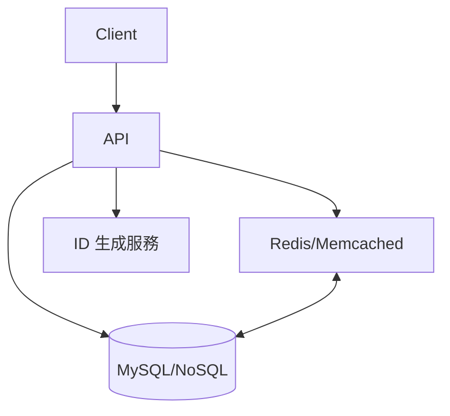
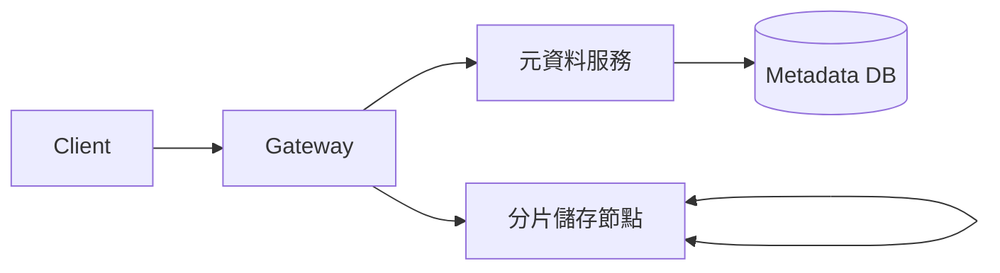
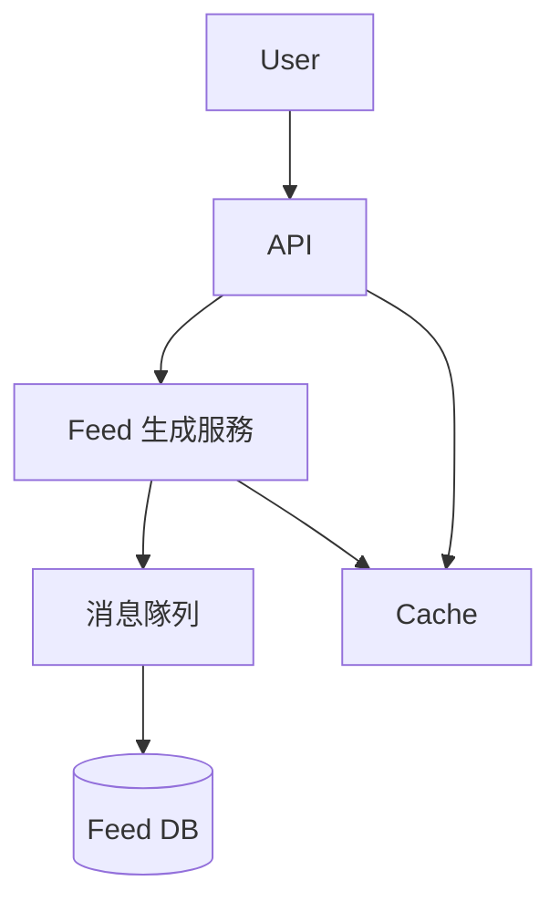
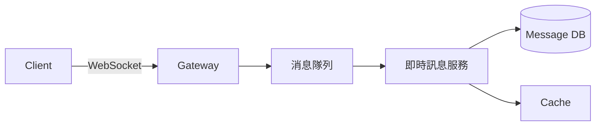
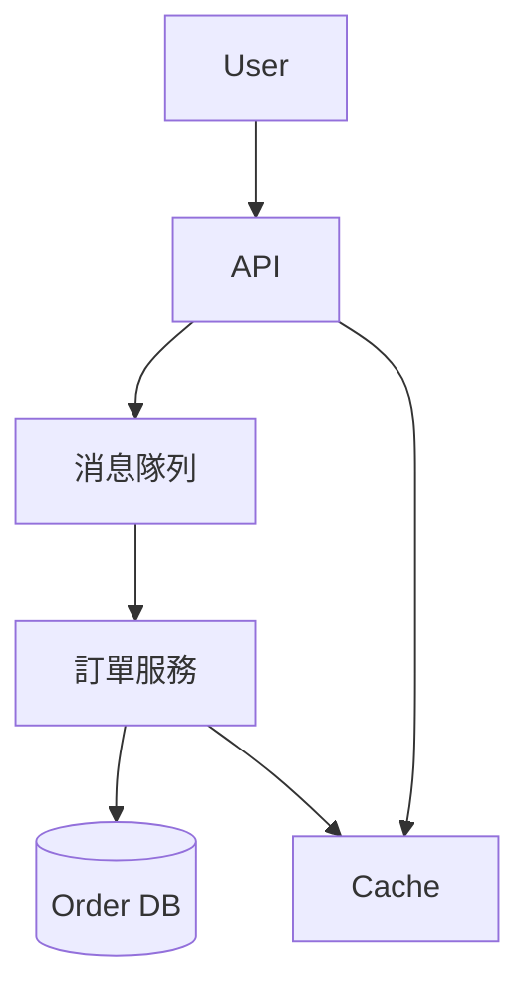

# 經典設計案例總覽與分類

本章節彙整五大經典系統設計案例，涵蓋理論基礎、核心挑戰、設計模式、架構圖、真實世界範例，以及架構師實務建議與 trade-off 分析。適合系統設計面試、架構師實戰參考。

## 案例分類

1. URL Shortener（短網址服務）
2. 分散式文件儲存系統
3. 社交網路 Feed 系統
4. 即時通訊系統
5. 高併發訂單系統

---

## 1. URL Shortener（短網址服務）

### 理論解釋
將長網址轉換為短網址，方便分享與追蹤。需支援高查詢量、低延遲、唯一性與可擴展性。

### 核心挑戰
- 唯一性與碰撞避免
- 高併發寫入與查詢
- 熱點資料分布
- 短網址還原效率

### 設計模式
- 資料庫自增 ID 或分散式唯一 ID（如 Snowflake）
- Cache + 資料庫雙層查詢
- 分片（Sharding）與負載均衡

### 架構圖


### 真實世界範例
- API 設計：
  - POST /shorten
  - GET /{shortUrl}
- 資料流：用戶請求 → 產生短碼 → 儲存對應關係 → 回傳短網址
- 配置片段（Redis 快取）：
  ```yaml
  maxmemory-policy: allkeys-lru
  ```

### 架構師建議與 Trade-off 分析
- **可用性**：Cache 失效時需降級查詢 DB
- **擴展性**：ID 生成需分散，避免單點瓶頸
- **成本**：Cache 可降低 DB 負載但需額外資源
- **複雜度**：分片與一致性處理需額外設計

---

## 2. 分散式文件儲存系統

### 理論解釋
支援大規模檔案上傳、下載、冗餘備援與高可用，常見於雲端儲存（如 Google Drive、Dropbox）。

### 核心挑戰
- 大檔案分片與合併
- 一致性與冗餘備援
- 元資料管理
- 效能與成本平衡

### 設計模式
- Chunk 分片儲存
- 多副本冗餘（Replication）
- 一致性哈希（Consistent Hashing）
- 元資料服務分離

### 架構圖


### 真實世界範例
- API 設計：
  - POST /upload
  - GET /download/{fileId}
- 資料流：檔案分片 → 分散儲存 → 元資料記錄分片位置
- 配置片段（副本數）：
  ```json
  { "replicaCount": 3 }
  ```

### 架構師建議與 Trade-off 分析
- **可用性**：多副本提升容錯，但增加儲存成本
- **擴展性**：ChunkServer 可橫向擴展
- **成本**：儲存與網路流量需平衡
- **複雜度**：元資料一致性需特別設計

---

## 3. 社交網路 Feed 系統

### 理論解釋
即時推播用戶動態，需支援高併發讀寫、個人化排序與資料一致性。

### 核心挑戰
- Feed 聚合與排序
- 寫擴散（Fan-out on write）與讀擴散（Fan-out on read）
- 個人化推薦
- 熱點用戶資料處理

### 設計模式
- Pull/Push Feed 混合
- 消息隊列（Kafka）解耦
- Cache 熱點資料
- 分片與分區

### 架構圖


### 真實世界範例
- API 設計：
  - GET /feed
  - POST /post
- 資料流：用戶發文 → Feed 生成 → 推送/拉取 Feed
- 配置片段（Kafka topic 分區）：
  ```yaml
  num.partitions: 10
  ```

### 架構師建議與 Trade-off 分析
- **可用性**：Cache 熱點資料，降低 DB 壓力
- **擴展性**：Feed 生成與消息隊列可獨立擴展
- **成本**：推模式需大量儲存，拉模式查詢壓力大
- **複雜度**：排序與推薦演算法需持續優化

---

## 4. 即時通訊系統

### 理論解釋
支援用戶間即時訊息傳遞，需低延遲、高可靠、訊息同步與離線儲存。

### 核心挑戰
- 連線管理與狀態同步
- 訊息可靠投遞
- 離線訊息儲存
- 水平擴展與分區

### 設計模式
- 長連線（WebSocket）
- 訊息隊列（MQTT/Kafka）
- 分區與用戶分流
- ACK 機制保證可靠性

### 架構圖


### 真實世界範例
- API 設計：
  - WebSocket /connect
  - REST /history/{userId}
- 資料流：用戶連線 → 訊息發送 → 投遞與儲存 → 離線同步
- 配置片段（WebSocket 心跳）：
  ```json
  { "heartbeatInterval": 30 }
  ```

### 架構師建議與 Trade-off 分析
- **可用性**：多 Gateway 部署提升容錯
- **擴展性**：訊息服務與儲存可獨立擴展
- **成本**：長連線需更多資源
- **複雜度**：狀態同步與可靠性需嚴謹設計

---

## 5. 高併發訂單系統

### 理論解釋
處理秒殺、搶購等高併發訂單，需確保一致性、去重與高效處理。

### 核心挑戰
- 超高併發下的資料一致性
- 超賣與重複下單問題
- 訂單狀態追蹤
- 資料庫瓶頸

### 設計模式
- 預扣庫存（Pre-deduct）
- 分散式鎖（Redis/Zookeeper）
- 消息隊列削峰填谷
- 資料庫分表分庫

### 架構圖


### 真實世界範例
- API 設計：
  - POST /order
  - GET /order/{orderId}
- 資料流：下單請求 → 消息隊列排隊 → 訂單服務處理 → 狀態回報
- 配置片段（Redis 分布式鎖）：
  ```yaml
  lock_timeout: 5s
  ```

### 架構師建議與 Trade-off 分析
- **可用性**：消息隊列保證請求不丟失
- **擴展性**：訂單服務可多實例部署
- **成本**：分散式鎖與消息隊列需額外維運
- **複雜度**：一致性與去重需嚴謹設計

---

# 結語

以上五大經典設計案例涵蓋系統設計常見挑戰與解法，實務上需根據業務需求、流量規模與資源條件，靈活選擇設計模式與技術棧，並持續優化架構以應對成長與變化。