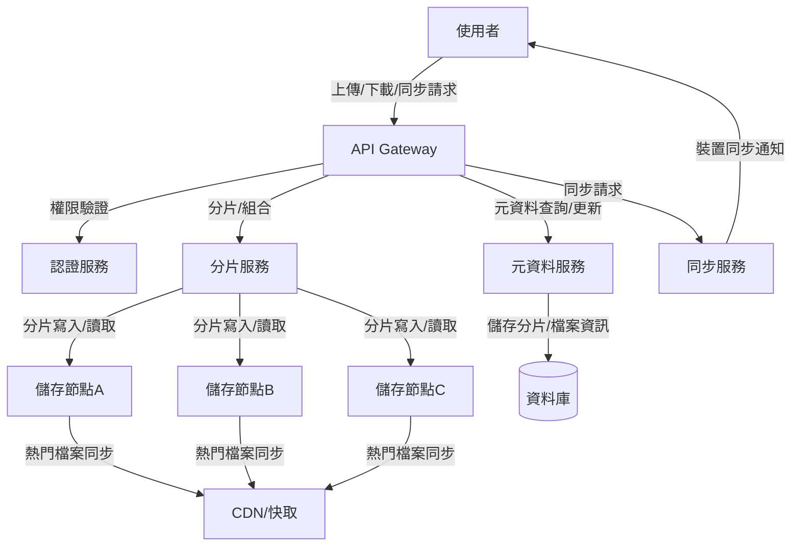

# 分散式文件儲存系統設計

## 1. 需求分析與設計理論

### 1.1 需求分析
- **高可用性**：用戶需隨時存取檔案，不能因單點故障導致服務中斷。
- **高擴展性**：需支援大量用戶與檔案，能隨需求動態擴充儲存與運算資源。
- **一致性與同步**：多裝置、多用戶同時操作時，需確保檔案一致性與同步。
- **安全性**：檔案需加密儲存與傳輸，並有完善的權限控管。
- **效能**：檔案上傳、下載、同步需快速，支援大檔案與多檔案操作。
- **成本控制**：儲存與頻寬成本需可控，支援冷熱資料分層。

### 1.2 核心挑戰
- **資料分片與分佈**：如何將檔案有效分片並分散儲存於多節點，提升可靠性與效能。
- **元資料管理**：需有高效的元資料服務追蹤檔案分片、版本、權限等資訊。
- **一致性協議**：多節點間如何協調，確保檔案一致性（如 CAP 定理權衡）。
- **故障恢復與容錯**：節點故障時如何自動修復與資料重建。
- **同步機制**：多裝置/多用戶間的即時同步與衝突解決。
- **安全與存取控制**：防止未授權存取與資料洩漏。

### 1.3 常見設計模式
- **分片（Sharding）**：將大檔案切割為多個分片，分散儲存於不同節點。
- **副本（Replication）**：每個分片可有多份副本，提升可用性與容錯。
- **元資料中心化管理**：集中式或分散式元資料服務管理檔案資訊。
- **同步與版本控制**：支援多版本、衝突解決與回溯。
- **分層儲存**：熱資料與冷資料分開管理，降低成本。

---

## 2. 系統架構圖

---

## 3. API/資料流設計與實例

### 3.1 檔案上傳 API 範例

#### API 設計
- `POST /files/upload`
    - 認證：JWT/OAuth2
    - 請求參數：檔案、檔案名稱、目錄、分片資訊（可選）
    - 回應：檔案ID、分片ID、上傳URL

#### 上傳流程
1. 用戶端呼叫 `/files/upload`，取得分片上傳URL與分片ID。
2. 用戶端將檔案分片後，分別上傳至指定儲存節點。
3. 上傳完成後，通知元資料服務更新分片狀態。
4. 元資料服務記錄檔案與分片對應關係。

#### 範例資料表設計

**files**
| file_id | user_id | filename | size | created_at | updated_at |
|---------|---------|----------|------|------------|------------|
| 1       | 100     | abc.pdf  | 2MB  | ...        | ...        |

**file_shards**
| shard_id | file_id | storage_node | status | checksum | created_at |
|----------|---------|--------------|--------|----------|------------|
| s1       | 1       | nodeA        | done   | ...      | ...        |
| s2       | 1       | nodeB        | done   | ...      | ...        |

**metadata**
| meta_id | file_id | key      | value      |
|---------|---------|----------|------------|
| m1      | 1       | version  | v1         |
| m2      | 1       | owner    | user100    |

---

### 3.2 分片儲存與同步機制

- **分片儲存**：檔案分片後分別上傳至多個儲存節點，每個分片可有多份副本。
- **同步機制**：用戶端定期與同步服務溝通，取得檔案變更資訊，進行增量同步。
- **衝突解決**：如同一檔案被多端同時修改，需根據時間戳、版本號或用戶選擇進行合併或覆蓋。

#### 同步流程範例
1. 裝置A修改檔案後，將變更上傳至同步服務。
2. 同步服務通知其他裝置有新版本可下載。
3. 裝置B收到通知後下載最新分片並合併。

---

## 4. 架構師實務建議與 Trade-off 分析

### 4.1 一致性（Consistency）
- 強一致性（如同步鎖、分布式交易）可確保資料正確，但效能較低、延遲高。
- 最終一致性（如多數副本確認）提升效能與可用性，但短時間內可能出現舊資料。

### 4.2 可用性（Availability）
- 多副本、跨區域部署可提升可用性，但需考慮同步延遲與成本。
- 元資料服務建議高可用部署（如 Raft/Paxos 共識協議）。

### 4.3 擴展性（Scalability）
- 儲存節點可水平擴展，分片與副本機制可動態調整。
- 元資料服務為瓶頸時，可考慮分散式元資料架構。

### 4.4 成本（Cost）
- 熱資料可用 SSD/快取，冷資料用低成本儲存（如物件儲存）。
- 多副本提升可靠性但增加儲存成本，需依業務需求調整。

### 4.5 複雜度（Complexity）
- 分片、同步、衝突解決等機制提升系統複雜度，需有完善監控與自動化運維工具。
- 建議採用現有分散式儲存框架（如 Ceph、MinIO）降低自建風險。

---

## 5. 結論

分散式文件儲存系統設計需在一致性、可用性、擴展性、成本與複雜度間取得平衡。建議根據實際業務需求選擇合適的設計模式與技術棧，並持續優化架構以因應規模成長與新挑戰。