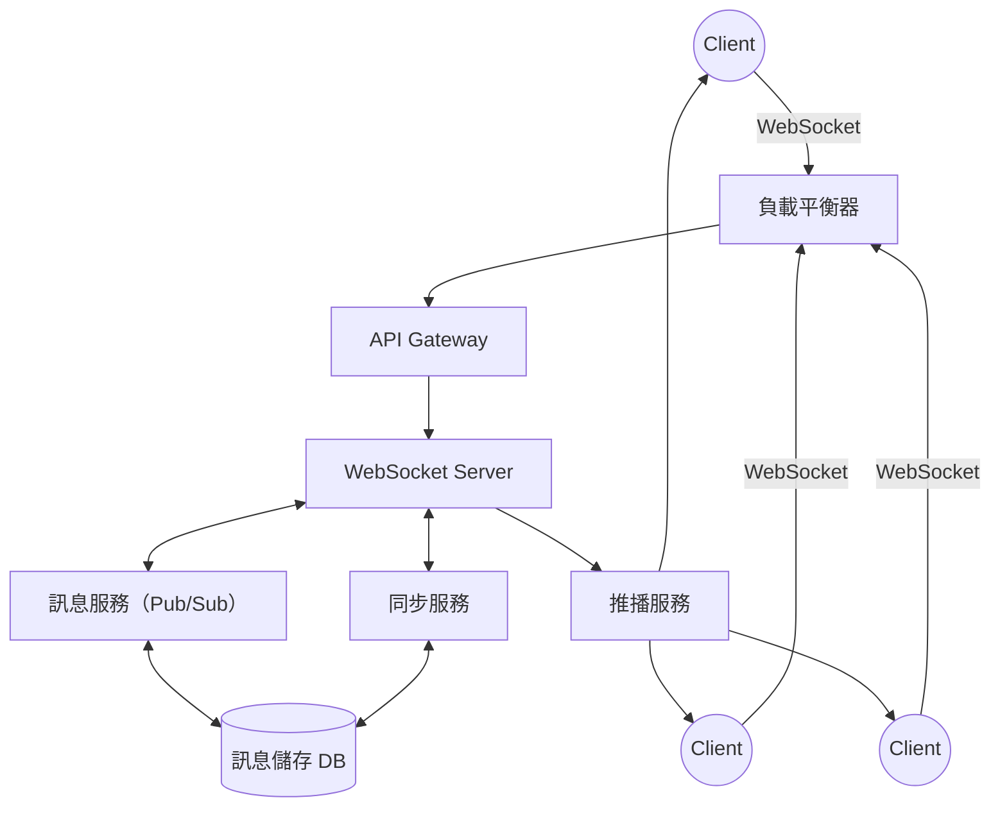

# 設計即時通訊系統

## 1. 系統設計理論

### 需求分析
- **即時性**：訊息需能即時送達，延遲需極低。
- **可靠性**：訊息不可遺失，需有重送與確認機制。
- **擴展性**：需支援大量同時連線與訊息流量。
- **一致性與同步**：多裝置同步、訊息順序一致。
- **安全性**：訊息加密、用戶驗證、權限控管。
- **推播支援**：用戶離線時能收到通知。

### 核心挑戰
- **高併發連線管理**（如百萬級 WebSocket 連線）
- **訊息可靠傳遞與順序保證**
- **多裝置同步與離線訊息儲存**
- **推播與即時通知整合**
- **資料一致性與分散式儲存**
- **系統可用性與容錯**

### 常見設計模式
- **Pub/Sub（發布/訂閱）**：訊息中心化分發，易於擴展。
- **Event Sourcing**：所有訊息事件皆記錄，便於重播與恢復。
- **CQRS**：讀寫分離，提升效能與可維護性。
- **分散式訊息佇列**：如 Kafka、RabbitMQ，提升可靠性與彈性。
- **WebSocket 長連線**：雙向即時通訊，降低延遲。

---

## 2. 架構圖


**說明：**
- Client 透過 WebSocket 連線至負載平衡器，進入 API Gateway，再由 WebSocket Server 處理。
- 訊息服務（Pub/Sub）負責訊息分發與儲存。
- 推播服務負責離線通知。
- 同步服務協助多裝置訊息同步。

---

## 3. API/資料流設計與範例

### 訊息發送 API（REST）
```http
POST /api/messages/send
Content-Type: application/json

{
  "from": "userA",
  "to": "userB",
  "content": "Hello, world!",
  "type": "text"
}
```
**回應：**
```json
{
  "messageId": "abc123",
  "status": "sent",
  "timestamp": 1694956800
}
```

### WebSocket 訊息格式
```json
{
  "action": "sendMessage",
  "data": {
    "to": "userB",
    "content": "Hello, world!",
    "type": "text"
  }
}
```
**伺服器推播訊息：**
```json
{
  "action": "receiveMessage",
  "data": {
    "from": "userA",
    "content": "Hello, world!",
    "timestamp": 1694956800
  }
}
```

### 資料表設計（MySQL 範例）
```sql
CREATE TABLE messages (
  id BIGINT PRIMARY KEY AUTO_INCREMENT,
  sender_id VARCHAR(64) NOT NULL,
  receiver_id VARCHAR(64) NOT NULL,
  content TEXT NOT NULL,
  type VARCHAR(16) NOT NULL,
  status VARCHAR(16) DEFAULT 'sent',
  created_at TIMESTAMP DEFAULT CURRENT_TIMESTAMP,
  delivered_at TIMESTAMP NULL,
  read_at TIMESTAMP NULL
);

CREATE INDEX idx_receiver_id ON messages(receiver_id);
```

### WebSocket 配置（Node.js 範例）
```javascript
// app.js
const WebSocket = require('ws');
const wss = new WebSocket.Server({ port: 8080 });

wss.on('connection', function connection(ws) {
  ws.on('message', function incoming(message) {
    // 處理訊息發送與分發
  });
  // 維護用戶連線狀態
});
```

---

## 4. 架構師實務建議與 Trade-off 分析

### 即時性
- **WebSocket** 提供低延遲雙向通訊，但需考慮連線維護成本。
- **推播服務** 適合用戶離線時通知，但有延遲。

### 可靠性
- **訊息持久化**（DB/Queue）防止訊息遺失。
- **重送機制** 保證訊息送達。
- **多副本儲存** 提升容錯。

### 擴展性
- **橫向擴展 WebSocket Server**，配合 session sticky 或集中式連線管理。
- **Pub/Sub 架構** 易於訊息分發與多服務整合。
- **分散式資料庫** 支援高併發。

### 成本
- **WebSocket 長連線** 需大量資源，雲端計費高。
- **推播服務** 依第三方服務收費。
- **資料儲存** 需考慮儲存空間與備份成本。

### 複雜度
- **多裝置同步**、訊息順序、離線訊息等需額外設計。
- **分散式架構** 增加維運與除錯難度。
- **安全性設計**（加密、驗證）不可忽略。

---

## 5. 結論

即時通訊系統設計需兼顧即時性、可靠性、擴展性與成本。建議採用 WebSocket + Pub/Sub 架構，並搭配推播與多裝置同步機制。設計時應根據實際需求權衡 trade-off，並持續優化系統效能與可用性。