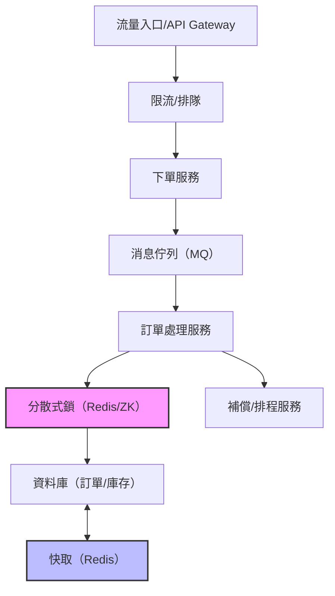

# 設計高併發訂單系統

## 1. 理論解釋

### 需求分析
- 支援大量用戶同時下單（如秒殺、搶購活動）
- 保證訂單資料正確性與一致性
- 高可用、可擴展、低延遲
- 防止超賣、重複下單、資料競爭

### 核心挑戰
- **瞬時高流量**：短時間內大量請求湧入，容易造成系統過載
- **資料一致性**：多節點、多服務下如何確保庫存、訂單正確
- **超賣問題**：庫存競爭導致賣出超過實際數量
- **分散式環境下的鎖與排程**：如何協調多台機器的操作
- **延遲與用戶體驗**：需快速響應，避免用戶等待

### 常見設計模式
- **流量削峰**：API Gateway + Rate Limiting，前端排隊
- **消息佇列（MQ）削峰填谷**：下單請求進入佇列，後端異步處理
- **分散式鎖**：如 Redis、Zookeeper 控制庫存扣減
- **快取（Cache）預扣庫存**：減少資料庫壓力
- **資料庫優化**：分庫分表、讀寫分離
- **排程補償**：失敗訂單自動補償或回滾

---

## 2. 架構圖



---

## 3. API/資料流設計與範例

### 下單 API 設計

- **POST /api/order**
    - 請求參數：user_id, product_id, quantity
    - 響應：訂單狀態、訂單編號

#### 範例流程
1. 用戶發送下單請求
2. API Gateway 檢查流量、權限
3. 請求進入消息佇列
4. 後端消費消息，進行庫存預扣與訂單建立
5. 若庫存不足，回滾訂單並通知用戶

### 資料表設計（MySQL）

```sql
CREATE TABLE `order` (
  `id` BIGINT PRIMARY KEY AUTO_INCREMENT,
  `user_id` BIGINT NOT NULL,
  `product_id` BIGINT NOT NULL,
  `quantity` INT NOT NULL,
  `status` VARCHAR(20) NOT NULL,
  `created_at` DATETIME NOT NULL
);

CREATE TABLE `product_stock` (
  `product_id` BIGINT PRIMARY KEY,
  `stock` INT NOT NULL,
  `version` INT NOT NULL
);
```

### Redis/消息佇列配置

- **Redis**：快取庫存、分散式鎖
    - `SETNX lock:product:{id}` 控制扣庫存原子性
    - `DECR stock:product:{id}` 快速預扣
- **消息佇列（如 Kafka/RabbitMQ）**：下單請求入列，異步處理

---

## 4. 架構師實務建議與 Trade-off 分析

| 面向         | 建議與說明                                                                                   | Trade-off 分析                         |
|--------------|---------------------------------------------------------------------------------------------|----------------------------------------|
| 一致性       | 關鍵操作（如扣庫存）需加鎖或用原子操作，避免超賣。可用最終一致性，失敗補償。                   | 強一致性會降低效能，最終一致性需補償   |
| 可用性       | 服務需多活部署，關鍵組件（MQ、Redis）需高可用配置。                                           | 增加成本與複雜度                       |
| 擴展性       | 服務無狀態化、分庫分表、MQ削峰，易於水平擴展。                                               | 架構設計複雜，需考慮資料分片           |
| 成本         | 依據流量彈性擴容，快取與MQ可減少資料庫壓力。                                                 | 高峰期需預留資源，閒時資源利用率低      |
| 複雜度       | 建議分層設計，關鍵流程加監控與告警，異常自動補償。                                           | 系統維運與排錯難度提升                 |

---

## 5. 結論

高併發訂單系統設計需兼顧效能、一致性與可用性。建議採用削峰填谷、分散式鎖、快取與消息佇列等技術，並根據業務需求選擇合適的 trade-off。架構設計應預留擴展與容錯空間，並強化監控與補償機制，確保系統穩定運行。