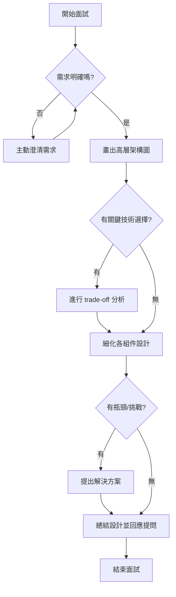

# 36_面試實戰指南

## 一、系統設計面試流程與理論解釋

系統設計面試主要考察候選人對於大型系統架構設計的能力、trade-off 分析、需求澄清與溝通技巧。典型流程如下：

1. **需求澄清**
   - 主動詢問產品目標、用戶規模、流量預期、非功能性需求（如可用性、擴展性、安全性等）。
   - 釐清模糊或不完整的需求，避免假設。

2. **架構拆解**
   - 由高層到細節，先畫出整體架構圖（如用戶、API Gateway、服務、資料庫、Cache、第三方服務等）。
   - 逐步細化各個組件的責任與互動。

3. **Trade-off 分析**
   - 比較不同技術方案（如 SQL vs NoSQL、同步 vs 非同步、單體 vs 微服務）。
   - 分析各方案的優缺點，並結合需求做出選擇。

4. **溝通技巧**
   - 邏輯清晰地表達設計思路，主動與面試官互動。
   - 遇到不熟悉的領域，坦誠說明並提出合理假設。

---

## 二、系統設計面試流程圖

---

## 三、常見問題與最佳策略

### 1. 如何處理模糊需求？
- **主動詢問**：釐清用戶規模、QPS、資料一致性、可用性、延遲等指標。
- **合理假設**：若面試官未給明確數字，可主動提出假設並說明原因。
- **分層討論**：先討論一般情境，再針對特殊情境深入。

### 2. 如何畫架構圖？
- **自上而下**：先畫出用戶、入口（如 API Gateway）、核心服務、資料庫、Cache 等主要組件。
- **標註資料流向**：用箭頭標示資料流，說明各組件互動。
- **逐步細化**：根據面試官追問，逐步展開細節（如分區、冗餘、容錯等）。

### 3. Trade-off 分析技巧
- **列出選項**：明確列出可行方案。
- **比較優缺點**：針對可用性、擴展性、維護性、成本等維度分析。
- **結合需求選擇**：根據實際需求做出合理選擇，並說明原因。

---

## 四、架構師實務建議與 trade-off 分析

### 1. 時間分配
- **需求澄清（3-5 分鐘）**：快速釐清核心需求與限制。
- **架構設計（10-15 分鐘）**：畫出高層架構並細化關鍵組件。
- **trade-off 分析（5 分鐘）**：針對關鍵決策點進行分析。
- **總結與回應（3-5 分鐘）**：總結設計並回答面試官問題。

### 2. 答題深度
- **先廣後深**：先展現全局觀，再針對面試官關注的部分深入。
- **避免過度細節**：除非被追問，否則不需深入到每個 API 細節。

### 3. 溝通與表達
- **主動互動**：適時詢問面試官意見，確認方向正確。
- **邏輯清晰**：分步驟說明設計思路，避免跳躍。
- **誠實應對**：遇到不熟悉的領域，坦誠說明並提出合理假設。

### 4. Trade-off 分析建議
- **明確列點**：將優缺點條列，便於比較。
- **結合需求**：每個選擇都要回扣需求，說明為何這樣選。
- **舉例說明**：用實際案例輔助說明 trade-off。

---

## 五、結語

系統設計面試重點在於邏輯思維、溝通能力與 trade-off 分析。建議多加練習，熟悉常見架構與設計模式，並養成主動澄清需求與條理表達的習慣，將有助於在面試中脫穎而出。