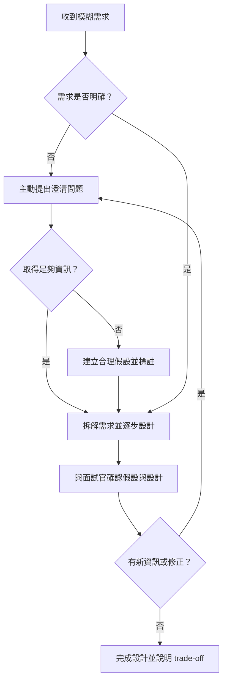

# 如何處理模糊需求

## 一、理論解釋與常見策略

在系統設計面試中，面對模糊或不完整的需求是常態。這類需求通常缺乏明確的範圍、細節或目標，考驗設計者的溝通、分析與假設能力。處理模糊需求的核心在於「主動澄清」、「合理拆解」與「建立假設」。

### 常見策略

1. **澄清問題**
   - 主動詢問需求相關細節，釐清目標、限制、使用情境。
   - 針對不明確處提出具體問題，避免自行臆測。

2. **需求拆解**
   - 將大範圍需求拆分為多個子問題，逐步釐清每一部分。
   - 以用戶流程、功能模組、資料流等角度切入。

3. **假設建立**
   - 在資訊不足時，明確說明自己的假設前提。
   - 每提出一項設計，皆標註其依據的假設，方便後續調整。

4. **反覆驗證**
   - 與面試官或需求方持續確認理解是否正確。
   - 根據回饋調整設計方向。

---

## 二、處理流程圖

---

## 三、常見問題與範例

### 1. 如何詢問澄清問題？

- 「請問這個系統的主要使用者是誰？」
- 「有沒有特定的流量規模或性能要求？」
- 「資料一致性與可用性哪個更重要？」
- 「是否有預算、時程或技術棧的限制？」
- 「有哪些失敗情境需要特別考慮？」

### 2. 如何界定需求範圍？

- 以 MVP（最小可行產品）為基準，聚焦核心功能。
- 明確區分「必須有」與「加分項」。
- 針對每個功能點，確認其必要性與優先順序。

### 3. 範例

**情境：設計一個即時通訊系統，但需求僅說「讓用戶可以即時聊天」。**

- 澄清問題：
  - 「是否需要支援群組聊天？」
  - 「訊息是否需要加密？」
  - 「是否需支援離線訊息推播？」
  - 「有沒有訊息儲存期限？」

- 假設建立：
  - 假設只需一對一聊天，訊息需永久保存，無需加密。

- 拆解需求：
  - 用戶註冊/登入、好友管理、訊息傳遞、訊息儲存。

---

## 四、架構師實務建議與 trade-off 分析

### 1. 溝通技巧

- 保持主動，勇於發問，避免「不懂裝懂」。
- 用具體例子或情境驗證理解。
- 明確標註假設，讓對方易於指正。

### 2. 時間分配

- 初期多花時間在需求澄清，避免後續大幅返工。
- 若面試時間有限，優先處理關鍵需求，次要部分以假設補足。

### 3. 假設風險

- 假設過多會增加設計偏差風險，需適時回頭確認。
- 每個假設都應有備案，並說明若假設不成立的應對方式。

### 4. Trade-off 分析

- **設計深度 vs. 廣度**：時間有限時，選擇深入一兩個重點場景，其他部分簡述假設。
- **彈性設計 vs. 複雜度**：過度追求彈性會增加系統複雜度，需根據需求明確度調整設計範圍。
- **溝通效率 vs. 完整性**：在資訊不足時，適度妥協，先提出可行方案，再根據回饋調整。

---

## 五、結語

面對模糊需求，關鍵在於主動澄清、合理假設、明確拆解與持續溝通。將每一步思考過程透明化，不僅能展現專業，也能有效降低設計風險。