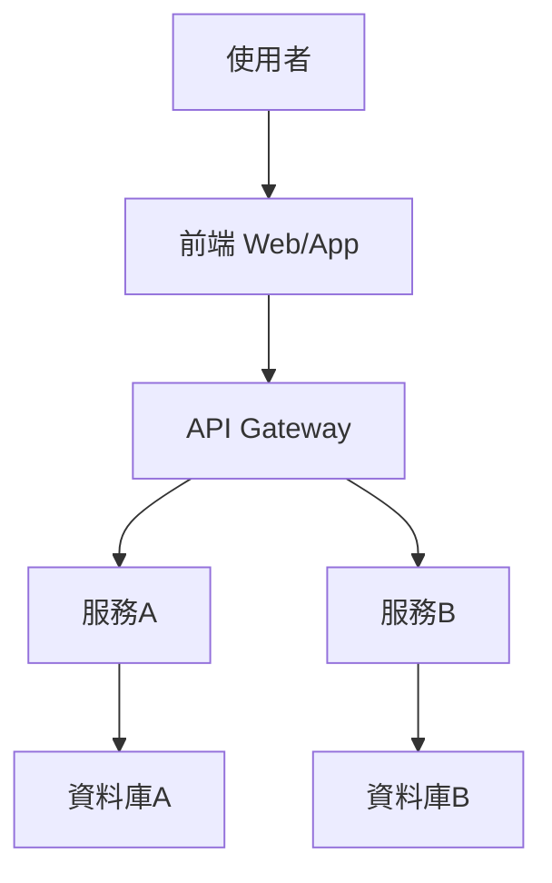
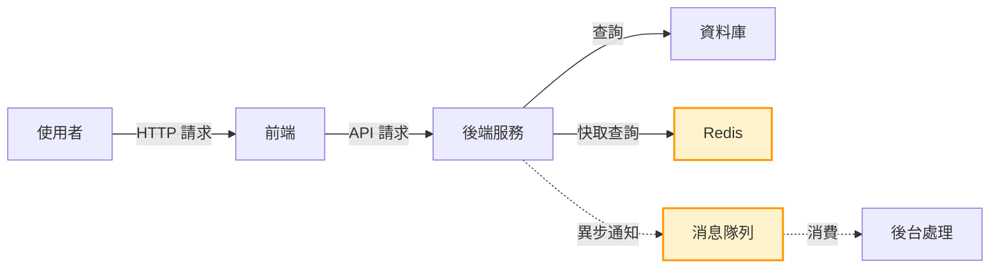

# 如何畫架構圖與做 Trade-off 分析

## 1. 架構圖繪製與 Trade-off 分析理論解釋

### 架構圖常見圖例
- **元件（Component）**：方框表示，代表服務、模組、資料庫等。
- **資料流（Data Flow）**：箭頭表示，標示資料或請求的流向。
- **分層（Layering）**：用不同區塊或顏色區分，如前端、後端、資料層。
- **關聯（Relationship）**：虛線/實線區分同步、非同步、依賴等。

### 分層設計
- **表示層（Presentation Layer）**：如 Web、App。
- **邏輯層（Logic Layer）**：業務邏輯、API。
- **資料層（Data Layer）**：資料庫、快取、檔案系統。

### 元件關係
- **同步/非同步**：同步用實線，非同步用虛線。
- **依賴/組合**：箭頭指向依賴對象。

### Trade-off 評估方法
- **列舉選項**：針對同一需求提出多種設計方案。
- **評估維度**：效能、可用性、成本、維運、複雜度等。
- **加權評分**：針對每個維度給分，總結優缺點。
- **決策標註**：在圖上標示 trade-off 點，說明取捨原因。

---

## 2. 圖解與範例

### 2.1 不同層級架構圖

### 2.2 資料流與 Trade-off 標註

> **Trade-off 標註說明**：
> - Redis 快取：提升效能，但需考慮資料一致性。
> - 消息隊列：提升系統解耦與可用性，但增加複雜度與延遲。

---

## 3. 常見問題與實務建議

### 常見問題
- **圖太複雜/太簡單**：細節過多難以溝通，過少則無法展現重點。
- **缺乏 trade-off 標註**：只畫結構，未說明設計取捨。
- **忽略資料流/依賴關係**：只畫元件，未標示互動。

### 實務建議
- **依溝通對象調整細節**：高層主管看重整體流程，工程師需細節。
- **明確標註 trade-off**：用顏色、註解標示設計取捨點。
- **聚焦溝通重點**：每張圖只傳達一個核心訊息。
- **討論 trade-off 技巧**：
    - 先列出所有選項與評估維度。
    - 針對每個維度討論優缺點。
    - 以業務目標為最終決策依據。

---

## 4. 架構師 Trade-off 分析實戰經驗

### 經驗分享

- **效能 vs. 一致性**
    - 例：引入快取（如 Redis）可提升查詢效能，但需設計快取失效策略，避免資料不一致。
- **可用性 vs. 成本**
    - 例：多區部署可提升可用性，但基礎設施與維運成本大幅增加。
- **維運 vs. 複雜度**
    - 例：微服務架構易於維運與擴展，但服務間通訊、部署、監控複雜度提升。
- **擴展性 vs. 開發速度**
    - 例：預留彈性設計可因應未來擴展，但初期開發需投入更多設計與測試時間。

### 建議流程
1. 明確需求與目標。
2. 列出可行方案，針對每個方案進行多維度評估。
3. 在架構圖上標註關鍵 trade-off 點。
4. 與團隊討論，取得共識。
5. 持續回顧與調整設計。

---

## 結語

架構圖與 trade-off 分析是系統設計溝通的核心工具。善用圖例、分層、資料流與 trade-off 標註，能有效協助團隊理解設計決策，並在複雜需求下做出最佳取捨。