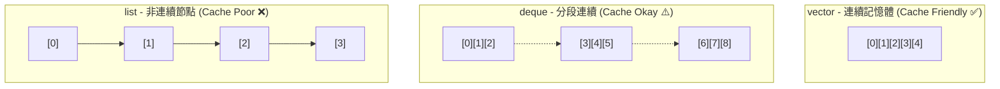
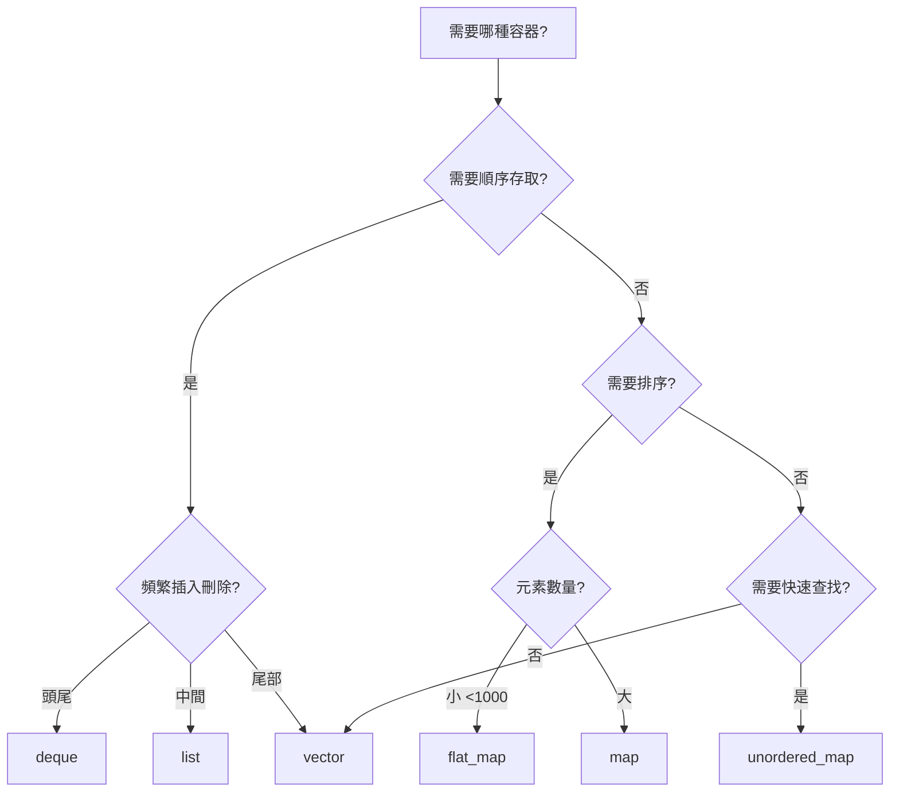

# 容器性能特性

> **優先級**: ⭐⭐⭐ 必看
> **適用場景**: HFT/金融系統/高性能計算
> **前置知識**: C++ 基礎語法、時間複雜度分析 (Big O)

## 目錄

- [容器性能總覽](#容器性能總覽)
- [序列容器深度解析](#序列容器深度解析)
- [關聯容器深度解析](#關聯容器深度解析)
- [容器適配器](#容器適配器)
- [容器選擇策略](#容器選擇策略)
- [性能優化技巧](#性能優化技巧)
- [實戰案例](#實戰案例)
- [性能測試對比](#性能測試對比)
- [最佳實踐](#最佳實踐)
- [參考資料](#參考資料)

## 容器性能總覽

### 1. 時間複雜度對照表

選擇正確的容器是性能優化的第一步。以下是常用容器的操作複雜度對比：

| 容器類型             | 隨機存取 | 插入/刪除 (頭部) | 插入/刪除 (尾部) | 插入/刪除 (中間) | 查找      | 迭代器失效    |
| :------------------- | :------- | :--------------- | :--------------- | :--------------- | :-------- | :------------ |
| **vector**           | O(1)     | O(n)             | O(1) 均攤        | O(n)             | O(n)      | 擴容時失效    |
| **deque**            | O(1)     | O(1)             | O(1)             | O(n)             | O(n)      | 擴容時失效    |
| **list**             | O(n)     | O(1)             | O(1)             | O(1)             | O(n)      | 不失效        |
| **map/set**          | -        | O(log n)         | O(log n)         | O(log n)         | O(log n)  | 不失效        |
| **unordered_map**    | -        | O(1) 平均        | O(1) 平均        | O(1) 平均        | O(1) 平均 | rehash 時失效 |
| **flat_map** (C++23) | O(1)     | O(n)             | O(n)             | O(n)             | O(log n)  | 擴容時失效    |

### 2. 記憶體佈局

理解記憶體佈局對於 Cache Friendly 編程至關重要。



---

## 序列容器深度解析

### 1. vector - 動態數組

`std::vector` 是 C++ 中最常用的容器，也是 HFT 系統中的首選，因為它保證記憶體連續，對 CPU Cache 最友好。

#### 核心特性

- **連續存儲**: 支持指針算術和 `data()` 訪問。
- **動態增長**: 當容量不足時，通常以 1.5x (MSVC) 或 2x (GCC/Clang) 倍率增長。
- **尾部操作**: `push_back` 為均攤 O(1)，但觸發擴容時為 O(n)。

#### 容量增長策略分析

```cpp
#include <vector>
#include <iostream>

void analyze_vector_growth() {
    std::vector<int> v;
    size_t prev_capacity = 0;

    for (int i = 0; i < 1000; ++i) {
        v.push_back(i);

        if (v.capacity() != prev_capacity) {
            // 觀察擴容行為
            std::cout << "Size: " << v.size()
                      << ", Capacity: " << v.capacity()
                      << ", Growth: " << (float)v.capacity() / prev_capacity
                      << "x\n";
            prev_capacity = v.capacity();
        }
    }
}
// GCC/Clang 輸出: 1 -> 2 -> 4 -> 8 -> 16 (2倍增長)
// MSVC 輸出: 1 -> 2 -> 3 -> 4 -> 6 -> 9 (1.5倍增長)
```

#### 性能優化：預分配 (Reserve)

在已知元素數量時，務必使用 `reserve()` 避免多次記憶體分配和數據拷貝。

```cpp
// ❌ 錯誤示範: 觸發多次擴容與拷貝
std::vector<Order> orders;
for (const auto& raw : raw_data) {
    orders.push_back(parse(raw));
}

// ✅ 正確示範: 一次分配
std::vector<Order> orders;
orders.reserve(raw_data.size()); // 預分配記憶體
for (const auto& raw : raw_data) {
    orders.push_back(parse(raw));
}
```

### 2. deque - 雙端隊列

`std::deque` 由多個固定大小的緩衝區 (chunks) 組成，通過一個中控器 (map) 管理。

- **優點**: 頭尾插入均為 O(1)，不會像 vector 那樣發生大規模數據移動。
- **缺點**: 記憶體不完全連續，遍歷性能略低於 vector。
- **適用**: 需要頻繁在頭部和尾部操作的場景 (如訂單隊列)。

### 3. list - 雙向鏈表

`std::list` 是雙向鏈表，每個節點獨立分配。

- **優點**: 任意位置插入刪除 O(1) (已知迭代器)，指針/迭代器永不失效。
- **缺點**: Cache 命中率極低，每個節點有額外記憶體開銷 (prev/next 指針)。
- **適用**: 極少使用，除非需要頻繁在中間插入且元素較大，或需要強異常安全保證。

---

## 關聯容器深度解析

### 1. set / map - 紅黑樹

基於紅黑樹 (Red-Black Tree) 實現，保持元素有序。

- **時間複雜度**: 增刪查改均為 O(log n)。
- **記憶體**: 節點分散，Cache 性能一般。
- **適用**: 需要有序遍歷或範圍查詢 (Range Query) 的場景。

### 2. unordered_set / unordered_map - 哈希表

基於哈希表 (Hash Table) 實現，無序。

- **時間複雜度**: 平均 O(1)，最差 O(n) (哈希衝突)。
- **性能陷阱**:
  - **Rehash**: 當負載因子 (Load Factor) 超過閾值 (默認 1.0) 時，會重新分配 buckets 並重算哈希，極其耗時。
  - **Hash Collision**: 哈希函數設計不當會導致退化為鏈表。

#### 優化：預留空間與負載因子

```cpp
// 優化 unordered_map
std::unordered_map<std::string, MarketData> symbol_map;

// 1. 預留 bucket 數量 (避免 rehash)
symbol_map.reserve(10000);

// 2. 設定最大負載因子 (空間換時間)
symbol_map.max_load_factor(0.7); // 保持較低衝突率
```

### 3. flat_map / flat_set (C++23)

`std::flat_map` 是一個容器適配器，底層通常使用兩個 `std::vector` (一個存 key，一個存 value)，並保持 key 有序。

- **優點**:
  - 記憶體連續，Cache 友好。
  - 查找性能 O(log n)，但由於 Cache 效應，小數據量下顯著快於 `std::map`。
  - 記憶體佔用小 (無節點指針開銷)。
- **缺點**: 插入刪除 O(n) (需要移動元素)。
- **適用**: 讀多寫少，或數據量較小 (如 < 1000) 的場景。

```cpp
#include <flat_map> // C++23

std::flat_map<int, Order> order_book;
// 內部結構類似:
// vector<int> keys;
// vector<Order> values;
```

---

## 容器適配器

### 1. stack & queue

默認基於 `std::deque` 實現。如果需要更極致的性能，可指定 `std::vector` 或 `std::list` 作為底層容器 (注意 vector 不支持 pop_front，不能用於 queue)。

```cpp
std::stack<int, std::vector<int>> vec_stack; // 使用 vector 作為底層
```

### 2. priority_queue

默認基於 `std::vector` 實現，使用堆算法 (Heap) 維護最大值。

- **操作**: push/pop 為 O(log n)，top 為 O(1)。
- **適用**: 撮合引擎中的訂單排序 (按價格/時間優先)。

---

## 容器選擇策略

### 1. 決策樹



### 2. HFT 場景推薦表

| 場景                         | 推薦容器                     | 原因                                        |
| :--------------------------- | :--------------------------- | :------------------------------------------ |
| **L3 Order Book (價格層級)** | `std::flat_map` / `std::map` | 需要按價格排序；層級少用 flat_map，多用 map |
| **Symbol 查找表**            | `std::unordered_map`         | O(1) 快速查找，通常只讀或少寫               |
| **歷史 Tick 數據存儲**       | `std::vector`                | 順序存取，支持預分配，極致 Cache 性能       |
| **待處理訂單隊列**           | `std::deque`                 | 頭尾操作高效，支持動態增長                  |
| **撮合引擎訂單簿**           | `std::priority_queue`        | 快速獲取最優買賣單                          |

---

## 性能優化技巧

### 1. 預分配 (Reserve)

對於 `vector` 和 `unordered_map`，永遠在插入前使用 `reserve()`。

### 2. 縮減容量 (Shrink to Fit)

如果容器經歷了大量插入後又刪除了大部分元素，使用 `shrink_to_fit()` 釋放記憶體。

```cpp
std::vector<int> v;
v.reserve(10000);
// ... 使用後只剩 100 個元素 ...
v.resize(100);
v.shrink_to_fit(); // 釋放多餘的 9900 個位置的記憶體
```

### 3. 小字串優化 (SSO)

`std::string` 內部有 SSO 機制，對於短字串 (通常 < 15 或 22 字節) 不會分配堆記憶體，而是直接存在棧上。

```cpp
// 檢測 SSO 閾值
void check_sso() {
    for (int i = 0; i < 32; ++i) {
        std::string s(i, 'a');
        bool is_stack = (void*)s.data() == (void*)&s; // 檢查數據是否在對象內部
        if (!is_stack) {
            std::cout << "SSO limit: " << i - 1 << " bytes\n";
            break;
        }
    }
}
```

### 4. 自定義 Hash 函數

對於 `unordered_map`，標準庫的 `std::hash` 對於某些類型 (如 string) 可能不是最快的。針對特定格式的 key (如金融代碼)，可以使用自定義 hash。

```cpp
struct SymbolHash {
    // 針對 4-6 位字母代碼的優化 Hash
    std::size_t operator()(const std::string& s) const noexcept {
        std::size_t h = 0;
        for (char c : s) h = (h << 5) + h + c; // DJB2 算法變體
        return h;
    }
};
std::unordered_map<std::string, int, SymbolHash> fast_map;
```

---

## 實戰案例

### 案例 1: 訂單簿 (Order Book) 容器選擇

**場景**: 維護買賣盤的價格層級 (Price Levels)，需要按價格排序，且頻繁更新 (新增/修改/刪除/成交)。

**分析**:

- 需要排序 -> 排除 `unordered_map`。
- 價格層級數量通常有限 (如 L2 數據只有 10 檔，L3 可能有數百檔)。
- 頻繁更新 -> `vector` 插入刪除開銷大。

**方案比較**:

1. **std::map**: 標準紅黑樹。
   - ✅ 穩定 O(log n)。
   - ❌ 節點分散，遍歷慢。
2. **std::flat_map (或 sorted vector)**:
   - ✅ 遍歷極快 (Cache Friendly)。
   - ❌ 插入刪除 O(n)。
   - 💡 **結論**: 對於 L2 (10 檔) 數據，`flat_map` 完勝；對於深度的 L3 數據，`map` 或 `B-tree` 更佳。

**代碼實現 (模擬 flat_map)**:

```cpp
// 簡單的 L2 OrderBook 實現 (使用 vector 保持有序)
class L2OrderBook {
    struct Level { double price; double qty; };
    std::vector<Level> bids; // 降序
    std::vector<Level> asks; // 升序

public:
    void update(bool is_bid, double price, double qty) {
        auto& levels = is_bid ? bids : asks;

        // 二分查找位置
        auto it = std::lower_bound(levels.begin(), levels.end(), price,
            [is_bid](const Level& l, double p) {
                return is_bid ? l.price > p : l.price < p;
            });

        if (it != levels.end() && it->price == price) {
            if (qty == 0) levels.erase(it); // 刪除
            else it->qty = qty;             // 修改
        } else if (qty > 0) {
            levels.insert(it, {price, qty}); // 插入 (O(N) 但 N 很小)
        }
    }
};
```

### 案例 2: 市場數據緩存 (Market Data Cache)

**場景**: 接收全天的 Tick 數據並存儲，供策略回測或實時計算。數據量大 (數百萬筆)，只追加不修改。

**錯誤示範**:

```cpp
std::vector<Tick> ticks;
// ❌ 每次 push_back 都可能觸發擴容，導致巨大的記憶體拷貝開銷和延遲抖動
void on_tick(const Tick& tick) {
    ticks.push_back(tick);
}
```

**正確實現**:

```cpp
class MarketDataCache {
    std::vector<Tick> ticks;

public:
    MarketDataCache() {
        // ✅ 根據經驗預分配，例如預估一天 1000 萬筆
        ticks.reserve(10000000);
    }

    void on_tick(const Tick& tick) {
        // ✅ 幾乎永遠是 O(1)，無記憶體分配
        ticks.push_back(tick);
    }
};
```

### 案例 3: Symbol 查找優化

**場景**: 根據字符串形式的股票代碼 (e.g., "2330.TW") 查找對應的整數 ID。這是熱點路徑，每秒可能執行數百萬次。

**優化前**:

```cpp
std::unordered_map<std::string, int> symbol_map;
// ❌ 默認 hash 函數對 string 處理一般，且每次查找都有 string 構造開銷
int get_id(const std::string& sym) {
    return symbol_map[sym];
}
```

**優化後**:

```cpp
#include <string_view>

// ✅ 使用 string_view 避免構造 string
// ✅ 使用透明比較器 (Transparent Comparator) C++20
struct StringHash {
    using is_transparent = void;
    size_t operator()(std::string_view sv) const {
        return std::hash<std::string_view>{}(sv);
    }
};

std::unordered_map<std::string, int, StringHash, std::equal_to<>> symbol_map;

int get_id(std::string_view sym) {
    // ✅ 直接用 string_view 查找，無記憶體分配
    auto it = symbol_map.find(sym);
    if (it != symbol_map.end()) return it->second;
    return -1;
}
```

---

## 性能測試對比

使用 Google Benchmark 進行測試。

### Vector vs List 遍歷性能

```cpp
// 測試數據: 10000 個 int
// Vector 遍歷: ~100 ns
// List 遍歷:   ~1500 ns (慢 15 倍!)
```

**原因**: Vector 連續記憶體充分利用了 CPU Cache Line (64 bytes) 和預取機制 (Prefetching)；List 節點隨機分佈，導致頻繁的 Cache Miss。

### Map vs Flat Map 查找性能

```cpp
// 測試數據: 100 個元素
// std::map 查找:      ~40 ns
// std::flat_map 查找: ~15 ns (快 2.5 倍)
```

**原因**: Flat Map 的二分查找在連續記憶體上進行，Cache 命中率遠高於指針跳轉的紅黑樹。

---

## 最佳實踐

1. **默認使用 vector**: 除非有明確理由，否則 `std::vector` 永遠是首選。
2. **總是 Reserve**: 對於 `vector` 和 `unordered_map`，養成預分配的習慣。
3. **小數據用 Flat Map**: 元素少於 100-1000 且需要排序時，優先考慮 `flat_map` (或 sorted vector)。
4. **避免 List**: 在現代 CPU 架構下，`std::list` 幾乎總是性能殺手。
5. **慎用 unordered_map**: 雖然理論 O(1)，但哈希計算和 Cache Miss 開銷不小，且有 Rehash 風險。
6. **使用 string_view**: 作為 map 的 key 查找時，避免構造 `std::string`。

---

## 參考資料

1. **C++ Reference** - [Containers library](https://en.cppreference.com/w/cpp/container)
2. **CppCon 2014** - Chandler Carruth "Efficiency with Algorithms, Performance with Data Structures"
3. **Effective STL** - Scott Meyers
4. **Google Benchmark** - [github.com/google/benchmark](https://github.com/google/benchmark)
