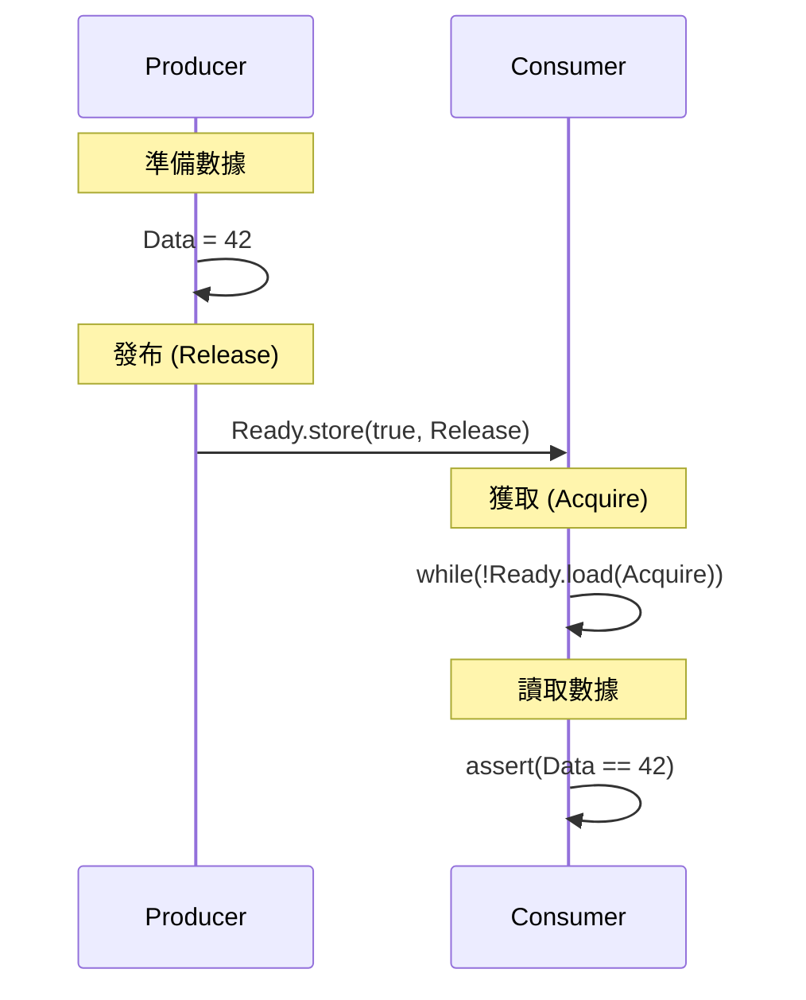

# 原子操作與內存序

> **優先級**: ⭐⭐⭐ 必看
> **適用場景**: HFT / 底層系統開發 / 無鎖數據結構
> **前置知識**: 多線程基礎, CPU 快取一致性 (MESI)

## 目錄

- [核心概念](#核心概念)
- [std::atomic 詳解](#stdatomic-詳解)
- [內存序 (Memory Ordering)](#內存序-memory-ordering)
- [原子操作實戰](#原子操作實戰)
- [性能分析](#性能分析)
- [最佳實踐](#最佳實踐)
- [參考資料](#參考資料)

## 核心概念

### 1. 基本定義

**原子操作 (Atomic Operation)** 是指不會被執行緒調度機制打斷的操作。在多核處理器上,原子操作保證了指令執行的**不可分割性 (Indivisibility)**。

**內存序 (Memory Ordering)** 定義了原子操作周圍的內存訪問如何被處理器和編譯器重排。這是無鎖編程中最困難但也最重要的部分。

### 2. 使用場景

- **無鎖數據結構**: Queue, Stack, Hash Map。
- **計數器與標誌位**: 引用計數 (shared_ptr), 停止信號。
- **發布-訂閱模式**: 單生產者單消費者 (SPSC) 隊列。

---

## std::atomic 詳解

C++11 引入了 `std::atomic` 模板,提供了一套標準的原子類型。

### 1. 基本操作

```cpp
#include <atomic>
#include <iostream>

struct Data {
    std::atomic<int> counter{0};
    std::atomic<bool> flag{false};
};

void basic_usage() {
    std::atomic<int> val = 10;
    
    // 1. Load / Store
    int x = val.load();      // 原子讀取
    val.store(20);           // 原子寫入
    
    // 2. RMW (Read-Modify-Write)
    int old = val.fetch_add(1); // val 變為 21, 返回 20
    val.fetch_sub(1);           // val 變為 20
    
    // 3. Exchange (交換值)
    int prev = val.exchange(100); // val 變為 100, 返回 20
}
```

### 2. Compare-And-Swap (CAS)

CAS 是無鎖編程的基石。

```cpp
void cas_example() {
    std::atomic<int> val{10};
    int expected = 10;
    int desired = 20;
    
    // compare_exchange_strong
    // 如果 val == expected, 則 val = desired, 返回 true
    // 如果 val != expected, 則 expected = val, 返回 false
    bool success = val.compare_exchange_strong(expected, desired);
    
    // compare_exchange_weak
    // 允許"虛假失敗" (Spurious Failure), 即值相等但也返回 false
    // 在循環中通常比 strong 版本更高效 (某些架構下)
    expected = 20;
    while (!val.compare_exchange_weak(expected, 30)) {
        // 失敗時 expected 會被更新為當前 val
        // 可以在這裡處理重試邏輯
    }
}
```

---

## 內存序 (Memory Ordering)

C++ 定義了 6 種內存序,控制編譯器和 CPU 的重排行為。

### 1. 內存序類型

| 枚舉值                    | 描述                              | 同步效果                                                                                      | 開銷  | 直觀說明                                                              |
| :--------------------- | :------------------------------ | :---------------------------------------------------------------------------------------- | :-- | :---------------------------------------------------------------- |
| `memory_order_relaxed` | 鬆散序 (Relaxed)                   | 僅保證**原子性**，不提供任何跨線程的**順序或可見性**保證。                                                         | 最低  | **只保證**讀取到的原子變數是最新的，**不保證**能看到其他變數的修改。                            |
| `memory_order_acquire` | 獲取序 (Acquire)                   | **讀操作**：建立**釋放-獲取**關係。禁止**後續**的讀寫操作被重排到此操作**之前**。                                         | 低   | **保證**能看到**寫入該原子變數之前**（由 `release` 寫入）的其他線程的所有操作結果。               |
| `memory_order_release` | 釋放序 (Release)                   | **寫操作**：建立**釋放-獲取**關係。禁止**之前**的讀寫操作被重排到此操作**之後**。                                         | 低   | **保證**寫入到原子變數之前的**所有操作**（包括非原子變數）的修改，都能被**之後**的 `acquire` 讀取操作看到。 |
| `memory_order_acq_rel` | 獲取釋放序 (Acquire-Release)         | 既具有 **Acquire** 語義（讀取時），又具有 **Release** 語義（寫入時）。通常用於原子變數的 **Read-Modify-Write (RMW)** 操作。 | 中   | **讀寫操作**：保證讀取到 X 之後的操作不會重排到之前，且寫入 X 之前的操作不會重排到之後。                 |
| `memory_order_seq_cst` | 順序一致性 (Sequentially Consistent) | **全域順序**：在所有線程看來，所有 `seq_cst` 操作的順序都是**完全相同**的。                                           | 高   | **最安全**。提供直觀的單線程模型，但由於需要與所有線程同步，**開銷最高**。                         |
| `memory_order_consume` | 消費序 (Consume)                   | 讀操作：建立釋放-消費關係。僅保證依賴於該原子變數的後續讀取操作不會被重排。                                                    | -   | **已棄用**，因其複雜性高且與編譯器優化難以協同，在 C++20 後已不再建議使用。                       |

### 2. Relaxed Ordering (鬆散序)

僅保證原子性,不保證順序。適用於計數器。

```cpp
std::atomic<int> cnt{0};
void relaxed_counter() {
    for(int i=0; i<1000; ++i) {
        cnt.fetch_add(1, std::memory_order_relaxed);
    }
}
```

### 3. Acquire-Release Ordering (獲取-釋放序)

建立**Happens-Before**關係,常用於生產者-消費者模式。



```cpp
std::atomic<bool> ready{false};
int data = 0;

void producer() {
    data = 42;                                  // A
    ready.store(true, std::memory_order_release); // B
    // 保證: A 在 B 之前發生
}

void consumer() {
    while (!ready.load(std::memory_order_acquire)); // C
    assert(data == 42);                             // D
    // 保證: C 在 D 之前發生
    // 因為 B synchronizes-with C, 所以 A happens-before D
}
```

### 4. Sequential Consistency (順序一致性)

默認模式 (`std::memory_order_seq_cst`)。保證所有執行緒看到的操作順序一致,但開銷最大 (通常需要全內存屏障 `MFENCE`)。

```cpp
std::atomic<bool> x{false}, y{false};
std::atomic<int> z{0};

void write_x() { x.store(true, std::memory_order_seq_cst); }
void write_y() { y.store(true, std::memory_order_seq_cst); }

void read_x_then_y() {
    while (!x.load(std::memory_order_seq_cst));
    if (y.load(std::memory_order_seq_cst)) ++z;
}

void read_y_then_x() {
    while (!y.load(std::memory_order_seq_cst));
    if (x.load(std::memory_order_seq_cst)) ++z;
}

// 使用 seq_cst 保證 z 至少為 1 (不可能同時看到 x=false 和 y=false)
// 如果使用 relaxed, z 可能為 0
```

---

## 原子操作實戰

### 1. 自旋鎖 (Spinlock)

使用 `std::atomic_flag` 實現最簡單的互斥鎖。

```cpp
#include <atomic>
#include <thread>

class Spinlock {
    std::atomic_flag flag = ATOMIC_FLAG_INIT;

public:
    void lock() {
        // test_and_set: 將 flag 設為 true 並返回舊值
        // 如果返回 true, 表示已被鎖定, 繼續自旋
        while (flag.test_and_set(std::memory_order_acquire)) {
            // 優化: 提示 CPU 我們在自旋等待
            #if defined(__x86_64__) || defined(_M_X64)
                _mm_pause(); 
            #endif
            std::this_thread::yield(); // 讓出時間片 (可選)
        }
    }

    void unlock() {
        flag.clear(std::memory_order_release);
    }
};
```

### 2. 引用計數 (Reference Counting)

類似 `std::shared_ptr` 的核心機制。

```cpp
template<typename T>
class RefCounted {
    T* ptr;
    std::atomic<int> ref_count;

public:
    void add_ref() {
        // 增加引用計數, 不需要同步其他內存, relaxed 即可
        ref_count.fetch_add(1, std::memory_order_relaxed);
    }

    void release() {
        // 減少引用計數
        // 需要 acq_rel 確保:
        // 1. 之前的訪問 (Release) 在刪除前完成
        // 2. 刪除操作 (Acquire) 看到最新的狀態
        if (ref_count.fetch_sub(1, std::memory_order_acq_rel) == 1) {
            delete ptr;
        }
    }
};
```

---

## 性能分析

### 內存序開銷

| 架構 | Relaxed | Acquire | Release | Seq_Cst |
|------|---------|---------|---------|---------|
| **x86_64** | 免費 (MOV) | 免費 (MOV) | 免費 (MOV) | 昂貴 (LOCK XCHG / MFENCE) |
| **ARM64** | 免費 | LDAR (低) | STLR (低) | LDAR/STLR (中) |

> [!NOTE]
> x86 架構具有強內存模型 (Strong Memory Model), Load 隱含 Acquire, Store 隱含 Release。因此在 x86 上, `relaxed`, `acquire`, `release` 性能幾乎相同, 但 `seq_cst` 仍然昂貴。

### False Sharing 影響

當多個原子變數位於同一 Cache Line 時,性能會急劇下降。

**錯誤示範**:
```cpp
struct Bad {
    std::atomic<int> a;
    std::atomic<int> b; // 與 a 在同一 Cache Line
};
```

**優化方案**:
```cpp
struct Good {
    alignas(64) std::atomic<int> a;
    alignas(64) std::atomic<int> b; // 強制對齊到不同 Cache Line
};
```

---

## 最佳實踐

1. **默認使用 seq_cst**: 除非經過嚴格的性能測試證明瓶頸在原子操作,否則不要輕易使用更弱的內存序。
2. **優先使用標準庫**: 盡量使用 `std::atomic` 而非 `volatile` (volatile 在 C++ 中不保證原子性或線程安全)。
3. **避免複雜的無鎖結構**: 實現正確的無鎖隊列非常困難,優先使用經過驗證的庫 (如 Boost.Lockfree)。
4. **注意 Cache Line 對齊**: 對於高頻競爭的原子變數,務必使用 `alignas(64)` (或 `std::hardware_destructive_interference_size`)。

---

## 參考資料

1. [CppReference - std::memory_order](https://en.cppreference.com/w/cpp/atomic/memory_order)
2. *C++ Concurrency in Action* - Chapter 5: The C++ memory model and operations on atomic types
3. [Preshing on Programming - Memory Ordering at Compile Time](https://preshing.com/20120625/memory-ordering-at-compile-time/)
4. [Herb Sutter - atomic<> Weapons](https://channel9.msdn.com/Shows/Going+Deep/Cpp-and-Beyond-2012-Herb-Sutter-atomic-Weapons-1-of-2)