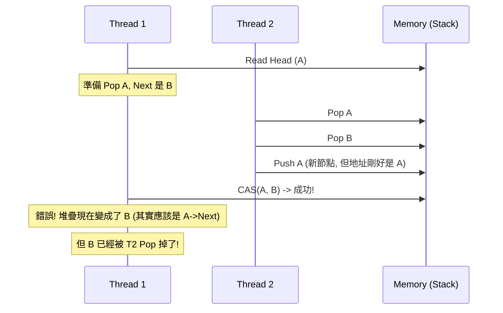

# 無鎖編程實戰

> **優先級**: ⭐⭐⭐ 必看
> **適用場景**: HFT / 超低延遲系統 / 實時系統
> **前置知識**: 原子操作, 內存序, ABA 問題

## 目錄

- [核心概念](#核心概念)
- [無鎖數據結構](#無鎖數據結構)
- [ABA 問題與解決](#aba-問題與解決)
- [內存回收 (Reclamation)](#內存回收-reclamation)
- [HFT 實戰: SPSC 隊列](#hft-實戰-spsc-隊列)
- [性能分析](#性能分析)
- [最佳實踐](#最佳實踐)
- [參考資料](#參考資料)

## 核心概念

### 1. 基本定義

**無鎖編程 (Lock-free Programming)** 是一種不使用互斥鎖 (Mutex) 的並發編程技術。它保證系統中至少有一個執行緒能夠在有限步驟內完成操作,從而避免了死鎖、優先級反轉等問題。

**無等待 (Wait-free)** 是更強的保證,確保**每個**執行緒都能在有限步驟內完成操作。

### 2. 優勢與代價

| 特性 | 優勢 | 代價 |
|------|------|------|
| **延遲** | 極低 (無上下文切換) | 實現極其複雜 |
| **吞吐量** | 高 (無鎖競爭) | 內存消耗可能較高 |
| **可靠性** | 無死鎖 | 難以調試驗證 |

---

## 無鎖數據結構

### 1. 無鎖堆疊 (Lock-free Stack)

最基礎的無鎖結構,使用 CAS 操作頭部指針。

```cpp
#include <atomic>
#include <memory>

template<typename T>
class LockFreeStack {
    struct Node {
        T data;
        Node* next;
        Node(const T& d) : data(d), next(nullptr) {}
    };

    std::atomic<Node*> head_{nullptr};

public:
    void push(const T& data) {
        Node* new_node = new Node(data);
        new_node->next = head_.load(std::memory_order_relaxed);

        // CAS 循環
        while (!head_.compare_exchange_weak(
            new_node->next, // expected (比較值)
            new_node,       // desired (新值)
            std::memory_order_release, // 成功時內存序
            std::memory_order_relaxed  // 失敗時內存序
        )) {
            // 失敗時 new_node->next 會被更新為最新的 head
            // 繼續重試
        }
    }

    bool pop(T& result) {
        Node* old_head = head_.load(std::memory_order_acquire);

        while (old_head && !head_.compare_exchange_weak(
            old_head,
            old_head->next,
            std::memory_order_release,
            std::memory_order_acquire
        )) {
            // 重試
        }

        if (old_head) {
            result = old_head->data;
            // 注意: 這裡直接 delete 有風險 (ABA 問題 / 內存回收)
            // 實際生產代碼需要配合 Hazard Pointers
            delete old_head; 
            return true;
        }
        return false;
    }
};
```

---

## ABA 問題與解決

### 1. 問題描述

ABA 問題發生在 CAS 操作中:
1. 執行緒 1 讀取值 A。
2. 執行緒 2 將 A 修改為 B, 然後又修改回 A。
3. 執行緒 1 執行 CAS, 發現值仍為 A, 認為沒有變化, 操作成功。

但在指針操作中, 雖然地址相同 (A), 但內存可能已被釋放並重用, 導致邏輯錯誤。



### 2. 解決方案: Tagged Pointers

在指針中加入版本號 (Version Tag), 每次修改時增加版本號。

```cpp
// 64位系統上, 指針通常只使用 48 位
// 可以利用剩餘位存儲計數器 (或使用 std::atomic<DoubleWord>)

struct TaggedPointer {
    Node* ptr;
    uint64_t tag;
};

// C++17 之後可以使用 std::atomic<std::shared_ptr> (開銷較大)
// 或者使用平台相關的 128 位原子操作 (CMPXCHG16B)
```

---

## 內存回收 (Reclamation)

無鎖編程中, **何時安全釋放內存**是一個大難題。

### 1. Hazard Pointers (風險指針)

每個執行緒維護一個 "Hazard Pointer" 列表, 標記自己正在訪問的節點。刪除節點時, 檢查是否有其他執行緒標記了該節點。如果有, 則延遲刪除。

```cpp
// 概念示意代碼
class HazardPointer {
    std::atomic<void*> hp_{nullptr};
    
public:
    void acquire(void* ptr) {
        hp_.store(ptr, std::memory_order_release);
    }
    
    void release() {
        hp_.store(nullptr, std::memory_order_release);
    }
    
    bool is_hazardous(void* ptr) {
        return hp_.load(std::memory_order_acquire) == ptr;
    }
};
```

### 2. Epoch Based Reclamation (EBR)

將執行劃分為不同的 Epoch (時代)。只有當所有執行緒都離開了某個 Epoch, 該 Epoch 產生的垃圾才能被回收。性能通常優於 Hazard Pointers, 常用於 RCU (Read-Copy-Update) 機制。

---

## HFT 實戰: SPSC 隊列

**單生產者單消費者 (Single Producer Single Consumer)** 隊列是 HFT 系統的核心組件。

### 實現原理

- **環形緩衝區 (Ring Buffer)**: 避免動態內存分配。
- **無鎖設計**: 生產者只修改 `tail`, 消費者只修改 `head`。
- **Cache Line 優化**: 將 `head` 和 `tail` 分隔在不同的 Cache Line, 避免 False Sharing。

```cpp
#include <atomic>
#include <array>
#include <new>

// 緩存行大小 (通常是 64 字節)
constexpr size_t CACHE_LINE_SIZE = 64;

template<typename T, size_t Capacity>
class SPSCQueue {
    // 確保 Capacity 是 2 的冪, 以便使用位運算優化取模
    static_assert((Capacity & (Capacity - 1)) == 0, "Capacity must be power of 2");

    struct alignas(CACHE_LINE_SIZE) AlignedSize {
        std::atomic<size_t> value{0};
    };

    // 數據緩衝區
    alignas(CACHE_LINE_SIZE) std::array<T, Capacity> buffer_;
    
    // 讀寫指針分開存放, 避免 False Sharing
    AlignedSize head_; // 消費者寫入
    AlignedSize tail_; // 生產者寫入

public:
    bool push(const T& item) {
        const size_t t = tail_.value.load(std::memory_order_relaxed);
        const size_t h = head_.value.load(std::memory_order_acquire);

        if (t - h >= Capacity) {
            return false; // 隊列滿
        }

        buffer_[t & (Capacity - 1)] = item;
        
        // Release 確保數據寫入對消費者可見
        tail_.value.store(t + 1, std::memory_order_release);
        return true;
    }

    bool pop(T& item) {
        const size_t h = head_.value.load(std::memory_order_relaxed);
        const size_t t = tail_.value.load(std::memory_order_acquire);

        if (h == t) {
            return false; // 隊列空
        }

        item = buffer_[h & (Capacity - 1)];

        // Release 確保讀取完成對生產者可見
        head_.value.store(h + 1, std::memory_order_release);
        return true;
    }
    
    // 零拷貝讀取 (Zero-Copy Read)
    T* front() {
        const size_t h = head_.value.load(std::memory_order_relaxed);
        const size_t t = tail_.value.load(std::memory_order_acquire);
        
        if (h == t) return nullptr;
        return &buffer_[h & (Capacity - 1)];
    }
    
    void pop_front() {
        const size_t h = head_.value.load(std::memory_order_relaxed);
        head_.value.store(h + 1, std::memory_order_release);
    }
};
```

### 性能特徵

- **延遲**: ~10-20 ns (納秒級)
- **吞吐量**: > 1000 萬 ops/sec
- **適用**: 市場數據分發, 訂單發送, 日誌寫入

---

## 性能分析

### 鎖 vs 無鎖

| 場景 | Mutex (ns) | Spinlock (ns) | Lock-free (ns) |
|------|------------|---------------|----------------|
| 無競爭 | ~25 | ~15 | ~5-10 |
| 高競爭 | > 1000 (上下文切換) | > 100 (CPU 消耗) | ~20-50 |

### 緩存一致性流量

無鎖算法雖然避免了鎖, 但頻繁的 CAS 操作會導致大量的緩存一致性流量 (Cache Coherence Traffic), 尤其是在多核競爭同一變數時 (如 MPMC 隊列)。

**優化策略**:
- **Backoff**: CAS 失敗後等待一段時間再重試。
- **分散熱點**: 使用多個隊列或分片 (Sharding)。

---

## 最佳實踐

1. **不要自己造輪子**: 除非是學習目的, 否則優先使用 `boost::lockfree`, `folly::ProducerConsumerQueue`, `concurrentqueue` (moodycamel)。
2. **優先使用 SPSC**: 它是最快且最簡單的無鎖結構。如果需要 MPMC, 考慮是否可以拆分為多個 SPSC。
3. **避免 ABA**: 對於指針類型的無鎖結構, 必須處理 ABA 問題 (使用 Tagged Pointers 或 Hazard Pointers)。
4. **驗證困難**: 無鎖代碼極難測試。使用 ThreadSanitizer 和形式化驗證工具。

---

## 參考資料

1. [Boost.Lockfree Documentation](https://www.boost.org/doc/libs/release/doc/html/lockfree.html)
2. [Moodycamel Concurrent Queue](https://github.com/cameron314/concurrentqueue)
3. [Folly ProducerConsumerQueue](https://github.com/facebook/folly/blob/main/folly/docs/ProducerConsumerQueue.md)
4. [Safe Memory Reclamation for C++ Concurrency](https://www.youtube.com/watch?v=n805e7iX8EU) (CppCon)