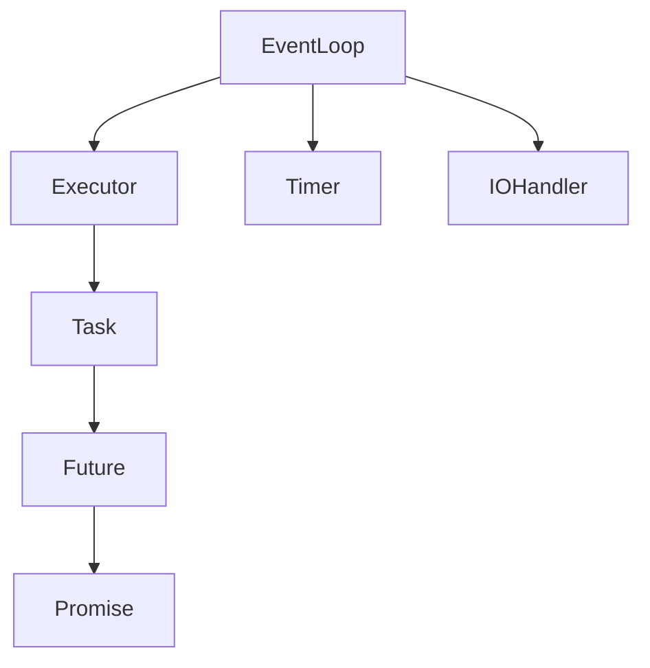

# 自定義異步庫實現 (Custom Async Library Implementation)

> **優先級**: ⭐⭐ 建議
> **適用場景**: 深入理解異步原理/自定義框架開發
> **前置知識**: epoll基礎、C++17特性、智能指針

## 目錄

- [設計目標與架構](#設計目標與架構)
- [EventLoop核心實現](#eventloop核心實現)
- [Future與Promise](#future與promise)
- [異步TCP客戶端](#異步tcp客戶端)
- [定時器實現](#定時器實現)
- [實戰案例](#實戰案例)
- [參考資料](#參考資料)

## 設計目標與架構

### 設計原則

1. **零成本抽象**: 無虛函數開銷
2. **類型安全**: 利用模板和C++17特性
3. **易用性**: 鏈式調用、協程支持
4. **高性能**: 基於epoll/io_uring

### 核心組件架構



---

## EventLoop核心實現

### 基礎EventLoop

```cpp
#include <sys/epoll.h>
#include <sys/timerfd.h>
#include <unistd.h>
#include <queue>
#include <functional>
#include <unordered_map>
#include <mutex>
#include <iostream>

class EventLoop {
public:
    using Callback = std::function<void()>;
    using IOCallback = std::function<void(uint32_t events)>;
    
    EventLoop() {
        epoll_fd_ = epoll_create1(EPOLL_CLOEXEC);
        if (epoll_fd_ < 0) {
            throw std::runtime_error("epoll_create1 failed");
        }
    }
    
    ~EventLoop() {
        stop();
        if (epoll_fd_ >= 0) {
            close(epoll_fd_);
        }
    }
    
    // 添加I/O監聽
    void add_io(int fd, uint32_t events, IOCallback callback) {
        struct epoll_event ev;
        ev.events = events | EPOLLET;  // Edge-triggered
        
        auto* cb = new IOCallback(std::move(callback));
        ev.data.ptr = cb;
        
        if (epoll_ctl(epoll_fd_, EPOLL_CTL_ADD, fd, &ev) < 0) {
            delete cb;
            throw std::runtime_error("epoll_ctl ADD failed");
        }
        
        io_callbacks_[fd] = cb;
    }
    
    // 移除I/O監聽
    void remove_io(int fd) {
        epoll_ctl(epoll_fd_, EPOLL_CTL_DEL, fd, nullptr);
        
        auto it = io_callbacks_.find(fd);
        if (it != io_callbacks_.end()) {
            delete it->second;
            io_callbacks_.erase(it);
        }
    }
    
    // 投遞任務到事件循環
    void post(Callback callback) {
        std::lock_guard<std::mutex> lock(queue_mutex_);
        task_queue_.push(std::move(callback));
    }
    
    // 運行事件循環
    void run() {
        std::vector<struct epoll_event> events(64);
        running_ = true;
        
        while (running_) {
            // 處理投遞的任務
            process_tasks();
            
            // 等待I/O事件
            int timeout = task_queue_.empty() ? 10 : 0;
            int nfds = epoll_wait(epoll_fd_, events.data(), events.size(), timeout);
            
            if (nfds < 0) {
                if (errno == EINTR) continue;
                break;
            }
            
            for (int i = 0; i < nfds; ++i) {
                auto* callback = static_cast<IOCallback*>(events[i].data.ptr);
                (*callback)(events[i].events);
            }
        }
    }
    
    void stop() {
        running_ = false;
    }
    
private:
    void process_tasks() {
        std::queue<Callback> tasks;
        {
            std::lock_guard<std::mutex> lock(queue_mutex_);
            tasks.swap(task_queue_);
        }
        
        while (!tasks.empty()) {
            tasks.front()();
            tasks.pop();
        }
    }
    
    int epoll_fd_;
    bool running_ = false;
    std::queue<Callback> task_queue_;
    std::mutex queue_mutex_;
    std::unordered_map<int, IOCallback*> io_callbacks_;
};
```

---

## Future與Promise

### Future/Promise實現

```cpp
#include <memory>
#include <mutex>
#include <condition_variable>
#include <optional>
#include <exception>
#include <functional>

template<typename T>
class Future;

template<typename T>
class Promise {
public:
    Promise() : state_(std::make_shared<State>()) {}
    
    Future<T> get_future() {
        return Future<T>(state_);
    }
    
    void set_value(T value) {
        std::lock_guard<std::mutex> lock(state_->mutex);
        state_->value = std::move(value);
        state_->ready = true;
        state_->cv.notify_all();
        
        if (state_->callback) {
            state_->callback(*state_->value);
        }
    }
    
    void set_exception(std::exception_ptr ex) {
        std::lock_guard<std::mutex> lock(state_->mutex);
        state_->exception = ex;
        state_->ready = true;
        state_->cv.notify_all();
    }
    
private:
    struct State {
        std::mutex mutex;
        std::condition_variable cv;
        std::optional<T> value;
        std::exception_ptr exception;
        bool ready = false;
        std::function<void(T)> callback;
    };
    
    std::shared_ptr<State> state_;
    
    template<typename U>
    friend class Future;
};

template<typename T>
class Future {
public:
    explicit Future(std::shared_ptr<typename Promise<T>::State> state)
        : state_(std::move(state)) {}
    
    // 阻塞等待結果
    T get() {
        std::unique_lock<std::mutex> lock(state_->mutex);
        state_->cv.wait(lock, [this] { return state_->ready; });
        
        if (state_->exception) {
            std::rethrow_exception(state_->exception);
        }
        
        return std::move(*state_->value);
    }
    
    // 檢查是否準備好
    bool is_ready() const {
        std::lock_guard<std::mutex> lock(state_->mutex);
        return state_->ready;
    }
    
    // 鏈式調用
    template<typename F>
    auto then(F&& func) -> Future<std::invoke_result_t<F, T>> {
        using ReturnType = std::invoke_result_t<F, T>;
        
        Promise<ReturnType> promise;
        auto future = promise.get_future();
        
        std::lock_guard<std::mutex> lock(state_->mutex);
        state_->callback = [promise = std::move(promise), 
                           func = std::forward<F>(func)](T value) mutable {
            try {
                if constexpr (std::is_void_v<ReturnType>) {
                    func(std::move(value));
                    promise.set_value();
                } else {
                    promise.set_value(func(std::move(value)));
                }
            } catch (...) {
                promise.set_exception(std::current_exception());
            }
        };
        
        if (state_->ready && state_->value) {
            state_->callback(*state_->value);
        }
        
        return future;
    }
    
private:
    std::shared_ptr<typename Promise<T>::State> state_;
};

// void特化
template<>
class Promise<void> {
public:
    Promise() : state_(std::make_shared<State>()) {}
    
    Future<void> get_future();
    
    void set_value() {
        std::lock_guard<std::mutex> lock(state_->mutex);
        state_->ready = true;
        state_->cv.notify_all();
        
        if (state_->callback) {
            state_->callback();
        }
    }
    
private:
    struct State {
        std::mutex mutex;
        std::condition_variable cv;
        bool ready = false;
        std::function<void()> callback;
    };
    
    std::shared_ptr<State> state_;
    
    friend class Future<void>;
};
```

---

## 異步TCP客戶端

### 完整實現

```cpp
#include <sys/socket.h>
#include <netinet/in.h>
#include <arpa/inet.h>
#include <fcntl.h>
#include <unistd.h>
#include <cstring>

class AsyncTcpClient {
public:
    explicit AsyncTcpClient(EventLoop& loop) : loop_(loop) {}
    
    ~AsyncTcpClient() {
        if (sockfd_ >= 0) {
            close(sockfd_);
        }
    }
    
    Future<void> connect(const std::string& host, uint16_t port) {
        Promise<void> promise;
        auto future = promise.get_future();
        
        // 創建非阻塞socket
        sockfd_ = socket(AF_INET, SOCK_STREAM, 0);
        if (sockfd_ < 0) {
            promise.set_exception(std::make_exception_ptr(
                std::runtime_error("socket failed")));
            return future;
        }
        
        int flags = fcntl(sockfd_, F_GETFL, 0);
        fcntl(sockfd_, F_SETFL, flags | O_NONBLOCK);
        
        struct sockaddr_in addr;
        std::memset(&addr, 0, sizeof(addr));
        addr.sin_family = AF_INET;
        addr.sin_port = htons(port);
        inet_pton(AF_INET, host.c_str(), &addr.sin_addr);
        
        // 發起非阻塞連接
        int ret = ::connect(sockfd_, (struct sockaddr*)&addr, sizeof(addr));
        
        if (ret < 0 && errno != EINPROGRESS) {
            promise.set_exception(std::make_exception_ptr(
                std::runtime_error("connect failed")));
            return future;
        }
        
        // 監聽可寫事件(連接完成)
        loop_.add_io(sockfd_, EPOLLOUT, 
            [this, promise = std::move(promise)](uint32_t events) mutable {
                int error = 0;
                socklen_t len = sizeof(error);
                getsockopt(sockfd_, SOL_SOCKET, SO_ERROR, &error, &len);
                
                loop_.remove_io(sockfd_);
                
                if (error == 0) {
                    promise.set_value();
                } else {
                    promise.set_exception(std::make_exception_ptr(
                        std::runtime_error("connect error: " + std::to_string(error))));
                }
            });
        
        return future;
    }
    
    Future<size_t> async_write(const std::string& data) {
        Promise<size_t> promise;
        auto future = promise.get_future();
        
        // 嘗試立即發送
        ssize_t n = send(sockfd_, data.data(), data.size(), MSG_DONTWAIT);
        
        if (n >= 0) {
            promise.set_value(n);
            return future;
        }
        
        if (errno != EAGAIN && errno != EWOULDBLOCK) {
            promise.set_exception(std::make_exception_ptr(
                std::runtime_error("write failed")));
            return future;
        }
        
        // 監聽可寫事件
        loop_.add_io(sockfd_, EPOLLOUT,
            [this, data, promise = std::move(promise)](uint32_t events) mutable {
                ssize_t n = send(sockfd_, data.data(), data.size(), 0);
                
                loop_.remove_io(sockfd_);
                
                if (n > 0) {
                    promise.set_value(n);
                } else {
                    promise.set_exception(std::make_exception_ptr(
                        std::runtime_error("write failed")));
                }
            });
        
        return future;
    }
    
    Future<std::string> async_read(size_t max_len = 4096) {
        Promise<std::string> promise;
        auto future = promise.get_future();
        
        loop_.add_io(sockfd_, EPOLLIN,
            [this, max_len, promise = std::move(promise)](uint32_t events) mutable {
                std::string buffer(max_len, '\0');
                ssize_t n = recv(sockfd_, buffer.data(), max_len, 0);
                
                loop_.remove_io(sockfd_);
                
                if (n > 0) {
                    buffer.resize(n);
                    promise.set_value(std::move(buffer));
                } else {
                    promise.set_exception(std::make_exception_ptr(
                        std::runtime_error("read failed")));
                }
            });
        
        return future;
    }
    
private:
    EventLoop& loop_;
    int sockfd_ = -1;
};
```

### 使用示例

```cpp
void http_request_example() {
    EventLoop loop;
    AsyncTcpClient client(loop);
    
    // 鏈式異步調用
    client.connect("example.com", 80)
        .then([&client](auto) {
            std::cout << "Connected!\n";
            return client.async_write("GET / HTTP/1.1\r\nHost: example.com\r\n\r\n");
        })
        .then([&client](size_t bytes) {
            std::cout << "Sent " << bytes << " bytes\n";
            return client.async_read();
        })
        .then([&loop](std::string response) {
            std::cout << "Received:\n" << response << "\n";
            loop.stop();
        });
    
    loop.run();
}
```

---

## 定時器實現

### Timer類

```cpp
#include <sys/timerfd.h>
#include <chrono>

class Timer {
public:
    using Callback = std::function<void()>;
    
    explicit Timer(EventLoop& loop) : loop_(loop) {
        timer_fd_ = timerfd_create(CLOCK_MONOTONIC, TFD_NONBLOCK);
        if (timer_fd_ < 0) {
            throw std::runtime_error("timerfd_create failed");
        }
    }
    
    ~Timer() {
        if (timer_fd_ >= 0) {
            close(timer_fd_);
        }
    }
    
    void start(std::chrono::milliseconds delay, Callback callback) {
        struct itimerspec ts;
        ts.it_value.tv_sec = delay.count() / 1000;
        ts.it_value.tv_nsec = (delay.count() % 1000) * 1000000;
        ts.it_interval.tv_sec = 0;
        ts.it_interval.tv_nsec = 0;
        
        timerfd_settime(timer_fd_, 0, &ts, nullptr);
        
        loop_.add_io(timer_fd_, EPOLLIN,
            [this, callback = std::move(callback)](uint32_t events) mutable {
                uint64_t exp;
                read(timer_fd_, &exp, sizeof(exp));
                callback();
                loop_.remove_io(timer_fd_);
            });
    }
    
private:
    EventLoop& loop_;
    int timer_fd_;
};

// 使用示例
void timer_example() {
    EventLoop loop;
    Timer timer(loop);
    
    timer.start(std::chrono::seconds(2), [&loop]() {
        std::cout << "Timer expired!\n";
        loop.stop();
    });
    
    loop.run();
}
```

---

## 實戰案例

### 案例1: HTTP客戶端

```cpp
class SimpleHttpClient {
public:
    explicit SimpleHttpClient(EventLoop& loop) : client_(loop) {}
    
    Future<std::string> get(const std::string& url) {
        // 簡化: 假設URL格式為 http://host/path
        auto pos = url.find("://");
        pos = url.find('/', pos + 3);
        
        std::string host = url.substr(7, pos - 7);
        std::string path = url.substr(pos);
        
        return client_.connect(host, 80)
            .then([this, host, path](auto) {
                std::string request = "GET " + path + " HTTP/1.1\r\n"
                                    "Host: " + host + "\r\n"
                                    "Connection: close\r\n\r\n";
                return client_.async_write(request);
            })
            .then([this](size_t) {
                return client_.async_read(8192);
            });
    }
    
private:
    AsyncTcpClient client_;
};

// 使用示例
void http_client_example() {
    EventLoop loop;
    SimpleHttpClient http(loop);
    
    http.get("http://example.com/index.html")
        .then([&loop](std::string response) {
            std::cout << "Response:\n" << response << "\n";
            loop.stop();
        });
    
    loop.run();
}
```

### 案例2: 併發請求

```cpp
#include <vector>

void concurrent_requests_example() {
    EventLoop loop;
    
    std::vector<std::string> urls = {
        "http://example.com/page1",
        "http://example.com/page2",
        "http://example.com/page3"
    };
    
    std::atomic<int> completed{0};
    
    for (const auto& url : urls) {
        SimpleHttpClient http(loop);
        
        http.get(url).then([&completed, &loop, total = urls.size()](std::string response) {
            std::cout << "Response length: " << response.size() << "\n";
            
            if (++completed == total) {
                loop.stop();
            }
        });
    }
    
    loop.run();
}
```

### 案例3: 超時處理

```cpp
template<typename T>
Future<T> with_timeout(Future<T> future, EventLoop& loop, 
                       std::chrono::milliseconds timeout) {
    Promise<T> promise;
    auto result = promise.get_future();
    
    Timer timer(loop);
    auto timeout_flag = std::make_shared<bool>(false);
    
    timer.start(timeout, [timeout_flag, promise = std::move(promise)]() mutable {
        *timeout_flag = true;
        promise.set_exception(std::make_exception_ptr(
            std::runtime_error("Timeout")));
    });
    
    future.then([timeout_flag, promise = std::move(promise)](T value) mutable {
        if (!*timeout_flag) {
            promise.set_value(std::move(value));
        }
    });
    
    return result;
}
```

---

## 最佳實踐

1. **使用RAII管理資源**: fd在析構時自動關閉
2. **避免阻塞操作**: 所有I/O必須非阻塞
3. **錯誤處理**: 使用exception_ptr傳遞異常
4. **內存管理**: 使用shared_ptr管理共享狀態
5. **線程安全**: EventLoop在單線程運行,避免競爭
6. **及時移除監聽**: 避免fd洩漏

---

## 參考資料 (References)

1. [libuv Design Overview](https://docs.libuv.org/en/v1.x/design.html)
2. [Boost.Asio Documentation](https://www.boost.org/doc/libs/release/doc/html/boost_asio.html)
3. [Node.js Event Loop](https://nodejs.org/en/docs/guides/event-loop-timers-and-nexttick/)
4. Stevens, W. Richard. *UNIX Network Programming* (3rd Edition)
5. [libev Documentation](http://pod.tst.eu/http://cvs.schmorp.de/libev/ev.pod)
