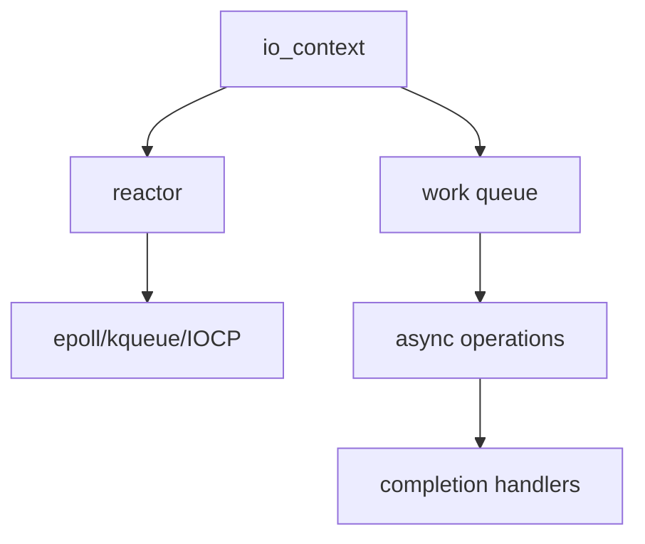

# Asio深度剖析 (Boost.Asio Deep Dive)

> **優先級**: ⭐⭐⭐ 必看
> **適用場景**: HFT/金融系統/企業級應用開發
> **前置知識**: C++17、異步I/O基礎、TCP/IP協議

## 目錄

- [Asio核心架構](#asio核心架構)
- [io_context執行模型](#io_context執行模型)
- [回調風格編程](#回調風格編程)
- [C++20協程整合](#c20協程整合)
- [Strand執行緒安全](#strand執行緒安全)
- [SSL_TLS支持](#ssl_tls支持)
- [性能優化技巧](#性能優化技巧)
- [參考資料](#參考資料)

## Asio核心架構

### 核心組件



**三大核心概念**:

1. **io_context**: 事件循環核心,負責調度所有異步操作
2. **strand**: 串行執行保證,確保線程安全
3. **executor**: 執行器,控制回調在哪裡執行

---

## io_context執行模型

### 基礎使用

```cpp
#include <boost/asio.hpp>
#include <iostream>

namespace asio = boost::asio;

void basic_example() {
    asio::io_context io_context;
    
    // 投遞任務
    io_context.post([]() {
        std::cout << "Task 1\n";
    });
    
    io_context.post([]() {
        std::cout << "Task 2\n";
    });
    
    // 運行事件循環
    io_context.run();  // 執行所有任務後返回
}
```

### 多線程模型

```cpp
#include <boost/asio.hpp>
#include <thread>
#include <vector>

void multi_threaded_io_context() {
    asio::io_context io_context;
    
    // 防止io_context.run()立即返回
    auto work = asio::make_work_guard(io_context);
    
    // 創建線程池
    std::vector<std::thread> threads;
    for (int i = 0; i < 4; ++i) {
        threads.emplace_back([&io_context]() {
            io_context.run();
        });
    }
    
    // 投遞任務
    for (int i = 0; i < 100; ++i) {
        io_context.post([i]() {
            std::cout << "Task " << i << " on thread " 
                      << std::this_thread::get_id() << "\n";
        });
    }
    
    // 停止並等待
    work.reset();
    for (auto& t : threads) {
        t.join();
    }
}
```

---

## 回調風格編程

### TCP客戶端 (回調風格)

```cpp
#include <boost/asio.hpp>
#include <iostream>
#include <memory>

namespace asio = boost::asio;
using tcp = asio::ip::tcp;

class AsyncTcpClient : public std::enable_shared_from_this<AsyncTcpClient> {
public:
    explicit AsyncTcpClient(asio::io_context& io_context)
        : socket_(io_context) {}
    
    void connect(const std::string& host, const std::string& service) {
        tcp::resolver resolver(socket_.get_executor());
        
        // 異步解析地址
        resolver.async_resolve(host, service,
            [this, self = shared_from_this()](
                const boost::system::error_code& ec, 
                tcp::resolver::results_type results) {
                
                if (!ec) {
                    // 異步連接
                    asio::async_connect(socket_, results,
                        [this, self](const boost::system::error_code& ec, 
                                    const tcp::endpoint&) {
                            if (!ec) {
                                std::cout << "Connected!\n";
                                start_read();
                            }
                        });
                }
            });
    }
    
    void write(const std::string& message) {
        asio::async_write(socket_, asio::buffer(message),
            [this, self = shared_from_this()](
                const boost::system::error_code& ec, 
                size_t bytes_transferred) {
                
                if (!ec) {
                    std::cout << "Sent " << bytes_transferred << " bytes\n";
                }
            });
    }
    
private:
    void start_read() {
        socket_.async_read_some(asio::buffer(buffer_),
            [this, self = shared_from_this()](
                const boost::system::error_code& ec, 
                size_t length) {
                
                if (!ec) {
                    std::cout << "Received: " 
                              << std::string(buffer_.data(), length) << "\n";
                    start_read();  // 繼續讀取
                }
            });
    }
    
    tcp::socket socket_;
    std::array<char, 1024> buffer_;
};

void callback_style_example() {
    asio::io_context io_context;
    
    auto client = std::make_shared<AsyncTcpClient>(io_context);
    client->connect("example.com", "80");
    
    io_context.run();
}
```

### TCP服務器 (回調風格)

```cpp
class AsyncTcpServer {
public:
    AsyncTcpServer(asio::io_context& io_context, uint16_t port)
        : acceptor_(io_context, tcp::endpoint(tcp::v4(), port)) {
        start_accept();
    }
    
private:
    void start_accept() {
        auto socket = std::make_shared<tcp::socket>(acceptor_.get_executor());
        
        acceptor_.async_accept(*socket,
            [this, socket](const boost::system::error_code& ec) {
                if (!ec) {
                    std::cout << "Client connected\n";
                    handle_client(socket);
                }
                
                start_accept();  // 繼續接受連接
            });
    }
    
    void handle_client(std::shared_ptr<tcp::socket> socket) {
        auto buffer = std::make_shared<std::array<char, 1024>>();
        
        socket->async_read_some(asio::buffer(*buffer),
            [this, socket, buffer](const boost::system::error_code& ec, 
                                  size_t length) {
                if (!ec) {
                    // Echo back
                    asio::async_write(*socket, asio::buffer(*buffer, length),
                        [socket](const boost::system::error_code&, size_t) {
                            // 寫入完成
                        });
                }
            });
    }
    
    tcp::acceptor acceptor_;
};
```

---

## C++20協程整合

### 協程風格TCP客戶端

```cpp
#include <boost/asio.hpp>
#include <boost/asio/co_spawn.hpp>
#include <boost/asio/detached.hpp>
#include <boost/asio/use_awaitable.hpp>
#include <iostream>

namespace asio = boost::asio;
using tcp = asio::ip::tcp;

// 協程風格 - 像同步代碼一樣清晰
asio::awaitable<void> async_tcp_client_coroutine() {
    auto executor = co_await asio::this_coro::executor;
    tcp::socket socket(executor);
    tcp::resolver resolver(executor);
    
    // 協程風格: 無回調地獄
    auto endpoints = co_await resolver.async_resolve(
        "example.com", "80", asio::use_awaitable);
    
    co_await asio::async_connect(socket, endpoints, asio::use_awaitable);
    std::cout << "Connected!\n";
    
    std::string request = "GET / HTTP/1.1\r\nHost: example.com\r\n\r\n";
    co_await asio::async_write(socket, asio::buffer(request), asio::use_awaitable);
    
    char buffer[1024];
    size_t n = co_await socket.async_read_some(
        asio::buffer(buffer), asio::use_awaitable);
    
    std::cout << "Received: " << std::string(buffer, n) << "\n";
}

void coroutine_style_example() {
    asio::io_context io_context;
    
    asio::co_spawn(io_context, async_tcp_client_coroutine(), asio::detached);
    
    io_context.run();
}
```

### 協程風格Echo服務器

```cpp
asio::awaitable<void> echo_session(tcp::socket socket) {
    try {
        char buffer[1024];
        
        while (true) {
            size_t n = co_await socket.async_read_some(
                asio::buffer(buffer), asio::use_awaitable);
            
            co_await asio::async_write(
                socket, asio::buffer(buffer, n), asio::use_awaitable);
        }
    } catch (std::exception& e) {
        std::cerr << "Exception: " << e.what() << "\n";
    }
}

asio::awaitable<void> listener(uint16_t port) {
    auto executor = co_await asio::this_coro::executor;
    tcp::acceptor acceptor(executor, {tcp::v4(), port});
    
    std::cout << "Server listening on port " << port << "\n";
    
    while (true) {
        tcp::socket socket = co_await acceptor.async_accept(asio::use_awaitable);
        
        // 為每個連接創建新協程
        asio::co_spawn(executor, echo_session(std::move(socket)), asio::detached);
    }
}

void coroutine_echo_server() {
    asio::io_context io_context;
    asio::co_spawn(io_context, listener(8080), asio::detached);
    io_context.run();
}
```

### 協程組合操作

```cpp
#include <boost/asio/experimental/awaitable_operators.hpp>

using namespace asio::experimental::awaitable_operators;

// 並行執行
asio::awaitable<void> parallel_operations() {
    auto [result1, result2] = co_await (
        async_operation1() &&
        async_operation2()
    );
    
    std::cout << "Result1: " << result1 << ", Result2: " << result2 << "\n";
}

// 超時處理
asio::awaitable<void> operation_with_timeout() {
    using namespace std::chrono_literals;
    
    asio::steady_timer timer(co_await asio::this_coro::executor, 5s);
    
    auto result = co_await (
        async_operation() ||
        timer.async_wait(asio::use_awaitable)
    );
    
    if (result.index() == 1) {
        std::cerr << "Operation timed out!\n";
    }
}
```

---

## Strand執行緒安全

### 問題場景

```cpp
// ❌ 錯誤: 多線程競爭
class UnsafeServer {
    tcp::socket socket_;
    std::string data_;
    
    void start_read() {
        socket_.async_read_some(asio::buffer(data_),
            [this](auto ec, size_t length) {
                // 危險! 可能與write同時執行
                process_data(data_);
            });
    }
    
    void start_write() {
        asio::async_write(socket_, asio::buffer(data_),
            [this](auto ec, size_t length) {
                // 危險! 可能與read同時執行
                data_.clear();
            });
    }
};
```

### 使用Strand解決

```cpp
#include <boost/asio/strand.hpp>

// ✅ 正確: 使用strand保證串行執行
class SafeServer {
public:
    SafeServer(asio::io_context& io_context)
        : socket_(io_context),
          strand_(asio::make_strand(io_context)) {}
    
    void start_read() {
        socket_.async_read_some(asio::buffer(data_),
            asio::bind_executor(strand_,
                [this](auto ec, size_t length) {
                    // 保證串行執行,不會與write並發
                    process_data(data_);
                }));
    }
    
    void start_write(const std::string& message) {
        asio::async_write(socket_, asio::buffer(message),
            asio::bind_executor(strand_,
                [this](auto ec, size_t length) {
                    // 保證串行執行
                    data_.clear();
                }));
    }
    
private:
    tcp::socket socket_;
    asio::strand<asio::io_context::executor_type> strand_;
    std::string data_;
};
```

---

## SSL_TLS支持

### HTTPS客戶端

```cpp
#include <boost/asio/ssl.hpp>

namespace ssl = asio::ssl;

asio::awaitable<void> https_client() {
    auto executor = co_await asio::this_coro::executor;
    
    // SSL上下文
    ssl::context ctx(ssl::context::tls_client);
    ctx.set_default_verify_paths();
    ctx.set_verify_mode(ssl::verify_peer);
    
    // SSL socket
    ssl::stream<tcp::socket> socket(executor, ctx);
    
    // 解析地址
    tcp::resolver resolver(executor);
    auto endpoints = co_await resolver.async_resolve(
        "www.google.com", "443", asio::use_awaitable);
    
    // 連接
    co_await asio::async_connect(
        socket.lowest_layer(), endpoints, asio::use_awaitable);
    
    // SSL握手
    co_await socket.async_handshake(
        ssl::stream_base::client, asio::use_awaitable);
    
    std::cout << "SSL handshake completed\n";
    
    // 發送HTTPS請求
    std::string request = "GET / HTTP/1.1\r\nHost: www.google.com\r\n\r\n";
    co_await asio::async_write(
        socket, asio::buffer(request), asio::use_awaitable);
    
    // 接收響應
    char buffer[4096];
    size_t n = co_await socket.async_read_some(
        asio::buffer(buffer), asio::use_awaitable);
    
    std::cout << "Received " << n << " bytes\n";
}
```

---

## 性能優化技巧

### 1. 減少內存分配

```cpp
// ❌ 每次分配新buffer
void inefficient_read(tcp::socket& socket) {
    auto buffer = std::make_shared<std::vector<char>>(1024);
    socket.async_read_some(asio::buffer(*buffer), /*...*/);
}

// ✅ 重用buffer
class EfficientReader {
    std::array<char, 1024> buffer_;  // 成員變量,重用
    
    void start_read(tcp::socket& socket) {
        socket.async_read_some(asio::buffer(buffer_), /*...*/);
    }
};
```

### 2. 批量寫入

```cpp
// 使用scatter-gather I/O
std::vector<asio::const_buffer> buffers;
buffers.push_back(asio::buffer(header));
buffers.push_back(asio::buffer(body));

asio::async_write(socket, buffers, /*...*/);
```

### 3. 零拷貝

```cpp
// 使用buffer_copy避免多次拷貝
asio::streambuf sb;
std::istream is(&sb);

socket.async_read_some(sb.prepare(1024),
    [&sb](auto ec, size_t bytes) {
        sb.commit(bytes);
        // 直接從streambuf讀取,無需拷貝
    });
```

### 性能對比: 回調 vs 協程

```cpp
#include <chrono>

void benchmark_callback_style() {
    asio::io_context io_context;
    auto start = std::chrono::high_resolution_clock::now();
    
    int count = 0;
    std::function<void()> loop;
    loop = [&]() {
        if (count++ < 10000) {
            asio::post(io_context, loop);
        }
    };
    
    asio::post(io_context, loop);
    io_context.run();
    
    auto duration = std::chrono::high_resolution_clock::now() - start;
    auto us = std::chrono::duration_cast<std::chrono::microseconds>(duration);
    
    std::cout << "Callback style: " << us.count() << " μs\n";
}

void benchmark_coroutine_style() {
    asio::io_context io_context;
    auto start = std::chrono::high_resolution_clock::now();
    
    asio::co_spawn(io_context, []() -> asio::awaitable<void> {
        for (int i = 0; i < 10000; ++i) {
            co_await asio::post(asio::use_awaitable);
        }
    }(), asio::detached);
    
    io_context.run();
    
    auto duration = std::chrono::high_resolution_clock::now() - start;
    auto us = std::chrono::duration_cast<std::chrono::microseconds>(duration);
    
    std::cout << "Coroutine style: " << us.count() << " μs\n";
}

// 典型結果:
// Callback style:   ~2000 μs
// Coroutine style:  ~2100 μs (開銷略高但可接受)
```

---

## 最佳實踐

1. **使用shared_from_this**: 確保對象生命週期
2. **多線程使用strand**: 保證線程安全
3. **協程優先**: C++20環境下優先使用協程
4. **重用buffer**: 減少內存分配
5. **適當使用work_guard**: 防止io_context提前退出
6. **錯誤處理**: 檢查error_code
7. **SSL驗證**: 生產環境必須驗證證書

---

## 參考資料 (References)

1. [Boost.Asio Documentation](https://www.boost.org/doc/libs/release/doc/html/boost_asio.html)
2. [Asio C++ Library](https://think-async.com/Asio/)
3. Kohlhoff, Christopher. *Asio Design Patterns* (2008)
4. [C++20 Coroutines with Asio](https://www.boost.org/doc/libs/release/doc/html/boost_asio/overview/core/coroutines.html)
5. Williams, Anthony. *C++ Concurrency in Action* (2nd Edition)
