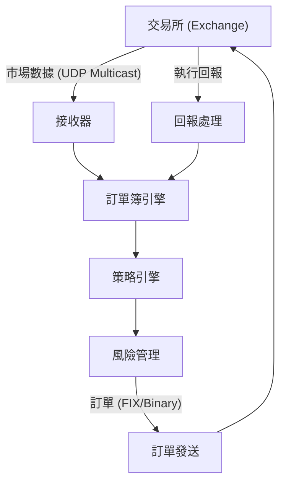

# HFT異步網路實戰 (HFT Async Network Practices)

> **優先級**: ⭐⭐⭐ 必看
> **適用場景**: 高頻交易/低延遲系統
> **前置知識**: 異步IO、UDP Multicast、訂單簿基礎

## 目錄

- [HFT網路架構](#hft網路架構)
- [UDP Multicast市場數據接收](#udp-multicast市場數據接收)
- [低延遲訂單發送](#低延遲訂單發送)
- [FIX協議異步處理](#fix協議異步處理)
- [心跳與連接管理](#心跳與連接管理)
- [完整交易系統](#完整交易系統)
- [參考資料](#參考資料)

## HFT網路架構

### 典型HFT網路拓撲



**關鍵特性**:
- **市場數據**: UDP Multicast (單向,高吞吐量)
- **訂單發送**: TCP/FIX或Binary (雙向,低延遲)
- **執行回報**: TCP (可靠)

---

## UDP Multicast市場數據接收

### io_uring實現

```cpp
#include <liburing.h>
#include <sys/socket.h>
#include <netinet/in.h>
#include <arpa/inet.h>
#include <cstring>
#include <iostream>
#include <vector>

struct MarketDataContext {
    int sockfd;
    char buffer[8192];  // 市場數據包
    size_t buffer_size = sizeof(buffer);
};

class IoUringMarketDataReceiver {
public:
    IoUringMarketDataReceiver(const std::vector<std::string>& multicast_groups, 
                               uint16_t port) {
        // 初始化io_uring with SQPOLL
        struct io_uring_params params;
        std::memset(&params, 0, sizeof(params));
        params.flags = IORING_SETUP_SQPOLL;
        params.sq_thread_idle = 1000;  // 1秒空閒
        
        io_uring_queue_init_params(256, &ring_, &params);
        
        // 創建UDP multicast sockets
        for (const auto& group : multicast_groups) {
            int sockfd = create_multicast_socket(group, port);
            
            auto ctx = std::make_unique<MarketDataContext>();
            ctx->sockfd = sockfd;
            
            submit_recv(ctx.get());
            contexts_.push_back(std::move(ctx));
        }
    }
    
    ~IoUringMarketDataReceiver() {
        io_uring_queue_exit(&ring_);
    }
    
    void run() {
        while (true) {
            struct io_uring_cqe *cqe;
            
            // 非阻塞輪詢
            int ret = io_uring_peek_cqe(&ring_, &cqe);
            
            if (ret == 0) {
                auto *ctx = static_cast<MarketDataContext*>(io_uring_cqe_get_data(cqe));
                int bytes = cqe->res;
                
                if (bytes > 0) {
                    // HFT關鍵路徑: 處理市場數據
                    process_market_data(ctx->buffer, bytes);
                    
                    // 重新提交接收請求
                    submit_recv(ctx);
                }
                
                io_uring_cqe_seen(&ring_, cqe);
            }
        }
    }
    
private:
    int create_multicast_socket(const std::string& group, uint16_t port) {
        int sockfd = socket(AF_INET, SOCK_DGRAM, 0);
        
        int opt = 1;
        setsockopt(sockfd, SOL_SOCKET, SO_REUSEADDR, &opt, sizeof(opt));
        
        struct sockaddr_in addr;
        std::memset(&addr, 0, sizeof(addr));
        addr.sin_family = AF_INET;
        addr.sin_addr.s_addr = INADDR_ANY;
        addr.sin_port = htons(port);
        
        bind(sockfd, (struct sockaddr*)&addr, sizeof(addr));
        
        // 加入multicast組
        struct ip_mreq mreq;
        mreq.imr_multiaddr.s_addr = inet_addr(group.c_str());
        mreq.imr_interface.s_addr = INADDR_ANY;
        setsockopt(sockfd, IPPROTO_IP, IP_ADD_MEMBERSHIP, &mreq, sizeof(mreq));
        
        return sockfd;
    }
    
    void submit_recv(MarketDataContext *ctx) {
        struct io_uring_sqe *sqe = io_uring_get_sqe(&ring_);
        io_uring_prep_recv(sqe, ctx->sockfd, ctx->buffer, ctx->buffer_size, 0);
        io_uring_sqe_set_data(sqe, ctx);
        // SQPOLL模式下無需手動submit
    }
    
    void process_market_data(const char *data, size_t len) {
        // HFT關鍵路徑: 解析並更新訂單簿
        // 延遲要求 < 500ns
        
        // 假設簡單的市場數據格式
        // [symbol:4][price:8][qty:4]
        
        // TODO: 實際解析邏輯
        // update_order_book(data, len);
    }
    
    struct io_uring ring_;
    std::vector<std::unique_ptr<MarketDataContext>> contexts_;
};
```

---

## 低延遲訂單發送

### 零拷貝訂單發送

```cpp
#include <sys/socket.h>
#include <netinet/in.h>
#include <unistd.h>

class LowLatencyOrderSender {
public:
    LowLatencyOrderSender(const std::string& host, uint16_t port) {
        sockfd_ = socket(AF_INET, SOCK_STREAM, 0);
        
        // TCP_NODELAY: 禁用Nagle算法
        int flag = 1;
        setsockopt(sockfd_, IPPROTO_TCP, TCP_NODELAY, &flag, sizeof(flag));
        
        // SO_SNDBUF: 發送緩衝區大小
        int sndbuf = 8192;
        setsockopt(sockfd_, SOL_SOCKET, SO_SNDBUF, &sndbuf, sizeof(sndbuf));
        
        struct sockaddr_in addr;
        std::memset(&addr, 0, sizeof(addr));
        addr.sin_family = AF_INET;
        addr.sin_port = htons(port);
        inet_pton(AF_INET, host.c_str(), &addr.sin_addr);
        
        connect(sockfd_, (struct sockaddr*)&addr, sizeof(addr));
    }
    
    ~LowLatencyOrderSender() {
        if (sockfd_ >= 0) {
            close(sockfd_);
        }
    }
    
    // 同步發送 (HFT場景,延遲優先於吞吐量)
    bool send_order(const void* data, size_t len) {
        ssize_t sent = send(sockfd_, data, len, MSG_DONTWAIT);
        return sent == static_cast<ssize_t>(len);
    }
    
private:
    int sockfd_;
};
```

---

## FIX協議異步處理

### 簡化FIX消息處理

```cpp
#include <string>
#include <unordered_map>

struct FIXMessage {
    std::unordered_map<int, std::string> fields;
    
    std::string get_field(int tag) const {
        auto it = fields.find(tag);
        return it != fields.end() ? it->second : "";
    }
};

class FIXParser {
public:
    // 解析FIX消息 (格式: 8=FIX.4.2|35=D|49=SENDER|...)
    static FIXMessage parse(const std::string& raw) {
        FIXMessage msg;
        
        size_t pos = 0;
        while (pos < raw.size()) {
            // 查找等號
            size_t eq = raw.find('=', pos);
            if (eq == std::string::npos) break;
            
            // 查找分隔符
            size_t sep = raw.find('|', eq);
            if (sep == std::string::npos) sep = raw.size();
            
            int tag = std::stoi(raw.substr(pos, eq - pos));
            std::string value = raw.substr(eq + 1, sep - eq - 1);
            
            msg.fields[tag] = value;
            
            pos = sep + 1;
        }
        
        return msg;
    }
    
    // 構建FIX消息
    static std::string build(const FIXMessage& msg) {
        std::string result;
        
        for (const auto& [tag, value] : msg.fields) {
            result += std::to_string(tag) + "=" + value + "|";
        }
        
        return result;
    }
};

// 異步FIX處理器
class AsyncFIXHandler {
public:
    using MessageCallback = std::function<void(const FIXMessage&)>;
    
    void async_receive(int sockfd, MessageCallback callback) {
        // 簡化: 實際需要處理分包
        char buffer[4096];
        ssize_t n = recv(sockfd, buffer, sizeof(buffer), MSG_DONTWAIT);
        
        if (n > 0) {
            std::string raw(buffer, n);
            FIXMessage msg = FIXParser::parse(raw);
            callback(msg);
        }
    }
    
    void async_send(int sockfd, const FIXMessage& msg) {
        std::string raw = FIXParser::build(msg);
        send(sockfd, raw.data(), raw.size(), MSG_DONTWAIT);
    }
};
```

---

## 心跳與連接管理

### 心跳機制

```cpp
#include <boost/asio.hpp>
#include <boost/asio/steady_timer.hpp>

namespace asio = boost::asio;

class HeartbeatManager {
public:
    HeartbeatManager(asio::io_context& io_context, 
                     asio::ip::tcp::socket& socket,
                     std::chrono::seconds interval)
        : socket_(socket),
          timer_(io_context, interval),
          interval_(interval) {
        start_heartbeat();
    }
    
private:
    void start_heartbeat() {
        timer_.async_wait([this](const boost::system::error_code& ec) {
            if (!ec) {
                send_heartbeat();
                
                // 重置定時器
                timer_.expires_after(interval_);
                start_heartbeat();
            }
        });
    }
    
    void send_heartbeat() {
        // FIX Heartbeat消息 (35=0)
        FIXMessage msg;
        msg.fields[35] = "0";  // MsgType=Heartbeat
        
        std::string raw = FIXParser::build(msg);
        asio::async_write(socket_, asio::buffer(raw),
            [](const boost::system::error_code& ec, size_t) {
                if (!ec) {
                    std::cout << "Heartbeat sent\n";
                }
            });
    }
    
    asio::ip::tcp::socket& socket_;
    asio::steady_timer timer_;
    std::chrono::seconds interval_;
};
```

---

## 完整交易系統

### HFT交易系統架構

```cpp
#include <memory>
#include <atomic>

class OrderBook {
public:
    void update(const char* data, size_t len) {
        // 更新訂單簿
    }
};

class TradingStrategy {
public:
    struct Signal {
        std::string symbol;
        double price;
        int quantity;
    };
    
    std::optional<Signal> evaluate(const OrderBook& book) {
        // 策略邏輯
        return std::nullopt;
    }
};

class HFTTradingSystem {
public:
    HFTTradingSystem(asio::io_context& io_context)
        : io_context_(io_context),
          order_sender_("exchange.com", 9000) {}
    
    void start() {
        // 啟動市場數據接收
        std::thread([this]() {
            std::vector<std::string> groups = {"239.1.1.1"};
            IoUringMarketDataReceiver receiver(groups, 9000);
            receiver.run();
        }).detach();
    }
    
private:
    void on_market_data(const char* data, size_t len) {
        // 更新訂單簿
        order_book_.update(data, len);
        
        // 執行策略
        if (auto signal = strategy_.evaluate(order_book_)) {
            // 風險檢查
            if (check_risk(*signal)) {
                // 發送訂單
                send_order(*signal);
            }
        }
    }
    
    bool check_risk(const TradingStrategy::Signal& signal) {
        // 簡化風險檢查
        return true;
    }
    
    void send_order(const TradingStrategy::Signal& signal) {
        // 構建訂單消息
        char order[64];
        // ... 填充訂單數據
        
        order_sender_.send_order(order, sizeof(order));
    }
    
    asio::io_context& io_context_;
    OrderBook order_book_;
    TradingStrategy strategy_;
    LowLatencyOrderSender order_sender_;
};
```

---

## 最佳實踐

1. **CPU親和性**: 綁定關鍵線程到特定CPU核心
2. **內存預分配**: 避免動態分配
3. **零拷貝**: 使用mmap、sendfile
4. **TCP_NODELAY**: 禁用Nagle算法
5. **SQPOLL**: io_uring內核輪詢模式
6. **固定Buffer**: 註冊固定緩衝區
7. **批量處理**: 批量提交I/O請求
8. **監控**: 實時監控延遲和吞吐量

---

## 參考資料 (References)

1. [FIX Protocol Specification](https://www.fixtrading.org/standards/)
2. [UDP Multicast Programming](https://tldp.org/HOWTO/Multicast-HOWTO.html)
3. [Low-Latency Network Programming](https://www.intel.com/content/www/us/en/developer/articles/technical/network-performance-tuning.html)
4. Corbet, Jonathan. *Linux Device Drivers* (3rd Edition)
5. [High-Frequency Trading Systems Design](https://queue.acm.org/detail.cfm?id=2536492)
