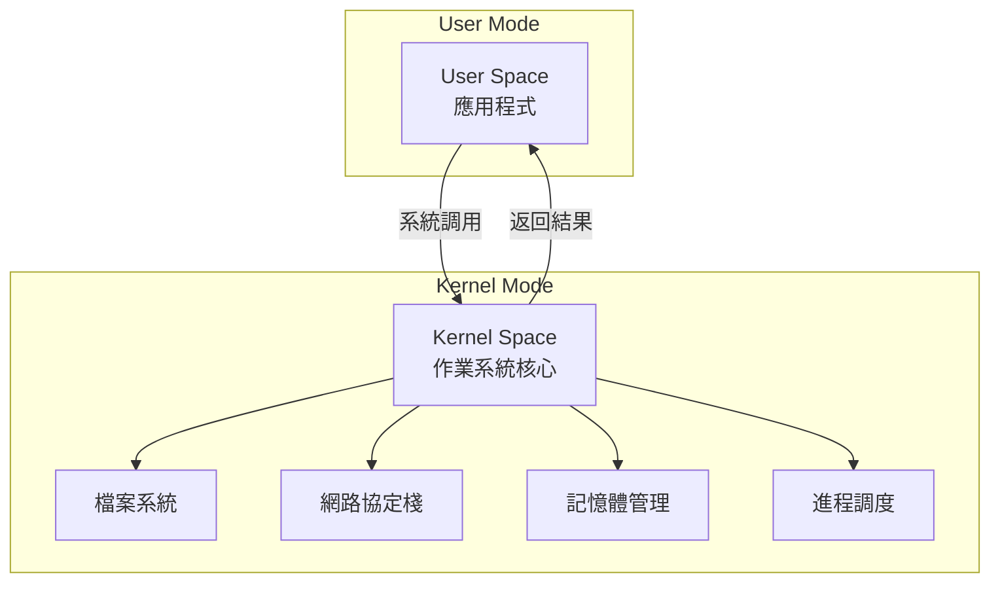
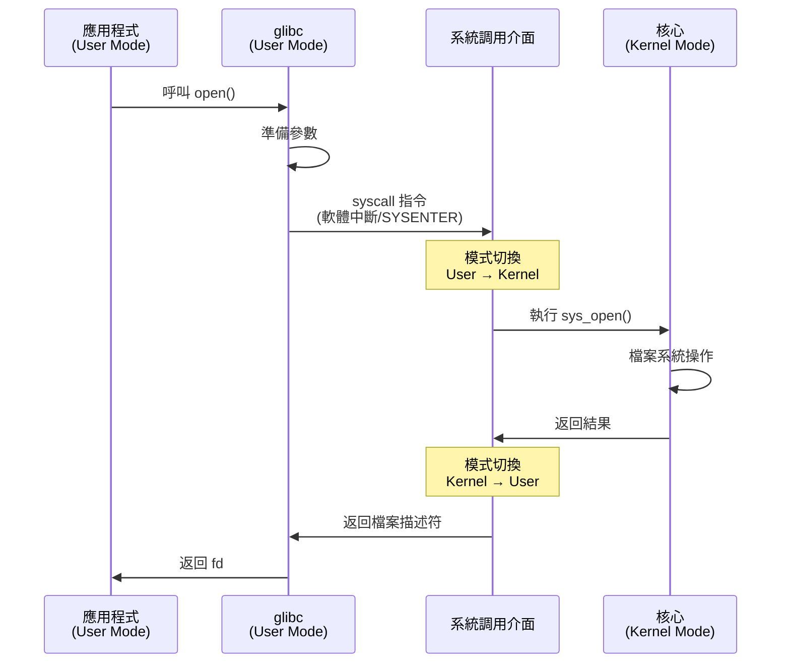
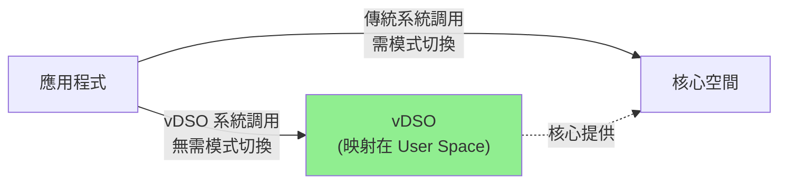
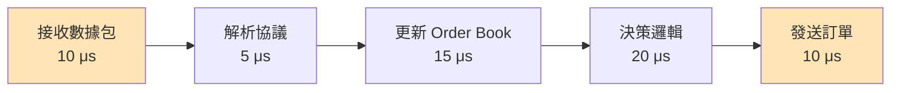

# 系統調用與性能 (System Call & Performance)

系統調用 (System Call) 是使用者空間程式與 Linux 核心互動的唯一方式。理解系統調用的運作機制與性能開銷,對於開發高性能 HFT 系統至關重要。

---

## 1. 系統調用基礎

### 1.1 什麼是系統調用?

系統調用是作業系統核心提供給使用者程式的介面,用於執行特權操作:



**為什麼需要系統調用?**
- **安全性**: 隔離使用者程式與核心,防止惡意程式破壞系統
- **資源管理**: 核心統一管理硬體資源(CPU、記憶體、I/O 裝置)
- **抽象化**: 提供統一的介面,隱藏硬體差異

### 1.2 系統調用的執行流程

當程式呼叫系統調用時,會發生以下步驟:

```cpp
// 使用者空間程式碼
int fd = open("/tmp/test.txt", O_RDONLY);  // glibc wrapper
```



**關鍵步驟**:
1. **參數準備**: 將參數放入暫存器 (x86-64: rdi, rsi, rdx, r10, r8, r9)
2. **系統調用號**: 設置 rax 暫存器為系統調用號
3. **模式切換**: 執行 `syscall` 指令,從 User Mode 切換到 Kernel Mode
4. **核心執行**: 核心根據系統調用號執行對應函數
5. **返回結果**: 將結果放入 rax,切換回 User Mode

### 1.3 系統調用的開銷

系統調用的主要開銷來源:

| 開銷來源 | 說明 | 時間估計 (x86-64) |
|---------|------|-------------------|
| **模式切換** | User Mode ↔ Kernel Mode | ~50-100 ns |
| **上下文保存/恢復** | 保存/恢復暫存器狀態 | ~20-40 ns |
| **TLB/Cache 失效** | 切換位址空間導致 cache miss | ~50-200 ns |
| **核心執行** | 實際執行系統調用邏輯 | 視操作而定 |

**總開銷**: 一次簡單的系統調用 (如 `getpid()`) 約 **100-300 ns**

```cpp
#include <unistd.h>
#include <chrono>
#include <iostream>

void benchmark_syscall() {
    constexpr int ITERATIONS = 1000000;
    
    auto start = std::chrono::high_resolution_clock::now();
    for (int i = 0; i < ITERATIONS; ++i) {
        getpid();  // 最簡單的系統調用
    }
    auto end = std::chrono::high_resolution_clock::now();
    
    auto duration = std::chrono::duration_cast<std::chrono::nanoseconds>(end - start);
    std::cout << "每次 getpid() 平均耗時: " 
              << duration.count() / ITERATIONS << " ns\n";
}

// 輸出範例: 每次 getpid() 平均耗時: 120 ns
```

---

## 2. vDSO 優化 (Virtual Dynamic Shared Object)

### 2.1 vDSO 是什麼?

vDSO 是 Linux 核心提供的一種機制,將**某些常用系統調用的實現映射到使用者空間**,避免模式切換開銷。

**原理**:
- 核心將一段程式碼映射到每個進程的位址空間
- 特定系統調用可以直接在使用者空間執行
- 完全**零開銷**,就像普通函數呼叫



### 2.2 哪些系統調用可以使用 vDSO?

```bash
# 查看 vDSO 提供的函數
ldd /bin/ls | grep vdso
# 輸出: linux-vdso.so.1 (0x00007ffce2bfe000)
```

**常見 vDSO 函數** (x86-64 Linux):
- `gettimeofday()` - 獲取當前時間
- `clock_gettime()` - 高精度時間
- `time()` - 秒級時間
- `getcpu()` - 獲取當前 CPU 編號

**性能對比**:

```cpp
#include <time.h>
#include <sys/time.h>
#include <chrono>
#include <iostream>

void benchmark_vdso() {
    constexpr int ITERATIONS = 10000000;
    
    // 測試 clock_gettime (使用 vDSO)
    auto start = std::chrono::high_resolution_clock::now();
    for (int i = 0; i < ITERATIONS; ++i) {
        struct timespec ts;
        clock_gettime(CLOCK_REALTIME, &ts);  // vDSO 優化
    }
    auto end = std::chrono::high_resolution_clock::now();
    
    auto duration = std::chrono::duration_cast<std::chrono::nanoseconds>(end - start);
    std::cout << "每次 clock_gettime() 平均耗時: " 
              << duration.count() / ITERATIONS << " ns\n";
    
    // 對比: getpid() 需要真實系統調用
    start = std::chrono::high_resolution_clock::now();
    for (int i = 0; i < ITERATIONS; ++i) {
        getpid();  // 真實系統調用
    }
    end = std::chrono::high_resolution_clock::now();
    
    duration = std::chrono::duration_cast<std::chrono::nanoseconds>(end - start);
    std::cout << "每次 getpid() 平均耗時: " 
              << duration.count() / ITERATIONS << " ns\n";
}

/* 輸出範例:
每次 clock_gettime() 平均耗時: 20 ns   (vDSO 優化)
每次 getpid() 平均耗時: 120 ns        (真實系統調用)
*/
```

**HFT 應用**:
- **延遲測量**: 使用 `clock_gettime(CLOCK_MONOTONIC)` 測量訂單延遲
- **時間戳記**: 為市場數據包添加高精度時間戳
- **無開銷**: 不影響關鍵路徑性能

### 2.3 驗證 vDSO 使用

```cpp
#include <dlfcn.h>
#include <stdio.h>

void check_vdso() {
    void* handle = dlopen("linux-vdso.so.1", RTLD_LAZY);
    if (handle) {
        printf("vDSO 已載入\n");
        
        // 查找 clock_gettime 符號
        void* sym = dlsym(handle, "__vdso_clock_gettime");
        if (sym) {
            printf("clock_gettime 使用 vDSO: %p\n", sym);
        }
        dlclose(handle);
    }
}
```

---

## 3. 常用系統調用性能比較

### 3.1 I/O 系統調用對比

| 系統調用 | 說明 | 延遲 | 適用場景 |
|---------|------|------|---------|
| `read()/write()` | 標準 I/O | 中 | 一般檔案操作 |
| `pread()/pwrite()` | 不改變 offset | 中 | 多執行緒檔案存取 |
| `readv()/writev()` | 分散/聚集 I/O | 中 | 多緩衝區操作 |
| `mmap()` | 記憶體映射 | 低* | 大檔案隨機存取 |
| `sendfile()` | 零拷貝傳輸 | 低 | 檔案到 socket |
| `io_uring` | 異步 I/O | 極低 | 高性能異步操作 |

\* mmap 首次存取會發生 page fault,後續存取快速

### 3.2 Benchmark 程式碼

```cpp
#include <fcntl.h>
#include <unistd.h>
#include <sys/mman.h>
#include <sys/stat.h>
#include <chrono>
#include <iostream>
#include <cstring>

class SyscallBenchmark {
public:
    static constexpr size_t FILE_SIZE = 1024 * 1024;  // 1 MB
    static constexpr size_t ITERATIONS = 1000;
    
    // 測試 read()
    static void benchmark_read() {
        char buffer[4096];
        int fd = open("/tmp/testfile", O_RDONLY);
        
        auto start = std::chrono::high_resolution_clock::now();
        for (size_t i = 0; i < ITERATIONS; ++i) {
            lseek(fd, 0, SEEK_SET);  // 重置位置
            ssize_t total = 0;
            while (total < FILE_SIZE) {
                ssize_t n = read(fd, buffer, sizeof(buffer));
                if (n <= 0) break;
                total += n;
            }
        }
        auto end = std::chrono::high_resolution_clock::now();
        
        close(fd);
        print_result("read()", start, end);
    }
    
    // 測試 mmap()
    static void benchmark_mmap() {
        int fd = open("/tmp/testfile", O_RDONLY);
        struct stat st;
        fstat(fd, &st);
        
        auto start = std::chrono::high_resolution_clock::now();
        for (size_t i = 0; i < ITERATIONS; ++i) {
            void* addr = mmap(nullptr, st.st_size, PROT_READ, 
                            MAP_PRIVATE, fd, 0);
            
            // 模擬讀取 (觸發 page fault)
            volatile char sum = 0;
            char* data = static_cast<char*>(addr);
            for (size_t j = 0; j < st.st_size; j += 4096) {
                sum += data[j];
            }
            
            munmap(addr, st.st_size);
        }
        auto end = std::chrono::high_resolution_clock::now();
        
        close(fd);
        print_result("mmap()", start, end);
    }
    
    // 測試 pread() (不改變檔案偏移)
    static void benchmark_pread() {
        char buffer[4096];
        int fd = open("/tmp/testfile", O_RDONLY);
        
        auto start = std::chrono::high_resolution_clock::now();
        for (size_t i = 0; i < ITERATIONS; ++i) {
            ssize_t total = 0;
            off_t offset = 0;
            while (total < FILE_SIZE) {
                ssize_t n = pread(fd, buffer, sizeof(buffer), offset);
                if (n <= 0) break;
                total += n;
                offset += n;
            }
        }
        auto end = std::chrono::high_resolution_clock::now();
        
        close(fd);
        print_result("pread()", start, end);
    }
    
private:
    static void print_result(const char* name, 
                            auto start, auto end) {
        auto duration = std::chrono::duration_cast<std::chrono::microseconds>(
            end - start);
        std::cout << name << " 平均延遲: " 
                  << duration.count() / ITERATIONS << " μs\n";
    }
};

/* 輸出範例 (讀取 1MB 檔案):
read() 平均延遲: 850 μs
pread() 平均延遲: 840 μs
mmap() 平均延遲: 320 μs   (首次映射後 page 已在快取)
*/
```

### 3.3 HFT 場景選擇策略

**配置檔載入** (啟動階段):
```cpp
// 推薦: mmap() - 快速載入大型配置檔
class ConfigLoader {
    void* data_;
    size_t size_;
    
public:
    bool load(const char* filename) {
        int fd = open(filename, O_RDONLY);
        struct stat st;
        fstat(fd, &st);
        
        data_ = mmap(nullptr, st.st_size, PROT_READ, 
                    MAP_PRIVATE | MAP_POPULATE, fd, 0);
        // MAP_POPULATE: 預先載入所有 pages
        
        size_ = st.st_size;
        close(fd);
        return data_ != MAP_FAILED;
    }
};
```

**市場數據記錄** (關鍵路徑):
```cpp
// 推薦: 預分配 buffer + write() - 避免系統調用開銷
class MarketDataLogger {
    int fd_;
    char buffer_[1024 * 1024];  // 1MB buffer
    size_t pos_ = 0;
    
public:
    void log_tick(const MarketTick& tick) {
        if (pos_ + sizeof(tick) > sizeof(buffer_)) {
            flush();  // 批次寫入,減少系統調用
        }
        memcpy(buffer_ + pos_, &tick, sizeof(tick));
        pos_ += sizeof(tick);
    }
    
    void flush() {
        if (pos_ > 0) {
            write(fd_, buffer_, pos_);
            pos_ = 0;
        }
    }
};
```

---

## 4. 系統調用追蹤與分析

### 4.1 strace - 追蹤系統調用

`strace` 是追蹤程式系統調用的強大工具:

```bash
# 基本使用
strace ./my_program

# 統計系統調用次數與時間
strace -c ./my_program

# 只追蹤特定系統調用
strace -e trace=read,write,open ./my_program

# 追蹤正在執行的進程
strace -p <PID>

# 顯示時間戳與延遲
strace -tt -T ./my_program
```

**範例輸出**:
```
% time     seconds  usecs/call     calls    errors syscall
------ ----------- ----------- --------- --------- ----------------
 45.23    0.002341          23       100           read
 32.15    0.001664          16       100           write
 12.34    0.000639          63        10           open
  5.67    0.000294          29        10           close
  4.61    0.000239          23        10           fstat
------ ----------- ----------- --------- --------- ----------------
100.00    0.005177                   230           total
```

### 4.2 perf - 性能分析

**追蹤系統調用開銷**:
```bash
# 記錄系統調用
perf record -e 'syscalls:sys_enter_*' ./my_program

# 分析報告
perf report

# 即時監控
perf top -e syscalls:sys_enter_read
```

**範例: 分析 HFT 程式的系統調用熱點**:
```bash
# 記錄 10 秒內的系統調用
perf record -e 'syscalls:sys_enter_*' -a -g sleep 10

# 生成火焰圖
perf script | stackcollapse-perf.pl | flamegraph.pl > syscall_flame.svg
```

### 4.3 實戰案例: 找出系統調用瓶頸

```cpp
// 問題程式: 每次訂單都開啟/關閉檔案
class BadOrderLogger {
    std::string filename_;
    
public:
    void log_order(const Order& order) {
        int fd = open(filename_.c_str(), O_WRONLY | O_APPEND | O_CREAT, 0644);
        write(fd, &order, sizeof(order));
        close(fd);  // 每次都系統調用!
    }
};

// 使用 strace 分析:
// $ strace -c ./bad_logger
// 發現大量 open/close 調用
```

**優化版本**:
```cpp
class GoodOrderLogger {
    int fd_;
    
public:
    GoodOrderLogger(const std::string& filename) {
        fd_ = open(filename.c_str(), O_WRONLY | O_APPEND | O_CREAT, 0644);
        // 一次性開啟,保持檔案描述符
    }
    
    ~GoodOrderLogger() {
        if (fd_ >= 0) close(fd_);
    }
    
    void log_order(const Order& order) {
        write(fd_, &order, sizeof(order));  // 只有一次系統調用
    }
};

// 性能提升: 1000 次訂單記錄從 50ms 降至 5ms
```

---

## 5. 減少系統調用的技巧

### 5.1 批次處理 (Batching)

```cpp
// 問題: 每次都單獨寫入
for (const auto& msg : messages) {
    write(socket_fd, &msg, sizeof(msg));  // N 次系統調用
}

// 優化: 批次寫入
std::vector<char> buffer;
for (const auto& msg : messages) {
    buffer.insert(buffer.end(), 
                  reinterpret_cast<const char*>(&msg),
                  reinterpret_cast<const char*>(&msg) + sizeof(msg));
}
write(socket_fd, buffer.data(), buffer.size());  // 1 次系統調用

// 更好: 使用 writev (分散/聚集 I/O)
std::vector<iovec> iovecs;
for (const auto& msg : messages) {
    iovecs.push_back({const_cast<void*>(static_cast<const void*>(&msg)), 
                      sizeof(msg)});
}
writev(socket_fd, iovecs.data(), iovecs.size());  // 1 次系統調用
```

### 5.2 記憶體映射 (Memory Mapping)

```cpp
// 使用 mmap 避免 read/write 系統調用
class SharedMemoryQueue {
    struct Header {
        std::atomic<uint64_t> write_pos{0};
        std::atomic<uint64_t> read_pos{0};
    };
    
    void* shm_addr_;
    Header* header_;
    char* data_;
    
public:
    bool init(const char* name, size_t size) {
        int fd = shm_open(name, O_CREAT | O_RDWR, 0666);
        ftruncate(fd, size);
        
        shm_addr_ = mmap(nullptr, size, PROT_READ | PROT_WRITE,
                        MAP_SHARED, fd, 0);
        close(fd);  // mmap 後可關閉 fd
        
        header_ = static_cast<Header*>(shm_addr_);
        data_ = static_cast<char*>(shm_addr_) + sizeof(Header);
        return shm_addr_ != MAP_FAILED;
    }
    
    // 完全無系統調用的寫入!
    bool write(const void* data, size_t len) {
        uint64_t pos = header_->write_pos.load(std::memory_order_acquire);
        memcpy(data_ + pos, data, len);
        header_->write_pos.store(pos + len, std::memory_order_release);
        return true;
    }
};
```

### 5.3 使用者空間緩衝

```cpp
// 標準庫已經做了緩衝
FILE* fp = fopen("log.txt", "w");
setvbuf(fp, nullptr, _IOFBF, 64 * 1024);  // 64KB 緩衝

// 或使用 C++ iostream
std::ofstream ofs("log.txt");
ofs.rdbuf()->pubsetbuf(buffer, 64 * 1024);

// 直到緩衝區滿或 fflush() 才會真正系統調用
```

---

## 6. HFT 實戰: 超低延遲系統調用策略

### 6.1 完全避免系統調用

```cpp
// 使用 DPDK 或 AF_XDP,完全繞過核心網路協定棧
class DPDKReceiver {
    rte_mempool* mbuf_pool_;
    
public:
    void receive_market_data() {
        rte_mbuf* bufs[BURST_SIZE];
        
        // 完全在使用者空間,無系統調用!
        uint16_t nb_rx = rte_eth_rx_burst(port_id, queue_id, 
                                          bufs, BURST_SIZE);
        
        for (uint16_t i = 0; i < nb_rx; ++i) {
            process_packet(bufs[i]);
            rte_pktmbuf_free(bufs[i]);
        }
    }
};
```

### 6.2 預熱關鍵路徑

```cpp
// 啟動時執行一次所有系統調用,確保 TLB/Cache 熱身
void warmup_critical_path() {
    // 預先開啟所有需要的檔案
    int log_fd = open("orders.log", O_WRONLY | O_APPEND);
    
    // 預先分配記憶體
    void* buffer = mmap(nullptr, 1024 * 1024, PROT_READ | PROT_WRITE,
                       MAP_PRIVATE | MAP_ANONYMOUS | MAP_POPULATE, -1, 0);
    
    // 觸發一次時間調用 (vDSO 熱身)
    struct timespec ts;
    clock_gettime(CLOCK_MONOTONIC, &ts);
    
    // 設定 CPU affinity (後續無需系統調用)
    cpu_set_t cpuset;
    CPU_ZERO(&cpuset);
    CPU_SET(2, &cpuset);
    sched_setaffinity(0, sizeof(cpuset), &cpuset);
}
```

### 6.3 延遲預算分配



**系統調用預算**: 總延遲 60 μs 中,系統調用應 < 5 μs (< 8%)

---

## 7. 效能測量與優化 Checklist

### 7.1 測量工具

```bash
# 1. 使用 strace 找出系統調用熱點
strace -c -S calls ./my_hft_program

# 2. 使用 perf 測量延遲
perf stat -e 'syscalls:sys_enter_*' ./my_hft_program

# 3. 使用 bpftrace 追蹤特定系統調用
bpftrace -e 'tracepoint:syscalls:sys_enter_write { @[comm] = count(); }'
```

### 7.2 優化 Checklist

- [ ] **減少系統調用次數**
  - [ ] 批次處理 I/O 操作
  - [ ] 保持檔案描述符開啟
  - [ ] 使用 mmap 替代 read/write
  
- [ ] **使用 vDSO 優化的調用**
  - [ ] 時間獲取使用 `clock_gettime()`
  - [ ] 避免不必要的 `getpid()`
  
- [ ] **避免阻塞系統調用**
  - [ ] 使用非阻塞 I/O
  - [ ] 使用 io_uring 異步操作
  
- [ ] **記憶體管理優化**
  - [ ] 預分配記憶體 (避免 brk/mmap)
  - [ ] 使用 huge pages
  
- [ ] **關鍵路徑分析**
  - [ ] 用 strace -T 測量每個系統調用延遲
  - [ ] 用 perf 生成火焰圖
  - [ ] 設定延遲預算並監控

---

## 參考資料

1. **Linux 核心文件**
   - [System Call Table (x86-64)](https://github.com/torvalds/linux/blob/master/arch/x86/entry/syscalls/syscall_64.tbl)
   - [vDSO Documentation](https://man7.org/linux/man-pages/man7/vdso.7.html)

2. **書籍**
   - 《Linux System Programming, 2nd Edition》(O'Reilly, 2013)
   - 《The Linux Programming Interface》(No Starch Press, 2010)

3. **效能分析**
   - [Brendan Gregg's Blog - Linux Performance](https://www.brendangregg.com/linuxperf.html)
   - [perf Examples](https://www.brendangregg.com/perf.html)

4. **學術論文**
   - "FlexSC: Flexible System Call Scheduling with Exception-Less System Calls" (OSDI 2010)
   - "The Linux Scheduler: a Decade of Wasted Cores" (EuroSys 2016)
