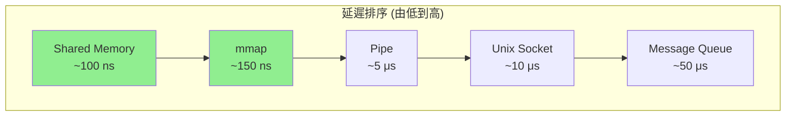
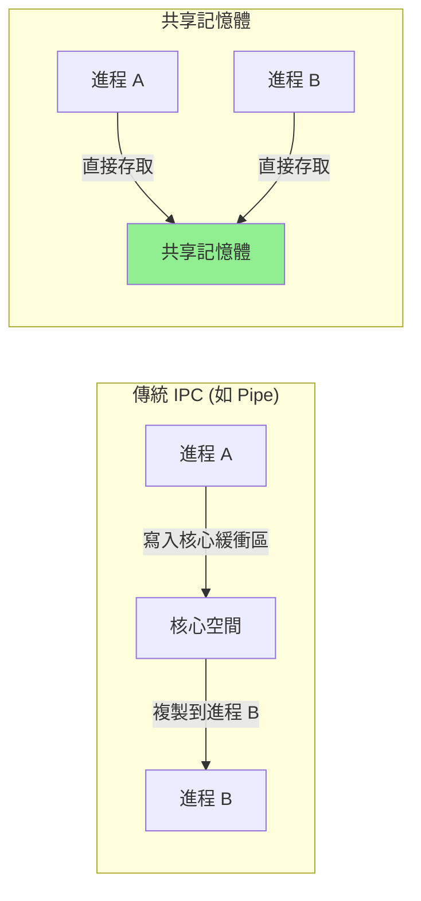
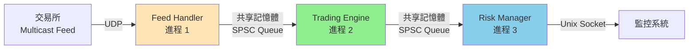

# 進程間通信 IPC (Inter-Process Communication)

進程間通信 (IPC) 是多個進程交換數據的機制。在 HFT 系統中,不同組件 (Feed Handler, Trading Engine, Risk Manager) 往往運行在獨立進程中,需要高效的 IPC 機制來實現微秒級通信。

---

## 1. IPC 機制概覽

### 1.1 IPC 方式對比

| IPC 機制 | 延遲 | 頻寬 | 資料結構 | 同步 | 適用場景 |
|---------|------|------|---------|------|---------|
| **Pipe / FIFO** | 中 | 中 | 位元組流 | 阻塞/非阻塞 | 簡單父子進程通信 |
| **Unix Socket** | 中-高 | 中 | 位元組流/訊息 | 阻塞/非阻塞 | 靈活的進程通信 |
| **Message Queue** | 高 | 低 | 訊息 | 阻塞/非阻塞 | 優先級訊息傳遞 |
| **Shared Memory** | **極低** | **極高** | 任意結構 | 需手動同步 | **HFT 首選** |
| **Memory-Mapped File** | 極低 | 極高 | 任意結構 | 需手動同步 | 持久化共享數據 |



### 1.2 POSIX vs System V IPC

Linux 支援兩套 IPC API:

| 特性 | POSIX IPC | System V IPC |
|-----|-----------|-------------|
| **API 風格** | 簡單、檔案導向 | 複雜、整數 ID |
| **命名** | 檔案系統路徑 (`/dev/shm/myqueue`) | 整數 key |
| **權限** | 檔案權限 | 獨立權限結構 |
| **持久性** | 進程結束自動清理 | 需手動清理 (ipcrm) |
| **可移植性** | 較好 | 較差 |
| **推薦** | ✅ **優先使用** | 僅相容舊系統 |

**查看 IPC 資源**:
```bash
# System V IPC
ipcs -a     # 查看所有 IPC 資源
ipcrm -m <shmid>  # 刪除共享記憶體

# POSIX IPC
ls /dev/shm/     # 查看共享記憶體對象
ls /dev/mqueue/  # 查看訊息隊列
```

---

## 2. Pipe 與 FIFO

### 2.1 匿名 Pipe (Anonymous Pipe)

**特性**:
- 單向通信 (half-duplex)
- 只能用於**有親緣關係的進程** (父子進程)
- 核心提供的緩衝區 (預設 64 KB)

```cpp
#include <unistd.h>
#include <sys/wait.h>
#include <iostream>
#include <cstring>

void pipe_example() {
    int pipefd[2];
    
    // 建立 pipe: pipefd[0] 讀端, pipefd[1] 寫端
    if (pipe(pipefd) == -1) {
        perror("pipe");
        return;
    }
    
    pid_t pid = fork();
    
    if (pid == 0) {
        // 子進程: 寫入數據
        close(pipefd[0]);  // 關閉讀端
        
        const char* msg = "Hello from child!";
        write(pipefd[1], msg, strlen(msg) + 1);
        
        close(pipefd[1]);
        exit(0);
        
    } else {
        // 父進程: 讀取數據
        close(pipefd[1]);  // 關閉寫端
        
        char buffer[128];
        ssize_t n = read(pipefd[0], buffer, sizeof(buffer));
        std::cout << "父進程收到: " << buffer << " (" << n << " bytes)\n";
        
        close(pipefd[0]);
        wait(nullptr);  // 等待子進程結束
    }
}
```

**性能測量**:
```cpp
#include <chrono>

void benchmark_pipe() {
    int pipefd[2];
    pipe(pipefd);
    
    constexpr int ITERATIONS = 10000;
    char data = 'A';
    
    auto start = std::chrono::high_resolution_clock::now();
    
    for (int i = 0; i < ITERATIONS; ++i) {
        write(pipefd[1], &data, 1);
        read(pipefd[0], &data, 1);
    }
    
    auto end = std::chrono::high_resolution_clock::now();
    auto duration = std::chrono::duration_cast<std::chrono::nanoseconds>(end - start);
    
    std::cout << "Pipe 往返延遲: " << duration.count() / ITERATIONS << " ns\n";
    // 輸出範例: Pipe 往返延遲: 5000 ns (5 μs)
    
    close(pipefd[0]);
    close(pipefd[1]);
}
```

### 2.2 命名 Pipe (FIFO)

**特性**:
- 有檔案系統路徑名稱
- 可用於**任意進程**之間通信
- 資料不持久化 (存在核心緩衝區)

```cpp
#include <sys/stat.h>
#include <fcntl.h>
#include <unistd.h>

// 寫入端 (Producer)
void fifo_writer() {
    const char* fifo_path = "/tmp/my_fifo";
    
    // 建立 FIFO (已存在則失敗)
    mkfifo(fifo_path, 0666);
    
    int fd = open(fifo_path, O_WRONLY);  // 會阻塞直到有讀取端
    
    for (int i = 0; i < 10; ++i) {
        write(fd, &i, sizeof(i));
        std::cout << "寫入: " << i << "\n";
    }
    
    close(fd);
}

// 讀取端 (Consumer)
void fifo_reader() {
    const char* fifo_path = "/tmp/my_fifo";
    
    int fd = open(fifo_path, O_RDONLY);  // 會阻塞直到有寫入端
    
    int value;
    while (read(fd, &value, sizeof(value)) > 0) {
        std::cout << "讀取: " << value << "\n";
    }
    
    close(fd);
    unlink(fifo_path);  // 刪除 FIFO
}
```

**HFT 應用**:
- ❌ **不推薦用於關鍵路徑** (延遲較高)
- ✅ 適合: 監控數據導出、日誌收集、控制訊息

---

## 3. Unix Domain Socket

### 3.1 基礎用法

Unix Socket 提供類似 TCP 的介面,但用於本地進程間通信,效能優於網路 socket。

```cpp
#include <sys/socket.h>
#include <sys/un.h>
#include <unistd.h>
#include <cstring>
#include <iostream>

// Server 端
class UnixSocketServer {
    int server_fd_;
    const char* socket_path_;
    
public:
    UnixSocketServer(const char* path) : socket_path_(path) {
        server_fd_ = socket(AF_UNIX, SOCK_STREAM, 0);
        
        struct sockaddr_un addr;
        memset(&addr, 0, sizeof(addr));
        addr.sun_family = AF_UNIX;
        strncpy(addr.sun_path, socket_path_, sizeof(addr.sun_path) - 1);
        
        unlink(socket_path_);  // 移除舊的 socket 檔案
        bind(server_fd_, (struct sockaddr*)&addr, sizeof(addr));
        listen(server_fd_, 5);
        
        std::cout << "Server 監聽於: " << socket_path_ << "\n";
    }
    
    void accept_and_handle() {
        int client_fd = accept(server_fd_, nullptr, nullptr);
        
        char buffer[1024];
        ssize_t n = read(client_fd, buffer, sizeof(buffer));
        std::cout << "收到: " << std::string(buffer, n) << "\n";
        
        const char* response = "ACK";
        write(client_fd, response, strlen(response));
        
        close(client_fd);
    }
    
    ~UnixSocketServer() {
        close(server_fd_);
        unlink(socket_path_);
    }
};

// Client 端
class UnixSocketClient {
public:
    static void send_message(const char* socket_path, const char* msg) {
        int fd = socket(AF_UNIX, SOCK_STREAM, 0);
        
        struct sockaddr_un addr;
        memset(&addr, 0, sizeof(addr));
        addr.sun_family = AF_UNIX;
        strncpy(addr.sun_path, socket_path, sizeof(addr.sun_path) - 1);
        
        connect(fd, (struct sockaddr*)&addr, sizeof(addr));
        
        write(fd, msg, strlen(msg));
        
        char buffer[128];
        ssize_t n = read(fd, buffer, sizeof(buffer));
        std::cout << "回應: " << std::string(buffer, n) << "\n";
        
        close(fd);
    }
};
```

### 3.2 Datagram Socket (SOCK_DGRAM)

```cpp
// 類似 UDP,無連接、訊息導向
void unix_dgram_example() {
    const char* server_path = "/tmp/dgram_server";
    const char* client_path = "/tmp/dgram_client";
    
    // Server
    int server_fd = socket(AF_UNIX, SOCK_DGRAM, 0);
    struct sockaddr_un server_addr;
    server_addr.sun_family = AF_UNIX;
    strcpy(server_addr.sun_path, server_path);
    unlink(server_path);
    bind(server_fd, (struct sockaddr*)&server_addr, sizeof(server_addr));
    
    // Client
    int client_fd = socket(AF_UNIX, SOCK_DGRAM, 0);
    struct sockaddr_un client_addr;
    client_addr.sun_family = AF_UNIX;
    strcpy(client_addr.sun_path, client_path);
    unlink(client_path);
    bind(client_fd, (struct sockaddr*)&client_addr, sizeof(client_addr));
    
    // 發送訊息
    const char* msg = "Hello Server!";
    sendto(client_fd, msg, strlen(msg), 0, 
           (struct sockaddr*)&server_addr, sizeof(server_addr));
    
    // 接收訊息
    char buffer[1024];
    recvfrom(server_fd, buffer, sizeof(buffer), 0, nullptr, nullptr);
    
    close(server_fd);
    close(client_fd);
    unlink(server_path);
    unlink(client_path);
}
```

**性能對比**:
```
Unix SOCK_STREAM: ~10 μs 延遲
Unix SOCK_DGRAM:  ~8 μs 延遲 (少了連接管理)
```

**HFT 應用**:
- ✅ 適合: 組件間指令傳遞 (重新載入配置、風險限制更新)
- ❌ 不適合: 市場數據傳輸 (仍有 10 μs 延遲)

---

## 4. 共享記憶體 (Shared Memory) - HFT 核心

### 4.1 POSIX 共享記憶體

**特性**:
- **零拷貝**: 多個進程直接存取同一塊實體記憶體
- **極低延遲**: ~100 ns (僅記憶體存取延遲)
- **需手動同步**: 使用 atomic、mutex 或 futex



**基本使用**:
```cpp
#include <sys/mman.h>
#include <sys/stat.h>
#include <fcntl.h>
#include <unistd.h>
#include <cstring>
#include <iostream>

// 建立共享記憶體
class SharedMemory {
    void* addr_;
    size_t size_;
    int fd_;
    const char* name_;
    
public:
    // 建立並映射共享記憶體
    bool create(const char* name, size_t size) {
        name_ = name;
        size_ = size;
        
        // 建立共享記憶體對象
        fd_ = shm_open(name, O_CREAT | O_RDWR, 0666);
        if (fd_ == -1) {
            perror("shm_open");
            return false;
        }
        
        // 設定大小
        if (ftruncate(fd_, size) == -1) {
            perror("ftruncate");
            return false;
        }
        
        // 映射到進程位址空間
        addr_ = mmap(nullptr, size, PROT_READ | PROT_WRITE, 
                     MAP_SHARED, fd_, 0);
        
        if (addr_ == MAP_FAILED) {
            perror("mmap");
            return false;
        }
        
        std::cout << "共享記憶體已建立: " << name << " (" << size << " bytes)\n";
        return true;
    }
    
    // 開啟現有共享記憶體
    bool open(const char* name, size_t size) {
        name_ = name;
        size_ = size;
        
        fd_ = shm_open(name, O_RDWR, 0666);
        if (fd_ == -1) {
            perror("shm_open");
            return false;
        }
        
        addr_ = mmap(nullptr, size, PROT_READ | PROT_WRITE, 
                     MAP_SHARED, fd_, 0);
        
        if (addr_ == MAP_FAILED) {
            perror("mmap");
            return false;
        }
        
        return true;
    }
    
    void* data() { return addr_; }
    
    ~SharedMemory() {
        if (addr_ != nullptr && addr_ != MAP_FAILED) {
            munmap(addr_, size_);
        }
        if (fd_ >= 0) {
            close(fd_);
        }
    }
    
    // 移除共享記憶體對象
    static void unlink(const char* name) {
        shm_unlink(name);
    }
};
```

### 4.2 Lock-Free 共享記憶體隊列

```cpp
#include <atomic>
#include <cstring>

// 單生產者單消費者 (SPSC) Lock-Free 隊列
template <typename T, size_t Capacity>
class SPSCQueue {
    struct alignas(64) Slot {
        std::atomic<uint64_t> sequence{0};
        T data;
    };
    
    alignas(64) std::atomic<uint64_t> write_pos_{0};
    alignas(64) std::atomic<uint64_t> read_pos_{0};
    Slot slots_[Capacity];
    
public:
    SPSCQueue() {
        for (size_t i = 0; i < Capacity; ++i) {
            slots_[i].sequence.store(i, std::memory_order_relaxed);
        }
    }
    
    // 生產者: 寫入數據
    bool try_push(const T& item) {
        uint64_t pos = write_pos_.load(std::memory_order_relaxed);
        Slot* slot = &slots_[pos % Capacity];
        
        uint64_t seq = slot->sequence.load(std::memory_order_acquire);
        
        // 檢查是否可寫入
        if (seq != pos) {
            return false;  // 隊列滿
        }
        
        slot->data = item;
        slot->sequence.store(pos + 1, std::memory_order_release);
        write_pos_.store(pos + 1, std::memory_order_release);
        
        return true;
    }
    
    // 消費者: 讀取數據
    bool try_pop(T& item) {
        uint64_t pos = read_pos_.load(std::memory_order_relaxed);
        Slot* slot = &slots_[pos % Capacity];
        
        uint64_t seq = slot->sequence.load(std::memory_order_acquire);
        
        // 檢查是否有數據
        if (seq != pos + 1) {
            return false;  // 隊列空
        }
        
        item = slot->data;
        slot->sequence.store(pos + Capacity, std::memory_order_release);
        read_pos_.store(pos + 1, std::memory_order_release);
        
        return true;
    }
};

// 使用範例
struct MarketTick {
    uint64_t timestamp;
    uint32_t symbol_id;
    double price;
    uint32_t volume;
};

void shared_memory_queue_example() {
    const char* shm_name = "/hft_market_data";
    constexpr size_t QUEUE_SIZE = 4096;
    
    using Queue = SPSCQueue<MarketTick, QUEUE_SIZE>;
    
    // Feed Handler (生產者進程)
    if (fork() == 0) {
        SharedMemory shm;
        shm.create(shm_name, sizeof(Queue));
        
        Queue* queue = new (shm.data()) Queue();  // Placement new
        
        for (int i = 0; i < 1000; ++i) {
            MarketTick tick{};
            tick.timestamp = i;
            tick.symbol_id = 1001;
            tick.price = 100.0 + i * 0.01;
            tick.volume = 100;
            
            while (!queue->try_push(tick)) {
                // Busy-wait (HFT 場景可接受)
            }
        }
        
        exit(0);
    }
    
    // Trading Engine (消費者進程)
    else {
        SharedMemory shm;
        shm.open(shm_name, sizeof(Queue));
        
        Queue* queue = static_cast<Queue*>(shm.data());
        
        MarketTick tick;
        int received = 0;
        while (received < 1000) {
            if (queue->try_pop(tick)) {
                // 處理市場數據
                ++received;
            }
        }
        
        wait(nullptr);
        SharedMemory::unlink(shm_name);
    }
}
```

**性能測量**:
```cpp
void benchmark_shared_memory() {
    constexpr int ITERATIONS = 1000000;
    
    // 使用共享記憶體的 SPSC 隊列
    SPSCQueue<int, 4096> queue;
    
    auto start = std::chrono::high_resolution_clock::now();
    
    for (int i = 0; i < ITERATIONS; ++i) {
        while (!queue.try_push(i)) {}
        
        int value;
        while (!queue.try_pop(value)) {}
    }
    
    auto end = std::chrono::high_resolution_clock::now();
    auto duration = std::chrono::duration_cast<std::chrono::nanoseconds>(end - start);
    
    std::cout << "共享記憶體往返延遲: " << duration.count() / ITERATIONS << " ns\n";
    // 輸出範例: 共享記憶體往返延遲: 100 ns
}
```

### 4.3 進程間同步

**方法 1: Futex (Fast Userspace Mutex)**

```cpp
#include <linux/futex.h>
#include <sys/syscall.h>
#include <limits.h>

class Futex {
    std::atomic<int> value_{0};
    
    long futex(int op, int val) {
        return syscall(SYS_futex, &value_, op, val, nullptr, nullptr, 0);
    }
    
public:
    void lock() {
        int expected = 0;
        // Fast path: CAS 成功則直接獲取鎖
        if (value_.compare_exchange_strong(expected, 1, 
                                          std::memory_order_acquire)) {
            return;
        }
        
        // Slow path: 進入核心等待
        while (true) {
            if (value_.exchange(2, std::memory_order_acquire) == 0) {
                return;
            }
            futex(FUTEX_WAIT, 2);  // 阻塞等待
        }
    }
    
    void unlock() {
        if (value_.exchange(0, std::memory_order_release) == 2) {
            futex(FUTEX_WAKE, 1);  // 喚醒一個等待者
        }
    }
};
```

**方法 2: 原子操作 + Busy-Wait (HFT 常用)**

```cpp
// 適合延遲敏感場景,避免系統調用
class SpinLock {
    std::atomic_flag flag_ = ATOMIC_FLAG_INIT;
    
public:
    void lock() {
        while (flag_.test_and_set(std::memory_order_acquire)) {
            // Busy-wait
            __builtin_ia32_pause();  // x86: pause 指令,減少功耗
        }
    }
    
    void unlock() {
        flag_.clear(std::memory_order_release);
    }
};
```

---

## 5. Memory-Mapped Files

### 5.1 基礎用法

mmap 可將檔案映射到記憶體,提供高效的檔案 I/O 和進程間共享數據。

```cpp
#include <sys/mman.h>
#include <fcntl.h>
#include <sys/stat.h>
#include <unistd.h>

class MappedFile {
    void* addr_;
    size_t size_;
    int fd_;
    
public:
    bool open(const char* filename, bool writable = false) {
        int flags = writable ? O_RDWR : O_RDONLY;
        fd_ = ::open(filename, flags);
        if (fd_ == -1) return false;
        
        struct stat st;
        fstat(fd_, &st);
        size_ = st.st_size;
        
        int prot = PROT_READ | (writable ? PROT_WRITE : 0);
        addr_ = mmap(nullptr, size_, prot, MAP_SHARED, fd_, 0);
        
        return addr_ != MAP_FAILED;
    }
    
    // 建立新檔案並映射
    bool create(const char* filename, size_t size) {
        fd_ = ::open(filename, O_RDWR | O_CREAT | O_TRUNC, 0666);
        if (fd_ == -1) return false;
        
        if (ftruncate(fd_, size) == -1) return false;
        
        size_ = size;
        addr_ = mmap(nullptr, size_, PROT_READ | PROT_WRITE, 
                     MAP_SHARED, fd_, 0);
        
        return addr_ != MAP_FAILED;
    }
    
    void* data() { return addr_; }
    size_t size() const { return size_; }
    
    // 強制同步到磁碟
    void sync() {
        msync(addr_, size_, MS_SYNC);  // MS_ASYNC 為異步
    }
    
    ~MappedFile() {
        if (addr_ != MAP_FAILED) {
            munmap(addr_, size_);
        }
        if (fd_ >= 0) {
            close(fd_);
        }
    }
};
```

### 5.2 HFT 應用: 持久化 Order Book

```cpp
struct OrderBookSnapshot {
    uint64_t timestamp;
    uint32_t symbol_id;
    
    struct Level {
        double price;
        uint32_t volume;
    };
    
    static constexpr size_t MAX_LEVELS = 10;
    Level bids[MAX_LEVELS];
    Level asks[MAX_LEVELS];
};

class OrderBookPersistence {
    MappedFile mmap_;
    OrderBookSnapshot* snapshot_;
    
public:
    bool init(const char* filename) {
        if (!mmap_.create(filename, sizeof(OrderBookSnapshot))) {
            return false;
        }
        snapshot_ = static_cast<OrderBookSnapshot*>(mmap_.data());
        memset(snapshot_, 0, sizeof(OrderBookSnapshot));
        return true;
    }
    
    // 更新快照 (零拷貝)
    void update_snapshot(const OrderBookSnapshot& snap) {
        *snapshot_ = snap;  // 直接寫入映射記憶體
        
        // 可選: 定期同步到磁碟
        // mmap_.sync();
    }
    
    // 其他進程可直接讀取
    const OrderBookSnapshot* get_snapshot() const {
        return snapshot_;
    }
};
```

### 5.3 MAP_HUGETLB - 使用 Huge Pages

```cpp
// 使用 2MB Huge Pages 映射,減少 TLB miss
void* addr = mmap(nullptr, size, PROT_READ | PROT_WRITE,
                  MAP_PRIVATE | MAP_ANONYMOUS | MAP_HUGETLB | MAP_HUGE_2MB,
                  -1, 0);

// 需要系統配置:
// echo 128 > /proc/sys/vm/nr_hugepages
```

---

## 6. HFT 實戰案例

### 6.1 Feed Handler 與 Trading Engine 通信架構



**數據流設計**:
1. **Feed Handler → Trading Engine**: SPSC 共享記憶體隊列 (100 ns 延遲)
2. **Trading Engine → Risk Manager**: SPSC 共享記憶體隊列
3. **控制指令**: Unix Socket (非關鍵路徑)

### 6.2 完整實現

```cpp
// 共享記憶體結構
struct SharedMarketData {
    SPSCQueue<MarketTick, 8192> tick_queue;
    SPSCQueue<Order, 4096> order_queue;
    
    std::atomic<bool> shutdown{false};
};

// Feed Handler 進程
class FeedHandler {
    SharedMemory shm_;
    SharedMarketData* data_;
    
public:
    bool init() {
        if (!shm_.create("/hft_shm", sizeof(SharedMarketData))) {
            return false;
        }
        data_ = new (shm_.data()) SharedMarketData();
        return true;
    }
    
    void run() {
        // 接收市場數據 (UDP multicast)
        int udp_fd = setup_multicast_socket();
        
        while (!data_->shutdown.load(std::memory_order_acquire)) {
            MarketTick tick;
            if (receive_tick(udp_fd, tick)) {
                // 寫入共享記憶體隊列
                while (!data_->tick_queue.try_push(tick)) {
                    // Busy-wait (延遲敏感)
                }
            }
        }
    }
    
private:
    int setup_multicast_socket() {
        // 實現省略,參見網路編程章節
        return 0;
    }
    
    bool receive_tick(int fd, MarketTick& tick) {
        // 實現省略
        return true;
    }
};

// Trading Engine 進程
class TradingEngine {
    SharedMemory shm_;
    SharedMarketData* data_;
    
public:
    bool init() {
        if (!shm_.open("/hft_shm", sizeof(SharedMarketData))) {
            return false;
        }
        data_ = static_cast<SharedMarketData*>(shm_.data());
        return true;
    }
    
    void run() {
        while (!data_->shutdown.load(std::memory_order_acquire)) {
            MarketTick tick;
            
            // 從共享記憶體隊列讀取
            if (data_->tick_queue.try_pop(tick)) {
                // 決策邏輯
                if (should_trade(tick)) {
                    Order order = generate_order(tick);
                    
                    // 寫入訂單隊列
                    while (!data_->order_queue.try_push(order)) {}
                }
            }
        }
    }
    
private:
    bool should_trade(const MarketTick& tick) {
        // 交易策略
        return true;
    }
    
    Order generate_order(const MarketTick& tick) {
        Order order{};
        // 生成訂單
        return order;
    }
};
```

### 6.3 性能測試結果

```
IPC 機制延遲測試 (x86-64, Linux 6.x):

1. 共享記憶體 SPSC Queue:  95 ns
2. Unix Socket (DGRAM):    8.2 μs
3. Unix Socket (STREAM):   10.5 μs
4. Pipe:                   5.3 μs
5. Message Queue:          45 μs

吞吐量測試 (1KB 訊息):

1. 共享記憶體:  10M msg/s
2. Unix Socket:  800K msg/s
3. Pipe:         1.2M msg/s
```

---

## 7. IPC 優化技巧

### 7.1 CPU Cache Line 對齊

```cpp
// 避免 False Sharing
struct alignas(64) CacheLineAligned {
    std::atomic<uint64_t> value;
    char padding[64 - sizeof(std::atomic<uint64_t>)];
};
```

### 7.2 預分配與 Huge Pages

```bash
# 系統配置
echo 1024 > /proc/sys/vm/nr_hugepages  # 配置 2GB huge pages

# 程式碼
void* shm = mmap(nullptr, size, PROT_READ | PROT_WRITE,
                 MAP_SHARED | MAP_ANONYMOUS | MAP_HUGETLB,
                 -1, 0);
```

### 7.3 NUMA Awareness

```cpp
#include <numa.h>

// 在特定 NUMA 節點分配記憶體
void* addr = numa_alloc_onnode(size, 0);  // 節點 0
```

---

## 8. 除錯與監控

### 8.1 查看共享記憶體

```bash
# POSIX 共享記憶體
ls -lh /dev/shm/

# 查看進程映射
cat /proc/<PID>/maps | grep shm
```

### 8.2 追蹤 IPC 調用

```bash
# strace 追蹤 IPC 系統調用
strace -e trace=shm,mmap,munmap ./my_program

# 追蹤跨進程通信
strace -f -e trace=read,write,sendto,recvfrom ./my_program
```

---

## 參考資料

1. **Linux 手冊頁**
   - `man 7 shm_overview` - POSIX 共享記憶體概覽
   - `man 2 mmap` - 記憶體映射
   - `man 7 unix` - Unix domain sockets

2. **書籍**
   - 《The Linux Programming Interface》 Chapter 45-55 (IPC)
   - 《Advanced Programming in the UNIX Environment》 Chapter 15-17

3. **開源項目**
   - [Boost.Interprocess](https://www.boost.org/doc/libs/1_83_0/doc/html/interprocess.html)
   - [LMAX Disruptor](https://github.com/LMAX-Exchange/disruptor) - 高性能隊列

4. **性能優化**
   - [共享記憶體最佳實踐](https://software.intel.com/content/www/us/en/develop/articles/how-to-use-shared-memory-for-fast-ipc.html)
