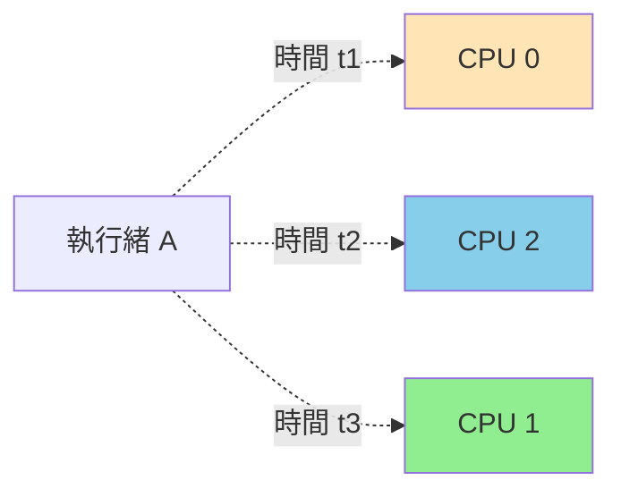
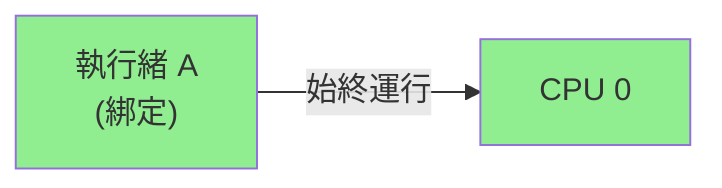
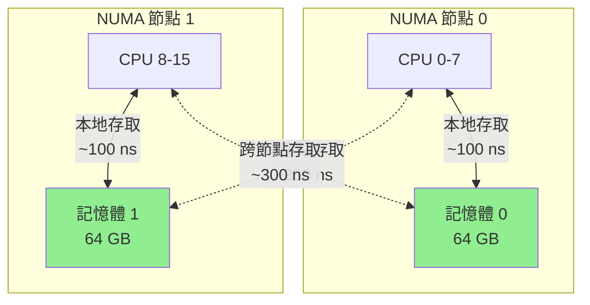
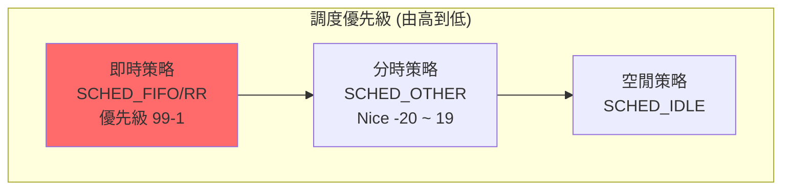
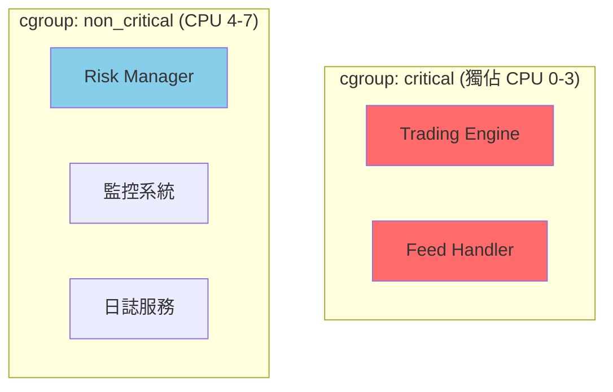

# CPU 親和性與調度 (CPU Affinity & Scheduling)

在 HFT 系統中,將關鍵執行緒綁定到特定 CPU 核心並使用即時調度策略,可以將延遲降低 30-50%。本章深入探討 Linux 的 CPU 親和性、NUMA 架構優化與即時調度機制。

---

## 1. CPU 親和性 (CPU Affinity)

### 1.1 為什麼需要 CPU 親和性?

**問題**: 預設情況下,Linux 調度器會將執行緒在所有 CPU 核心間遷移:



**遷移代價**:
- **Cache 失效**: L1/L2 cache 內容失效,需重新載入 (~100-200 ns)
- **TLB 失效**: Translation Lookaside Buffer 清空 (~50 ns)
- **NUMA 跨節點**: 跨 NUMA 節點存取記憶體延遲增加 2-3 倍

**解決方案**: 將執行緒綁定到特定 CPU,保持 cache 熱度:



### 1.2 設定 CPU 親和性

**方法 1: 使用 `sched_setaffinity`**

```cpp
#include <sched.h>
#include <pthread.h>
#include <iostream>

class CPUAffinity {
public:
    // 將當前執行緒綁定到指定 CPU
    static bool set_affinity(int cpu_id) {
        cpu_set_t cpuset;
        CPU_ZERO(&cpuset);
        CPU_SET(cpu_id, &cpuset);
        
        int result = sched_setaffinity(0, sizeof(cpuset), &cpuset);
        if (result != 0) {
            perror("sched_setaffinity");
            return false;
        }
        
        std::cout << "執行緒已綁定到 CPU " << cpu_id << "\n";
        return true;
    }
    
    // 綁定到多個 CPU (允許在指定核心間遷移)
    static bool set_affinity_multi(const std::vector<int>& cpu_ids) {
        cpu_set_t cpuset;
        CPU_ZERO(&cpuset);
        
        for (int cpu_id : cpu_ids) {
            CPU_SET(cpu_id, &cpuset);
        }
        
        return sched_setaffinity(0, sizeof(cpuset), &cpuset) == 0;
    }
    
    // 獲取當前執行緒的 CPU 親和性
    static std::vector<int> get_affinity() {
        cpu_set_t cpuset;
        CPU_ZERO(&cpuset);
        
        if (sched_getaffinity(0, sizeof(cpuset), &cpuset) != 0) {
            return {};
        }
        
        std::vector<int> cpus;
        for (int i = 0; i < CPU_SETSIZE; ++i) {
            if (CPU_ISSET(i, &cpuset)) {
                cpus.push_back(i);
            }
        }
        return cpus;
    }
    
    // 獲取當前運行在哪個 CPU 上
    static int get_current_cpu() {
        return sched_getcpu();
    }
};

// 使用範例
void example_basic_affinity() {
    std::cout << "當前運行在 CPU: " << CPUAffinity::get_current_cpu() << "\n";
    
    // 綁定到 CPU 2
    CPUAffinity::set_affinity(2);
    
    std::cout << "綁定後運行在 CPU: " << CPUAffinity::get_current_cpu() << "\n";
    
    // 驗證綁定
    auto cpus = CPUAffinity::get_affinity();
    std::cout << "允許運行的 CPU: ";
    for (int cpu : cpus) {
        std::cout << cpu << " ";
    }
    std::cout << "\n";
}
```

**方法 2: 使用 `pthread_setaffinity_np`**

```cpp
#include <pthread.h>

void* thread_function(void* arg) {
    int cpu_id = *static_cast<int*>(arg);
    
    // 在執行緒內部設定親和性
    cpu_set_t cpuset;
    CPU_ZERO(&cpuset);
    CPU_SET(cpu_id, &cpuset);
    
    pthread_t current_thread = pthread_self();
    pthread_setaffinity_np(current_thread, sizeof(cpuset), &cpuset);
    
    std::cout << "執行緒運行在 CPU " << sched_getcpu() << "\n";
    
    // 執行緒工作...
    
    return nullptr;
}

void example_pthread_affinity() {
    pthread_t thread;
    int cpu_id = 3;
    
    pthread_create(&thread, nullptr, thread_function, &cpu_id);
    pthread_join(thread, nullptr);
}
```

### 1.3 C++11 執行緒綁定

```cpp
#include <thread>
#include <vector>

class AffinityThread {
    std::thread thread_;
    int cpu_id_;
    
public:
    template<typename Func, typename... Args>
    AffinityThread(int cpu_id, Func&& func, Args&&... args)
        : cpu_id_(cpu_id)
    {
        thread_ = std::thread([cpu_id, func = std::forward<Func>(func), 
                               ...args = std::forward<Args>(args)]() mutable {
            // 設定親和性
            cpu_set_t cpuset;
            CPU_ZERO(&cpuset);
            CPU_SET(cpu_id, &cpuset);
            pthread_setaffinity_np(pthread_self(), sizeof(cpuset), &cpuset);
            
            // 執行函數
            func(args...);
        });
    }
    
    void join() { thread_.join(); }
    std::thread::id get_id() const { return thread_.get_id(); }
    int get_cpu() const { return cpu_id_; }
};

// 使用範例
void worker_function(int id) {
    std::cout << "Worker " << id << " 運行在 CPU " 
              << sched_getcpu() << "\n";
    
    // 模擬工作
    for (int i = 0; i < 1000000; ++i) {
        volatile int x = i * i;
    }
}

void example_affinity_threads() {
    std::vector<AffinityThread> threads;
    
    // 建立 4 個執行緒,分別綁定到 CPU 0-3
    for (int i = 0; i < 4; ++i) {
        threads.emplace_back(i, worker_function, i);
    }
    
    // 等待所有執行緒完成
    for (auto& thread : threads) {
        thread.join();
    }
}
```

### 1.4 效能測試: 有無親和性對比

```cpp
#include <chrono>
#include <atomic>

void benchmark_cache_locality() {
    constexpr size_t ARRAY_SIZE = 1024 * 1024;  // 1M 元素
    std::vector<int> data(ARRAY_SIZE);
    std::atomic<long long> sum{0};
    
    auto worker = [&data, &sum](bool use_affinity, int cpu_id) {
        if (use_affinity) {
            cpu_set_t cpuset;
            CPU_ZERO(&cpuset);
            CPU_SET(cpu_id, &cpuset);
            sched_setaffinity(0, sizeof(cpuset), &cpuset);
        }
        
        auto start = std::chrono::high_resolution_clock::now();
        
        // 重複存取相同資料 (測試 cache 效果)
        for (int iter = 0; iter < 100; ++iter) {
            long long local_sum = 0;
            for (size_t i = 0; i < ARRAY_SIZE; ++i) {
                local_sum += data[i];
            }
            sum.fetch_add(local_sum, std::memory_order_relaxed);
        }
        
        auto end = std::chrono::high_resolution_clock::now();
        auto duration = std::chrono::duration_cast<std::chrono::milliseconds>(
            end - start);
        
        std::cout << (use_affinity ? "有親和性" : "無親和性") 
                  << " - 耗時: " << duration.count() << " ms\n";
    };
    
    std::cout << "測試 1: 無 CPU 親和性\n";
    std::thread t1(worker, false, 0);
    t1.join();
    
    sum = 0;
    
    std::cout << "測試 2: 綁定到 CPU 0\n";
    std::thread t2(worker, true, 0);
    t2.join();
}

/* 輸出範例:
測試 1: 無 CPU 親和性 - 耗時: 450 ms
測試 2: 綁定到 CPU 0 - 耗時: 320 ms
性能提升: ~29%
*/
```

---

## 2. NUMA 架構優化

### 2.1 NUMA 架構簡介

現代多核伺服器通常採用 NUMA (Non-Uniform Memory Access) 架構:



**關鍵數據**:
- 本地記憶體存取: ~100 ns
- 遠端記憶體存取: ~300 ns (3 倍延遲!)
- HFT 影響: 每次跨節點存取增加 200 ns

### 2.2 查看 NUMA 拓撲

```bash
# 安裝 numactl
sudo apt install numactl

# 查看 NUMA 節點
numactl --hardware

# 輸出範例:
# available: 2 nodes (0-1)
# node 0 cpus: 0 1 2 3 4 5 6 7
# node 0 size: 65536 MB
# node 1 cpus: 8 9 10 11 12 13 14 15
# node 1 size: 65536 MB
# node distances:
# node   0   1
#   0:  10  21
#   1:  21  10

# 查看進程的 NUMA 統計
numastat -p <PID>
```

### 2.3 NUMA 感知的記憶體配置

```cpp
#include <numa.h>
#include <numaif.h>

class NUMAAware {
public:
    // 檢查系統是否支援 NUMA
    static bool is_numa_available() {
        return numa_available() != -1;
    }
    
    // 獲取 NUMA 節點數量
    static int get_numa_nodes() {
        return numa_num_configured_nodes();
    }
    
    // 獲取當前執行緒運行的 NUMA 節點
    static int get_current_node() {
        return numa_node_of_cpu(sched_getcpu());
    }
    
    // 在指定 NUMA 節點分配記憶體
    static void* alloc_on_node(size_t size, int node) {
        void* ptr = numa_alloc_onnode(size, node);
        if (ptr == nullptr) {
            std::cerr << "無法在節點 " << node << " 分配記憶體\n";
        }
        return ptr;
    }
    
    // 在本地 NUMA 節點分配記憶體
    static void* alloc_local(size_t size) {
        return numa_alloc_local(size);
    }
    
    // 釋放 NUMA 記憶體
    static void free_numa(void* ptr, size_t size) {
        numa_free(ptr, size);
    }
    
    // 綁定執行緒到指定 NUMA 節點
    static bool bind_to_node(int node) {
        struct bitmask* mask = numa_allocate_nodemask();
        numa_bitmask_setbit(mask, node);
        numa_bind(mask);
        numa_free_nodemask(mask);
        return true;
    }
};

// 使用範例
void example_numa_allocation() {
    if (!NUMAAware::is_numa_available()) {
        std::cout << "系統不支援 NUMA\n";
        return;
    }
    
    std::cout << "NUMA 節點數: " << NUMAAware::get_numa_nodes() << "\n";
    std::cout << "當前節點: " << NUMAAware::get_current_node() << "\n";
    
    constexpr size_t SIZE = 1024 * 1024 * 64;  // 64 MB
    
    // 在節點 0 分配記憶體
    void* mem0 = NUMAAware::alloc_on_node(SIZE, 0);
    std::cout << "在節點 0 分配記憶體: " << mem0 << "\n";
    
    // 在本地節點分配記憶體
    void* mem_local = NUMAAware::alloc_local(SIZE);
    std::cout << "在本地節點分配記憶體: " << mem_local << "\n";
    
    // 清理
    NUMAAware::free_numa(mem0, SIZE);
    NUMAAware::free_numa(mem_local, SIZE);
}
```

### 2.4 NUMA 效能測試

```cpp
void benchmark_numa_locality() {
    constexpr size_t SIZE = 1024 * 1024 * 100;  // 100 MB
    constexpr int ITERATIONS = 100;
    
    auto test_memory_access = [](void* data, size_t size, const char* desc) {
        auto start = std::chrono::high_resolution_clock::now();
        
        volatile long long sum = 0;
        for (int iter = 0; iter < ITERATIONS; ++iter) {
            long long* ptr = static_cast<long long*>(data);
            for (size_t i = 0; i < size / sizeof(long long); ++i) {
                sum += ptr[i];
            }
        }
        
        auto end = std::chrono::high_resolution_clock::now();
        auto duration = std::chrono::duration_cast<std::chrono::milliseconds>(
            end - start);
        
        std::cout << desc << " - 耗時: " << duration.count() << " ms\n";
    };
    
    // 綁定到節點 0 的 CPU
    cpu_set_t cpuset;
    CPU_ZERO(&cpuset);
    CPU_SET(0, &cpuset);  // 假設 CPU 0 在節點 0
    sched_setaffinity(0, sizeof(cpuset), &cpuset);
    
    // 測試 1: 本地記憶體存取
    void* local_mem = NUMAAware::alloc_on_node(SIZE, 0);
    test_memory_access(local_mem, SIZE, "本地記憶體存取");
    
    // 測試 2: 遠端記憶體存取
    void* remote_mem = NUMAAware::alloc_on_node(SIZE, 1);
    test_memory_access(remote_mem, SIZE, "遠端記憶體存取");
    
    NUMAAware::free_numa(local_mem, SIZE);
    NUMAAware::free_numa(remote_mem, SIZE);
}

/* 輸出範例:
本地記憶體存取 - 耗時: 320 ms
遠端記憶體存取 - 耗時: 890 ms
性能差異: 2.78x
*/
```

### 2.5 HFT 最佳實踐: NUMA 感知的執行緒配置

```cpp
class HFTThreadPool {
    struct ThreadConfig {
        int cpu_id;
        int numa_node;
        std::thread thread;
    };
    
    std::vector<ThreadConfig> threads_;
    
public:
    // 建立 NUMA 感知的執行緒池
    void initialize() {
        int num_nodes = NUMAAware::get_numa_nodes();
        int cpus_per_node = std::thread::hardware_concurrency() / num_nodes;
        
        std::cout << "建立執行緒池: " << num_nodes << " NUMA 節點\n";
        
        for (int node = 0; node < num_nodes; ++node) {
            for (int i = 0; i < cpus_per_node; ++i) {
                int cpu_id = node * cpus_per_node + i;
                
                ThreadConfig config;
                config.cpu_id = cpu_id;
                config.numa_node = node;
                
                config.thread = std::thread([cpu_id, node]() {
                    // 綁定 CPU
                    cpu_set_t cpuset;
                    CPU_ZERO(&cpuset);
                    CPU_SET(cpu_id, &cpuset);
                    sched_setaffinity(0, sizeof(cpuset), &cpuset);
                    
                    // 綁定 NUMA 節點
                    NUMAAware::bind_to_node(node);
                    
                    std::cout << "執行緒啟動: CPU " << cpu_id 
                              << ", NUMA 節點 " << node << "\n";
                    
                    // 工作循環...
                    worker_loop();
                });
                
                threads_.push_back(std::move(config));
            }
        }
    }
    
private:
    static void worker_loop() {
        // 執行緒工作邏輯
        while (true) {
            // 處理任務...
        }
    }
};
```

---

## 3. 即時調度 (Real-Time Scheduling)

### 3.1 Linux 調度策略

Linux 支援多種調度策略:

| 策略 | 類型 | 優先級範圍 | 說明 | 適用場景 |
|-----|------|-----------|------|---------|
| `SCHED_OTHER` | 分時 (CFS) | Nice: -20~19 | 預設策略 | 一般應用 |
| `SCHED_BATCH` | 批次處理 | Nice: -20~19 | CPU 密集型 | 批次計算 |
| `SCHED_IDLE` | 空閒 | - | 最低優先級 | 背景任務 |
| **`SCHED_FIFO`** | 即時 | 1-99 | 先進先出 | **HFT 首選** |
| **`SCHED_RR`** | 即時 | 1-99 | 時間片輪轉 | 即時任務 |
| `SCHED_DEADLINE` | 即時 | - | 截止時間調度 | 硬即時系統 |



### 3.2 設定即時調度

```cpp
#include <sched.h>
#include <sys/resource.h>

class RealtimeScheduler {
public:
    // 設定 SCHED_FIFO 調度策略
    static bool set_fifo(int priority) {
        if (priority < 1 || priority > 99) {
            std::cerr << "優先級必須在 1-99 之間\n";
            return false;
        }
        
        struct sched_param param;
        param.sched_priority = priority;
        
        if (sched_setscheduler(0, SCHED_FIFO, &param) != 0) {
            perror("sched_setscheduler");
            std::cerr << "提示: 需要 root 權限或設定 CAP_SYS_NICE\n";
            return false;
        }
        
        std::cout << "已設定 SCHED_FIFO, 優先級: " << priority << "\n";
        return true;
    }
    
    // 設定 SCHED_RR 調度策略
    static bool set_round_robin(int priority) {
        struct sched_param param;
        param.sched_priority = priority;
        
        if (sched_setscheduler(0, SCHED_RR, &param) != 0) {
            perror("sched_setscheduler");
            return false;
        }
        
        std::cout << "已設定 SCHED_RR, 優先級: " << priority << "\n";
        return true;
    }
    
    // 獲取當前調度策略
    static void print_current_policy() {
        int policy = sched_getscheduler(0);
        struct sched_param param;
        sched_getparam(0, &param);
        
        const char* policy_name;
        switch (policy) {
            case SCHED_OTHER: policy_name = "SCHED_OTHER"; break;
            case SCHED_FIFO:  policy_name = "SCHED_FIFO"; break;
            case SCHED_RR:    policy_name = "SCHED_RR"; break;
            case SCHED_BATCH: policy_name = "SCHED_BATCH"; break;
            case SCHED_IDLE:  policy_name = "SCHED_IDLE"; break;
            default:          policy_name = "UNKNOWN";
        }
        
        std::cout << "當前策略: " << policy_name 
                  << ", 優先級: " << param.sched_priority << "\n";
    }
    
    // 設定 nice 值 (SCHED_OTHER 策略)
    static bool set_nice(int nice_value) {
        if (setpriority(PRIO_PROCESS, 0, nice_value) != 0) {
            perror("setpriority");
            return false;
        }
        return true;
    }
};

// 使用範例
void example_realtime_scheduling() {
    RealtimeScheduler::print_current_policy();
    
    // 設定為高優先級即時調度
    if (RealtimeScheduler::set_fifo(80)) {
        std::cout << "成功設定即時調度\n";
    }
    
    RealtimeScheduler::print_current_policy();
    
    // 執行關鍵工作...
}
```

### 3.3 設定執行緒即時調度

```cpp
void* realtime_thread(void* arg) {
    // 在執行緒內部設定即時調度
    struct sched_param param;
    param.sched_priority = 90;  // 高優先級
    
    pthread_setschedparam(pthread_self(), SCHED_FIFO, &param);
    
    std::cout << "即時執行緒開始, CPU: " << sched_getcpu() << "\n";
    
    // 關鍵路徑邏輯...
    while (true) {
        // 處理市場數據、發送訂單等
    }
    
    return nullptr;
}
```

### 3.4 權限設定

即時調度需要特殊權限:

**方法 1: 使用 sudo 執行**
```bash
sudo ./my_hft_program
```

**方法 2: 設定 CAP_SYS_NICE capability**
```bash
# 允許程式設定即時調度,但不需要 root
sudo setcap cap_sys_nice=eip ./my_hft_program

# 驗證
getcap ./my_hft_program
# 輸出: ./my_hft_program = cap_sys_nice+eip
```

**方法 3: 設定 ulimit**
```bash
# 編輯 /etc/security/limits.conf
echo "@realtime - rtprio 99" | sudo tee -a /etc/security/limits.conf
echo "@realtime - nice -20" | sudo tee -a /etc/security/limits.conf

# 將使用者加入 realtime 組
sudo usermod -a -G realtime $USER
```

### 3.5 即時調度的風險

⚠️ **警告**: SCHED_FIFO 可能導致系統死鎖!

```cpp
// 危險範例: 無限循環會獨佔 CPU
void dangerous_realtime() {
    RealtimeScheduler::set_fifo(99);  // 最高優先級
    
    while (true) {
        // 無任何讓出 CPU 的操作
        // 其他進程 (包括系統關鍵服務) 無法運行!
    }
}

// 安全範例: 定期讓出 CPU
void safe_realtime() {
    RealtimeScheduler::set_fifo(90);
    
    while (true) {
        // 處理工作
        process_market_data();
        
        // 讓出 CPU (即使是 1 ns 也有效)
        sched_yield();  // 或 std::this_thread::yield()
    }
}
```

---

## 4. cgroup 資源隔離

### 4.1 cgroup v2 基礎

cgroup (control group) 允許限制和隔離進程資源:

```bash
# 查看 cgroup 版本
mount | grep cgroup

# cgroup v2
# cgroup2 on /sys/fs/cgroup type cgroup2

# 建立 HFT 專用 cgroup
sudo mkdir /sys/fs/cgroup/hft_critical

# 設定 CPU 配額 (限制使用 2 個 CPU)
echo "200000 100000" | sudo tee /sys/fs/cgroup/hft_critical/cpu.max
# 格式: <配額> <週期> (單位: 微秒)
# 200000 / 100000 = 2 個 CPU

# 將進程加入 cgroup
echo $PID | sudo tee /sys/fs/cgroup/hft_critical/cgroup.procs
```

### 4.2 C++ 程式中操作 cgroup

```cpp
#include <fstream>
#include <unistd.h>

class CGroupManager {
    std::string cgroup_path_;
    
public:
    CGroupManager(const std::string& name) 
        : cgroup_path_("/sys/fs/cgroup/" + name) {}
    
    // 建立 cgroup
    bool create() {
        std::string cmd = "sudo mkdir -p " + cgroup_path_;
        return system(cmd.c_str()) == 0;
    }
    
    // 設定 CPU 限制 (幾個 CPU 核心)
    bool set_cpu_limit(double num_cpus) {
        long quota = static_cast<long>(num_cpus * 100000);
        long period = 100000;
        
        std::string cpu_max = cgroup_path_ + "/cpu.max";
        std::ofstream ofs(cpu_max);
        if (!ofs) return false;
        
        ofs << quota << " " << period;
        return true;
    }
    
    // 設定記憶體限制
    bool set_memory_limit(size_t bytes) {
        std::string mem_max = cgroup_path_ + "/memory.max";
        std::ofstream ofs(mem_max);
        if (!ofs) return false;
        
        ofs << bytes;
        return true;
    }
    
    // 將當前進程加入 cgroup
    bool add_current_process() {
        std::string procs = cgroup_path_ + "/cgroup.procs";
        std::ofstream ofs(procs);
        if (!ofs) return false;
        
        ofs << getpid();
        return true;
    }
    
    // 將指定進程加入 cgroup
    bool add_process(pid_t pid) {
        std::string procs = cgroup_path_ + "/cgroup.procs";
        std::ofstream ofs(procs);
        if (!ofs) return false;
        
        ofs << pid;
        return true;
    }
};

// 使用範例
void example_cgroup() {
    CGroupManager cgroup("hft_trading_engine");
    
    if (cgroup.create()) {
        cgroup.set_cpu_limit(4.0);  // 限制使用 4 個 CPU
        cgroup.set_memory_limit(8ULL * 1024 * 1024 * 1024);  // 8 GB
        cgroup.add_current_process();
        
        std::cout << "進程已加入 cgroup, 資源受限\n";
    }
}
```

### 4.3 HFT 應用: 隔離關鍵與非關鍵任務



```cpp
void setup_hft_cgroups() {
    // 關鍵任務 cgroup: 獨佔 CPU 0-3
    CGroupManager critical("hft_critical");
    critical.create();
    critical.set_cpu_limit(4.0);
    
    // 非關鍵任務 cgroup: CPU 4-7
    CGroupManager non_critical("hft_noncritical");
    non_critical.create();
    non_critical.set_cpu_limit(4.0);
    
    // 根據進程類型分配 cgroup
    pid_t trading_engine_pid = /* ... */;
    critical.add_process(trading_engine_pid);
    
    pid_t monitor_pid = /* ... */;
    non_critical.add_process(monitor_pid);
}
```

---

## 5. HFT 實戰: 完整調度策略

### 5.1 架構設計

```cpp
class HFTSchedulingPolicy {
public:
    // 關鍵路徑執行緒: 最高優先級
    static void setup_critical_thread(int cpu_id) {
        // 1. 綁定 CPU
        cpu_set_t cpuset;
        CPU_ZERO(&cpuset);
        CPU_SET(cpu_id, &cpuset);
        sched_setaffinity(0, sizeof(cpuset), &cpuset);
        
        // 2. 設定即時調度
        struct sched_param param;
        param.sched_priority = 90;  // 高優先級
        sched_setscheduler(0, SCHED_FIFO, &param);
        
        // 3. NUMA 綁定
        int numa_node = numa_node_of_cpu(cpu_id);
        NUMAAware::bind_to_node(numa_node);
        
        // 4. 鎖定記憶體 (避免 page fault)
        mlockall(MCL_CURRENT | MCL_FUTURE);
        
        std::cout << "關鍵執行緒配置完成: CPU " << cpu_id 
                  << ", NUMA " << numa_node 
                  << ", 即時調度優先級 90\n";
    }
    
    // 次要執行緒: 中等優先級
    static void setup_secondary_thread(int cpu_id) {
        cpu_set_t cpuset;
        CPU_ZERO(&cpuset);
        CPU_SET(cpu_id, &cpuset);
        sched_setaffinity(0, sizeof(cpuset), &cpuset);
        
        struct sched_param param;
        param.sched_priority = 50;  // 中等優先級
        sched_setscheduler(0, SCHED_FIFO, &param);
    }
    
    // 背景執行緒: 預設調度
    static void setup_background_thread(const std::vector<int>& allowed_cpus) {
        cpu_set_t cpuset;
        CPU_ZERO(&cpuset);
        for (int cpu : allowed_cpus) {
            CPU_SET(cpu, &cpuset);
        }
        sched_setaffinity(0, sizeof(cpuset), &cpuset);
        
        // 使用預設 SCHED_OTHER, 降低 nice 值
        setpriority(PRIO_PROCESS, 0, 19);  // 最低優先級
    }
};
```

### 5.2 完整 HFT 系統配置範例

```cpp
#include <sys/mman.h>

class HFTSystem {
    std::thread feed_handler_;
    std::thread trading_engine_;
    std::thread risk_manager_;
    std::thread monitor_;
    
public:
    void initialize() {
        // 鎖定所有記憶體頁面 (避免 swap)
        if (mlockall(MCL_CURRENT | MCL_FUTURE) != 0) {
            perror("mlockall");
        }
        
        // 預分配堆疊記憶體
        preallocate_stack();
        
        // Feed Handler: CPU 0, 最高優先級
        feed_handler_ = std::thread([]() {
            HFTSchedulingPolicy::setup_critical_thread(0);
            run_feed_handler();
        });
        
        // Trading Engine: CPU 1, 最高優先級
        trading_engine_ = std::thread([]() {
            HFTSchedulingPolicy::setup_critical_thread(1);
            run_trading_engine();
        });
        
        // Risk Manager: CPU 2, 中等優先級
        risk_manager_ = std::thread([]() {
            HFTSchedulingPolicy::setup_secondary_thread(2);
            run_risk_manager();
        });
        
        // 監控系統: CPU 4-7, 低優先級
        monitor_ = std::thread([]() {
            HFTSchedulingPolicy::setup_background_thread({4, 5, 6, 7});
            run_monitor();
        });
        
        std::cout << "HFT 系統初始化完成\n";
    }
    
    void join_all() {
        feed_handler_.join();
        trading_engine_.join();
        risk_manager_.join();
        monitor_.join();
    }
    
private:
    static void preallocate_stack() {
        // 預先觸碰堆疊記憶體,避免運行時 page fault
        constexpr size_t STACK_SIZE = 8 * 1024 * 1024;  // 8 MB
        volatile char buffer[STACK_SIZE];
        
        for (size_t i = 0; i < STACK_SIZE; i += 4096) {
            buffer[i] = 0;
        }
    }
    
    static void run_feed_handler() {
        std::cout << "Feed Handler 運行在 CPU " << sched_getcpu() << "\n";
        // 實際邏輯...
    }
    
    static void run_trading_engine() {
        std::cout << "Trading Engine 運行在 CPU " << sched_getcpu() << "\n";
        // 實際邏輯...
    }
    
    static void run_risk_manager() {
        std::cout << "Risk Manager 運行在 CPU " << sched_getcpu() << "\n";
        // 實際邏輯...
    }
    
    static void run_monitor() {
        std::cout << "Monitor 運行在 CPU " << sched_getcpu() << "\n";
        // 實際邏輯...
    }
};
```

### 5.3 系統調校腳本

```bash
#!/bin/bash
# hft_system_tuning.sh

# 1. 隔離 CPU (將 CPU 0-3 隔離給 HFT 使用)
# 需要在 GRUB 配置中添加: isolcpus=0-3
# /etc/default/grub: GRUB_CMDLINE_LINUX="isolcpus=0-3"

# 2. 禁用 IRQ balance (避免中斷影響關鍵 CPU)
sudo systemctl stop irqbalance
sudo systemctl disable irqbalance

# 3. 將網卡中斷綁定到非關鍵 CPU
for irq in $(grep eth0 /proc/interrupts | awk '{print $1}' | tr -d ':'); do
    echo "8" | sudo tee /proc/irq/$irq/smp_affinity
    # 8 = 0b1000 = CPU 3
done

# 4. 設定 CPU 頻率為性能模式
for cpu in /sys/devices/system/cpu/cpu[0-3]; do
    echo "performance" | sudo tee $cpu/cpufreq/scaling_governor
done

# 5. 禁用透明大頁面 (可能導致延遲抖動)
echo never | sudo tee /sys/kernel/mm/transparent_hugepage/enabled

# 6. 增加即時優先級限制
echo "* - rtprio 99" | sudo tee -a /etc/security/limits.conf

echo "系統調校完成!"
```

---

## 6. 性能測量與驗證

### 6.1 測量延遲分佈

```cpp
#include <vector>
#include <algorithm>

class LatencyMeasurement {
    std::vector<uint64_t> samples_;
    
public:
    void measure_scheduling_latency() {
        constexpr int ITERATIONS = 10000;
        samples_.reserve(ITERATIONS);
        
        for (int i = 0; i < ITERATIONS; ++i) {
            auto start = std::chrono::high_resolution_clock::now();
            
            // 讓出 CPU 並重新調度
            sched_yield();
            
            auto end = std::chrono::high_resolution_clock::now();
            auto latency = std::chrono::duration_cast<std::chrono::nanoseconds>(
                end - start).count();
            
            samples_.push_back(latency);
        }
        
        print_statistics();
    }
    
private:
    void print_statistics() {
        std::sort(samples_.begin(), samples_.end());
        
        size_t n = samples_.size();
        uint64_t min = samples_.front();
        uint64_t max = samples_.back();
        uint64_t p50 = samples_[n * 50 / 100];
        uint64_t p99 = samples_[n * 99 / 100];
        uint64_t p999 = samples_[n * 999 / 1000];
        
        double avg = std::accumulate(samples_.begin(), samples_.end(), 0.0) / n;
        
        std::cout << "調度延遲統計 (ns):\n"
                  << "  最小值: " << min << "\n"
                  << "  平均值: " << avg << "\n"
                  << "  P50:   " << p50 << "\n"
                  << "  P99:   " << p99 << "\n"
                  << "  P99.9: " << p999 << "\n"
                  << "  最大值: " << max << "\n";
    }
};

/* 輸出範例:
無優化:
  最小值: 2000 ns
  平均值: 5500 ns
  P99:   15000 ns
  最大值: 850000 ns

有優化 (CPU affinity + SCHED_FIFO):
  最小值: 800 ns
  平均值: 1200 ns
  P99:   2500 ns
  最大值: 8000 ns
*/
```

### 6.2 監控 CPU 遷移

```bash
# 使用 perf 追蹤 CPU 遷移
perf stat -e sched:sched_migrate_task -p <PID> sleep 10

# 輸出:
# 無 affinity: 1,245 次遷移
# 有 affinity: 0 次遷移
```

---

## 參考資料

1. **Linux 核心文件**
   - [CPU Affinity](https://man7.org/linux/man-pages/man2/sched_setaffinity.2.html)
   - [Real-Time Scheduling](https://man7.org/linux/man-pages/man7/sched.7.html)
   - [NUMA](https://man7.org/linux/man-pages/man7/numa.7.html)

2. **書籍**
   - 《Systems Performance》 Chapter 6 (Brendan Gregg, 2020)
   - 《Linux Kernel Development》 Chapter 4 (Robert Love, 2010)

3. **工具**
   - [numactl](https://linux.die.net/man/8/numactl)
   - [taskset](https://man7.org/linux/man-pages/man1/taskset.1.html)
   - [chrt](https://man7.org/linux/man-pages/man1/chrt.1.html)

4. **HFT 最佳實踐**
   - [Low Latency Performance Tuning](https://rigtorp.se/low-latency-guide/)
   - [Linux Performance Tuning](https://access.redhat.com/documentation/en-us/red_hat_enterprise_linux/8/html/monitoring_and_managing_system_status_and_performance/)
