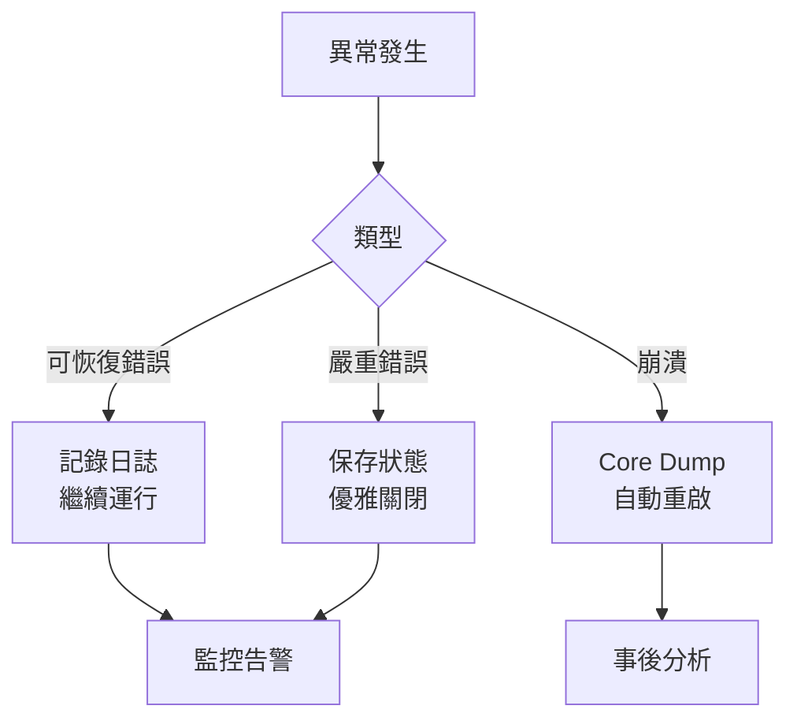

# 信號處理與異常安全 (Signal Handling & Exception Safety)

信號是 Linux 系統中異步事件通知機制。正確處理信號對 HFT 系統的穩定性和優雅關閉至關重要。

---

## 1. 信號基礎

### 1.1 常用信號

| 信號 | 值 | 預設行為 | 說明 | HFT 應用 |
|-----|---|---------|------|---------|
| `SIGINT` | 2 | 終止 | Ctrl+C | 手動停止系統 |
| `SIGTERM` | 15 | 終止 | kill 預設 | 優雅關閉 |
| `SIGKILL` | 9 | 終止 | 強制終止 | 無法捕獲 |
| `SIGSEGV` | 11 | Core dump | 段錯誤 | 程式錯誤 |
| `SIGPIPE` | 13 | 終止 | 管道破裂 | Socket 斷開 |
| `SIGALRM` | 14 | 終止 | 定時器 | 超時處理 |
| `SIGUSR1/2` | 10/12 | 終止 | 使用者自定 | 重載配置 |

### 1.2 信號處理函數

```cpp
#include <signal.h>
#include <iostream>
#include <atomic>

// 全域標誌 (必須是 sig_atomic_t 或 atomic)
std::atomic<bool> g_shutdown{false};

// 信號處理器 (async-signal-safe)
void signal_handler(int signum) {
    if (signum == SIGINT || signum == SIGTERM) {
        g_shutdown.store(true, std::memory_order_release);
    }
}

void example_basic_signal() {
    // 註冊信號處理器
    signal(SIGINT, signal_handler);
    signal(SIGTERM, signal_handler);
    
    std::cout << "程式運行中,按 Ctrl+C 停止...\n";
    
    while (!g_shutdown.load(std::memory_order_acquire)) {
        // 主循環
        std::this_thread::sleep_for(std::chrono::seconds(1));
    }
    
    std::cout << "收到停止信號,優雅關閉\n";
}
```

---

## 2. async-signal-safe 函數

### 2.1 什麼是 async-signal-safe?

信號處理器可能在**任何時刻**中斷程式執行,因此只能呼叫**可重入**的函數。

**不安全的操作** (禁止在信號處理器中使用):
- `malloc()` / `free()` (可能死鎖)
- `printf()` / `std::cout` (使用緩衝區鎖)
- 大部分 C++ 標準庫函數

**安全的操作**:
- 原子操作 (`std::atomic`)
- `write()` 系統調用
- `_exit()` (不是 `exit()`)

```cpp
// 錯誤範例 ❌
void bad_signal_handler(int signum) {
    std::cout << "收到信號 " << signum << "\n";  // 不安全!
    std::string msg = "停止中...";  // 不安全!
}

// 正確範例 ✅
void safe_signal_handler(int signum) {
    const char msg[] = "Caught signal\n";
    write(STDERR_FILENO, msg, sizeof(msg) - 1);  // 安全
    
    g_shutdown.store(true, std::memory_order_relaxed);  // 安全
}
```

---

## 3. sigaction - 現代信號處理

### 3.1 sigaction vs signal

`sigaction` 提供更強大和可預測的信號處理:

```cpp
#include <signal.h>
#include <cstring>

class SignalHandler {
public:
    using HandlerFunc = void(*)(int, siginfo_t*, void*);
    
    // 註冊信號處理器
    static bool register_handler(int signum, HandlerFunc handler) {
        struct sigaction sa;
        std::memset(&sa, 0, sizeof(sa));
        
        sa.sa_sigaction = handler;
        sa.sa_flags = SA_SIGINFO;  // 使用 sa_sigaction
        sigemptyset(&sa.sa_mask);
        
        return sigaction(signum, &sa, nullptr) == 0;
    }
    
    // 阻塞信號
    static bool block_signal(int signum) {
        sigset_t set;
        sigemptyset(&set);
        sigaddset(&set, signum);
        return sigprocmask(SIG_BLOCK, &set, nullptr) == 0;
    }
    
    // 解除阻塞
    static bool unblock_signal(int signum) {
        sigset_t set;
        sigemptyset(&set);
        sigaddset(&set, signum);
        return sigprocmask(SIG_UNBLOCK, &set, nullptr) == 0;
    }
};

// 詳細的信號處理器
void detailed_handler(int signum, siginfo_t* info, void* context) {
    const char* sig_name = "UNKNOWN";
    if (signum == SIGINT) sig_name = "SIGINT";
    else if (signum == SIGTERM) sig_name = "SIGTERM";
    
    char buffer[128];
    int len = snprintf(buffer, sizeof(buffer), 
                       "Received %s from PID %d\n", 
                       sig_name, info->si_pid);
    write(STDERR_FILENO, buffer, len);
    
    g_shutdown.store(true);
}
```

---

## 4. signalfd - 同步信號處理

### 4.1 將信號轉為檔案描述符

`signalfd` 允許將信號轉換為檔案描述符,可用於 `epoll`:

```cpp
#include <sys/signalfd.h>
#include <signal.h>
#include <unistd.h>

class SignalFD {
    int sfd_;
    
public:
    SignalFD() : sfd_(-1) {}
    
    bool init(const std::vector<int>& signals) {
        // 阻塞這些信號 (避免預設處理)
        sigset_t mask;
        sigemptyset(&mask);
        for (int sig : signals) {
            sigaddset(&mask, sig);
        }
        sigprocmask(SIG_BLOCK, &mask, nullptr);
        
        // 建立 signalfd
        sfd_ = signalfd(-1, &mask, SFD_NONBLOCK | SFD_CLOEXEC);
        return sfd_ >= 0;
    }
    
    // 讀取信號 (非阻塞)
    bool read_signal(int& signum) {
        struct signalfd_siginfo si;
        ssize_t n = read(sfd_, &si, sizeof(si));
        
        if (n == sizeof(si)) {
            signum = si.ssi_signo;
            return true;
        }
        return false;
    }
    
    int fd() const { return sfd_; }
    
    ~SignalFD() {
        if (sfd_ >= 0) close(sfd_);
    }
};

// 使用範例: 與 epoll 整合
void example_signalfd_epoll() {
    SignalFD sigfd;
    sigfd.init({SIGINT, SIGTERM});
    
    int epfd = epoll_create1(0);
    
    struct epoll_event ev;
    ev.events = EPOLLIN;
    ev.data.fd = sigfd.fd();
    epoll_ctl(epfd, EPOLL_CTL_ADD, sigfd.fd(), &ev);
    
    std::cout << "等待信號 (可與其他 I/O 一起處理)...\n";
    
    while (true) {
        struct epoll_event events[10];
        int nfds = epoll_wait(epfd, events, 10, -1);
        
        for (int i = 0; i < nfds; ++i) {
            if (events[i].data.fd == sigfd.fd()) {
                int signum;
                if (sigfd.read_signal(signum)) {
                    std::cout << "收到信號: " << signum << "\n";
                    if (signum == SIGINT || signum == SIGTERM) {
                        goto cleanup;
                    }
                }
            }
        }
    }
    
cleanup:
    close(epfd);
    std::cout << "優雅關閉\n";
}
```

---

## 5. HFT 實戰: 優雅關閉

### 5.1 多執行緒優雅關閉

```cpp
#include <thread>
#include <vector>
#include <atomic>

class GracefulShutdown {
    std::atomic<bool> shutdown_{false};
    std::vector<std::thread> threads_;
    
public:
    void initialize() {
        // 阻塞所有執行緒的信號
        sigset_t mask;
        sigfillset(&mask);
        pthread_sigmask(SIG_BLOCK, &mask, nullptr);
        
        // 啟動工作執行緒
        for (int i = 0; i < 4; ++i) {
            threads_.emplace_back([this, i]() {
                this->worker_thread(i);
            });
        }
        
        // 主執行緒處理信號
        signal_handler_thread();
    }
    
private:
    void worker_thread(int id) {
        std::cout << "Worker " << id << " 啟動\n";
        
        while (!shutdown_.load(std::memory_order_acquire)) {
            // 處理任務...
            std::this_thread::sleep_for(std::chrono::milliseconds(100));
        }
        
        std::cout << "Worker " << id << " 關閉\n";
    }
    
    void signal_handler_thread() {
        // 只在主執行緒處理信號
        sigset_t mask;
        sigemptyset(&mask);
        sigaddset(&mask, SIGINT);
        sigaddset(&mask, SIGTERM);
        
        int sig;
        sigwait(&mask, &sig);  // 阻塞等待信號
        
        std::cout << "\n收到停止信號,關閉中...\n";
        shutdown_.store(true, std::memory_order_release);
        
        // 等待所有工作執行緒結束
        for (auto& t : threads_) {
            if (t.joinable()) t.join();
        }
        
        std::cout << "所有執行緒已關閉\n";
    }
};
```

---

## 6. Core Dump 分析

### 6.1 啟用 Core Dump

```bash
# 設定 core dump 大小限制
ulimit -c unlimited

# 設定 core dump 檔案格式
echo "core.%e.%p.%t" | sudo tee /proc/sys/kernel/core_pattern
# %e: 執行檔名稱
# %p: PID
# %t: 時間戳

# 執行程式
./my_hft_program
# 若崩潰,會生成 core.my_hft_program.12345.1234567890
```

### 6.2 使用 GDB 分析 Core Dump

```bash
# 載入 core dump
gdb ./my_hft_program core.my_hft_program.12345.1234567890

# GDB 命令
(gdb) bt           # 查看堆疊追蹤
(gdb) info threads # 查看所有執行緒
(gdb) thread 2     # 切換到執行緒 2
(gdb) frame 3      # 切換到堆疊幀 3
(gdb) print var    # 查看變數值
(gdb) info locals  # 查看區域變數
```

### 6.3 自動化 Core Dump 處理

```cpp
#include <sys/resource.h>
#include <execinfo.h>

class CrashHandler {
public:
    static void initialize() {
        // 啟用 core dump
        struct rlimit rl;
        rl.rlim_cur = RLIM_INFINITY;
        rl.rlim_max = RLIM_INFINITY;
        setrlimit(RLIMIT_CORE, &rl);
        
        // 註冊崩潰處理器
        signal(SIGSEGV, crash_signal_handler);
        signal(SIGABRT, crash_signal_handler);
        signal(SIGFPE, crash_signal_handler);
    }
    
private:
    static void crash_signal_handler(int sig) {
        const char* sig_name = "UNKNOWN";
        if (sig == SIGSEGV) sig_name = "SIGSEGV";
        else if (sig == SIGABRT) sig_name = "SIGABRT";
        else if (sig == SIGFPE) sig_name = "SIGFPE";
        
        // 打印堆疊追蹤
        void* buffer[100];
        int nptrs = backtrace(buffer, 100);
        
        char msg[256];
        int len = snprintf(msg, sizeof(msg), "\n*** Crash: %s ***\n", sig_name);
        write(STDERR_FILENO, msg, len);
        
        backtrace_symbols_fd(buffer, nptrs, STDERR_FILENO);
        
        // 生成 core dump
        signal(sig, SIG_DFL);
        raise(sig);
    }
};
```

---

## 7. 生產環境異常處理策略

### 7.1 分層錯誤處理



### 7.2 完整錯誤處理框架

```cpp
class ProductionErrorHandler {
public:
    enum class ErrorLevel {
        WARNING,   // 可恢復,記錄日誌
        ERROR,     // 嚴重,觸發告警
        FATAL      // 致命,需要關閉
    };
    
    static void handle_error(ErrorLevel level, 
                            const std::string& msg,
                            const std::string& component) {
        switch (level) {
        case ErrorLevel::WARNING:
            log_warning(component, msg);
            metrics_increment("warnings");
            break;
            
        case ErrorLevel::ERROR:
            log_error(component, msg);
            metrics_increment("errors");
            send_alert(component, msg);
            break;
            
        case ErrorLevel::FATAL:
            log_fatal(component, msg);
            dump_system_state();
            initiate_graceful_shutdown();
            break;
        }
    }
    
private:
    static void log_warning(const std::string& comp, const std::string& msg) {
        // 寫入日誌
    }
    
    static void send_alert(const std::string& comp, const std::string& msg) {
        // 發送告警到監控系統
    }
    
    static void dump_system_state() {
        // 保存當前狀態: Order Book, 持倉, 訂單狀態等
    }
    
    static void initiate_graceful_shutdown() {
        // 觸發優雅關閉流程
    }
};
```

---

## 參考資料

1. **Linux 手冊**
   - `man 7 signal` - 信號概覽
   - `man 2 sigaction` - 信號處理
   - `man 2 signalfd` - signalfd

2. **書籍**
   - 《The Linux Programming Interface》 Chapter 20-22
   - 《Advanced Programming in the UNIX Environment》 Chapter 10

3. **工具**
   - [GDB Documentation](https://sourceware.org/gdb/current/onlinedocs/gdb/)
   - [Core Dump Analysis](https://www.brendangregg.com/blog/2016-08-09/gdb-example-ncurses.html)
