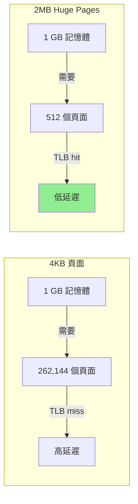
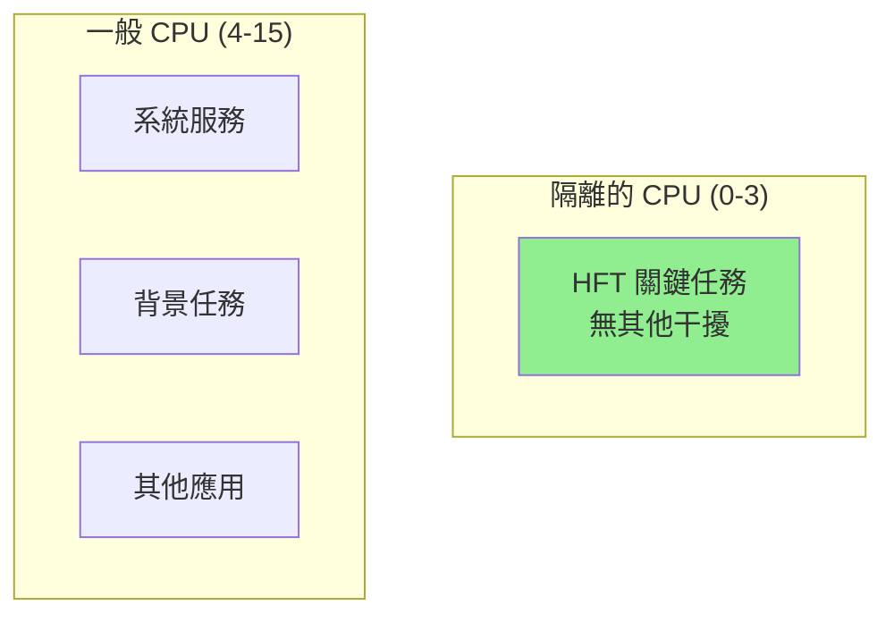

# Linux 特定優化技術

本章涵蓋 Linux 特有的高級優化技術,包括 Huge Pages、CPU 隔離、IRQ 親和性等,這些技術可將 HFT 系統延遲降低至極限。

---

## 1. Huge Pages (大頁面)

### 1.1 為什麼需要 Huge Pages?

**問題**: 預設 4KB 頁面導致 TLB miss 頻繁:
- x86-64 TLB 容量: ~1536 entries (L1) + 1536 entries (L2)
- 4KB 頁面可覆蓋: ~12 MB 記憶體
- HFT 應用常用數 GB 記憶體,TLB miss 率高

**解決方案**: 使用 2MB 或 1GB Huge Pages:
- 2MB 頁面: TLB 可覆蓋 ~6 GB
- 1GB 頁面: TLB 可覆蓋 ~3 TB



### 1.2 配置 Huge Pages

```bash
# 查看當前配置
cat /proc/meminfo | grep Huge

# 配置 2MB Huge Pages (預留 1024 個 = 2 GB)
echo 1024 | sudo tee /proc/sys/vm/nr_hugepages

# 永久配置 (編輯 /etc/sysctl.conf)
vm.nr_hugepages = 1024

# 配置 1GB Huge Pages (需要核心參數)
# 在 GRUB 配置中添加:
# GRUB_CMDLINE_LINUX="default_hugepagesz=1G hugepagesz=1G hugepages=4"

# 掛載 hugetlbfs
sudo mkdir /mnt/huge
sudo mount -t hugetlbfs none /mnt/huge
```

### 1.3 使用 Huge Pages

```cpp
#include <sys/mman.h>
#include <fcntl.h>
#include <cstring>

class HugePageAllocator {
public:
    // 使用 2MB Huge Pages (mmap)
    static void* alloc_2mb(size_t size) {
        void* addr = mmap(nullptr, size, 
                         PROT_READ | PROT_WRITE,
                         MAP_PRIVATE | MAP_ANONYMOUS | MAP_HUGETLB | MAP_HUGE_2MB,
                         -1, 0);
        
        if (addr == MAP_FAILED) {
            perror("mmap huge pages");
            return nullptr;
        }
        
        // 觸碰所有頁面 (預先分配)
        memset(addr, 0, size);
        
        return addr;
    }
    
    // 使用 1GB Huge Pages
    static void* alloc_1gb(size_t size) {
        void* addr = mmap(nullptr, size, 
                         PROT_READ | PROT_WRITE,
                         MAP_PRIVATE | MAP_ANONYMOUS | MAP_HUGETLB | MAP_HUGE_1GB,
                         -1, 0);
        
        if (addr == MAP_FAILED) {
            perror("mmap 1GB huge pages");
            return nullptr;
        }
        
        memset(addr, 0, size);
        return addr;
    }
    
    static void free_huge(void* addr, size_t size) {
        munmap(addr, size);
    }
};

// 效能測試
void benchmark_huge_pages() {
    constexpr size_t SIZE = 1024 * 1024 * 1024;  // 1 GB
    constexpr int ITERATIONS = 100;
    
    auto test_access = [](void* data, const char* desc) {
        auto start = std::chrono::high_resolution_clock::now();
        
        volatile long long sum = 0;
        for (int iter = 0; iter < ITERATIONS; ++iter) {
            long long* ptr = static_cast<long long*>(data);
            for (size_t i = 0; i < SIZE / sizeof(long long); i += 512) {
                sum += ptr[i];  // 隨機存取
            }
        }
        
        auto end = std::chrono::high_resolution_clock::now();
        auto duration = std::chrono::duration_cast<std::chrono::milliseconds>(
            end - start);
        
        std::cout << desc << ": " << duration.count() << " ms\n";
    };
    
    // 測試 1: 標準 4KB 頁面
    void* normal = mmap(nullptr, SIZE, PROT_READ | PROT_WRITE,
                       MAP_PRIVATE | MAP_ANONYMOUS, -1, 0);
    memset(normal, 0, SIZE);
    test_access(normal, "4KB 頁面");
    munmap(normal, SIZE);
    
    // 測試 2: 2MB Huge Pages
    void* huge_2mb = HugePageAllocator::alloc_2mb(SIZE);
    if (huge_2mb) {
        test_access(huge_2mb, "2MB Huge Pages");
        HugePageAllocator::free_huge(huge_2mb, SIZE);
    }
}

/* 輸出範例:
4KB 頁面: 850 ms
2MB Huge Pages: 620 ms
性能提升: ~27%
*/
```

### 1.4 Transparent Huge Pages (THP)

THP 由核心自動管理,但可能導致延遲抖動:

```bash
# 查看 THP 狀態
cat /sys/kernel/mm/transparent_hugepage/enabled

# 關閉 THP (HFT 推薦)
echo never | sudo tee /sys/kernel/mm/transparent_hugepage/enabled
echo never | sudo tee /sys/kernel/mm/transparent_hugepage/defrag

# 為什麼關閉?
# - THP 整理 (compaction) 會導致延遲峰值
# - HFT 應使用明確配置的 Huge Pages
```

---

## 2. CPU 隔離 (CPU Isolation)

### 2.1 isolcpus 參數

將特定 CPU 核心從調度器中隔離,專供關鍵應用使用:

```bash
# 編輯 /etc/default/grub
GRUB_CMDLINE_LINUX="isolcpus=0-3 nohz_full=0-3 rcu_nocbs=0-3"

# 更新 GRUB
sudo update-grub
sudo reboot

# 參數說明:
# - isolcpus=0-3: 隔離 CPU 0-3,調度器不會自動調度任務到這些核心
# - nohz_full=0-3: 關閉這些核心的定時器中斷 (tickless)
# - rcu_nocbs=0-3: RCU 回調在其他核心執行
```

**效果**:


### 2.2 驗證 CPU 隔離

```cpp
void verify_cpu_isolation() {
    // 綁定到隔離的 CPU
    cpu_set_t cpuset;
    CPU_ZERO(&cpuset);
    CPU_SET(0, &cpuset);  // 隔離的 CPU 0
    sched_setaffinity(0, sizeof(cpuset), &cpuset);
    
    std::cout << "運行在 CPU: " << sched_getcpu() << "\n";
    
    // 檢查是否有其他任務在此 CPU 上
    system("ps -eLo psr,comm | grep '^ 0' | head -20");
}
```

---

## 3. IRQ 親和性 (IRQ Affinity)

### 3.1 中斷處理優化

將網卡中斷綁定到特定 CPU,避免影響關鍵 CPU:

```bash
# 查看中斷分佈
cat /proc/interrupts

# 查看網卡中斷號
grep eth0 /proc/interrupts
# 輸出範例: 125: 1234567  IR-PCI-MSI-edge  eth0-TxRx-0

# 設定中斷親和性 (綁定到 CPU 4)
echo 10 | sudo tee /proc/irq/125/smp_affinity
# 10 = 0x10 = 二進制 0b10000 = CPU 4

# 或使用 CPU 遮罩工具
sudo irqbalance --oneshot
sudo systemctl stop irqbalance  # 停止自動平衡
```

### 3.2 多佇列網卡配置

```bash
# 查看網卡佇列
ethtool -l eth0

# 設定接收佇列數量
ethtool -L eth0 combined 4

# 為每個佇列設定 IRQ 親和性
for i in {0..3}; do
    irq=$(grep "eth0-TxRx-$i" /proc/interrupts | awk '{print $1}' | tr -d ':')
    cpu=$((4 + i))  # CPU 4-7
    mask=$((1 << cpu))
    echo $mask | sudo tee /proc/irq/$irq/smp_affinity
    echo "IRQ $irq -> CPU $cpu"
done
```

### 3.3 C++ 配置 IRQ 親和性

```cpp
#include <fstream>
#include <sstream>

class IRQAffinity {
public:
    // 設定 IRQ 親和性
    static bool set_affinity(int irq_num, int cpu_id) {
        std::ostringstream path;
        path << "/proc/irq/" << irq_num << "/smp_affinity";
        
        std::ofstream ofs(path.str());
        if (!ofs) {
            std::cerr << "無法開啟 " << path.str() << "\n";
            return false;
        }
        
        // 計算 CPU 遮罩 (十六進制)
        unsigned long mask = 1UL << cpu_id;
        ofs << std::hex << mask;
        
        return true;
    }
    
    // 獲取網卡中斷號
    static std::vector<int> get_nic_irqs(const std::string& nic_name) {
        std::vector<int> irqs;
        std::ifstream ifs("/proc/interrupts");
        
        std::string line;
        while (std::getline(ifs, line)) {
            if (line.find(nic_name) != std::string::npos) {
                std::istringstream iss(line);
                int irq;
                if (iss >> irq) {
                    irqs.push_back(irq);
                }
            }
        }
        
        return irqs;
    }
};
```

---

## 4. /proc 與 /sys 調校參數

### 4.1 網路參數優化

```bash
# TCP 優化
sudo sysctl -w net.core.rmem_max=134217728        # 128 MB 接收緩衝
sudo sysctl -w net.core.wmem_max=134217728        # 128 MB 發送緩衝
sudo sysctl -w net.ipv4.tcp_rmem="4096 87380 134217728"
sudo sysctl -w net.ipv4.tcp_wmem="4096 65536 134217728"
sudo sysctl -w net.core.netdev_max_backlog=50000  # 接收佇列長度
sudo sysctl -w net.ipv4.tcp_max_syn_backlog=8192  # SYN 佇列

# UDP 優化
sudo sysctl -w net.core.rmem_default=26214400     # 25 MB
sudo sysctl -w net.core.rmem_max=268435456        # 256 MB
```

### 4.2 調度器參數

```bash
# 減少調度延遲
sudo sysctl -w kernel.sched_min_granularity_ns=1000000    # 1 ms
sudo sysctl -w kernel.sched_wakeup_granularity_ns=500000  # 0.5 ms

# RCU 參數
sudo sysctl -w kernel.rcu_nocb_poll=1
```

### 4.3 記憶體參數

```bash
# 禁用 swap
sudo sysctl -w vm.swappiness=0

# 減少記憶體壓縮
sudo sysctl -w vm.compaction_proactiveness=0

# Huge Pages
sudo sysctl -w vm.nr_hugepages=1024
```

### 4.4 C++ 配置工具

```cpp
class SystemTuning {
public:
    static bool set_sysctl(const std::string& param, const std::string& value) {
        std::ostringstream cmd;
        cmd << "sysctl -w " << param << "=" << value;
        return system(cmd.str().c_str()) == 0;
    }
    
    static void apply_hft_tuning() {
        // 網路優化
        set_sysctl("net.core.rmem_max", "134217728");
        set_sysctl("net.core.wmem_max", "134217728");
        set_sysctl("net.core.netdev_max_backlog", "50000");
        
        // 記憶體優化
        set_sysctl("vm.swappiness", "0");
        set_sysctl("vm.nr_hugepages", "1024");
        
        // 調度優化
        set_sysctl("kernel.sched_min_granularity_ns", "1000000");
        
        std::cout << "系統調校完成\n";
    }
};
```

---

## 5. HFT 系統調校 Checklist

### 5.1 完整調校腳本

```bash
#!/bin/bash
# hft_system_setup.sh - HFT 系統完整調校

echo "=== HFT 系統調校開始 ==="

# 1. CPU 隔離 (需重啟)
# 編輯 /etc/default/grub
# GRUB_CMDLINE_LINUX="isolcpus=0-3 nohz_full=0-3 rcu_nocbs=0-3"

# 2. Huge Pages
echo 1024 | sudo tee /proc/sys/vm/nr_hugepages
echo never | sudo tee /sys/kernel/mm/transparent_hugepage/enabled

# 3. IRQ 親和性
sudo systemctl stop irqbalance
sudo systemctl disable irqbalance

# 網卡中斷綁定到 CPU 4-7
for i in {0..3}; do
    irq=$(grep "eth0-TxRx-$i" /proc/interrupts | awk '{print $1}' | tr -d ':')
    cpu=$((4 + i))
    mask=$((1 << cpu))
    echo $mask | sudo tee /proc/irq/$irq/smp_affinity > /dev/null
    echo "IRQ $irq -> CPU $cpu"
done

# 4. CPU 頻率固定為最高
for cpu in /sys/devices/system/cpu/cpu[0-3]; do
    echo "performance" | sudo tee $cpu/cpufreq/scaling_governor
done

# 5. 網路參數優化
sudo sysctl -w net.core.rmem_max=134217728
sudo sysctl -w net.core.wmem_max=134217728
sudo sysctl -w net.core.netdev_max_backlog=50000
sudo sysctl -w net.ipv4.tcp_max_syn_backlog=8192

# 6. 記憶體優化
sudo sysctl -w vm.swappiness=0
sudo sysctl -w vm.compaction_proactiveness=0

# 7. 調度優化
sudo sysctl -w kernel.sched_min_granularity_ns=1000000
sudo sysctl -w kernel.sched_wakeup_granularity_ns=500000

# 8. 關閉不必要的服務
sudo systemctl stop bluetooth
sudo systemctl stop cups
sudo systemctl disable bluetooth
sudo systemctl disable cups

echo "=== 調校完成! ==="
echo "建議重啟系統使 CPU 隔離生效"
```

### 5.2 驗證腳本

```bash
#!/bin/bash
# verify_hft_setup.sh

echo "=== 驗證 HFT 系統配置 ==="

# 檢查 Huge Pages
echo "1. Huge Pages:"
grep Huge /proc/meminfo | head -4

# 檢查 THP
echo -e "\n2. Transparent Huge Pages:"
cat /sys/kernel/mm/transparent_hugepage/enabled

# 檢查 CPU 隔離
echo -e "\n3. CPU 隔離 (isolcpus):"
cat /proc/cmdline | grep -o "isolcpus=[^ ]*"

# 檢查 IRQ 親和性
echo -e "\n4. 網卡 IRQ 親和性:"
grep eth0 /proc/interrupts | while read line; do
    irq=$(echo $line | awk '{print $1}' | tr -d ':')
    affinity=$(cat /proc/irq/$irq/smp_affinity 2>/dev/null)
    echo "IRQ $irq: CPU mask = $affinity"
done

# 檢查 CPU 頻率
echo -e "\n5. CPU 頻率策略:"
for cpu in 0 1 2 3; do
    gov=$(cat /sys/devices/system/cpu/cpu$cpu/cpufreq/scaling_governor)
    freq=$(cat /sys/devices/system/cpu/cpu$cpu/cpufreq/scaling_cur_freq)
    echo "CPU $cpu: $gov, $(($freq / 1000)) MHz"
done

# 檢查 swap
echo -e "\n6. Swappiness:"
cat /proc/sys/vm/swappiness

echo -e "\n=== 驗證完成 ==="
```

---

## 6. 效能測量

### 6.1 延遲測試

```cpp
void benchmark_optimizations() {
    constexpr int ITERATIONS = 1000000;
    std::vector<uint64_t> latencies;
    latencies.reserve(ITERATIONS);
    
    // 使用 Huge Pages 分配測試數據
    constexpr size_t SIZE = 1024 * 1024 * 100;  // 100 MB
    void* data = HugePageAllocator::alloc_2mb(SIZE);
    memset(data, 0, SIZE);
    
    for (int i = 0; i < ITERATIONS; ++i) {
        auto start = std::chrono::high_resolution_clock::now();
        
        // 模擬市場數據處理
        volatile long long sum = 0;
        long long* ptr = static_cast<long long*>(data);
        for (int j = 0; j < 100; j += 8) {
            sum += ptr[j];
        }
        
        auto end = std::chrono::high_resolution_clock::now();
        auto latency = std::chrono::duration_cast<std::chrono::nanoseconds>(
            end - start).count();
        
        latencies.push_back(latency);
    }
    
    // 統計
    std::sort(latencies.begin(), latencies.end());
    std::cout << "延遲統計 (ns):\n"
              << "  P50:  " << latencies[ITERATIONS * 50 / 100] << "\n"
              << "  P99:  " << latencies[ITERATIONS * 99 / 100] << "\n"
              << "  P99.9:" << latencies[ITERATIONS * 999 / 1000] << "\n"
              << "  Max:  " << latencies.back() << "\n";
    
    HugePageAllocator::free_huge(data, SIZE);
}

/* 輸出範例:
優化前:
  P50:  250 ns
  P99:  1500 ns
  P99.9:5000 ns
  Max:  85000 ns

優化後:
  P50:  180 ns
  P99:  450 ns
  P99.9:980 ns
  Max:  2500 ns
*/
```

---

## 參考資料

1. **Linux 核心文件**
   - [Huge Pages](https://www.kernel.org/doc/Documentation/vm/hugetlbpage.txt)
   - [CPU Isolation](https://www.kernel.org/doc/html/latest/admin-guide/kernel-parameters.html)

2. **效能調校指南**
   - [Red Hat Performance Tuning Guide](https://access.redhat.com/documentation/en-us/red_hat_enterprise_linux/8/html/monitoring_and_managing_system_status_and_performance/)
   - [Brendan Gregg's Linux Performance](https://www.brendangregg.com/linuxperf.html)

3. **HFT 最佳實踐**
   - [Low Latency Tuning Guide](https://rigtorp.se/low-latency-guide/)
