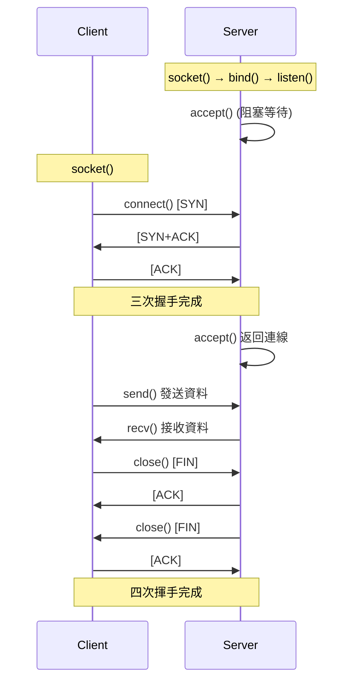

# TCP/UDP 基礎 (TCP/UDP Fundamentals)

## 概述

TCP 與 UDP 是傳輸層的核心協議,是網路編程的基礎。本章涵蓋 Socket API、TCP/UDP 協議特性、基本網路編程模式,為 HFT 系統網路層打下基礎。

## Socket API 基礎

### Socket 概念

Socket 是應用層與傳輸層的介面,抽象了網路通訊細節:

```
應用層程式
    ↕ Socket API (read/write)
傳輸層 (TCP/UDP)
    ↕
網路層 (IP)
    ↕
網卡 (NIC)
```

**Socket 類型**:
- `SOCK_STREAM`: TCP (可靠、有序、面向連線)
- `SOCK_DGRAM`: UDP (不可靠、無序、無連線)
- `SOCK_RAW`: 原始 Socket (自訂協議)

### TCP Socket 建立流程



## TCP 客戶端實作

### 基本 TCP Client

```cpp
#include <sys/socket.h>
#include <netinet/in.h>
#include <arpa/inet.h>
#include <unistd.h>
#include <cstring>
#include <stdexcept>
#include <string>
#include <iostream>

class TCPClient {
    int sockfd_;
    
public:
    TCPClient() : sockfd_(-1) {}
    
    ~TCPClient() {
        if (sockfd_ >= 0) {
            close(sockfd_);
        }
    }
    
    // 連線到伺服器
    void connect(const std::string& host, uint16_t port) {
        // 1. 建立 socket
        sockfd_ = socket(AF_INET, SOCK_STREAM, 0);
        if (sockfd_ < 0) {
            throw std::runtime_error("socket() failed");
        }
        
        // 2. 設定伺服器位址
        sockaddr_in server_addr{};
        server_addr.sin_family = AF_INET;
        server_addr.sin_port = htons(port);
        
        if (inet_pton(AF_INET, host.c_str(), &server_addr.sin_addr) <= 0) {
            close(sockfd_);
            throw std::runtime_error("inet_pton() failed - invalid address");
        }
        
        // 3. 連線 (三次握手)
        if (::connect(sockfd_, (sockaddr*)&server_addr, sizeof(server_addr)) < 0) {
            close(sockfd_);
            throw std::runtime_error("connect() failed");
        }
        
        std::cout << "Connected to " << host << ":" << port << "\n";
    }
    
    // 發送資料
    ssize_t send(const void* data, size_t len) {
        ssize_t total_sent = 0;
        
        while (total_sent < len) {
            ssize_t sent = ::send(sockfd_, 
                                 static_cast<const char*>(data) + total_sent,
                                 len - total_sent, 0);
            
            if (sent < 0) {
                throw std::runtime_error("send() failed");
            }
            
            total_sent += sent;
        }
        
        return total_sent;
    }
    
    // 接收資料
    ssize_t receive(void* buffer, size_t len) {
        ssize_t received = ::recv(sockfd_, buffer, len, 0);
        
        if (received < 0) {
            throw std::runtime_error("recv() failed");
        } else if (received == 0) {
            // 對方關閉連線
            return 0;
        }
        
        return received;
    }
    
    int get_fd() const { return sockfd_; }
};

// 使用範例
void tcp_client_example() {
    TCPClient client;
    
    try {
        client.connect("127.0.0.1", 8080);
        
        // 發送請求
        std::string request = "GET / HTTP/1.1\r\nHost: localhost\r\n\r\n";
        client.send(request.data(), request.size());
        
        // 接收回應
        char buffer[4096];
        ssize_t n = client.receive(buffer, sizeof(buffer) - 1);
        
        if (n > 0) {
            buffer[n] = '\0';
            std::cout << "Received:\n" << buffer << "\n";
        }
        
    } catch (const std::exception& e) {
        std::cerr << "Error: " << e.what() << "\n";
    }
}
```

## TCP 伺服器實作

### 基本 TCP Server

```cpp
#include <sys/socket.h>
#include <netinet/in.h>
#include <unistd.h>
#include <cstring>
#include <stdexcept>
#include <iostream>

class TCPServer {
    int listen_fd_;
    
public:
    TCPServer() : listen_fd_(-1) {}
    
    ~TCPServer() {
        if (listen_fd_ >= 0) {
            close(listen_fd_);
        }
    }
    
    // 啟動伺服器
    void start(uint16_t port, int backlog = 128) {
        // 1. 建立 socket
        listen_fd_ = socket(AF_INET, SOCK_STREAM, 0);
        if (listen_fd_ < 0) {
            throw std::runtime_error("socket() failed");
        }
        
        // 2. 設定 socket 選項
        int optval = 1;
        
        // SO_REUSEADDR: 允許重用 TIME_WAIT 狀態的埠
        if (setsockopt(listen_fd_, SOL_SOCKET, SO_REUSEADDR, 
                      &optval, sizeof(optval)) < 0) {
            close(listen_fd_);
            throw std::runtime_error("setsockopt(SO_REUSEADDR) failed");
        }
        
        // SO_REUSEPORT: 允許多程序綁定同一埠 (Linux 3.9+)
        setsockopt(listen_fd_, SOL_SOCKET, SO_REUSEPORT, 
                  &optval, sizeof(optval));
        
        // 3. 綁定位址
        sockaddr_in server_addr{};
        server_addr.sin_family = AF_INET;
        server_addr.sin_addr.s_addr = INADDR_ANY;  // 0.0.0.0
        server_addr.sin_port = htons(port);
        
        if (bind(listen_fd_, (sockaddr*)&server_addr, sizeof(server_addr)) < 0) {
            close(listen_fd_);
            throw std::runtime_error("bind() failed");
        }
        
        // 4. 監聽
        if (listen(listen_fd_, backlog) < 0) {
            close(listen_fd_);
            throw std::runtime_error("listen() failed");
        }
        
        std::cout << "Server listening on port " << port 
                  << " (backlog=" << backlog << ")\n";
    }
    
    // 接受連線
    int accept_connection() {
        sockaddr_in client_addr{};
        socklen_t addr_len = sizeof(client_addr);
        
        int client_fd = accept(listen_fd_, (sockaddr*)&client_addr, &addr_len);
        
        if (client_fd < 0) {
            throw std::runtime_error("accept() failed");
        }
        
        // 取得客戶端資訊
        char client_ip[INET_ADDRSTRLEN];
        inet_ntop(AF_INET, &client_addr.sin_addr, client_ip, sizeof(client_ip));
        
        std::cout << "Accepted connection from " 
                  << client_ip << ":" << ntohs(client_addr.sin_port) << "\n";
        
        return client_fd;
    }
    
    int get_fd() const { return listen_fd_; }
};

// Echo Server 範例
void tcp_echo_server_example() {
    TCPServer server;
    
    try {
        server.start(8080);
        
        while (true) {
            int client_fd = server.accept_connection();
            
            // 簡單的 echo 邏輯
            char buffer[1024];
            ssize_t n = recv(client_fd, buffer, sizeof(buffer), 0);
            
            if (n > 0) {
                send(client_fd, buffer, n, 0);  // Echo 回傳
            }
            
            close(client_fd);
        }
        
    } catch (const std::exception& e) {
        std::cerr << "Error: " << e.what() << "\n";
    }
}
```

### TCP 狀態機

```cpp
// TCP 狀態定義
enum class TCPState {
    CLOSED,
    LISTEN,
    SYN_SENT,
    SYN_RCVD,
    ESTABLISHED,
    FIN_WAIT_1,
    FIN_WAIT_2,
    CLOSE_WAIT,
    CLOSING,
    LAST_ACK,
    TIME_WAIT
};

// TIME_WAIT 狀態持續時間: 2*MSL (Maximum Segment Lifetime)
// Linux 預設 MSL = 60 秒,因此 TIME_WAIT = 120 秒
```

## UDP 編程

### UDP 特性

| 特性 | TCP | UDP |
|------|-----|-----|
| 連線 | 面向連線 | 無連線 |
| 可靠性 | 可靠傳輸 (ACK/重傳) | 不可靠 (無 ACK) |
| 順序 | 有序 | 無序 |
| 流控制 | 有 (滑動視窗) | 無 |
| 擁塞控制 | 有 | 無 |
| 頭部大小 | 20-60 bytes | 8 bytes |
| 延遲 | 較高 (握手/確認) | 低 (無握手) |
| HFT 應用 | 訂單提交、狀態查詢 | 市場資料接收 (Multicast) |

### UDP Server

```cpp
#include <sys/socket.h>
#include <netinet/in.h>
#include <arpa/inet.h>
#include <unistd.h>
#include <cstring>
#include <stdexcept>
#include <iostream>

class UDPServer {
    int sockfd_;
    
public:
    UDPServer() : sockfd_(-1) {}
    
    ~UDPServer() {
        if (sockfd_ >= 0) {
            close(sockfd_);
        }
    }
    
    void start(uint16_t port) {
        // 建立 UDP socket
        sockfd_ = socket(AF_INET, SOCK_DGRAM, 0);
        if (sockfd_ < 0) {
            throw std::runtime_error("socket() failed");
        }
        
        // 設定 SO_REUSEADDR
        int optval = 1;
        setsockopt(sockfd_, SOL_SOCKET, SO_REUSEADDR, &optval, sizeof(optval));
        
        // 綁定位址
        sockaddr_in server_addr{};
        server_addr.sin_family = AF_INET;
        server_addr.sin_addr.s_addr = INADDR_ANY;
        server_addr.sin_port = htons(port);
        
        if (bind(sockfd_, (sockaddr*)&server_addr, sizeof(server_addr)) < 0) {
            close(sockfd_);
            throw std::runtime_error("bind() failed");
        }
        
        std::cout << "UDP server listening on port " << port << "\n";
    }
    
    // 接收資料
    ssize_t receive_from(void* buffer, size_t len, sockaddr_in* src_addr) {
        socklen_t addr_len = sizeof(*src_addr);
        
        ssize_t n = recvfrom(sockfd_, buffer, len, 0,
                            (sockaddr*)src_addr, &addr_len);
        
        if (n < 0) {
            throw std::runtime_error("recvfrom() failed");
        }
        
        return n;
    }
    
    // 發送資料
    ssize_t send_to(const void* buffer, size_t len, const sockaddr_in* dest_addr) {
        ssize_t n = sendto(sockfd_, buffer, len, 0,
                          (sockaddr*)dest_addr, sizeof(*dest_addr));
        
        if (n < 0) {
            throw std::runtime_error("sendto() failed");
        }
        
        return n;
    }
    
    int get_fd() const { return sockfd_; }
};

// UDP Echo Server
void udp_echo_server_example() {
    UDPServer server;
    
    try {
        server.start(9000);
        
        char buffer[65536];  // UDP 最大封包 64KB
        
        while (true) {
            sockaddr_in client_addr{};
            ssize_t n = server.receive_from(buffer, sizeof(buffer), &client_addr);
            
            if (n > 0) {
                // Echo 回傳
                server.send_to(buffer, n, &client_addr);
                
                // 顯示客戶端資訊
                char client_ip[INET_ADDRSTRLEN];
                inet_ntop(AF_INET, &client_addr.sin_addr, client_ip, sizeof(client_ip));
                std::cout << "Echoed " << n << " bytes to " 
                          << client_ip << ":" << ntohs(client_addr.sin_port) << "\n";
            }
        }
        
    } catch (const std::exception& e) {
        std::cerr << "Error: " << e.what() << "\n";
    }
}
```

### UDP Multicast (組播)

```cpp
#include <sys/socket.h>
#include <netinet/in.h>
#include <arpa/inet.h>
#include <unistd.h>
#include <cstring>
#include <stdexcept>
#include <iostream>

class MulticastReceiver {
    int sockfd_;
    
public:
    MulticastReceiver() : sockfd_(-1) {}
    
    ~MulticastReceiver() {
        if (sockfd_ >= 0) {
            close(sockfd_);
        }
    }
    
    // 加入組播群組
    void join(const std::string& group_ip, uint16_t port, 
              const std::string& iface_ip = "0.0.0.0") {
        
        sockfd_ = socket(AF_INET, SOCK_DGRAM, 0);
        if (sockfd_ < 0) {
            throw std::runtime_error("socket() failed");
        }
        
        // 允許多個程序綁定同一埠 (組播必須)
        int optval = 1;
        setsockopt(sockfd_, SOL_SOCKET, SO_REUSEADDR, &optval, sizeof(optval));
        
        // 綁定到組播埠
        sockaddr_in local_addr{};
        local_addr.sin_family = AF_INET;
        local_addr.sin_addr.s_addr = INADDR_ANY;
        local_addr.sin_port = htons(port);
        
        if (bind(sockfd_, (sockaddr*)&local_addr, sizeof(local_addr)) < 0) {
            close(sockfd_);
            throw std::runtime_error("bind() failed");
        }
        
        // 加入組播群組
        ip_mreq mreq{};
        inet_pton(AF_INET, group_ip.c_str(), &mreq.imr_multiaddr);
        inet_pton(AF_INET, iface_ip.c_str(), &mreq.imr_interface);
        
        if (setsockopt(sockfd_, IPPROTO_IP, IP_ADD_MEMBERSHIP, 
                      &mreq, sizeof(mreq)) < 0) {
            close(sockfd_);
            throw std::runtime_error("setsockopt(IP_ADD_MEMBERSHIP) failed");
        }
        
        std::cout << "Joined multicast group " << group_ip 
                  << ":" << port << " on interface " << iface_ip << "\n";
    }
    
    ssize_t receive(void* buffer, size_t len) {
        ssize_t n = recv(sockfd_, buffer, len, 0);
        
        if (n < 0) {
            throw std::runtime_error("recv() failed");
        }
        
        return n;
    }
    
    int get_fd() const { return sockfd_; }
};

// HFT 應用: 接收市場資料 (Multicast)
struct MarketDataPacket {
    uint32_t sequence;
    uint32_t symbol_id;
    double price;
    int64_t volume;
    uint64_t timestamp;
} __attribute__((packed));

void market_data_receiver_example() {
    MulticastReceiver receiver;
    
    try {
        // 加入交易所組播群組
        receiver.join("239.1.1.1", 9001, "192.168.1.100");
        
        char buffer[65536];
        
        while (true) {
            ssize_t n = receiver.receive(buffer, sizeof(buffer));
            
            if (n >= sizeof(MarketDataPacket)) {
                const auto* pkt = reinterpret_cast<const MarketDataPacket*>(buffer);
                
                std::cout << "Market Data: seq=" << pkt->sequence
                          << " symbol=" << pkt->symbol_id
                          << " price=" << pkt->price
                          << " volume=" << pkt->volume << "\n";
                
                // 處理市場資料...
            }
        }
        
    } catch (const std::exception& e) {
        std::cerr << "Error: " << e.what() << "\n";
    }
}
```

## Socket 選項調整

### 常用 Socket 選項

```cpp
#include <sys/socket.h>
#include <netinet/tcp.h>
#include <netinet/in.h>

// TCP 效能優化選項
void optimize_tcp_socket(int sockfd) {
    int optval;
    
    // 1. TCP_NODELAY: 禁用 Nagle 演算法 (HFT 必須)
    optval = 1;
    setsockopt(sockfd, IPPROTO_TCP, TCP_NODELAY, &optval, sizeof(optval));
    
    // 2. SO_RCVBUF: 增大接收緩衝區
    optval = 2 * 1024 * 1024;  // 2 MB
    setsockopt(sockfd, SOL_SOCKET, SO_RCVBUF, &optval, sizeof(optval));
    
    // 3. SO_SNDBUF: 增大發送緩衝區
    optval = 2 * 1024 * 1024;  // 2 MB
    setsockopt(sockfd, SOL_SOCKET, SO_SNDBUF, &optval, sizeof(optval));
    
    // 4. TCP_QUICKACK: 快速 ACK (降低延遲)
    optval = 1;
    setsockopt(sockfd, IPPROTO_TCP, TCP_QUICKACK, &optval, sizeof(optval));
    
    // 5. SO_KEEPALIVE: 保持連線檢測
    optval = 1;
    setsockopt(sockfd, SOL_SOCKET, SO_KEEPALIVE, &optval, sizeof(optval));
    
    // Keepalive 參數調整
    optval = 60;  // 60 秒開始探測
    setsockopt(sockfd, IPPROTO_TCP, TCP_KEEPIDLE, &optval, sizeof(optval));
    
    optval = 10;  // 探測間隔 10 秒
    setsockopt(sockfd, IPPROTO_TCP, TCP_KEEPINTVL, &optval, sizeof(optval));
    
    optval = 3;   // 探測次數 3 次
    setsockopt(sockfd, IPPROTO_TCP, TCP_KEEPCNT, &optval, sizeof(optval));
}

// UDP 效能優化選項
void optimize_udp_socket(int sockfd) {
    int optval;
    
    // 1. 增大接收緩衝區 (避免丟包)
    optval = 16 * 1024 * 1024;  // 16 MB
    setsockopt(sockfd, SOL_SOCKET, SO_RCVBUF, &optval, sizeof(optval));
    
    // 2. 設定接收超時 (可選)
    timeval tv{};
    tv.tv_sec = 1;
    tv.tv_usec = 0;
    setsockopt(sockfd, SOL_SOCKET, SO_RCVTIMEO, &tv, sizeof(tv));
    
    // 3. 設定 TOS (Type of Service) - 最低延遲
    optval = IPTOS_LOWDELAY;
    setsockopt(sockfd, IPPROTO_IP, IP_TOS, &optval, sizeof(optval));
}
```

### Socket 選項查詢

```cpp
#include <iostream>

void print_socket_info(int sockfd) {
    int optval;
    socklen_t optlen = sizeof(optval);
    
    // 查詢接收緩衝區大小
    getsockopt(sockfd, SOL_SOCKET, SO_RCVBUF, &optval, &optlen);
    std::cout << "SO_RCVBUF: " << optval << " bytes\n";
    
    // 查詢發送緩衝區大小
    getsockopt(sockfd, SOL_SOCKET, SO_SNDBUF, &optval, &optlen);
    std::cout << "SO_SNDBUF: " << optval << " bytes\n";
    
    // 查詢 TCP_NODELAY
    getsockopt(sockfd, IPPROTO_TCP, TCP_NODELAY, &optval, &optlen);
    std::cout << "TCP_NODELAY: " << (optval ? "enabled" : "disabled") << "\n";
}
```

## 位址轉換工具

### IPv4 位址轉換

```cpp
#include <arpa/inet.h>
#include <iostream>
#include <cstring>

// 字串 → 二進位
void inet_pton_example() {
    const char* ip_str = "192.168.1.100";
    in_addr addr;
    
    if (inet_pton(AF_INET, ip_str, &addr) <= 0) {
        std::cerr << "inet_pton() failed\n";
        return;
    }
    
    std::cout << "Binary: 0x" << std::hex << ntohl(addr.s_addr) << std::dec << "\n";
}

// 二進位 → 字串
void inet_ntop_example() {
    in_addr addr;
    addr.s_addr = htonl(0xC0A80164);  // 192.168.1.100
    
    char ip_str[INET_ADDRSTRLEN];
    if (inet_ntop(AF_INET, &addr, ip_str, sizeof(ip_str)) == nullptr) {
        std::cerr << "inet_ntop() failed\n";
        return;
    }
    
    std::cout << "String: " << ip_str << "\n";
}

// 主機序 ↔ 網路序
void byte_order_example() {
    uint16_t port_host = 8080;
    uint16_t port_network = htons(port_host);
    
    std::cout << "Host order: " << port_host << "\n";
    std::cout << "Network order: 0x" << std::hex << port_network << std::dec << "\n";
    
    uint16_t port_back = ntohs(port_network);
    std::cout << "Back to host: " << port_back << "\n";
}
```

## 錯誤處理

### 常見錯誤碼

```cpp
#include <errno.h>
#include <cstring>
#include <iostream>

void handle_socket_error() {
    switch (errno) {
        case EAGAIN:
        case EWOULDBLOCK:
            // 非阻塞 I/O,無資料可用
            std::cout << "No data available (non-blocking)\n";
            break;
            
        case EINTR:
            // 系統調用被信號中斷
            std::cout << "Interrupted by signal\n";
            break;
            
        case ECONNRESET:
            // 連線被對方重置
            std::cout << "Connection reset by peer\n";
            break;
            
        case EPIPE:
            // 對方已關閉連線
            std::cout << "Broken pipe (peer closed)\n";
            break;
            
        case ETIMEDOUT:
            // 連線逾時
            std::cout << "Connection timed out\n";
            break;
            
        case ECONNREFUSED:
            // 連線被拒絕
            std::cout << "Connection refused\n";
            break;
            
        default:
            std::cout << "Error: " << strerror(errno) << "\n";
            break;
    }
}
```

## HFT 實戰: 雙向通訊

### FIX 協議 TCP 連線範例

```cpp
#include <sys/socket.h>
#include <netinet/in.h>
#include <netinet/tcp.h>
#include <arpa/inet.h>
#include <unistd.h>
#include <cstring>
#include <string>
#include <iostream>

class FIXConnection {
    int sockfd_;
    std::string buffer_;
    
public:
    FIXConnection() : sockfd_(-1) {}
    
    ~FIXConnection() {
        if (sockfd_ >= 0) {
            close(sockfd_);
        }
    }
    
    void connect(const std::string& host, uint16_t port) {
        sockfd_ = socket(AF_INET, SOCK_STREAM, 0);
        if (sockfd_ < 0) {
            throw std::runtime_error("socket() failed");
        }
        
        // TCP_NODELAY: HFT 必須禁用 Nagle
        int optval = 1;
        setsockopt(sockfd_, IPPROTO_TCP, TCP_NODELAY, &optval, sizeof(optval));
        
        // 增大緩衝區
        optval = 1024 * 1024;
        setsockopt(sockfd_, SOL_SOCKET, SO_RCVBUF, &optval, sizeof(optval));
        setsockopt(sockfd_, SOL_SOCKET, SO_SNDBUF, &optval, sizeof(optval));
        
        // 連線
        sockaddr_in server_addr{};
        server_addr.sin_family = AF_INET;
        server_addr.sin_port = htons(port);
        inet_pton(AF_INET, host.c_str(), &server_addr.sin_addr);
        
        if (::connect(sockfd_, (sockaddr*)&server_addr, sizeof(server_addr)) < 0) {
            close(sockfd_);
            throw std::runtime_error("connect() failed");
        }
    }
    
    void send_order(const std::string& order) {
        // FIX 訊息格式: <TAG>=<VALUE>\x01...
        std::string fix_msg = "8=FIX.4.4\x01" "35=D\x01" + order + "\x01" "10=000\x01";
        
        ssize_t sent = send(sockfd_, fix_msg.data(), fix_msg.size(), 0);
        if (sent != fix_msg.size()) {
            throw std::runtime_error("send() incomplete");
        }
    }
    
    std::string receive_message() {
        char buffer[4096];
        ssize_t n = recv(sockfd_, buffer, sizeof(buffer), 0);
        
        if (n <= 0) {
            throw std::runtime_error("recv() failed or connection closed");
        }
        
        return std::string(buffer, n);
    }
};
```

## 檢查清單

- [ ] TCP 連線設定 `TCP_NODELAY` (禁用 Nagle)
- [ ] 增大 Socket 緩衝區 (`SO_RCVBUF`, `SO_SNDBUF`)
- [ ] UDP 接收端設定大緩衝區避免丟包
- [ ] 使用 `SO_REUSEADDR` 避免 TIME_WAIT 埠佔用
- [ ] Multicast 接收設定正確的網路介面
- [ ] 錯誤處理覆蓋 `EAGAIN`, `EINTR`, `ECONNRESET`
- [ ] 使用 `inet_pton`/`inet_ntop` 而非過時的 `inet_addr`
- [ ] 檢查 `send`/`recv` 返回值 (可能部分發送)
- [ ] TCP 伺服器設定合理的 `backlog` (通常 128+)
- [ ] HFT 系統考慮 UDP Multicast 接收市場資料

---

## 參考資料 (References)

1. Stevens, W. Richard, et al. *Unix Network Programming, Volume 1* (2003)
2. [socket(7) - Linux Manual Page](https://man7.org/linux/man-pages/man7/socket.7.html)
3. [tcp(7) - Linux Manual Page](https://man7.org/linux/man-pages/man7/tcp.7.html)
4. [udp(7) - Linux Manual Page](https://man7.org/linux/man-pages/man7/udp.7.html)
5. [IP Multicast Programming](https://tldp.org/HOWTO/Multicast-HOWTO.html)
6. Kerrisk, Michael. *The Linux Programming Interface* (2010)
