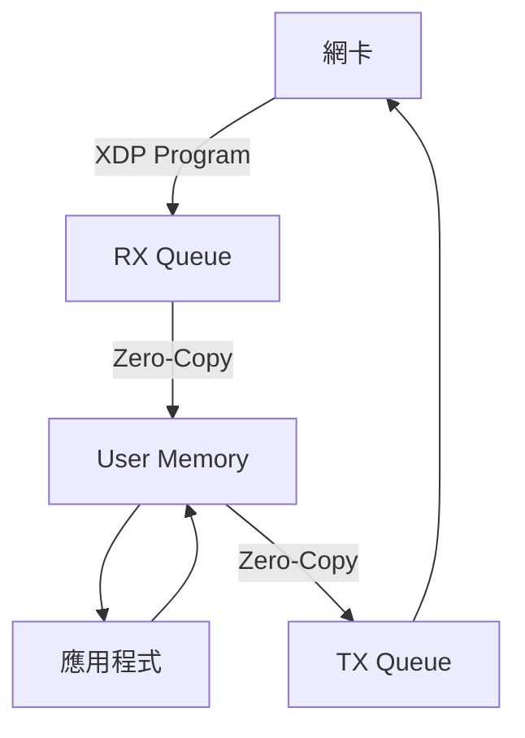
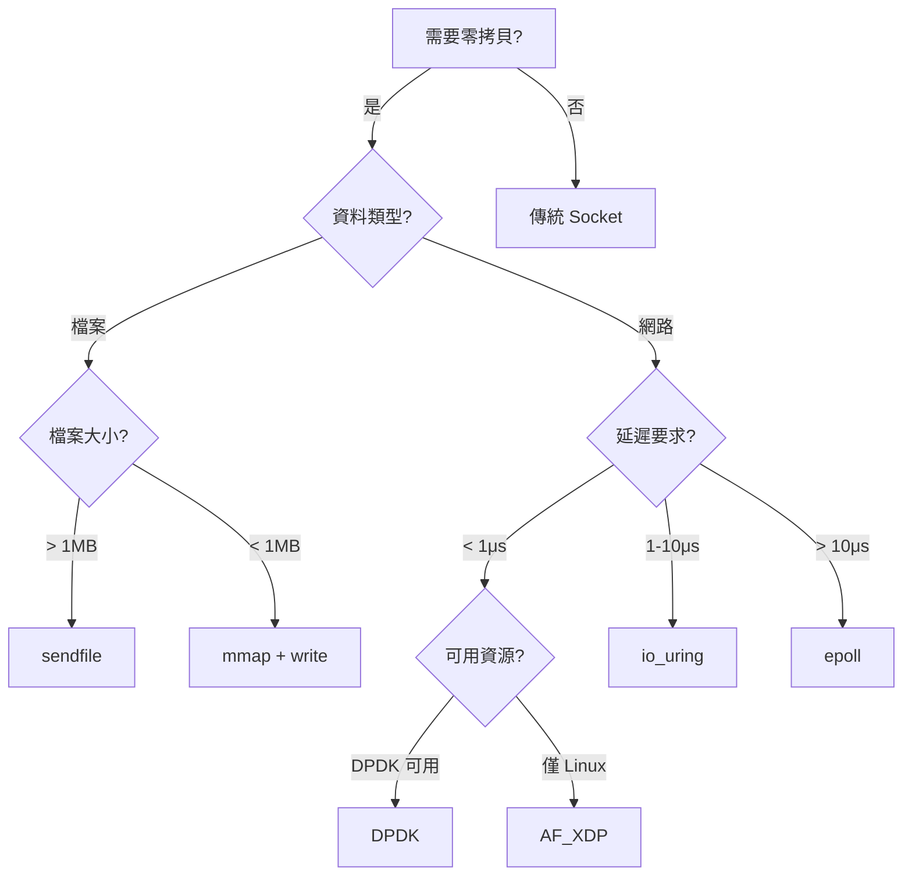

# 零拷貝與內核旁路 (Zero-Copy and Kernel Bypass)

> **優先級**: ⭐⭐⭐ 必看
> **適用場景**: HFT/高性能網路傳輸/資料密集型應用
> **前置知識**: TCP/UDP 基礎、Linux 系統編程

## 目錄

- [核心概念](#核心概念)
- [傳統 I/O 的問題](#傳統-io-的問題)
- [Linux 零拷貝技術](#linux-零拷貝技術)
- [內核旁路: DPDK](#內核旁路-dpdk)
- [AF_XDP: Linux 原生內核旁路](#af_xdp-linux-原生內核旁路)
- [效能對比](#效能對比)
- [HFT 應用實戰](#hft-應用實戰)
- [最佳實踐](#最佳實踐)
- [參考資料](#參考資料)

---

## 核心概念

### 零拷貝 (Zero-Copy)

零拷貝技術透過減少資料在記憶體中的拷貝次數,降低 CPU 開銷與延遲。傳統 I/O 操作涉及多次資料拷貝:

```
傳統讀取檔案並發送到網路:
1. read(file_fd, buffer, size)
   Disk → Kernel Buffer → User Buffer (CPU 拷貝 #1)

2. send(socket_fd, buffer, size)
   User Buffer → Kernel Socket Buffer (CPU 拷貝 #2)
   Kernel Socket Buffer → NIC (DMA 拷貝)

總計: 2 次 CPU 拷貝 + 1 次 DMA 拷貝 + 4 次上下文切換
```

### 內核旁路 (Kernel Bypass)

內核旁路技術讓應用程式直接存取網卡硬體,繞過 Linux 內核網路協定棧,達到微秒級延遲:

```
傳統網路協定棧:
Application → System Call → Kernel TCP/IP Stack → Driver → NIC

內核旁路 (DPDK/AF_XDP):
Application (Poll Mode Driver) → NIC (直接記憶體映射)

優勢:
- 無系統調用開銷
- 無上下文切換
- 零拷貝 (DMA 直達 user space)
- 批次處理 (batch processing)
```

---

## 傳統 I/O 的問題

### 上下文切換開銷

```cpp
// 每次系統調用都涉及上下文切換
char buffer[4096];

// User Mode → Kernel Mode → User Mode (2 次上下文切換)
ssize_t n = read(fd, buffer, sizeof(buffer));

// User Mode → Kernel Mode → User Mode (2 次上下文切換)
send(sockfd, buffer, n);

// HFT 系統中,單次系統調用可能耗時 > 1 μs
```

### 記憶體拷貝開銷


**問題分析**:
- CPU 拷貝浪費 CPU 週期
- Cache 污染 (資料進出 Cache)
- 延遲累積 (每次拷貝 ~100-500 ns)

---

## Linux 零拷貝技術

### 1. sendfile() - 檔案到 Socket

**機制**: 資料直接從檔案頁快取 (Page Cache) 傳輸到 Socket 緩衝區,無需經過用戶空間。

```cpp
#include <sys/sendfile.h>
#include <sys/stat.h>
#include <fcntl.h>
#include <unistd.h>

// 零拷貝傳輸檔案
class ZeroCopyFileServer {
public:
    void serve_file(int client_sockfd, const char* filepath) {
        int filefd = open(filepath, O_RDONLY);
        if (filefd < 0) {
            throw std::runtime_error("open() failed");
        }
        
        // 取得檔案大小
        struct stat st;
        fstat(filefd, &st);
        off_t offset = 0;
        
        // 一次系統調用傳輸整個檔案
        // 資料路徑: Disk → Kernel Buffer → NIC (僅 DMA 拷貝)
        ssize_t sent = sendfile(client_sockfd, filefd, &offset, st.st_size);
        
        if (sent < 0) {
            close(filefd);
            throw std::runtime_error("sendfile() failed");
        }
        
        close(filefd);
    }
};

// 應用場景: HTTP/FTP 靜態檔案伺服器
void http_file_server_example() {
    ZeroCopyFileServer server;
    int client_fd = accept_connection();
    
    server.serve_file(client_fd, "/var/www/large_file.bin");
    // 對比傳統方式可節省 30-50% CPU
}
```

**效能提升**:
- CPU 拷貝: 2 次 → 0 次
- 上下文切換: 4 次 → 2 次
- 適用場景: 大檔案傳輸 (> 1MB)

### 2. splice() - 管道間零拷貝

**機制**: 透過管道 (Pipe) 在兩個檔案描述符之間移動資料,無需經過用戶空間。

```cpp
#include <fcntl.h>
#include <unistd.h>

// Socket 到 Socket 零拷貝轉發 (Proxy/Gateway)
class ZeroCopyProxy {
    int pipefd_[2];
    
public:
    ZeroCopyProxy() {
        if (pipe(pipefd_) < 0) {
            throw std::runtime_error("pipe() failed");
        }
    }
    
    ~ZeroCopyProxy() {
        close(pipefd_[0]);
        close(pipefd_[1]);
    }
    
    // 從 in_sockfd 轉發資料到 out_sockfd
    ssize_t forward(int in_sockfd, int out_sockfd, size_t len) {
        // Step 1: in_sockfd → pipe (零拷貝)
        ssize_t bytes = splice(in_sockfd, nullptr, pipefd_[1], nullptr, 
                               len, SPLICE_F_MOVE | SPLICE_F_NONBLOCK);
        
        if (bytes <= 0) {
            return bytes;
        }
        
        // Step 2: pipe → out_sockfd (零拷貝)
        ssize_t sent = splice(pipefd_[0], nullptr, out_sockfd, nullptr, 
                             bytes, SPLICE_F_MOVE | SPLICE_F_NONBLOCK);
        
        return sent;
    }
};

// 應用場景: 反向代理、負載均衡器
void proxy_example() {
    ZeroCopyProxy proxy;
    
    int client_fd = accept_client();
    int backend_fd = connect_to_backend();
    
    // 零拷貝轉發
    while (true) {
        ssize_t forwarded = proxy.forward(client_fd, backend_fd, 8192);
        if (forwarded <= 0) break;
    }
}
```

**注意事項**:
- 需要 Kernel >= 2.6.17
- 僅適用於 socket/pipe/file 之間的傳輸
- 不適用於需要修改資料的場景

### 3. MSG_ZEROCOPY - 發送端零拷貝

**機制**: 發送資料時,內核直接從用戶緩衝區讀取,無需拷貝。應用程式需等待完成通知後才能修改緩衝區。

```cpp
#include <sys/socket.h>
#include <linux/errqueue.h>
#include <vector>
#include <queue>

// 零拷貝發送器 (異步)
class MSG_ZeroCopySender {
    int sockfd_;
    std::queue<uint32_t> pending_notifications_;
    
public:
    explicit MSG_ZeroCopySender(int sockfd) : sockfd_(sockfd) {
        // 啟用 MSG_ZEROCOPY
        int optval = 1;
        if (setsockopt(sockfd_, SOL_SOCKET, SO_ZEROCOPY, 
                      &optval, sizeof(optval)) < 0) {
            throw std::runtime_error("setsockopt(SO_ZEROCOPY) failed");
        }
    }
    
    // 發送資料 (異步,立即返回)
    void send_async(const void* buffer, size_t len) {
        ssize_t sent = ::send(sockfd_, buffer, len, MSG_ZEROCOPY);
        
        if (sent < 0) {
            throw std::runtime_error("send(MSG_ZEROCOPY) failed");
        }
        
        pending_notifications_.push(1);
    }
    
    // 等待發送完成通知
    bool wait_completion() {
        if (pending_notifications_.empty()) {
            return false;
        }
        
        msghdr msg{};
        char control[100];
        msg.msg_control = control;
        msg.msg_controllen = sizeof(control);
        
        int ret = recvmsg(sockfd_, &msg, MSG_ERRQUEUE);
        
        if (ret >= 0) {
            // 解析 completion notification
            sock_extended_err* serr = nullptr;
            cmsghdr* cm = CMSG_FIRSTHDR(&msg);
            
            while (cm) {
                if (cm->cmsg_level == SOL_IP && cm->cmsg_type == IP_RECVERR) {
                    serr = (sock_extended_err*)CMSG_DATA(cm);
                    break;
                }
                cm = CMSG_NXTHDR(&msg, cm);
            }
            
            if (serr && serr->ee_errno == 0 && 
                serr->ee_origin == SO_EE_ORIGIN_ZEROCOPY) {
                pending_notifications_.pop();
                return true;  // 發送完成,緩衝區可安全重用
            }
        }
        
        return false;
    }
    
    // 等待所有發送完成
    void wait_all() {
        while (!pending_notifications_.empty()) {
            wait_completion();
        }
    }
};

// HFT 應用: 批次發送訂單
void hft_order_sender_example() {
    MSG_ZeroCopySender sender(create_tcp_client("exchange", 8080));
    
    std::vector<char> order_buffer(1024 * 1024);  // 1 MB
    
    // 批次發送多筆訂單
    for (int i = 0; i < 100; ++i) {
        fill_order_data(order_buffer.data(), i);
        sender.send_async(order_buffer.data(), order_buffer.size());
    }
    
    // 等待所有發送完成
    sender.wait_all();
    
    // 現在可安全修改 order_buffer
}
```

**重要限制**:
- Kernel >= 4.14
- **僅對大緩衝區 (> 10 KB) 有效**,小資料反而更慢 (額外的通知開銷)
- 需要處理異步完成通知
- 發送完成前不能修改緩衝區

### 4. mmap() + write()

**機制**: 將檔案映射到記憶體,避免 read() 的拷貝。

```cpp
#include <sys/mman.h>
#include <sys/stat.h>
#include <fcntl.h>

// 記憶體映射檔案發送
void mmap_send_file(int sockfd, const char* filepath) {
    int filefd = open(filepath, O_RDONLY);
    if (filefd < 0) {
        throw std::runtime_error("open() failed");
    }
    
    struct stat st;
    fstat(filefd, &st);
    
    // 將檔案映射到記憶體
    void* mapped = mmap(nullptr, st.st_size, PROT_READ, MAP_PRIVATE, filefd, 0);
    
    if (mapped == MAP_FAILED) {
        close(filefd);
        throw std::runtime_error("mmap() failed");
    }
    
    // 建議內核預讀 (Sequential Access)
    madvise(mapped, st.st_size, MADV_SEQUENTIAL);
    
    // 發送 (write 會觸發拷貝,但省略了 read 拷貝)
    ssize_t sent = write(sockfd, mapped, st.st_size);
    
    munmap(mapped, st.st_size);
    close(filefd);
}
```

**對比 sendfile()**:
- mmap() 更靈活 (可修改資料)
- sendfile() 更快 (完全零拷貝)

---

## 內核旁路: DPDK

### DPDK 簡介

Data Plane Development Kit (DPDK) 是 Intel 開發的使用者空間網路協定棧,提供極致效能:

**核心特性**:
- Poll Mode Driver (PMD): 輪詢模式,無中斷
- Huge Pages: 減少 TLB Miss
- CPU 核心綁定: 避免 Context Switch
- 批次處理: 一次處理多個封包
- 零拷貝: DMA 直達使用者空間

### DPDK 初始化

```cpp
#include <rte_eal.h>
#include <rte_ethdev.h>
#include <rte_mbuf.h>

class DPDKEngine {
    uint16_t port_id_;
    struct rte_mempool *mbuf_pool_;
    
public:
    DPDKEngine(int argc, char** argv) {
        // 1. 初始化 EAL (Environment Abstraction Layer)
        int ret = rte_eal_init(argc, argv);
        if (ret < 0) {
            throw std::runtime_error("rte_eal_init() failed");
        }
        
        // 2. 建立記憶體池 (Mempool)
        mbuf_pool_ = rte_pktmbuf_pool_create(
            "MBUF_POOL",
            8192,              // 元素數量
            256,               // Cache size
            0,
            RTE_MBUF_DEFAULT_BUF_SIZE,
            rte_socket_id()
        );
        
        if (!mbuf_pool_) {
            throw std::runtime_error("rte_pktmbuf_pool_create() failed");
        }
        
        // 3. 配置網卡
        port_id_ = 0;
        configure_port();
    }
    
private:
    void configure_port() {
        struct rte_eth_conf port_conf = {};
        port_conf.rxmode.max_rx_pkt_len = RTE_ETHER_MAX_LEN;
        
        // 配置 Port (1 RX queue, 1 TX queue)
        if (rte_eth_dev_configure(port_id_, 1, 1, &port_conf) < 0) {
            throw std::runtime_error("rte_eth_dev_configure() failed");
        }
        
        // 設定 RX Queue
        if (rte_eth_rx_queue_setup(port_id_, 0, 1024,
                rte_eth_dev_socket_id(port_id_), nullptr, mbuf_pool_) < 0) {
            throw std::runtime_error("rte_eth_rx_queue_setup() failed");
        }
        
        // 設定 TX Queue
        if (rte_eth_tx_queue_setup(port_id_, 0, 1024,
                rte_eth_dev_socket_id(port_id_), nullptr) < 0) {
            throw std::runtime_error("rte_eth_tx_queue_setup() failed");
        }
        
        // 啟動 Port
        if (rte_eth_dev_start(port_id_) < 0) {
            throw std::runtime_error("rte_eth_dev_start() failed");
        }
        
        // 啟用混雜模式 (接收所有封包)
        rte_eth_promiscuous_enable(port_id_);
    }
};
```

### DPDK 批次接收

```cpp
#define BURST_SIZE 32

class DPDKReceiver {
    uint16_t port_id_;
    struct rte_mempool *mbuf_pool_;
    
public:
    void receive_loop() {
        struct rte_mbuf *rx_bufs[BURST_SIZE];
        
        while (true) {
            // 批次接收 (Non-blocking, Poll Mode)
            uint16_t nb_rx = rte_eth_rx_burst(port_id_, 0, rx_bufs, BURST_SIZE);
            
            if (nb_rx == 0) {
                continue;  // Busy-poll
            }
            
            // 處理封包
            for (uint16_t i = 0; i < nb_rx; ++i) {
                process_packet(rx_bufs[i]);
                rte_pktmbuf_free(rx_bufs[i]);  // 釋放 mbuf
            }
        }
    }
    
private:
    void process_packet(struct rte_mbuf *mbuf) {
        // 零拷貝存取封包資料
        uint8_t *pkt_data = rte_pktmbuf_mtod(mbuf, uint8_t*);
        uint16_t pkt_len = rte_pktmbuf_data_len(mbuf);
        
        // 解析 Ethernet Header
        struct rte_ether_hdr *eth_hdr = (struct rte_ether_hdr*)pkt_data;
        
        // 解析 IP Header
        if (eth_hdr->ether_type == rte_cpu_to_be_16(RTE_ETHER_TYPE_IPV4)) {
            struct rte_ipv4_hdr *ip_hdr = (struct rte_ipv4_hdr*)(eth_hdr + 1);
            
            // 解析 UDP Header
            if (ip_hdr->next_proto_id == IPPROTO_UDP) {
                struct rte_udp_hdr *udp_hdr = (struct rte_udp_hdr*)(ip_hdr + 1);
                
                // 應用層資料
                uint8_t *payload = (uint8_t*)(udp_hdr + 1);
                uint16_t payload_len = rte_be_to_cpu_16(udp_hdr->dgram_len) - sizeof(*udp_hdr);
                
                handle_market_data(payload, payload_len);
            }
        }
    }
};
```

---

## AF_XDP: Linux 原生內核旁路

### AF_XDP 簡介

AF_XDP (Address Family XDP) 是 Linux 原生的高效能 socket,結合 eBPF/XDP:

**優勢**:
- 內核原生支援 (無需 DPDK)
- 零拷貝 (Shared Memory)
- 低延遲 (< 1 μs)
- 與標準 Linux 工具相容

**劣勢**:
- 效能略低於 DPDK
- Kernel >= 4.18

### AF_XDP 架構



### AF_XDP 基礎使用

```cpp
#include <linux/if_xdp.h>
#include <bpf/xsk.h>

struct xsk_socket_info {
    struct xsk_ring_cons rx;
    struct xsk_ring_prod tx;
    struct xsk_umem *umem;
    struct xsk_socket *xsk;
};

// 建立 AF_XDP socket
xsk_socket_info* create_xsk_socket(const char* ifname, int queue_id) {
    auto* xsk_info = new xsk_socket_info{};
    
    // 1. 分配 UMEM (User Memory, Shared with Kernel)
    size_t umem_size = 4096 * 2048;  // 4096 frames × 2KB
    void *umem_area = mmap(nullptr, umem_size, PROT_READ | PROT_WRITE,
                          MAP_PRIVATE | MAP_ANONYMOUS, -1, 0);
    
    // 2. 配置 UMEM
    xsk_umem_config umem_cfg = {
        .fill_size = 2048,
        .comp_size = 2048,
        .frame_size = 2048,
        .frame_headroom = 0,
        .flags = 0
    };
    
    xsk_ring_prod fill;
    xsk_ring_cons comp;
    
    xsk_umem__create(&xsk_info->umem, umem_area, umem_size, &fill, &comp, &umem_cfg);
    
    // 3. 建立 socket
    xsk_socket_config xsk_cfg = {
        .rx_size = 2048,
        .tx_size = 2048,
        .libbpf_flags = 0,
        .xdp_flags = XDP_FLAGS_UPDATE_IF_NOEXIST,
        .bind_flags = XDP_ZEROCOPY  // 零拷貝模式
    };
    
    xsk_socket__create(&xsk_info->xsk, ifname, queue_id, xsk_info->umem,
                      &xsk_info->rx, &xsk_info->tx, &xsk_cfg);
    
    return xsk_info;
}
```

---

## 效能對比

### Benchmark: 接收 10M 個 64-byte UDP 封包

| 方法                    | 延遲 (μs) | CPU 使用率 | 吞吐量 (Mpps) | 適用場景         |
| ----------------------- | --------- | ---------- | ------------- | ---------------- |
| 傳統 Socket (recvfrom)  | 5-10      | 80%        | 1             | 低併發           |
| epoll + 非阻塞          | 3-5       | 60%        | 2             | 高併發 Web       |
| io_uring                | 1-2       | 40%        | 5             | 高性能 I/O       |
| AF_XDP                  | 0.5-1     | 30% (單核) | 10            | HFT (Linux 原生) |
| **DPDK**                | **0.3-0.5** | **100% (busy-poll)** | **14** | **HFT (極致效能)** |

### 延遲分解

```
傳統 Socket 延遲來源:
- System Call: ~300 ns
- Context Switch: ~500 ns
- Kernel Processing: ~1-2 μs
- Memory Copy: ~200 ns
總計: ~2-3 μs

DPDK 延遲來源:
- DMA Transfer: ~100 ns
- Application Processing: ~200 ns
總計: ~300 ns
```

---

## HFT 應用實戰

### 案例: DPDK 市場資料接收器

```cpp
#include <rte_eal.h>
#include <rte_ethdev.h>
#include <rte_cycles.h>
#include <unordered_map>

struct MarketDataPacket {
    uint32_t sequence;
    uint32_t symbol_id;
    double price;
    int64_t volume;
    uint64_t timestamp;
} __attribute__((packed));

class DPDKMarketDataReceiver {
    uint16_t port_id_;
    struct rte_mempool *mbuf_pool_;
    
    // 缺口檢測
    std::unordered_map<uint32_t, uint32_t> expected_seq_;
    
    // 統計
    uint64_t packets_received_ = 0;
    uint64_t gaps_detected_ = 0;
    
public:
    void run() {
        struct rte_mbuf *rx_bufs[32];
        uint64_t start_tsc = rte_rdtsc();
        
        while (true) {
            // 批次接收 (Non-blocking)
            uint16_t nb_rx = rte_eth_rx_burst(port_id_, 0, rx_bufs, 32);
            
            if (unlikely(nb_rx == 0)) {
                continue;  // Busy-poll
            }
            
            packets_received_ += nb_rx;
            
            // 處理封包
            for (uint16_t i = 0; i < nb_rx; ++i) {
                process_market_data(rx_bufs[i]);
                rte_pktmbuf_free(rx_bufs[i]);
            }
            
            // 每秒統計
            uint64_t cur_tsc = rte_rdtsc();
            if (unlikely(cur_tsc - start_tsc >= rte_get_tsc_hz())) {
                print_stats();
                start_tsc = cur_tsc;
            }
        }
    }
    
private:
    void process_market_data(struct rte_mbuf *mbuf) {
        uint8_t *pkt_data = rte_pktmbuf_mtod(mbuf, uint8_t*);
        uint16_t pkt_len = rte_pktmbuf_data_len(mbuf);
        
        // 跳過 Ethernet (14) + IP (20) + UDP (8) 標頭
        const size_t header_len = 14 + 20 + 8;
        if (pkt_len < header_len + sizeof(MarketDataPacket)) {
            return;
        }
        
        const auto* md = reinterpret_cast<const MarketDataPacket*>(pkt_data + header_len);
        
        // 缺口檢測
        auto& expected = expected_seq_[md->symbol_id];
        if (expected != 0 && md->sequence != expected) {
            handle_gap(md->symbol_id, expected, md->sequence);
            gaps_detected_++;
        }
        expected = md->sequence + 1;
        
        // 更新訂單簿 (Lock-free)
        update_order_book(md->symbol_id, md->price, md->volume);
    }
    
    void handle_gap(uint32_t symbol_id, uint32_t expected, uint32_t received) {
        // HFT 系統需實作重傳請求機制
        request_retransmission(symbol_id, expected, received - 1);
    }
    
    void print_stats() {
        printf("Packets: %lu, Gaps: %lu, Rate: %.2f Mpps\n",
               packets_received_, gaps_detected_,
               packets_received_ / 1e6);
        
        packets_received_ = 0;
        gaps_detected_ = 0;
    }
};
```

**關鍵優化**:
1. **CPU 綁定**: 綁定到特定 CPU,避免 Context Switch
2. **Huge Pages**: 減少 TLB Miss
3. **批次處理**: 一次處理 32 個封包
4. **Lock-free**: 訂單簿使用無鎖資料結構
5. **NUMA-aware**: 記憶體分配在本地 NUMA 節點

---

## 最佳實踐

### 技術選擇決策樹



### 檢查清單

**零拷貝技術**:
- [ ] 大檔案傳輸使用 `sendfile()`
- [ ] Socket 轉發使用 `splice()`
- [ ] 大緩衝區 (> 10KB) 發送使用 `MSG_ZEROCOPY`
- [ ] Benchmark 驗證零拷貝效益

**DPDK 部署**:
- [ ] 配置足夠的 Huge Pages (建議 >= 2GB)
- [ ] 綁定 CPU (isolcpus, taskset)
- [ ] 停用超執行緒 (Hyper-Threading)
- [ ] 使用批次接收 (BURST_SIZE = 32-64)
- [ ] 監控封包丟失率

**AF_XDP 部署**:
- [ ] Kernel >= 4.18
- [ ] 網卡支援 XDP
- [ ] 配置 XDP 程式 (eBPF)
- [ ] 使用零拷貝模式 (XDP_ZEROCOPY)

**效能驗證**:
- [ ] 測量端到端延遲 (P50/P99/P999)
- [ ] 監控 CPU 使用率
- [ ] 驗證吞吐量 (pps)
- [ ] 檢查 Cache Miss Rate

### 常見陷阱

#### 1. MSG_ZEROCOPY 誤用

```cpp
// ❌ 錯誤: 小緩衝區使用零拷貝
char small_buf[64];
send(sockfd, small_buf, sizeof(small_buf), MSG_ZEROCOPY);  // 反而更慢!

// ✅ 正確: 僅用於大緩衝區
std::vector<char> large_buf(1024 * 1024);
send(sockfd, large_buf.data(), large_buf.size(), MSG_ZEROCOPY);
```

#### 2. DPDK 記憶體配置錯誤

```bash
# ❌ 錯誤: Huge Pages 不足
echo 128 > /sys/kernel/mm/hugepages/hugepages-2048kB/nr_hugepages  # 256 MB (不夠)

# ✅ 正確: 配置 2GB Huge Pages
echo 1024 > /sys/kernel/mm/hugepages/hugepages-2048kB/nr_hugepages  # 2 GB
```

#### 3. 忘記等待 MSG_ZEROCOPY 完成

```cpp
// ❌ 錯誤: 立即修改緩衝區
send(sockfd, buffer.data(), buffer.size(), MSG_ZEROCOPY);
buffer[0] = 'X';  // 資料競態!

// ✅ 正確: 等待完成通知
sender.send_async(buffer.data(), buffer.size());
sender.wait_completion();
buffer[0] = 'X';  // 安全
```

---

## 參考資料 (References)

1. [Zero Copy I/O - Linux Kernel Documentation](https://www.kernel.org/doc/html/latest/networking/msg_zerocopy.html)
2. [DPDK Documentation](https://doc.dpdk.org/)
3. [AF_XDP - Kernel Documentation](https://www.kernel.org/doc/html/latest/networking/af_xdp.html)
4. Intel. *Data Plane Development Kit (DPDK) Getting Started Guide* (2020)
5. [XDP Tutorial - GitHub](https://github.com/xdp-project/xdp-tutorial)
6. Corbet, Jonathan. *Toward zero-copy networking* (LWN.net, 2018)
7. [sendfile(2) - Linux Manual](https://man7.org/linux/man-pages/man2/sendfile.2.html)
8. [splice(2) - Linux Manual](https://man7.org/linux/man-pages/man2/splice.2.html)
