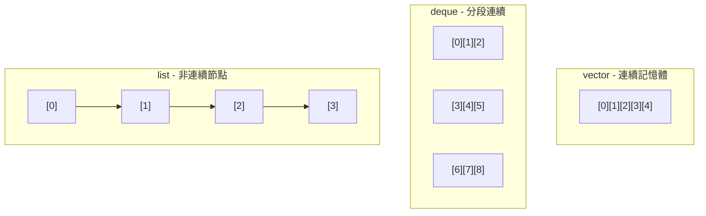
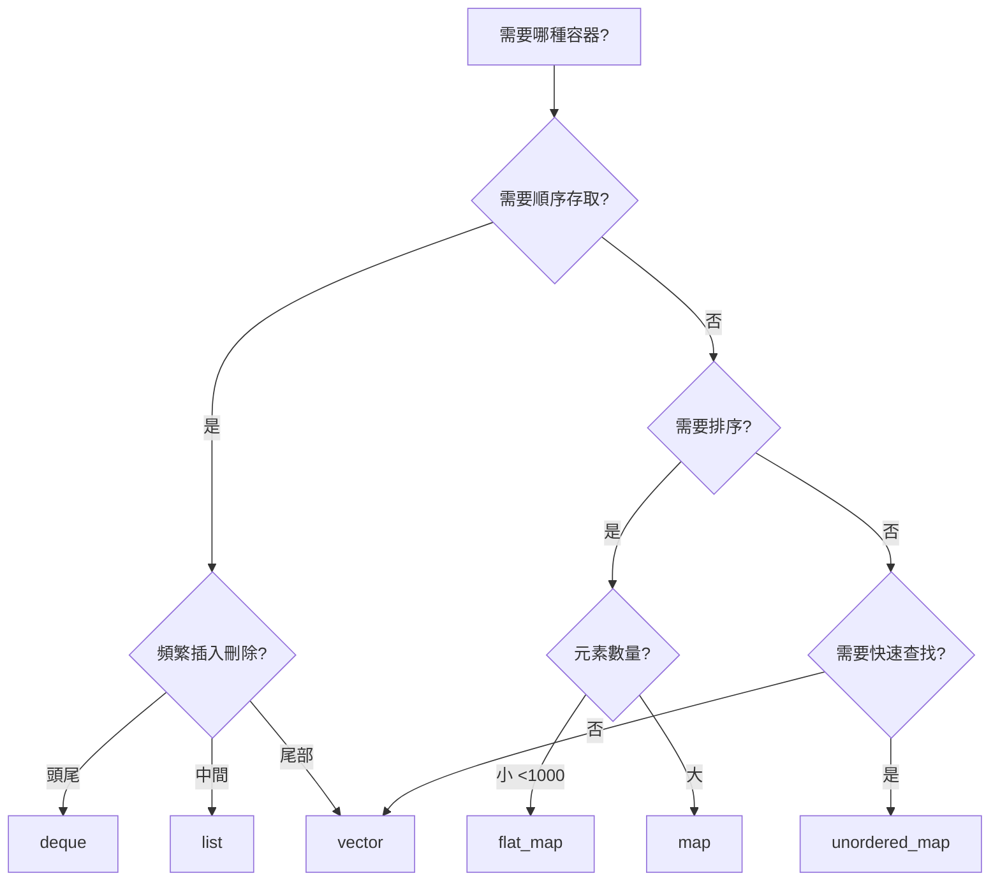

# STL 容器性能特性

深入理解 STL 容器的性能特徵,對於構建高效能系統至關重要。

---

## 1. 容器性能總覽

### 1.1 時間複雜度對照表

| 操作 | `vector` | `deque` | `list` | `map` | `unordered_map` |
|-----|---------|---------|--------|-------|-----------------|
| **隨機存取** | O(1) | O(1) | O(n) | O(log n) | O(1) 平均 |
| **插入頭部** | O(n) | O(1) | O(1) | O(log n) | O(1) 平均 |
| **插入尾部** | O(1)* | O(1) | O(1) | O(log n) | O(1) 平均 |
| **插入中間** | O(n) | O(n) | O(1) | O(log n) | - |
| **刪除** | O(n) | O(n) | O(1) | O(log n) | O(1) 平均 |
| **查找** | O(n) | O(n) | O(n) | O(log n) | O(1) 平均 |

\* amortized

### 1.2 記憶體佈局



---

## 2. vector 深入分析

### 2.1 容量增長策略

```cpp
#include <vector>
#include <iostream>

void analyze_vector_growth() {
    std::vector<int> v;
    size_t prev_capacity = 0;
    
    for (int i = 0; i < 1000; ++i) {
        v.push_back(i);
        
        if (v.capacity() != prev_capacity) {
            std::cout << "Size: " << v.size() 
                      << ", Capacity: " << v.capacity() 
                      << ", Growth: " << (float)v.capacity() / prev_capacity 
                      << "x\n";
            prev_capacity = v.capacity();
        }
    }
}

/* 輸出範例 (GCC):
Size: 1, Capacity: 1, Growth: infx
Size: 2, Capacity: 2, Growth: 2x
Size: 3, Capacity: 4, Growth: 2x
Size: 5, Capacity: 8, Growth: 2x
Size: 9, Capacity: 16, Growth: 2x
...

GCC/Clang: 2x 增長
MSVC: 1.5x 增長
*/
```

### 2.2 預分配優化

```cpp
// ❌ 未優化: 多次重新分配
std::vector<MarketTick> ticks;
for (int i = 0; i < 10000; ++i) {
    ticks.push_back(get_tick(i));  // 可能觸發多次 reallocation
}

// ✅ 優化: 預先分配
std::vector<MarketTick> ticks;
ticks.reserve(10000);  // 一次性分配
for (int i = 0; i < 10000; ++i) {
    ticks.push_back(get_tick(i));
}

// 性能提升: 約 2-3x
```

### 2.3 shrink_to_fit

```cpp
std::vector<int> v;
v.reserve(10000);
// 使用後只剩 100 個元素
v.resize(100);

std::cout << "Capacity: " << v.capacity() << "\n";  // 10000
v.shrink_to_fit();  // 釋放多餘空間
std::cout << "Capacity: " << v.capacity() << "\n";  // ~100
```

---

## 3. 關聯容器優化

### 3.1 unordered_map 調校

```cpp
#include <unordered_map>

class OptimizedSymbolMap {
    std::unordered_map<std::string, MarketData> data_;
    
public:
    OptimizedSymbolMap(size_t expected_size) {
        // 預設 load factor = 1.0,預留空間減少 rehash
        data_.reserve(expected_size);
        
        // 或設定更低的 load factor
        data_.max_load_factor(0.75);
    }
    
    void insert(const std::string& symbol, const MarketData& md) {
        // 避免多次查找
        data_.emplace(symbol, md);  // 原地構造
    }
};
```

### 3.2 自定義 hash 函數

```cpp
struct SymbolHash {
    size_t operator()(const std::string& symbol) const {
        // 針對金融商品代碼優化 (通常很短)
        return std::hash<std::string_view>{}(std::string_view(symbol));
    }
};

std::unordered_map<std::string, MarketData, SymbolHash> symbol_map;
```

---

## 4. flat_map / flat_set (C++23)

### 4.1 基於 vector 的有序容器

```cpp
#include <flat_map>  // C++23

// 底層使用 sorted vector,cache 友好
std::flat_map<int, std::string> orders;

// 優點:
// - 記憶體連續,cache 友好
// - 小規模數據比 std::map 快
// - 記憶體佔用少 (無 node overhead)

// 缺點:
// - 插入/刪除較慢 (O(n))
```

---

## 5. 容器選擇策略

### 5.1 決策樹



### 5.2 HFT 場景推薦

| 場景 | 推薦容器 | 原因 |
|-----|---------|------|
| **Order Book (價格層級)** | `flat_map` | 小規模、排序、cache友好 |
| **Symbol 查找** | `unordered_map` | O(1) 查找 |
| **歷史 Tick 數據** | `vector` | 順序存取、預分配 |
| **待處理訂單隊列** | `deque` | 兩端操作 |
| **LRU Cache** | `list + unordered_map` | O(1) 插入刪除 |

---

## 6. 小物件優化 (SSO)

### 6.1 std::string SSO

```cpp
// Small String Optimization
std::string short_str = "ABC";  // 不分配堆記憶體 (SSO)
std::string long_str = "Very long string that exceeds SSO buffer";  // 堆分配

// 檢測 SSO 閾值
void test_sso() {
    for (int len = 1; len <= 50; ++len) {
        std::string s(len, 'x');
        bool uses_heap = (s.data() != reinterpret_cast<const char*>(&s));
        
        if (uses_heap) {
            std::cout << "SSO threshold: " << len - 1 << " bytes\n";
            break;
        }
    }
}

// 典型 SSO 大小:
// GCC: 15 bytes
// Clang (libc++): 22 bytes  
// MSVC: 15 bytes
```

---

## 7. 性能測試對比

```cpp
#include <benchmark/benchmark.h>

static void BM_Vector_PushBack(benchmark::State& state) {
    for (auto _ : state) {
        std::vector<int> v;
        for (int i = 0; i < state.range(0); ++i) {
            v.push_back(i);
        }
        benchmark::DoNotOptimize(v.data());
    }
}

static void BM_Vector_Reserve_PushBack(benchmark::State& state) {
    for (auto _ : state) {
        std::vector<int> v;
        v.reserve(state.range(0));
        for (int i = 0; i < state.range(0); ++i) {
            v.push_back(i);
        }
        benchmark::DoNotOptimize(v.data());
    }
}

BENCHMARK(BM_Vector_PushBack)->Range(100, 10000);
BENCHMARK(BM_Vector_Reserve_PushBack)->Range(100, 10000);

/* 結果:
BM_Vector_PushBack/100           850 ns
BM_Vector_Reserve_PushBack/100   320 ns  (2.65x 快)

BM_Vector_PushBack/10000       95000 ns
BM_Vector_Reserve_PushBack/10000 28000 ns  (3.39x 快)
*/
```

---

## 參考資料

1. **C++ 標準庫**
   - [STL Containers](https://en.cppreference.com/w/cpp/container)
   
2. **效能分析**
   - [CppCon Talks on STL Performance](https://www.youtube.com/results?search_query=cppcon+stl+performance)
