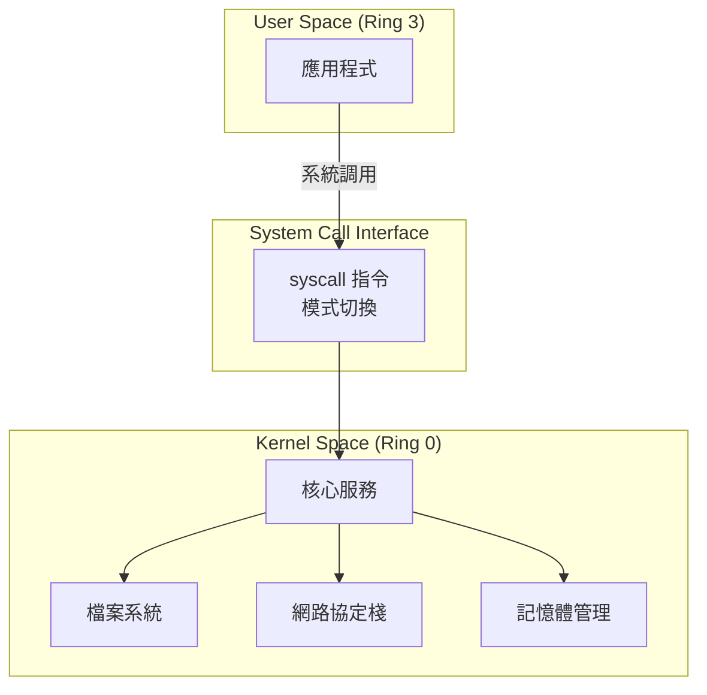
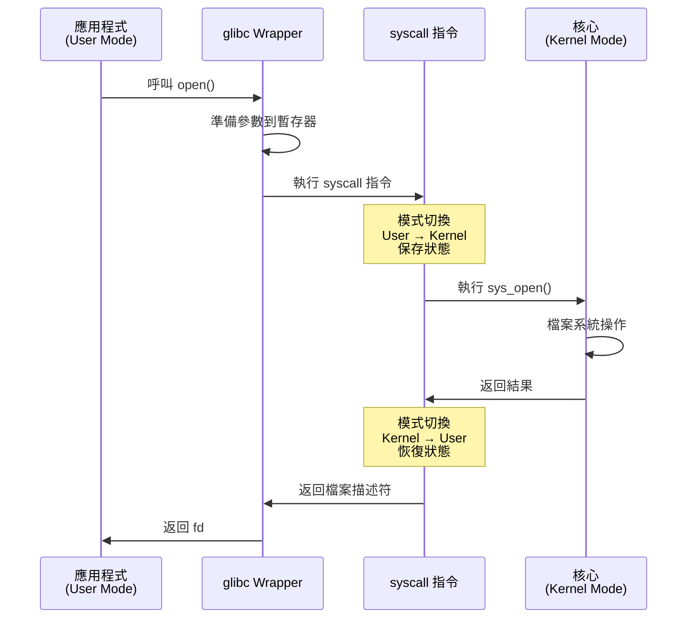
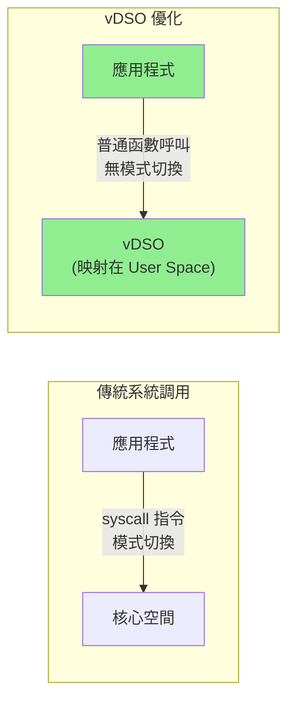
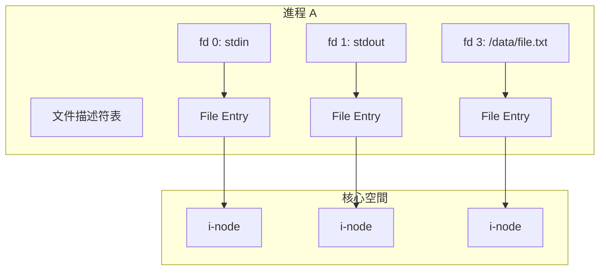

# 系統調用與文件IO (System Call & File I/O)

系統調用 (System Call) 是應用程式與作業系統核心互動的唯一合法方式。深入理解系統調用機制與文件 I/O 優化,是構建高性能 HFT 系統的基礎。

---

## 1. 系統調用基礎 ⭐⭐

### 1.1 用戶態與內核態

作業系統將 CPU 運行權限分為兩個等級:



**用戶態 (User Mode)**:
- 應用程式運行環境
- 權限受限,無法直接存取硬體
- 只能存取分配給該進程的記憶體空間
- 執行特權指令會觸發異常

**內核態 (Kernel Mode)**:
- 作業系統核心運行環境
- 擁有最高權限 (Ring 0)
- 可存取所有硬體和記憶體資源
- 負責管理進程、記憶體、檔案系統、網路等

### 1.2 系統調用執行流程



**關鍵步驟**:
1. **參數準備**: 將參數放入暫存器 (x86-64: rdi, rsi, rdx, r10, r8, r9)
2. **系統調用號**: 設置 rax 暫存器為系統調用號
3. **模式切換**: 執行 `syscall` 指令,從 User Mode 切換到 Kernel Mode
4. **核心執行**: 核心根據系統調用號執行對應函數
5. **返回結果**: 將結果放入 rax,切換回 User Mode

### 1.3 系統調用開銷

系統調用的主要開銷來源:

| 開銷來源 | 說明 | 時間估計 (x86-64) |
|---------|------|-------------------|
| **模式切換** | User Mode ↔ Kernel Mode | ~50-100 ns |
| **上下文保存/恢復** | 保存/恢復暫存器狀態 | ~20-40 ns |
| **TLB/Cache 失效** | 切換位址空間導致 cache miss | ~50-200 ns |
| **參數驗證** | 檢查指標有效性、權限等 | ~20-100 ns |
| **核心執行** | 實際執行系統調用邏輯 | 視操作而定 |

**總開銷**: 一次簡單的系統調用 (如 `getpid()`) 約 **100-300 ns**

```cpp
#include <unistd.h>
#include <chrono>
#include <iostream>

void benchmark_syscall_overhead() {
    constexpr int ITERATIONS = 1000000;
    
    // 測試 getpid() (最簡單的系統調用)
    auto start = std::chrono::high_resolution_clock::now();
    for (int i = 0; i < ITERATIONS; ++i) {
        getpid();  // ✅ 需要真實系統調用
    }
    auto end = std::chrono::high_resolution_clock::now();
    
    auto duration = std::chrono::duration_cast<std::chrono::nanoseconds>(
        end - start);
    std::cout << "每次 getpid() 平均耗時: " 
              << duration.count() / ITERATIONS << " ns\n";
}

/* 輸出範例:
每次 getpid() 平均耗時: 120 ns
*/
```

**額外開銷**:
- **TLB (Translation Lookaside Buffer) 刷新**: 頁表切換可能導致 TLB 失效
- **CPU Pipeline 清空**: 特權級切換會清空流水線
- **Cache 污染**: 核心程式碼可能驅逐使用者態熱點資料

---

## 2. vDSO 優化 (Virtual Dynamic Shared Object) ⭐⭐⭐

### 2.1 vDSO 原理

vDSO 是 Linux 核心提供的一種機制,將**某些常用系統調用的實現映射到使用者空間**,避免模式切換開銷。



**原理**:
- 核心將一段程式碼映射到每個進程的位址空間
- 特定系統調用可以直接在使用者空間執行
- 完全**零開銷**,就像普通函數呼叫

### 2.2 vDSO 支援的系統調用

```bash
# 查看 vDSO
ldd /bin/ls | grep vdso
# 輸出: linux-vdso.so.1 (0x00007ffce2bfe000)
```

**常見 vDSO 函數** (x86-64 Linux):
- `gettimeofday()` - 獲取當前時間
- `clock_gettime()` - 高精度時間 (HFT 必用)
- `time()` - 秒級時間
- `getcpu()` - 獲取當前 CPU 編號

### 2.3 效能對比

```cpp
#include <time.h>
#include <sys/time.h>
#include <unistd.h>
#include <chrono>
#include <iostream>

void benchmark_vdso() {
    constexpr int ITERATIONS = 10000000;
    
    // 測試 1: clock_gettime (使用 vDSO)
    auto start = std::chrono::high_resolution_clock::now();
    for (int i = 0; i < ITERATIONS; ++i) {
        struct timespec ts;
        clock_gettime(CLOCK_REALTIME, &ts);  // ✅ vDSO 優化
    }
    auto end = std::chrono::high_resolution_clock::now();
    
    auto duration = std::chrono::duration_cast<std::chrono::nanoseconds>(
        end - start);
    std::cout << "clock_gettime() 平均耗時: " 
              << duration.count() / ITERATIONS << " ns\n";
    
    // 測試 2: getpid() (需要真實系統調用)
    start = std::chrono::high_resolution_clock::now();
    for (int i = 0; i < ITERATIONS; ++i) {
        getpid();  // ❌ 無 vDSO 優化
    }
    end = std::chrono::high_resolution_clock::now();
    
    duration = std::chrono::duration_cast<std::chrono::nanoseconds>(
        end - start);
    std::cout << "getpid() 平均耗時: " 
              << duration.count() / ITERATIONS << " ns\n";
}

/* 輸出範例:
clock_gettime() 平均耗時: 20 ns   (vDSO 優化)
getpid() 平均耗時: 120 ns          (真實系統調用)

性能提升: 6x
*/
```

**HFT 應用**:
- **延遲測量**: 使用 `clock_gettime(CLOCK_MONOTONIC)` 測量訂單延遲
- **時間戳記**: 為市場數據包添加高精度時間戳
- **無開銷**: 完全不影響關鍵路徑效能

---

## 3. 文件描述符與基礎 I/O ⭐⭐

### 3.1 文件描述符 (File Descriptor)

文件描述符是核心為開啟的檔案分配的非負整數,用於後續 I/O 操作。

**close() 函數簽名**:
```cpp
#include <unistd.h>

int close(int fd);
```

**參數說明**:
- `fd`: 要關閉的文件描述符

**返回值**:
- 成功: 返回 0
- 失敗: 返回 -1,並設置 `errno`

**注意事項**:
- 關閉後 fd 可被重用
- 多次關閉同一個 fd 是錯誤的
- 進程終止時,所有 fd 會自動關閉

**標準文件描述符**:
- `0` - `STDIN_FILENO` (標準輸入)
- `1` - `STDOUT_FILENO` (標準輸出)
- `2` - `STDERR_FILENO` (標準錯誤)

**文件描述符表**:



每個 File Entry 包含:
- 檔案偏移量 (offset)
- 狀態標誌 (flags): `O_APPEND`, `O_NONBLOCK` 等
- 存取模式 (mode): 讀取、寫入、讀寫

### 3.2 open() - 開啟檔案

**函數簽名**:
```cpp
#include <fcntl.h>

int open(const char *pathname, int flags);
int open(const char *pathname, int flags, mode_t mode);
```

**參數說明**:
- `pathname`: 要開啟的檔案路徑 (C 字符串)
- `flags`: 檔案開啟標誌 (必須包含 `O_RDONLY`, `O_WRONLY`, 或 `O_RDWR` 之一)
- `mode`: 檔案權限 (僅當 `O_CREAT` 時需要,是一個 8 進制數如 0644)

**返回值**:
- 成功: 返回非負整數的檔案描述符 (file descriptor)
- 失敗: 返回 -1,並設置 `errno`

**常見 errno**:
- `EACCES`: 權限不足
- `EEXIST`: 檔案已存在 (與 `O_CREAT | O_EXCL` 使用時)
- `ENOENT`: 檔案不存在
- `EMFILE`: 進程開啟的檔案描述符過多

```cpp
#include <fcntl.h>
#include <unistd.h>
#include <iostream>
#include <cstring>

void open_example() {
    // 開啟現有檔案 (唯讀)
    int fd1 = open("/tmp/existing.txt", O_RDONLY);
    if (fd1 < 0) {
        perror("open");
        return;
    }
    std::cout << "開啟檔案,fd = " << fd1 << "\n";
    
    // 建立新檔案 (可讀寫)
    int fd2 = open("/tmp/new.txt", 
                   O_RDWR | O_CREAT | O_TRUNC,  // 標誌
                   0644);                        // 權限: rw-r--r--
    if (fd2 < 0) {
        perror("open");
        close(fd1);
        return;
    }
    
    // 以附加模式開啟
    int fd3 = open("/tmp/log.txt", 
                   O_WRONLY | O_CREAT | O_APPEND,
                   0644);
    
    close(fd1);
    close(fd2);
    close(fd3);
}
```

**常用標誌**:

| 標誌 | 說明 |
|-----|------|
| `O_RDONLY` | 唯讀模式 |
| `O_WRONLY` | 唯寫模式 |
| `O_RDWR` | 讀寫模式 |
| `O_CREAT` | 若檔案不存在則建立 |
| `O_TRUNC` | 截斷檔案至 0 長度 |
| `O_APPEND` | 附加模式 (寫入總是在檔尾) |
| `O_NONBLOCK` | 非阻塞模式 |
| `O_SYNC` | 同步寫入 (每次 write 等待磁碟完成) |
| `O_DIRECT` | 直接 I/O (繞過核心緩衝) |

### 3.3 read() / write() - 基礎 I/O

**函數簽名**:
```cpp
#include <unistd.h>

ssize_t read(int fd, void *buf, size_t count);
ssize_t write(int fd, const void *buf, size_t count);
```

**參數說明**:
- `fd`: 檔案描述符
- `buf`: 緩衝區指標 (read: 寫入緩衝區, write: 從緩衝區讀取)
- `count`: 要讀取/寫入的字節數

**返回值**:
- **read()**:
  - 成功: 返回實際讀取的字節數 (可能小於 count)
  - EOF: 返回 0
  - 失敗: 返回 -1,並設置 `errno`
- **write()**:
  - 成功: 返回實際寫入的字節數 (可能小於 count)
  - 失敗: 返回 -1,並設置 `errno`

**重要**: `ssize_t` 是有符號類型,用於表示可能為負數的返回值

**常見 errno**:
- `EAGAIN`/`EWOULDBLOCK`: 非阻塞模式下無數據可讀/無法寫入
- `EINTR`: 被信號中斷
- `EBADF`: 無效的檔案描述符
- `EIO`: I/O 錯誤

```cpp
#include <fcntl.h>
#include <unistd.h>
#include <iostream>
#include <cstring>

void read_write_example() {
    // 寫入
    int fd = open("/tmp/test.txt", O_RDWR | O_CREAT | O_TRUNC, 0644);
    if (fd < 0) {
        perror("open");
        return;
    }
    
    const char* data = "Hello, HFT World!";
    ssize_t written = write(fd, data, strlen(data));
    std::cout << "寫入 " << written << " bytes\n";
    
    // 重置位置
    lseek(fd, 0, SEEK_SET);
    
    // 讀取
    char buffer[128];
    ssize_t nread = read(fd, buffer, sizeof(buffer));
    if (nread > 0) {
        buffer[nread] = '\0';
        std::cout << "讀取: " << buffer << "\n";
    }
    
    close(fd);
}
```

**關鍵特性**:
- `read()/write()` 可能返回**部分資料** (short count)
- 必須在迴圈中處理,直到完成所有資料傳輸
- 會更新檔案偏移量

```cpp
// 完整讀取指定位元組數
ssize_t read_full(int fd, void* buf, size_t count) {
    char* ptr = static_cast<char*>(buf);
    size_t remaining = count;
    
    while (remaining > 0) {
        ssize_t n = read(fd, ptr, remaining);
        if (n < 0) {
            if (errno == EINTR) continue;  // 被信號中斷,重試
            return -1;
        }
        if (n == 0) break;  // EOF
        
        remaining -= n;
        ptr += n;
    }
    
    return count - remaining;
}
```

### 3.4 lseek() - 定位

**函數簽名**:
```cpp
#include <unistd.h>

off_t lseek(int fd, off_t offset, int whence);
```

**參數說明**:
- `fd`: 檔案描述符
- `offset`: 偏移量 (字節數,可為負數)
- `whence`: 基準位置:
  - `SEEK_SET`: 從檔案開頭 (offset 必須 >= 0)
  - `SEEK_CUR`: 從當前位置
  - `SEEK_END`: 從檔案結尾

**返回值**:
- 成功: 返回新的檔案偏移量 (從檔案開頭算起的字節數)
- 失敗: 返回 -1,並設置 `errno`

**注意**: `off_t` 通常是 64 位有符號整數,可以處理大檔案

```cpp
#include <unistd.h>

void lseek_example() {
    int fd = open("/tmp/test.txt", O_RDWR);
    
    // 移動到檔案開頭
    off_t pos = lseek(fd, 0, SEEK_SET);
    
    // 移動到檔案結尾
    pos = lseek(fd, 0, SEEK_END);
    std::cout << "檔案大小: " << pos << " bytes\n";
    
    // 相對當前位置移動
    lseek(fd, -10, SEEK_CUR);  // 往回移動 10 bytes
    
    // 建立檔案洞 (sparse file)
    lseek(fd, 1024 * 1024, SEEK_SET);  // 跳到 1MB 位置
    write(fd, "x", 1);  // 中間的空間不佔用實際磁碟空間
    
    close(fd);
}
```

### 3.5 stat() / fstat() - 檔案資訊

**函數簽名**:
```cpp
#include <sys/stat.h>

int stat(const char *pathname, struct stat *statbuf);
int fstat(int fd, struct stat *statbuf);
int lstat(const char *pathname, struct stat *statbuf);  // 不追蹤符號連結
```

**參數說明**:
- `pathname`: 檔案路徑
- `fd`: 檔案描述符
- `statbuf`: 指向 `struct stat` 的指標,用於存儲檔案資訊

**返回值**:
- 成功: 返回 0
- 失敗: 返回 -1,並設置 `errno`

**struct stat 結構**:
```cpp
struct stat {
    dev_t     st_dev;      // 裝置 ID
    ino_t     st_ino;      // i-node 號碼
    mode_t    st_mode;     // 檔案類型和權限
    nlink_t   st_nlink;    // 硬連結數
    uid_t     st_uid;      // 擁有者用戶 ID
    gid_t     st_gid;      // 擁有者組 ID
    dev_t     st_rdev;     // 裝置 ID (如果是特殊檔案)
    off_t     st_size;     // 檔案大小 (字節)
    blksize_t st_blksize;  // I/O 塊大小
    blkcnt_t  st_blocks;   // 分配的 512B 塊數
    
    struct timespec st_atim;  // 最後訪問時間
    struct timespec st_mtim;  // 最後修改時間
    struct timespec st_ctim;  // 最後狀態改變時間
};
```

**st_mode 欄位**:
- 檔案類型巨集: `S_ISREG()`, `S_ISDIR()`, `S_ISLNK()`, `S_ISFIFO()` 等
- 權限位: `S_IRUSR`, `S_IWUSR`, `S_IXUSR` 等

```cpp
#include <sys/stat.h>
#include <fcntl.h>
#include <unistd.h>
#include <iostream>

void stat_example(const char* path) {
    struct stat sb;
    
    if (stat(path, &sb) < 0) {
        perror("stat");
        return;
    }
    
    std::cout << "File: " << path << "\n";
    std::cout << "Size: " << sb.st_size << " bytes\n";
    std::cout << "Blocks: " << sb.st_blocks << "\n";
    std::cout << "I-node: " << sb.st_ino << "\n";
    
    // 檔案類型
    if (S_ISREG(sb.st_mode)) std::cout << "Type: regular file\n";
    else if (S_ISDIR(sb.st_mode)) std::cout << "Type: directory\n";
    else if (S_ISLNK(sb.st_mode)) std::cout << "Type: symbolic link\n";
    
    // 權限
    std::cout << "Mode: " << std::oct << (sb.st_mode & 0777) 
              << std::dec << "\n";
}
```

---

## 4. 進階文件操作 ⭐⭐⭐

### 4.1 pread() / pwrite() - 原子定位讀寫

**函數簽名**:
```cpp
#include <unistd.h>

ssize_t pread(int fd, void *buf, size_t count, off_t offset);
ssize_t pwrite(int fd, const void *buf, size_t count, off_t offset);
```

**參數說明**:
- `fd`: 檔案描述符
- `buf`: 緩衝區指標
- `count`: 要讀取/寫入的字節數
- `offset`: 檔案偏移量 (從檔案開頭算起)

**返回值**:
- 成功: 返回實際讀取/寫入的字節數
- 失敗: 返回 -1,並設置 `errno`

**關鍵特性**:
- 原子操作:讀寫操作和定位是原子的
- 不改變檔案偏移:檔案的當前位置指針不會改變
- 線程安全:多個線程可以安全地同時對同一個 fd 執行 pread/pwrite

**pread()/pwrite()** 在指定偏移量處讀寫,但**不改變**檔案的當前位置。

```cpp
#include <unistd.h>
#include <fcntl.h>
#include <iostream>

void pread_pwrite_example() {
    int fd = open("/tmp/random_access.dat", O_RDWR | O_CREAT, 0644);
    
    // 在偏移 100 處寫入,但不改變 offset
    const char* data = "Position 100";
    pwrite(fd, data, strlen(data), 100);
    
    // 在偏移 200 處寫入
    pwrite(fd, "Position 200", 12, 200);
    
    // 檔案 offset 仍然是 0
    off_t pos = lseek(fd, 0, SEEK_CUR);
    std::cout << "Current offset: " << pos << "\n";  // ✅ 輸出: 0
    
    // 讀取偏移 100 的資料
    char buffer[128];
    ssize_t n = pread(fd, buffer, sizeof(buffer), 100);
    buffer[n] = '\0';
    std::cout << "Read from offset 100: " << buffer << "\n";
    
    close(fd);
}
```

**優勢**:
1. **執行緒安全**: 原子操作,多執行緒環境下不會互相干擾
2. **無副作用**: 不改變檔案 offset,適合隨機存取
3. **HFT 應用**: 多執行緒同時讀取同一個市場數據檔案

> 多執行續對同一個 fd 進行讀寫，會導致兩個執行續相互修改到 cursor，使用 pread, pwrite 更安全

### 4.2 readv() / writev() - 分散聚集 I/O

**函數簽名**:
```cpp
#include <sys/uio.h>

ssize_t readv(int fd, const struct iovec *iov, int iovcnt);
ssize_t writev(int fd, const struct iovec *iov, int iovcnt);
```

**參數說明**:
- `fd`: 檔案描述符
- `iov`: 指向 `struct iovec` 陣列的指標
- `iovcnt`: `iov` 陣列的元素數量

**struct iovec 結構**:
```cpp
struct iovec {
    void  *iov_base;    // 緩衝區起始地址
    size_t iov_len;     // 緩衝區長度
};
```

**返回值**:
- 成功: 返回總共讀取/寫入的字節數
- 失敗: 返回 -1,並設置 `errno`

**優勢**:
- 減少系統調用次數 (多個緩衝區只需一次系統調用)
- 避免在使用者空間複製資料到單一緩衝區

**readv()/writev()** 允許單次系統調用讀寫多個不連續的緩衝區。

```cpp
#include <sys/uio.h>
#include <fcntl.h>
#include <unistd.h>
#include <iostream>
#include <cstring>

void readv_writev_example() {
    // 準備多個緩衝區
    struct Header {
        uint32_t magic;
        uint32_t length;
    } header = {0xDEADBEEF, 100};
    
    char payload[100];
    strcpy(payload, "Market data payload");
    
    uint32_t checksum = 0x12345678;
    
    // 使用 writev 一次性寫入多個緩衝區
    int fd = open("/tmp/message.dat", O_WRONLY | O_CREAT | O_TRUNC, 0644);
    
    struct iovec iov[3];
    iov[0].iov_base = &header;
    iov[0].iov_len = sizeof(header);
    iov[1].iov_base = payload;
    iov[1].iov_len = sizeof(payload);
    iov[2].iov_base = &checksum;
    iov[2].iov_len = sizeof(checksum);
    
    ssize_t written = writev(fd, iov, 3);  // ✅ 只有 1 次系統調用!
    std::cout << "writev() 寫入 " << written << " bytes\n";
    
    close(fd);
    
    // 讀取
    fd = open("/tmp/message.dat", O_RDONLY);
    
    Header read_header;
    char read_payload[100];
    uint32_t read_checksum;
    
    struct iovec read_iov[3];
    read_iov[0].iov_base = &read_header;
    read_iov[0].iov_len = sizeof(read_header);
    read_iov[1].iov_base = read_payload;
    read_iov[1].iov_len = sizeof(read_payload);
    read_iov[2].iov_base = &read_checksum;
    read_iov[2].iov_len = sizeof(read_checksum);
    
    ssize_t nread = readv(fd, read_iov, 3);  // ✅ 只有 1 次系統調用!
    std::cout << "readv() 讀取 " << nread << " bytes\n";
    std::cout << "Header magic: 0x" << std::hex << read_header.magic << "\n";
    
    close(fd);
}
```

**優勢**:
- 減少系統調用次數
- 避免在使用者空間複製資料到單一緩衝區
- 適合網路協議封包處理 (header + body + checksum)

### 4.3 mmap() - 記憶體映射檔案

**函數簽名**:
```cpp
#include <sys/mman.h>

void *mmap(void *addr, size_t length, int prot, int flags, int fd, off_t offset);
int munmap(void *addr, size_t length);
int msync(void *addr, size_t length, int flags);
```

**參數說明 (mmap)**:
- `addr`: 建議的映射起始地址 (通常傳 NULL,讓內核選擇)
- `length`: 映射的字節數
- `prot`: 記憶體保護標誌:
  - `PROT_READ`: 可讀
  - `PROT_WRITE`: 可寫
  - `PROT_EXEC`: 可執行
  - `PROT_NONE`: 不可訪問
- `flags`: 映射類型:
  - `MAP_SHARED`: 修改對其他進程可見,會同步到檔案
  - `MAP_PRIVATE`: 寫時複製 (COW),修改不影響原檔案
  - `MAP_ANONYMOUS`: 匿名映射 (不對應檔案,fd=-1)
  - `MAP_POPULATE`: 預先載入所有頁面
  - `MAP_HUGETLB`: 使用 Huge Pages
- `fd`: 檔案描述符 (匿名映射時為 -1)
- `offset`: 檔案偏移量 (必須是頁大小的倍數,通常是 4096)

**返回值 (mmap)**:
- 成功: 返回映射區域的起始地址
- 失敗: 返回 `MAP_FAILED` ((void *) -1),並設置 `errno`

**返回值 (munmap, msync)**:
- 成功: 返回 0
- 失敗: 返回 -1,並設置 `errno`

**mmap()** 將檔案映射到記憶體位址空間,透過記憶體存取操作檔案。

```cpp
#include <sys/mman.h>
#include <sys/stat.h>
#include <fcntl.h>
#include <unistd.h>
#include <iostream>
#include <cstring>

void mmap_example() {
    // 建立並寫入測試檔案
    int fd = open("/tmp/mmap_test.dat", O_RDWR | O_CREAT | O_TRUNC, 0644);
    const char* initial_data = "Initial data for mmap test";
    write(fd, initial_data, strlen(initial_data));
    
    // 獲取檔案大小
    struct stat sb;
    fstat(fd, &sb);
    size_t file_size = sb.st_size;
    
    // 映射檔案到記憶體
    void* addr = mmap(nullptr,           // 讓核心選擇位址
                     file_size,          // 映射大小
                     PROT_READ | PROT_WRITE,  // 可讀寫
                     MAP_SHARED,         // 修改會同步到檔案
                     fd,                 // 檔案描述符
                     0);                 // 偏移量
    
    if (addr == MAP_FAILED) {
        perror("mmap");
        close(fd);
        return;
    }
    
    // 可以關閉檔案描述符,映射仍然有效 (重要！)
    close(fd);
    
    // 透過記憶體操作檔案 (無系統調用!)
    char* data = static_cast<char*>(addr);
    std::cout << "讀取: " << std::string(data, file_size) << "\n";
    
    // 修改資料
    strcpy(data, "Modified via mmap!");
    
    // 同步到磁碟 (可選,munmap 時會自動同步)
    msync(addr, file_size, MS_SYNC);
    
    // 解除映射
    munmap(addr, file_size);
}
```

**MAP 標誌**:

| 標誌 | 說明 |
|-----|------|
| `MAP_SHARED` | 修改對其他進程可見,會同步到檔案 |
| `MAP_PRIVATE` | 寫時複製 (COW),修改不影響原檔案 |
| `MAP_ANONYMOUS` | 匿名映射,不對應檔案 (用於共享記憶體) |
| `MAP_POPULATE` | 預先載入所有頁面,避免後續 page fault |
| `MAP_HUGETLB` | 使用 Huge Pages (2MB/1GB) |

**HFT 應用場景**:
- **配置檔載入**: 快速載入大型配置檔
- **Market Data 緩存**: 共享記憶體存取歷史行情
- **Order Book 快照**: 持久化訂單簿狀態

### 4.4 sendfile() - 零拷貝傳輸

**函數簽名**:
```cpp
#include <sys/sendfile.h>

ssize_t sendfile(int out_fd, int in_fd, off_t *offset, size_t count);
```

**參數說明**:
- `out_fd`: 目標文件描述符 (必須是 socket)
- `in_fd`: 源文件描述符 (必須支持 mmap,通常是普通文件)
- `offset`: 
  - 非 NULL: 從指定偏移量開始讀取,函數會更新此值
  - NULL: 從 in_fd 的當前位置開始讀取
- `count`: 要傳輸的字節數

**返回值**:
- 成功: 返回實際傳輸的字節數
- 失敗: 返回 -1,並設置 `errno`

**零拷貝原理**:
- 傳統方式: 磁碟 → 內核緩衝 → 使用者空間 → socket 緩衝 → 網卡 (2 次 CPU 拷貝)
- sendfile: 磁碟 → 內核緩衝 → socket 緩衝 → 網卡 (0 次 CPU 拷貝)

**sendfile()** 在核心空間直接將檔案資料傳輸到 socket,完全不經過使用者空間。

```cpp
#include <sys/sendfile.h>
#include <fcntl.h>
#include <unistd.h>
#include <sys/socket.h>
#include <netinet/in.h>
#include <iostream>

void sendfile_example() {
    // 開啟檔案
    int file_fd = open("/tmp/large_file.dat", O_RDONLY);
    if (file_fd < 0) {
        perror("open");
        return;
    }
    
    // 建立 socket (簡化範例)
    int sock_fd = socket(AF_INET, SOCK_STREAM, 0);
    
    // ... (連接到遠端) ...
    
    // 使用 sendfile 零拷貝傳輸
    off_t offset = 0;
    size_t count = 1024 * 1024;  // 傳輸 1MB
    
    ssize_t sent = sendfile(sock_fd,   // 目標 socket
                           file_fd,    // 源檔案
                           &offset,    // 偏移量 (會自動更新)
                           count);     // 傳輸大小
    
    std::cout << "sendfile() 傳輸 " << sent << " bytes\n";
    
    close(file_fd);
    close(sock_fd);
}
```

**傳統方式 vs sendfile()**:

```
傳統方式:
磁碟 → 核心緩衝 → 使用者空間 → socket 緩衝 → 網卡
       (DMA)      (copy)        (copy)       (DMA)
總計: 2 次 DMA + 2 次 CPU 拷貝

sendfile():
磁碟 → 核心緩衝 → socket 緩衝 → 網卡
       (DMA)      (DMA)         (DMA)
總計: 3 次 DMA + 0 次 CPU 拷貝 (零拷貝!)
```

### 4.5 Direct I/O - 繞過核心緩衝

```cpp
#include <fcntl.h>
#include <unistd.h>
#include <stdlib.h>
#include <iostream>

void direct_io_example() {
    // 使用 O_DIRECT 繞過頁面緩存
    int fd = open("/tmp/direct_io.dat", 
                  O_RDWR | O_CREAT | O_DIRECT,
                  0644);
    
    if (fd < 0) {
        perror("open with O_DIRECT");
        return;
    }
    
    // O_DIRECT 要求:
    // 1. 緩衝區位址對齊 (通常 512 bytes)
    // 2. 傳輸大小對齊 (通常 512 bytes)
    // 3. 檔案偏移量對齊 (通常 512 bytes)
    
    const size_t BLOCK_SIZE = 4096;
    void* buffer = aligned_alloc(BLOCK_SIZE, BLOCK_SIZE);
    
    if (!buffer) {
        perror("aligned_alloc");
        close(fd);
        return;
    }
    
    // 寫入資料
    memset(buffer, 'A', BLOCK_SIZE);
    ssize_t written = write(fd, buffer, BLOCK_SIZE);
    std::cout << "Direct I/O 寫入 " << written << " bytes\n";
    
    free(buffer);
    close(fd);
}
```

**Direct I/O 特性**:
- ✅ 完全繞過頁面緩存,降低記憶體壓力
- ✅ 適合資料庫、大檔案處理
- ❌ 對齊要求嚴格
- ❌ 可能降低小檔案效能

---

## 5. HFT 實戰優化 ⭐⭐⭐

### 5.1 減少系統調用次數

```cpp
// ❌ 錯誤: 每次都開啟/關閉檔案
class BadOrderLogger {
    std::string filename_;
    
public:
    void log_order(const Order& order) {
        int fd = open(filename_.c_str(), O_WRONLY | O_APPEND | O_CREAT, 0644);
        write(fd, &order, sizeof(order));
        close(fd);  // 每次 3 個系統調用!
    }
};

// ✅ 正確: 保持檔案描述符開啟
class GoodOrderLogger {
    int fd_;
    
public:
    GoodOrderLogger(const std::string& filename) {
        fd_ = open(filename.c_str(), O_WRONLY | O_APPEND | O_CREAT, 0644);
        // 一次性開啟
    }
    
    ~GoodOrderLogger() {
        if (fd_ >= 0) close(fd_);
    }
    
    void log_order(const Order& order) {
        write(fd_, &order, sizeof(order));  // ✅ 只有 1 個系統調用
    }
};
```

### 5.2 批次處理

```cpp
// 使用 writev 批次寫入
class BatchLogger {
    int fd_;
    std::vector<iovec> pending_;
    
public:
    void log_order(const Order& order) {
        iovec iov;
        iov.iov_base = const_cast<Order*>(&order);
        iov.iov_len = sizeof(order);
        pending_.push_back(iov);
        
        if (pending_.size() >= 100) {
            flush();  // ✅ 100 個訂單只需 1 次系統調用
        }
    }
    
    void flush() {
        if (!pending_.empty()) {
            writev(fd_, pending_.data(), pending_.size());
            pending_.clear();
        }
    }
};
```

### 5.3 記憶體映射配置檔

```cpp
class ConfigLoader {
    void* data_;
    size_t size_;
    
public:
    bool load(const char* filename) {
        int fd = open(filename, O_RDONLY);
        struct stat sb;
        fstat(fd, &sb);
        size_ = sb.st_size;
        
        // 使用 MAP_POPULATE 預先載入所有頁面
        data_ = mmap(nullptr, size_, PROT_READ,
                    MAP_PRIVATE | MAP_POPULATE,
                    fd, 0);
        
        close(fd);
        
        // ✅ 後續存取完全無系統調用
        return data_ != MAP_FAILED;
    }
    
    const char* data() const { return static_cast<const char*>(data_); }
    size_t size() const { return size_; }
    
    ~ConfigLoader() {
        if (data_) munmap(data_, size_);
    }
};
```

---

## 6. 系統調用追蹤與分析 ⭐⭐

### 6.1 strace - 追蹤系統調用

```bash
# 基本使用
strace ./my_hft_program

# 統計系統調用次數與時間
strace -c ./my_hft_program

# 只追蹤檔案 I/O
strace -e trace=open,read,write,close ./my_hft_program

# 追蹤執行中的進程
strace -p <PID>

# 顯示時間戳與延遲
strace -tt -T ./my_hft_program
```

**範例輸出**:
```
% time     seconds  usecs/call     calls    errors syscall
------ ----------- ----------- --------- --------- ----------------
 45.23    0.002341          23       100           read
 32.15    0.001664          16       100           write
 12.34    0.000639          63        10           open
  5.67    0.000294          29        10           close
------ ----------- ----------- --------- --------- ----------------
100.00    0.005177                   220           total
```

### 6.2 perf - 效能分析

```bash
# 記錄系統調用
perf record -e 'syscalls:sys_enter_*' ./my_hft_program

# 分析報告
perf report

# 追蹤特定系統調用
perf trace -e read,write ./my_hft_program
```

---

## 7. 優化 Checklist ⭐⭐⭐

### 7.1 系統調用優化

- [ ] **減少系統調用次數**
  - [ ] 保持檔案描述符開啟
  - [ ] 批次處理 I/O 操作 (writev/readv)
  - [ ] 使用 mmap 替代 read/write

- [ ] **使用 vDSO 優化**
  - [ ] 時間獲取使用 `clock_gettime()`
  - [ ] 驗證 vDSO 可用性

- [ ] **選擇合適的 I/O 方法**
  - [ ] 大檔案隨機存取 → mmap
  - [ ] 檔案到 socket → sendfile
  - [ ] 資料庫/大檔案 → Direct I/O

### 7.2 效能測試

```cpp
class IOBenchmark {
public:
    static void run_all() {
        benchmark_read_write();
        benchmark_pread_pwrite();
        benchmark_mmap();
        benchmark_writev();
    }
    
private:
    static void benchmark_read_write() {
        // 實現略
    }
    
    static void benchmark_pread_pwrite() {
        // 實現略
    }
    
    static void benchmark_mmap() {
        // 實現略
    }
    
    static void benchmark_writev() {
        // 實現略
    }
};
```

---

## 參考資料 (References)

1. **Linux 核心文件**
   - [System Call Table (x86-64)](https://github.com/torvalds/linux/blob/master/arch/x86/entry/syscalls/syscall_64.tbl)
   - [vDSO Documentation](https://man7.org/linux/man-pages/man7/vdso.7.html)

2. **書籍**
   - 《The Linux Programming Interface》(Michael Kerrisk, 2010) - Chapter 4-5, 13-15
   - 《Linux System Programming, 2nd Edition》(Robert Love, 2013)
   - 《Advanced Programming in the UNIX Environment》(Stevens & Rago, 2013)

3. **效能分析工具**
   - [Brendan Gregg - Linux Performance](https://www.brendangregg.com/linuxperf.html)
   - [perf Examples](https://www.brendangregg.com/perf.html)
   - [strace(1) Manual](https://man7.org/linux/man-pages/man1/strace.1.html)

4. **學術論文**
   - "FlexSC: Flexible System Call Scheduling with Exception-Less System Calls" (OSDI 2010)
   - "The Linux Scheduler: a Decade of Wasted Cores" (EuroSys 2016)
