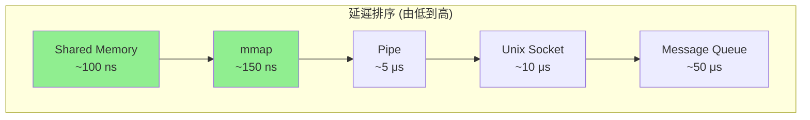
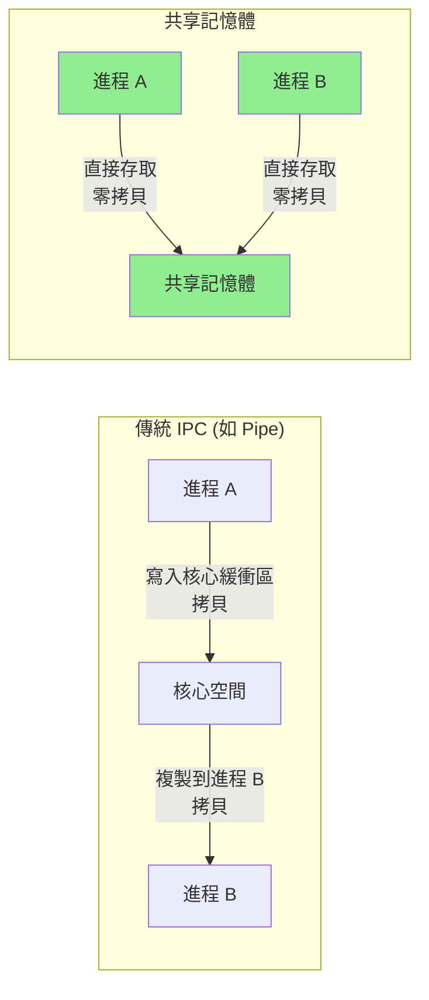
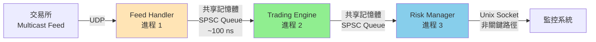

# 進程管理與IPC (Process Management & Inter-Process Communication)

進程間通信 (IPC) 是構建高性能分散式系統的基礎。在 HFT 架構中,Feed Handler、Trading Engine、Risk Manager 通常運行在獨立進程中,需要微秒級的 IPC 機制來交換數據。

---

## 1. 進程管理基礎 ⭐

### 1.1 進程生命週期


### 1.2 fork() - 建立子進程

```cpp
#include <unistd.h>
#include <sys/wait.h>
#include <iostream>

void fork_example() {
    std::cout << "父進程 PID: " << getpid() << "\n";
    
    pid_t pid = fork();
    
    if (pid < 0) {
        // fork 失敗
        perror("fork");
        return;
    }
    else if (pid == 0) {
        // 子進程
        std::cout << "子進程 PID: " << getpid() 
                  << ", 父進程 PID: " << getppid() << "\n";
        
        // 子進程執行的程式碼
        sleep(2);
        exit(0);
    }
    else {
        // 父進程 (pid 是子進程的 PID)
        std::cout << "父進程建立了子進程 " << pid << "\n";
        
        // 等待子進程結束
        int status;
        pid_t terminated_pid = wait(&status);
        
        if (WIFEXITED(status)) {
            std::cout << "子進程 " << terminated_pid 
                      << " 正常結束,退出碼: " << WEXITSTATUS(status) << "\n";
        }
    }
}
```

**fork() 特性**:
- 子進程獲得父進程位址空間的**副本** (Copy-on-Write)
- 繼承: 開啟的檔案描述符、環境變數、工作目錄等
- 不繼承: PID、記憶體鎖、待處理信號等

### 1.3 exec() 系列 - 執行新程式

```cpp
#include <unistd.h>
#include <sys/wait.h>
#include <iostream>

void exec_example() {
    pid_t pid = fork();
    
    if (pid == 0) {
        // 子進程執行 ls 命令
        execl("/bin/ls", "ls", "-l", "/tmp", nullptr);
        
        // 如果 exec 成功,這行程式碼不會執行
        perror("execl");
        exit(1);
    }
    else {
        // 父進程等待子進程
        wait(nullptr);
        std::cout << "子進程已完成\n";
    }
}
```

**exec() 系列函數**:
- `execl()` - 列表傳遞參數
- `execv()` - 陣列傳遞參數
- `execle()` - 指定環境變數
- `execvp()` - 在 PATH 中搜尋程式

---

## 2. IPC 機制概覽 ⭐⭐

### 2.1 IPC 方式對比

| IPC 機制 | 延遲 | 頻寬 | 資料結構 | 同步 | 適用場景 |
|---------|------|------|---------|------|---------|
| **Pipe / FIFO** | 中 (~5 μs) | 中 | 位元組流 | 阻塞/非阻塞 | 簡單進程通信 |
| **Unix Socket** | 中-高 (~10 μs) | 中 | 位元組流/訊息 | 阻塞/非阻塞 | 靈活的進程通信 |
| **Message Queue** | 高 (~50 μs) | 低 | 訊息 | 阻塞/非阻塞 | 優先級訊息 |
| **Shared Memory** | **極低 (~100 ns)** | **極高** | 任意結構 | 需手動同步 | **HFT 首選** |
| **Memory-Mapped File** | 極低 (~150 ns) | 極高 | 任意結構 | 需手動同步 | 持久化共享 |



### 2.2 POSIX vs System V IPC

| 特性 | POSIX IPC | System V IPC |
|-----|-----------|-------------|
| **API 風格** | 簡單、檔案導向 | 複雜、整數 ID |
| **命名** | 檔案系統路徑 | 整數 key |
| **權限** | 檔案權限 | 獨立權限結構 |
| **持久性** | 進程結束自動清理 | 需手動清理 |
| **推薦** | ✅ **優先使用** | 僅相容舊系統 |

```bash
# System V IPC
ipcs -a               # 查看所有 IPC 資源
ipcrm -m <shmid>      # 刪除共享記憶體

# POSIX IPC
ls /dev/shm/          # 查看共享記憶體對象
ls /dev/mqueue/       # 查看訊息隊列
```

---

## 3. Pipe 與 FIFO ⭐

### 3.1 匿名 Pipe

```cpp
#include <unistd.h>
#include <sys/wait.h>
#include <iostream>
#include <cstring>

void pipe_example() {
    int pipefd[2];
    
    // 建立 pipe: pipefd[0] 讀端, pipefd[1] 寫端
    if (pipe(pipefd) == -1) {
        perror("pipe");
        return;
    }
    
    pid_t pid = fork();
    
    if (pid == 0) {
        // 子進程: 寫入數據
        close(pipefd[0]);  // ✅ 關閉讀端
        
        const char* msg = "Hello from child!";
        write(pipefd[1], msg, strlen(msg) + 1);
        
        close(pipefd[1]);
        exit(0);
    }
    else {
        // 父進程: 讀取數據
        close(pipefd[1]);  // ✅ 關閉寫端
        
        char buffer[128];
        ssize_t n = read(pipefd[0], buffer, sizeof(buffer));
        std::cout << "父進程收到: " << buffer << " (" << n << " bytes)\n";
        
        close(pipefd[0]);
        wait(nullptr);
    }
}
```

**性能測量**:
```cpp
#include <chrono>

void benchmark_pipe() {
    int pipefd[2];
    pipe(pipefd);
    
    constexpr int ITERATIONS = 10000;
    char data = 'A';
    
    auto start = std::chrono::high_resolution_clock::now();
    
    for (int i = 0; i < ITERATIONS; ++i) {
        write(pipefd[1], &data, 1);
        read(pipefd[0], &data, 1);
    }
    
    auto end = std::chrono::high_resolution_clock::now();
    auto duration = std::chrono::duration_cast<std::chrono::nanoseconds>(
        end - start);
    
    std::cout << "Pipe 往返延遲: " 
              << duration.count() / ITERATIONS << " ns\n";
    // 輸出範例: Pipe 往返延遲: 5000 ns (5 μs)
    
    close(pipefd[0]);
    close(pipefd[1]);
}
```

### 3.2 命名 Pipe (FIFO)

```cpp
#include <sys/stat.h>
#include <fcntl.h>
#include <unistd.h>
#include <iostream>

// 寫入端
void fifo_writer() {
    const char* fifo_path = "/tmp/my_fifo";
    
    // 建立 FIFO
    mkfifo(fifo_path, 0666);
    
    int fd = open(fifo_path, O_WRONLY);  // ✅ 阻塞直到有讀取端
    
    for (int i = 0; i < 10; ++i) {
        write(fd, &i, sizeof(i));
        std::cout << "寫入: " << i << "\n";
    }
    
    close(fd);
}

// 讀取端
void fifo_reader() {
    const char* fifo_path = "/tmp/my_fifo";
    
    int fd = open(fifo_path, O_RDONLY);
    
    int value;
    while (read(fd, &value, sizeof(value)) > 0) {
        std::cout << "讀取: " << value << "\n";
    }
    
    close(fd);
    unlink(fifo_path);
}
```

---

## 4. Unix Domain Socket ⭐⭐

### 4.1 基礎用法

```cpp
#include <sys/socket.h>
#include <sys/un.h>
#include <unistd.h>
#include <cstring>
#include <iostream>

// Server 端
class UnixSocketServer {
    int server_fd_;
    const char* socket_path_;
    
public:
    UnixSocketServer(const char* path) : socket_path_(path) {
        server_fd_ = socket(AF_UNIX, SOCK_STREAM, 0);
        
        struct sockaddr_un addr;
        memset(&addr, 0, sizeof(addr));
        addr.sun_family = AF_UNIX;
        strncpy(addr.sun_path, socket_path_, sizeof(addr.sun_path) - 1);
        
        unlink(socket_path_);  // 移除舊的 socket 檔案
        bind(server_fd_, (struct sockaddr*)&addr, sizeof(addr));
        listen(server_fd_, 5);
        
        std::cout << "Server 監聽於: " << socket_path_ << "\n";
    }
    
    void accept_and_handle() {
        int client_fd = accept(server_fd_, nullptr, nullptr);
        
        char buffer[1024];
        ssize_t n = read(client_fd, buffer, sizeof(buffer));
        std::cout << "收到: " << std::string(buffer, n) << "\n";
        
        const char* response = "ACK";
        write(client_fd, response, strlen(response));
        
        close(client_fd);
    }
    
    ~UnixSocketServer() {
        close(server_fd_);
        unlink(socket_path_);
    }
};

// Client 端
void unix_socket_client(const char* socket_path, const char* msg) {
    int fd = socket(AF_UNIX, SOCK_STREAM, 0);
    
    struct sockaddr_un addr;
    memset(&addr, 0, sizeof(addr));
    addr.sun_family = AF_UNIX;
    strncpy(addr.sun_path, socket_path, sizeof(addr.sun_path) - 1);
    
    connect(fd, (struct sockaddr*)&addr, sizeof(addr));
    
    write(fd, msg, strlen(msg));
    
    char buffer[128];
    ssize_t n = read(fd, buffer, sizeof(buffer));
    std::cout << "回應: " << std::string(buffer, n) << "\n";
    
    close(fd);
}
```

### 4.2 Datagram Socket (SOCK_DGRAM)

```cpp
// 類似 UDP,無連接、訊息導向
void unix_dgram_example() {
    const char* server_path = "/tmp/dgram_server";
    
    // Server
    int server_fd = socket(AF_UNIX, SOCK_DGRAM, 0);
    struct sockaddr_un server_addr;
    server_addr.sun_family = AF_UNIX;
    strcpy(server_addr.sun_path, server_path);
    unlink(server_path);
    bind(server_fd, (struct sockaddr*)&server_addr, sizeof(server_addr));
    
    // Client
    int client_fd = socket(AF_UNIX, SOCK_DGRAM, 0);
    
    // 發送訊息
    const char* msg = "Hello Server!";
    sendto(client_fd, msg, strlen(msg), 0, 
           (struct sockaddr*)&server_addr, sizeof(server_addr));
    
    // 接收訊息
    char buffer[1024];
    recvfrom(server_fd, buffer, sizeof(buffer), 0, nullptr, nullptr);
    
    close(server_fd);
    close(client_fd);
    unlink(server_path);
}
```

**性能對比**:
```
Unix SOCK_STREAM: ~10 μs 延遲
Unix SOCK_DGRAM:  ~8 μs 延遲 (少了連接管理)
```

---

## 5. 共享記憶體 - HFT 核心 ⭐⭐⭐

### 5.1 POSIX 共享記憶體



**特性**:
- **零拷貝**: 多個進程直接存取同一塊實體記憶體
- **極低延遲**: ~100 ns (僅記憶體存取延遲)
- **需手動同步**: 使用 atomic、mutex 或 futex

```cpp
#include <sys/mman.h>
#include <sys/stat.h>
#include <fcntl.h>
#include <unistd.h>
#include <cstring>
#include <iostream>

class SharedMemory {
    void* addr_;
    size_t size_;
    int fd_;
    const char* name_;
    
public:
    // 建立並映射共享記憶體
    bool create(const char* name, size_t size) {
        name_ = name;
        size_ = size;
        
        // 建立共享記憶體對象
        fd_ = shm_open(name, O_CREAT | O_RDWR, 0666);
        if (fd_ == -1) {
            perror("shm_open");
            return false;
        }
        
        // 設定大小
        if (ftruncate(fd_, size) == -1) {
            perror("ftruncate");
            return false;
        }
        
        // 映射到進程位址空間
        addr_ = mmap(nullptr, size, PROT_READ | PROT_WRITE, 
                     MAP_SHARED, fd_, 0);
        
        if (addr_ == MAP_FAILED) {
            perror("mmap");
            return false;
        }
        
        std::cout << "共享記憶體已建立: " << name 
                  << " (" << size << " bytes)\n";
        return true;
    }
    
    // 開啟現有共享記憶體
    bool open(const char* name, size_t size) {
        name_ = name;
        size_ = size;
        
        fd_ = shm_open(name, O_RDWR, 0666);
        if (fd_ == -1) {
            perror("shm_open");
            return false;
        }
        
        addr_ = mmap(nullptr, size, PROT_READ | PROT_WRITE, 
                     MAP_SHARED, fd_, 0);
        
        return addr_ != MAP_FAILED;
    }
    
    void* data() { return addr_; }
    
    ~SharedMemory() {
        if (addr_ != nullptr && addr_ != MAP_FAILED) {
            munmap(addr_, size_);
        }
        if (fd_ >= 0) {
            close(fd_);
        }
    }
    
    static void unlink(const char* name) {
        shm_unlink(name);
    }
};
```

### 5.2 Lock-Free 共享記憶體隊列

```cpp
#include <atomic>
#include <cstring>

// 單生產者單消費者 (SPSC) Lock-Free 隊列
template <typename T, size_t Capacity>
class SPSCQueue {
    struct alignas(64) Slot {
        std::atomic<uint64_t> sequence{0};
        T data;
    };
    
    alignas(64) std::atomic<uint64_t> write_pos_{0};
    alignas(64) std::atomic<uint64_t> read_pos_{0};
    Slot slots_[Capacity];
    
public:
    SPSCQueue() {
        for (size_t i = 0; i < Capacity; ++i) {
            slots_[i].sequence.store(i, std::memory_order_relaxed);
        }
    }
    
    // 生產者: 寫入數據
    bool try_push(const T& item) {
        uint64_t pos = write_pos_.load(std::memory_order_relaxed);
        Slot* slot = &slots_[pos % Capacity];
        
        uint64_t seq = slot->sequence.load(std::memory_order_acquire);
        
        if (seq != pos) {
            return false;  // ❌ 隊列滿
        }
        
        slot->data = item;
        slot->sequence.store(pos + 1, std::memory_order_release);
        write_pos_.store(pos + 1, std::memory_order_release);
        
        return true;  // ✅ 寫入成功
    }
    
    // 消費者: 讀取數據
    bool try_pop(T& item) {
        uint64_t pos = read_pos_.load(std::memory_order_relaxed);
        Slot* slot = &slots_[pos % Capacity];
        
        uint64_t seq = slot->sequence.load(std::memory_order_acquire);
        
        if (seq != pos + 1) {
            return false;  // ❌ 隊列空
        }
        
        item = slot->data;
        slot->sequence.store(pos + Capacity, std::memory_order_release);
        read_pos_.store(pos + 1, std::memory_order_release);
        
        return true;  // ✅ 讀取成功
    }
};
```

### 5.3 HFT 實戰案例: Market Data 傳輸

```cpp
struct MarketTick {
    uint64_t timestamp;
    uint32_t symbol_id;
    double price;
    uint32_t volume;
    char side;  // 'B' or 'S'
};

// Feed Handler (生產者進程)
class FeedHandler {
    SharedMemory shm_;
    using Queue = SPSCQueue<MarketTick, 8192>;
    Queue* queue_;
    
public:
    bool init() {
        if (!shm_.create("/hft_market_data", sizeof(Queue))) {
            return false;
        }
        queue_ = new (shm_.data()) Queue();  // ✅ Placement new
        return true;
    }
    
    void publish_tick(const MarketTick& tick) {
        while (!queue_->try_push(tick)) {
            // Busy-wait (HFT 場景可接受)
        }
    }
};

// Trading Engine (消費者進程)
class TradingEngine {
    SharedMemory shm_;
    using Queue = SPSCQueue<MarketTick, 8192>;
    Queue* queue_;
    
public:
    bool init() {
        if (!shm_.open("/hft_market_data", sizeof(Queue))) {
            return false;
        }
        queue_ = static_cast<Queue*>(shm_.data());
        return true;
    }
    
    void process_market_data() {
        MarketTick tick;
        while (true) {
            if (queue_->try_pop(tick)) {
                // ✅ 處理市場數據 (~100 ns 延遲)
                handle_tick(tick);
            }
        }
    }
    
private:
    void handle_tick(const MarketTick& tick) {
        // 交易邏輯...
    }
};
```

### 5.4 進程間同步機制

**方法 1: Futex (Fast Userspace Mutex)**

```cpp
#include <linux/futex.h>
#include <sys/syscall.h>
#include <limits.h>

class Futex {
    std::atomic<int> value_{0};
    
    long futex(int op, int val) {
        return syscall(SYS_futex, &value_, op, val, nullptr, nullptr, 0);
    }
    
public:
    void lock() {
        int expected = 0;
        // Fast path: CAS 成功則直接獲取鎖
        if (value_.compare_exchange_strong(expected, 1, 
                                          std::memory_order_acquire)) {
            return;
        }
        
        // Slow path: 進入核心等待
        while (true) {
            if (value_.exchange(2, std::memory_order_acquire) == 0) {
                return;
            }
            futex(FUTEX_WAIT, 2);
        }
    }
    
    void unlock() {
        if (value_.exchange(0, std::memory_order_release) == 2) {
            futex(FUTEX_WAKE, 1);
        }
    }
};
```

**方法 2: Spin Lock (HFT 常用)**

```cpp
// 適合延遲敏感場景,避免系統調用
class SpinLock {
    std::atomic_flag flag_ = ATOMIC_FLAG_INIT;
    
public:
    void lock() {
        while (flag_.test_and_set(std::memory_order_acquire)) {
            // Busy-wait
            __builtin_ia32_pause();  // ✅ x86: pause 指令
        }
    }
    
    void unlock() {
        flag_.clear(std::memory_order_release);
    }
};
```

---

## 6. Memory-Mapped Files ⭐⭐

### 6.1 基礎用法

```cpp
#include <sys/mman.h>
#include <fcntl.h>
#include <sys/stat.h>
#include <unistd.h>

class MappedFile {
    void* addr_;
    size_t size_;
    int fd_;
    
public:
    bool open(const char* filename, bool writable = false) {
        int flags = writable ? O_RDWR : O_RDONLY;
        fd_ = ::open(filename, flags);
        if (fd_ == -1) return false;
        
        struct stat st;
        fstat(fd_, &st);
        size_ = st.st_size;
        
        int prot = PROT_READ | (writable ? PROT_WRITE : 0);
        addr_ = mmap(nullptr, size_, prot, MAP_SHARED, fd_, 0);
        
        return addr_ != MAP_FAILED;
    }
    
    // 建立新檔案並映射
    bool create(const char* filename, size_t size) {
        fd_ = ::open(filename, O_RDWR | O_CREAT | O_TRUNC, 0666);
        if (fd_ == -1) return false;
        
        if (ftruncate(fd_, size) == -1) return false;
        
        size_ = size;
        addr_ = mmap(nullptr, size_, PROT_READ | PROT_WRITE, 
                     MAP_SHARED, fd_, 0);
        
        return addr_ != MAP_FAILED;
    }
    
    void* data() { return addr_; }
    size_t size() const { return size_; }
    
    // 強制同步到磁碟
    void sync() {
        msync(addr_, size_, MS_SYNC);
    }
    
    ~MappedFile() {
        if (addr_ != MAP_FAILED) munmap(addr_, size_);
        if (fd_ >= 0) close(fd_);
    }
};
```

### 6.2 HFT 應用: Order Book 快照

```cpp
struct OrderBookSnapshot {
    uint64_t timestamp;
    uint32_t symbol_id;
    
    struct Level {
        double price;
        uint32_t volume;
    };
    
    static constexpr size_t MAX_LEVELS = 10;
    Level bids[MAX_LEVELS];
    Level asks[MAX_LEVELS];
};

class OrderBookPersistence {
    MappedFile mmap_;
    OrderBookSnapshot* snapshot_;
    
public:
    bool init(const char* filename) {
        if (!mmap_.create(filename, sizeof(OrderBookSnapshot))) {
            return false;
        }
        snapshot_ = static_cast<OrderBookSnapshot*>(mmap_.data());
        memset(snapshot_, 0, sizeof(OrderBookSnapshot));
        return true;
    }
    
    // 更新快照 (零拷貝)
    void update_snapshot(const OrderBookSnapshot& snap) {
        *snapshot_ = snap;  // ✅ 直接寫入映射記憶體
    }
    
    // 其他進程可直接讀取
    const OrderBookSnapshot* get_snapshot() const {
        return snapshot_;
    }
};
```

---

## 7. IPC 效能對比 ⭐⭐⭐

### 7.1 Benchmark 結果

```
IPC 機制延遲測試 (x86-64, Linux 6.x):

1. 共享記憶體 SPSC Queue:  95 ns    ✅ HFT 首選
2. Unix Socket (DGRAM):    8.2 μs
3. Pipe:                   5.3 μs
4. Unix Socket (STREAM):   10.5 μs
5. Message Queue:          45 μs

吞吐量測試 (1KB 訊息):

1. 共享記憶體:  10M msg/s    ✅ 最高
2. Pipe:         1.2M msg/s
3. Unix Socket:  800K msg/s
```

### 7.2 HFT 系統架構



**設計原則**:
1. **關鍵路徑**: 使用共享記憶體 (~100 ns)
2. **次要路徑**: Unix Socket (~10 μs)
3. **背景任務**: Message Queue 或 Pipe

---

## 8. 優化技巧 ⭐⭐⭐

### 8.1 CPU Cache Line 對齊

```cpp
// 避免 False Sharing
struct alignas(64) CacheLineAligned {
    std::atomic<uint64_t> value;
    char padding[64 - sizeof(std::atomic<uint64_t>)];
};
```

### 8.2 Huge Pages

```bash
# 配置 2GB Huge Pages
echo 1024 > /proc/sys/vm/nr_hugepages

# 使用 Huge Pages
void* shm = mmap(nullptr, size, PROT_READ | PROT_WRITE,
                 MAP_SHARED | MAP_ANONYMOUS | MAP_HUGETLB,
                 -1, 0);
```

### 8.3 除錯與監控

```bash
# 查看共享記憶體
ls -lh /dev/shm/

# 查看進程映射
cat /proc/<PID>/maps | grep shm

# 追蹤 IPC 調用
strace -e trace=shm,mmap,munmap ./my_program
```

---

## 參考資料 (References)

1. **Linux 手冊頁**
   - `man 7 shm_overview` - POSIX 共享記憶體概覽
   - `man 2 mmap` - 記憶體映射
   - `man 7 unix` - Unix domain sockets
   - `man 7 pipe` - Pipe 概覽

2. **書籍**
   - 《The Linux Programming Interface》(Michael Kerrisk, 2010) - Chapter 45-55
   - 《Advanced Programming in the UNIX Environment》(Stevens & Rago, 2013) - Chapter 15-17

3. **開源項目**
   - [Boost.Interprocess](https://www.boost.org/doc/libs/release/doc/html/interprocess.html)
   - [LMAX Disruptor](https://github.com/LMAX-Exchange/disruptor) - 高性能隊列

4. **效能優化**
   - [Intel - Shared Memory Best Practices](https://software.intel.com/content/www/us/en/develop/articles/how-to-use-shared-memory-for-fast-ipc.html)
   - [Lock-Free Programming](https://preshing.com/20120612/an-introduction-to-lock-free-programming/)
