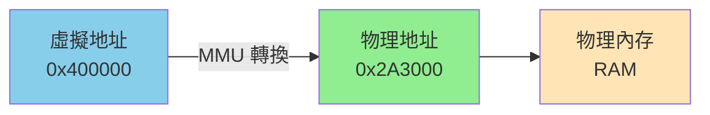
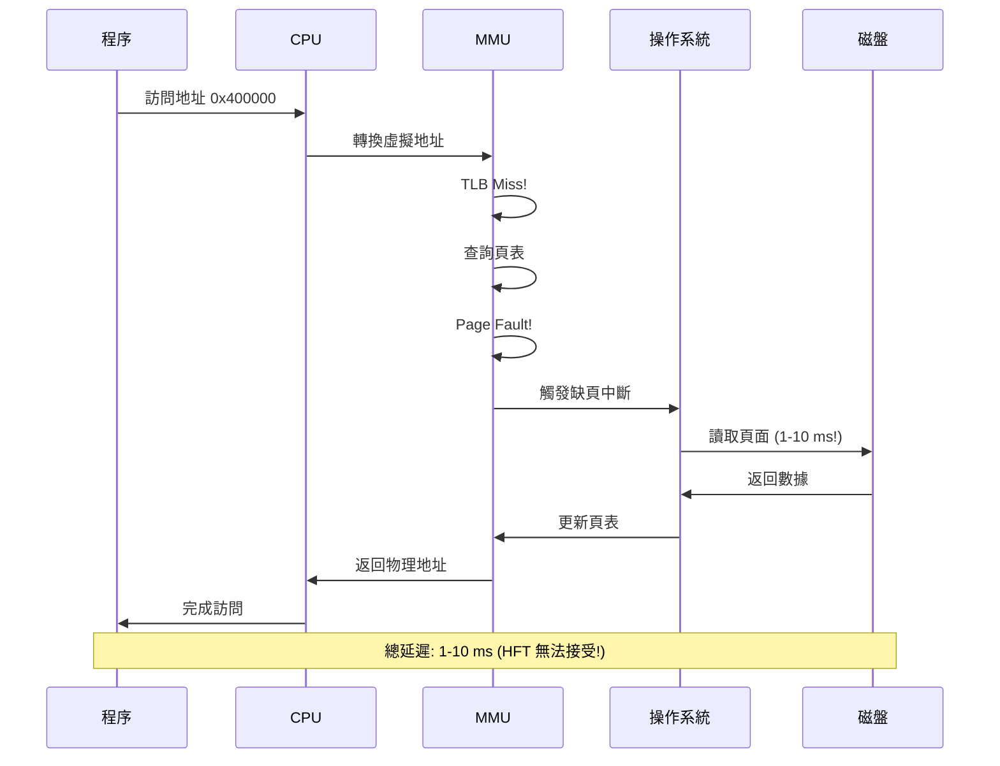
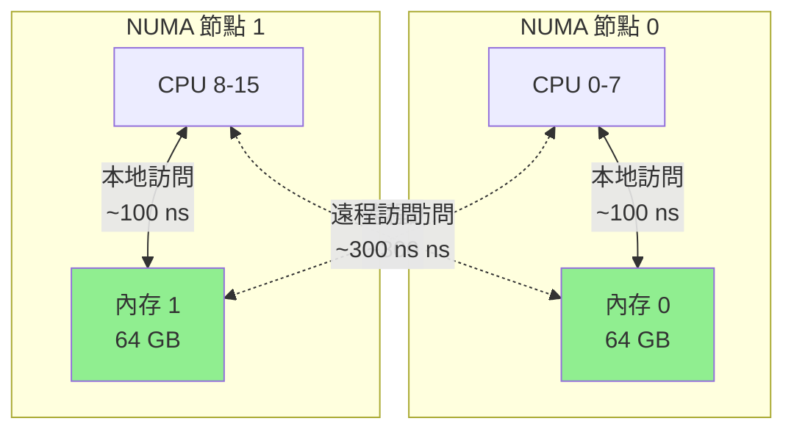

# 內存管理與 Huge Pages (Memory Management & Huge Pages)

在高頻交易系統中,內存管理的優劣直接影響延遲表現。本章深入探討虛擬內存機制、內存鎖定、Huge Pages 優化以及 NUMA 內存分配策略。

---

## 1. 虛擬內存與缺頁中斷

### 1.1 虛擬內存機制

**虛擬內存 (Virtual Memory)** 是現代操作系統的核心機制:



**⭐⭐⭐ 核心概念**:
- **虛擬地址空間**: 程序看到的內存地址是虛擬的
- **頁表 (Page Table)**: 操作系統維護虛擬地址到物理地址的映射
- **MMU (Memory Management Unit)**: 硬件完成地址轉換
- **頁大小**: 默認 4KB,Huge Page 可達 2MB/1GB

### 1.2 缺頁中斷 (Page Fault)

**缺頁中斷** 是 HFT 系統的頭號延遲殺手!

**發生時機**:
1. **Major Page Fault**: 訪問的頁不在物理內存中,需要從磁盤讀取
2. **Minor Page Fault**: 頁在物理內存中,但頁表未映射

**⭐⭐⭐ 延遲代價**:
- **Minor Page Fault**: ~1-5 μs (微秒級)
- **Major Page Fault**: ~1-10 ms (毫秒級!) - 從磁盤讀取
- **TLB Miss**: ~50-100 ns (納秒級) - 需要查詢頁表



**HFT 解決方案**:
1. ⭐⭐⭐ **內存鎖定 (mlock)**: 防止頁面被換出到磁盤
2. ⭐⭐⭐ **預觸碰 (Pre-faulting)**: 程序啟動時訪問所有內存
3. ⭐⭐⭐ **Huge Pages**: 減少頁表條目,提高 TLB 命中率

### 1.3 查看缺頁中斷

```bash
# 查看進程的缺頁統計
cat /proc/<PID>/status | grep -i fault

# 輸出範例:
# VmHWM:     10240 kB
# voluntary_ctxt_switches:    1234
# nonvoluntary_ctxt_switches: 567
# Minflt:  1234   # Minor Page Fault
# Majflt:  5      # Major Page Fault (越少越好!)

# 使用 time 命令查看
/usr/bin/time -v ./my_program

# 輸出:
# Major (requiring I/O) page faults: 0  # 理想值!
# Minor (reclaiming a frame) page faults: 1234
```

---

## 2. 內存鎖定 (Memory Locking)

### 2.1 mlock 與 mlockall

**⭐⭐⭐ mlock 系列函數**: 鎖定內存頁面,防止被交換到磁盤。

**函數簽名**:
```cpp
#include <sys/mman.h>

int mlock(const void *addr, size_t len);
int munlock(const void *addr, size_t len);
int mlockall(int flags);
int munlockall(void);
```

**參數說明**:
- `addr`: 內存區域起始地址 (建議頁對齊)
- `len`: 要鎖定的字節數
- `flags`: mlockall 標誌:
  - `MCL_CURRENT`: 鎖定當前已映射的所有頁面
  - `MCL_FUTURE`: 鎖定未來映射的所有頁面
  - `MCL_ONFAULT`: 僅在訪問時鎖定 (Linux 4.4+,延遲鎖定)

**返回值**:
- 成功: 返回 0
- 失敗: 返回 -1,並設置 `errno`

**常見 errno**:
- `ENOMEM`: 內存不足或超出鎖定限制 (ulimit -l)
- `EPERM`: 權限不足 (需要 CAP_IPC_LOCK)
- `EINVAL`: 無效參數

**效果**:
- 保證頁面駐留在 RAM 中,不會被 swap 到磁盤
- 避免 Major Page Fault (從磁盤讀取頁面,延遲 1-10ms)
- 對 HFT 系統至關重要

### 2.2 基本使用

```cpp
#include <sys/mman.h>
#include <iostream>
#include <cstring>
#include <cerrno>

class MemoryLocker {
public:
    // 鎖定所有內存
    static bool lock_all_memory() {
        if (mlockall(MCL_CURRENT | MCL_FUTURE) != 0) {
            std::cerr << "mlockall failed: " << strerror(errno) << "\n";
            std::cerr << "提示: 需要 root 權限或增加 ulimit -l\n";
            return false;
        }
        
        std::cout << "所有內存已鎖定 (不會被 swap)\n";
        return true;
    }
    
    // 解鎖所有內存
    static void unlock_all_memory() {
        munlockall();
        std::cout << "內存已解鎖\n";
    }
    
    // 鎖定特定內存區域
    static bool lock_region(void* addr, size_t size) {
        if (mlock(addr, size) != 0) {
            std::cerr << "mlock failed: " << strerror(errno) << "\n";
            return false;
        }
        
        std::cout << "鎖定 " << size << " 字節內存\n";
        return true;
    }
};

// 使用範例
void example_mlock() {
    // 鎖定所有內存
    MemoryLocker::lock_all_memory();
    
    // 分配內存 (不會被 swap 出去)
    constexpr size_t SIZE = 1024 * 1024;  // 1MB
    char* buffer = new char[SIZE];
    
    // 使用內存...
    memset(buffer, 0, SIZE);
    
    delete[] buffer;
    MemoryLocker::unlock_all_memory();
}
```

### 2.3 預觸碰內存 (Pre-faulting)

**⭐⭐⭐ HFT 核心技術**: 程序啟動時訪問所有內存,觸發所有缺頁中斷。

```cpp
#include <sys/mman.h>
#include <iostream>
#include <vector>

class MemoryPrefaulter {
public:
    // 預觸碰所有內存頁
    static void prefault_memory(void* addr, size_t size) {
        constexpr size_t PAGE_SIZE = 4096;
        volatile char* ptr = static_cast<char*>(addr);
        
        // 每隔一頁讀寫一次
        for (size_t i = 0; i < size; i += PAGE_SIZE) {
            ptr[i] = ptr[i];  // 讀寫操作,觸發缺頁
        }
        
        std::cout << "預觸碰完成: " << size << " 字節\n";
    }
    
    // 預觸碰堆棧
    static void prefault_stack(size_t stack_size = 8 * 1024 * 1024) {
        volatile char buffer[stack_size];
        
        for (size_t i = 0; i < stack_size; i += 4096) {
            buffer[i] = 0;
        }
        
        std::cout << "堆棧預觸碰完成: " << stack_size << " 字節\n";
    }
};

// HFT 系統初始化範例
void hft_initialize() {
    // 1. 鎖定內存
    mlockall(MCL_CURRENT | MCL_FUTURE);
    
    // 2. 預觸碰堆棧
    MemoryPrefaulter::prefault_stack();
    
    // 3. 預分配並預觸碰堆內存
    constexpr size_t HEAP_SIZE = 100 * 1024 * 1024;  // 100 MB
    void* heap = malloc(HEAP_SIZE);
    MemoryPrefaulter::prefault_memory(heap, HEAP_SIZE);
    
    std::cout << "HFT 系統內存初始化完成\n";
}
```

### 2.4 權限設置

mlock 需要特殊權限:

```bash
# 查看當前限制
ulimit -l
# 輸出: 64 (KB)

# 臨時增加限制 (當前 shell)
ulimit -l unlimited

# 永久設置 (編輯 /etc/security/limits.conf)
echo "* - memlock unlimited" | sudo tee -a /etc/security/limits.conf

# 或者設置 CAP_IPC_LOCK capability
sudo setcap cap_ipc_lock=eip ./my_hft_program
```

---

## 3. Huge Pages 優化

### 3.1 Huge Pages 原理

**⭐⭐⭐ Huge Pages (大頁)**: 使用比默認 4KB 更大的頁面。

**為什麼需要 Huge Pages?**

現代系統使用虛擬內存,每次內存訪問都需要通過頁表將虛擬地址轉換為物理地址。為了加速這個過程,CPU 有一個緩存叫 **TLB (Translation Lookaside Buffer)**。


**TLB (轉譯後備緩衝區)**:
- 緩存最近使用的頁表項
- 容量有限,通常只有幾百到幾千個條目
- **TLB Miss**: 未命中時需要訪問內存中的頁表 (~50-100 ns)

**⭐⭐⭐ Huge Pages 的優勢**:

| 頁大小 | 可尋址範圍 (1000 TLB 條目) | TLB 效率 | HFT 適用性 |
|--------|---------------------------|----------|-----------|
| 4KB (默認) | 4MB | 低 | 不推薦 |
| 2MB (Huge Page) | 2GB | **高** | **推薦** |
| 1GB (Gigantic Page) | 1TB | 極高 | 特大內存場景 |

**性能提升**:
- TLB Miss 減少 90%+
- 頁表查詢開銷降低
- 延遲降低 10-30% (取決於工作負載)

### 3.2 配置 Huge Pages

**⭐⭐⭐ 系統配置**:

```bash
# 查看 Huge Pages 配置
cat /proc/meminfo | grep Huge

# 輸出:
# AnonHugePages:         0 kB
# ShmemHugePages:        0 kB
# HugePages_Total:       0
# HugePages_Free:        0
# HugePages_Rsvd:        0
# HugePages_Surp:        0
# Hugepagesize:       2048 kB  # 2MB

# 配置 Huge Pages 數量 (1024 * 2MB = 2GB)
sudo sysctl -w vm.nr_hugepages=1024

# 永久配置
echo "vm.nr_hugepages=1024" | sudo tee -a /etc/sysctl.conf
sudo sysctl -p

# 查看可用的 Huge Pages
cat /proc/meminfo | grep HugePages_Free

# 配置 Huge Page 過量提交 (允許超額分配)
sudo sysctl -w vm.nr_overcommit_hugepages=512
```

### 3.3 使用 Huge Pages

**⭐⭐⭐ 方法 1: mmap + MAP_HUGETLB**

```cpp
#include <sys/mman.h>
#include <iostream>
#include <cstring>
#include <cerrno>

class HugePageAllocator {
public:
    // 分配 Huge Pages
    static void* allocate(size_t size) {
        // size 必須是 2MB 的倍數
        if (size % (2 * 1024 * 1024) != 0) {
            std::cerr << "大小必須是 2MB 的倍數\n";
            return nullptr;
        }
        
        void* addr = mmap(nullptr, size, 
                         PROT_READ | PROT_WRITE,
                         MAP_PRIVATE | MAP_ANONYMOUS | MAP_HUGETLB,
                         -1, 0);
        
        if (addr == MAP_FAILED) {
            std::cerr << "Huge Page 分配失敗: " << strerror(errno) << "\n";
            std::cerr << "提示: 檢查 vm.nr_hugepages 配置\n";
            return nullptr;
        }
        
        std::cout << "分配 " << size / (1024 * 1024) << " MB Huge Pages\n";
        return addr;
    }
    
    // 釋放 Huge Pages
    static void deallocate(void* addr, size_t size) {
        if (addr) {
            munmap(addr, size);
            std::cout << "釋放 Huge Pages\n";
        }
    }
    
    // 檢查是否使用了 Huge Pages
    static bool is_huge_page(void* addr) {
        // 讀取 /proc/self/smaps 確認
        // 這裡簡化處理
        return true;
    }
};

// 使用範例
void example_hugepage() {
    constexpr size_t SIZE = 2 * 1024 * 1024;  // 2MB
    
    void* buffer = HugePageAllocator::allocate(SIZE);
    if (buffer) {
        // 使用內存
        memset(buffer, 0, SIZE);
        
        // 進行計算...
        
        HugePageAllocator::deallocate(buffer, SIZE);
    }
}
```

**⭐⭐ 方法 2: Transparent Huge Pages (THP)**

THP 由內核自動管理,無需代碼修改:

```bash
# 查看 THP 狀態
cat /sys/kernel/mm/transparent_hugepage/enabled
# [always] madvise never

# 啟用 THP (always 模式)
echo always | sudo tee /sys/kernel/mm/transparent_hugepage/enabled

# ⚠️ HFT 警告: THP 可能導致延遲抖動,建議使用 madvise 模式
echo madvise | sudo tee /sys/kernel/mm/transparent_hugepage/enabled

# 禁用 THP (推薦 HFT 使用顯式 Huge Pages)
echo never | sudo tee /sys/kernel/mm/transparent_hugepage/enabled
```

**使用 madvise 提示**:

```cpp
#include <sys/mman.h>

void use_transparent_hugepage(void* addr, size_t size) {
    // 建議內核使用 THP
    madvise(addr, size, MADV_HUGEPAGE);
}

void example_thp() {
    constexpr size_t SIZE = 10 * 1024 * 1024;  // 10MB
    void* buffer = malloc(SIZE);
    
    // 建議使用 THP
    madvise(buffer, SIZE, MADV_HUGEPAGE);
    
    // 預觸碰
    memset(buffer, 0, SIZE);
    
    // 使用內存...
    
    free(buffer);
}
```

### 3.4 Huge Pages vs THP 對比

| 特性 | Huge Pages | Transparent Huge Pages (THP) |
|-----|-----------|------------------------------|
| **配置方式** | 顯式分配 | 內核自動 |
| **性能** | 穩定,可預測 | 可能有抖動 |
| **延遲** | 最優 | 偶爾延遲尖峰 |
| **內存開銷** | 需要預留 | 動態管理 |
| **HFT 推薦** | **推薦** (顯式控制) | 謹慎使用 (madvise 模式) |

### 3.5 HFT 實戰: Huge Page 內存池

**⭐⭐⭐ 生產級實現**:

```cpp
#include <sys/mman.h>
#include <iostream>
#include <vector>
#include <mutex>

class HugePagePool {
    void* base_addr_;
    size_t total_size_;
    size_t allocated_;
    std::mutex mutex_;
    
public:
    HugePagePool(size_t size_mb) {
        total_size_ = size_mb * 1024 * 1024;
        
        // 確保是 2MB 的倍數
        total_size_ = (total_size_ + (2 * 1024 * 1024 - 1)) 
                     & ~(2 * 1024 * 1024 - 1);
        
        base_addr_ = mmap(nullptr, total_size_,
                         PROT_READ | PROT_WRITE,
                         MAP_PRIVATE | MAP_ANONYMOUS | MAP_HUGETLB,
                         -1, 0);
        
        if (base_addr_ == MAP_FAILED) {
            throw std::runtime_error("Huge Page 分配失敗");
        }
        
        // 預觸碰所有頁面
        memset(base_addr_, 0, total_size_);
        
        allocated_ = 0;
        
        std::cout << "Huge Page 池初始化: " << size_mb << " MB\n";
    }
    
    ~HugePagePool() {
        if (base_addr_ != MAP_FAILED) {
            munmap(base_addr_, total_size_);
        }
    }
    
    // 從池中分配內存
    void* allocate(size_t size) {
        std::lock_guard<std::mutex> lock(mutex_);
        
        if (allocated_ + size > total_size_) {
            std::cerr << "Huge Page 池耗盡\n";
            return nullptr;
        }
        
        void* ptr = static_cast<char*>(base_addr_) + allocated_;
        allocated_ += size;
        
        return ptr;
    }
    
    // 獲取使用統計
    void print_stats() const {
        std::cout << "Huge Page 使用: " 
                  << (allocated_ / 1024.0 / 1024.0) << " / "
                  << (total_size_ / 1024.0 / 1024.0) << " MB\n";
    }
};

// 使用範例
void example_hugepage_pool() {
    // 初始化 100MB Huge Page 池
    HugePagePool pool(100);
    
    // 分配內存
    void* buffer1 = pool.allocate(10 * 1024 * 1024);  // 10MB
    void* buffer2 = pool.allocate(20 * 1024 * 1024);  // 20MB
    
    pool.print_stats();
    
    // 使用內存...
}
```

---

## 4. NUMA 內存優化

### 4.1 NUMA 內存分配策略

**⭐⭐⭐ NUMA (Non-Uniform Memory Access)**: 多處理器系統中,每個 CPU 有本地內存。



**關鍵數據**:
- 本地內存訪問: ~100 ns
- 遠程內存訪問: ~300 ns (3 倍延遲!)
- **HFT 影響**: 每次跨節點訪問增加 200 ns

### 4.2 NUMA 內存分配

**函數簽名**:
```cpp
#include <numa.h>
#include <numaif.h>

// NUMA 系統查詢
int numa_available(void);
int numa_num_configured_nodes(void);
int numa_node_of_cpu(int cpu);

// NUMA 內存分配
void *numa_alloc(size_t size);
void *numa_alloc_onnode(size_t size, int node);
void *numa_alloc_local(size_t size);
void *numa_alloc_interleaved(size_t size);
void numa_free(void *mem, size_t size);

// NUMA 策略設置
void numa_set_preferred(int node);
void numa_bind(struct bitmask *nodemask);
```

**參數說明**:
- `size`: 分配的字節數
- `node`: NUMA 節點編號 (0-based)
- `nodemask`: NUMA 節點掩碼

**返回值**:
- **numa_available**: -1 表示不支持 NUMA,0 表示支持
- **內存分配函數**: 成功返回指標,失敗返回 NULL
- **numa_num_configured_nodes**: 返回 NUMA 節點數量
- **numa_node_of_cpu**: 返回指定 CPU 所屬的 NUMA 節點編號

**分配策略**:
- `numa_alloc_onnode`: 在指定節點分配 (本地訪問最快)
- `numa_alloc_local`: 在當前線程運行的節點分配
- `numa_alloc_interleaved`: 跨所有節點交錯分配 (負載均衡)

**⭐⭐⭐ 核心 API** (需要 libnuma):

```cpp
#include <numa.h>
#include <numaif.h>
#include <sched.h>
#include <iostream>

class NUMAAllocator {
public:
    // 檢查系統是否支持 NUMA
    static bool is_available() {
        return numa_available() != -1;
    }
    
    // 獲取 NUMA 節點數量
    static int get_num_nodes() {
        return numa_num_configured_nodes();
    }
    
    // 獲取當前線程運行的 NUMA 節點
    static int get_current_node() {
        return numa_node_of_cpu(sched_getcpu());
    }
    
    // 在指定 NUMA 節點分配內存
    static void* alloc_on_node(size_t size, int node) {
        void* ptr = numa_alloc_onnode(size, node);
        if (ptr == nullptr) {
            std::cerr << "無法在節點 " << node << " 分配內存\n";
        }
        return ptr;
    }
    
    // 在本地 NUMA 節點分配內存
    static void* alloc_local(size_t size) {
        return numa_alloc_local(size);
    }
    
    // 在所有 NUMA 節點上交錯分配 (均勻分布)
    static void* alloc_interleaved(size_t size) {
        return numa_alloc_interleaved(size);
    }
    
    // 釋放 NUMA 內存
    static void free(void* ptr, size_t size) {
        numa_free(ptr, size);
    }
    
    // 綁定線程到指定 NUMA 節點
    static bool bind_to_node(int node) {
        struct bitmask* mask = numa_allocate_nodemask();
        numa_bitmask_setbit(mask, node);
        numa_bind(mask);
        numa_free_nodemask(mask);
        return true;
    }
};

// 使用範例
void example_numa() {
    if (!NUMAAllocator::is_available()) {
        std::cout << "系統不支持 NUMA\n";
        return;
    }
    
    std::cout << "NUMA 節點數: " << NUMAAllocator::get_num_nodes() << "\n";
    std::cout << "當前節點: " << NUMAAllocator::get_current_node() << "\n";
    
    constexpr size_t SIZE = 100 * 1024 * 1024;  // 100 MB
    
    // 在節點 0 分配內存
    void* mem0 = NUMAAllocator::alloc_on_node(SIZE, 0);
    std::cout << "在節點 0 分配內存: " << mem0 << "\n";
    
    // 在本地節點分配內存
    void* mem_local = NUMAAllocator::alloc_local(SIZE);
    std::cout << "在本地節點分配內存: " << mem_local << "\n";
    
    // 清理
    NUMAAllocator::free(mem0, SIZE);
    NUMAAllocator::free(mem_local, SIZE);
}
```

### 4.3 NUMA + Huge Pages 組合

**⭐⭐⭐ 終極優化**: 在特定 NUMA 節點上分配 Huge Pages。

```cpp
#include <numa.h>
#include <sys/mman.h>
#include <iostream>

class NUMAHugePageAllocator {
public:
    // 在指定 NUMA 節點上分配 Huge Pages
    static void* allocate(size_t size, int node) {
        // 先綁定到目標節點
        numa_set_preferred(node);
        
        // 分配 Huge Pages
        void* addr = mmap(nullptr, size,
                         PROT_READ | PROT_WRITE,
                         MAP_PRIVATE | MAP_ANONYMOUS | MAP_HUGETLB,
                         -1, 0);
        
        if (addr == MAP_FAILED) {
            std::cerr << "NUMA Huge Page 分配失敗\n";
            return nullptr;
        }
        
        // 預觸碰
        memset(addr, 0, size);
        
        std::cout << "在 NUMA 節點 " << node 
                  << " 分配 " << (size / 1024 / 1024) << " MB Huge Pages\n";
        
        return addr;
    }
    
    static void deallocate(void* addr, size_t size) {
        munmap(addr, size);
    }
};

// HFT 實戰: 為每個 NUMA 節點分配專屬內存池
class NUMAMemoryPools {
    struct Pool {
        void* base;
        size_t size;
        size_t used;
    };
    
    std::vector<Pool> pools_;
    
public:
    void initialize(size_t pool_size_mb) {
        int num_nodes = numa_num_configured_nodes();
        pools_.resize(num_nodes);
        
        for (int node = 0; node < num_nodes; ++node) {
            size_t size = pool_size_mb * 1024 * 1024;
            void* base = NUMAHugePageAllocator::allocate(size, node);
            
            pools_[node] = {base, size, 0};
        }
        
        std::cout << "初始化 " << num_nodes << " 個 NUMA 內存池\n";
    }
    
    void* allocate(size_t size, int node) {
        if (node >= pools_.size()) return nullptr;
        
        Pool& pool = pools_[node];
        if (pool.used + size > pool.size) return nullptr;
        
        void* ptr = static_cast<char*>(pool.base) + pool.used;
        pool.used += size;
        
        return ptr;
    }
};
```

---

## 5. 內存分配器優化

### 5.1 對象池 (Object Pool)

**⭐⭐⭐ HFT 核心技術**: 預分配對象,避免運行時動態分配。

```cpp
#include <vector>
#include <stack>
#include <iostream>

template<typename T>
class ObjectPool {
    std::vector<T> storage_;
    std::stack<T*> free_list_;
    
public:
    ObjectPool(size_t capacity) {
        storage_.reserve(capacity);
        
        for (size_t i = 0; i < capacity; ++i) {
            storage_.emplace_back();
            free_list_.push(&storage_[i]);
        }
        
        std::cout << "對象池初始化: " << capacity << " 個對象\n";
    }
    
    // 獲取對象
    T* acquire() {
        if (free_list_.empty()) {
            std::cerr << "對象池耗盡!\n";
            return nullptr;
        }
        
        T* obj = free_list_.top();
        free_list_.pop();
        return obj;
    }
    
    // 歸還對象
    void release(T* obj) {
        // 重置對象狀態
        *obj = T{};
        free_list_.push(obj);
    }
    
    size_t available() const {
        return free_list_.size();
    }
};

// 使用範例
struct Order {
    int id;
    double price;
    int quantity;
};

void example_object_pool() {
    ObjectPool<Order> pool(10000);
    
    // 快速獲取對象 (無動態分配)
    Order* order = pool.acquire();
    if (order) {
        order->id = 1;
        order->price = 100.0;
        order->quantity = 10;
        
        // 使用訂單...
        
        // 歸還對象
        pool.release(order);
    }
    
    std::cout << "可用對象: " << pool.available() << "\n";
}
```

### 5.2 內存arena

**⭐⭐ 區域分配器**: 批量分配,統一釋放。

```cpp
#include <cstddef>
#include <cstring>
#include <iostream>

class MemoryArena {
    char* buffer_;
    size_t size_;
    size_t offset_;
    
public:
    MemoryArena(size_t size) : size_(size), offset_(0) {
        buffer_ = new char[size];
        std::cout << "Arena 初始化: " << (size / 1024 / 1024) << " MB\n";
    }
    
    ~MemoryArena() {
        delete[] buffer_;
    }
    
    // 分配內存
    void* allocate(size_t bytes, size_t alignment = 8) {
        // 對齊
        size_t aligned_offset = (offset_ + alignment - 1) & ~(alignment - 1);
        
        if (aligned_offset + bytes > size_) {
            std::cerr << "Arena 空間不足\n";
            return nullptr;
        }
        
        void* ptr = buffer_ + aligned_offset;
        offset_ = aligned_offset + bytes;
        
        return ptr;
    }
    
    // 重置 arena (釋放所有分配)
    void reset() {
        offset_ = 0;
    }
    
    size_t used() const { return offset_; }
    size_t available() const { return size_ - offset_; }
};

// 使用範例
void example_arena() {
    MemoryArena arena(10 * 1024 * 1024);  // 10MB
    
    // 快速分配
    int* array1 = static_cast<int*>(arena.allocate(1000 * sizeof(int)));
    double* array2 = static_cast<double*>(arena.allocate(500 * sizeof(double)));
    
    std::cout << "已使用: " << arena.used() << " 字節\n";
    
    // 重置 (一次性釋放所有)
    arena.reset();
}
```

---

## 6. 性能測試與監控

### 6.1 測量內存訪問延遲

**⭐⭐⭐ 驗證 Huge Pages 效果**:

```cpp
#include <chrono>
#include <iostream>
#include <cstring>

class MemoryBenchmark {
public:
    // 測試內存訪問延遲
    static void benchmark_latency(void* addr, size_t size, const char* desc) {
        constexpr int ITERATIONS = 1000000;
        volatile long long sum = 0;
        
        auto start = std::chrono::high_resolution_clock::now();
        
        long long* ptr = static_cast<long long*>(addr);
        for (int i = 0; i < ITERATIONS; ++i) {
            sum += ptr[i % (size / sizeof(long long))];
        }
        
        auto end = std::chrono::high_resolution_clock::now();
        auto duration = std::chrono::duration_cast<std::chrono::nanoseconds>(
            end - start);
        
        double avg_ns = duration.count() / static_cast<double>(ITERATIONS);
        
        std::cout << desc << " - 平均延遲: " << avg_ns << " ns\n";
    }
};

void compare_hugepage_performance() {
    constexpr size_t SIZE = 100 * 1024 * 1024;  // 100MB
    
    // 測試 1: 普通分配
    void* normal_mem = malloc(SIZE);
    memset(normal_mem, 0, SIZE);
    MemoryBenchmark::benchmark_latency(normal_mem, SIZE, "普通內存");
    
    // 測試 2: Huge Pages
    void* huge_mem = mmap(nullptr, SIZE, PROT_READ | PROT_WRITE,
                         MAP_PRIVATE | MAP_ANONYMOUS | MAP_HUGETLB, -1, 0);
    if (huge_mem != MAP_FAILED) {
        memset(huge_mem, 0, SIZE);
        MemoryBenchmark::benchmark_latency(huge_mem, SIZE, "Huge Pages");
        munmap(huge_mem, SIZE);
    }
    
    free(normal_mem);
}

/* 輸出範例:
普通內存 - 平均延遲: 8.5 ns
Huge Pages - 平均延遲: 6.2 ns
性能提升: ~27%
*/
```

### 6.2 監控內存使用

```bash
# 查看進程內存詳細信息
cat /proc/<PID>/smaps | grep -A 10 "huge"

# 查看 Huge Pages 使用統計
numastat -m | grep Huge

# 使用 perf 監控 TLB Miss
perf stat -e dTLB-load-misses,dTLB-store-misses -p <PID> sleep 10

# 輸出範例:
# 45,123  dTLB-load-misses   (普通內存)
# 2,456   dTLB-load-misses   (Huge Pages) - 減少 94%!
```

---

## 參考資料 (References)

1. **Linux 內核文檔**
   - [Huge Pages](https://www.kernel.org/doc/Documentation/vm/hugetlbpage.txt)
   - [mlock()](https://man7.org/linux/man-pages/man2/mlock.2.html)
   - [NUMA Memory Policy](https://man7.org/linux/man-pages/man7/numa.7.html)

2. **書籍**
   - 《Systems Performance》 Chapter 7 (Brendan Gregg, 2020)
   - 《Understanding the Linux Virtual Memory Manager》 (Mel Gorman, 2004)
   - 《What Every Programmer Should Know About Memory》 (Ulrich Drepper, 2007)

3. **工具**
   - [numactl](https://linux.die.net/man/8/numactl) - NUMA 控制工具
   - [numastat](https://linux.die.net/man/8/numastat) - NUMA 統計工具
   - [perf](https://perf.wiki.kernel.org/) - 性能分析工具

4. **HFT 最佳實踐**
   - [Memory Management for Low Latency](https://rigtorp.se/low-latency-guide/)
   - [NUMA Optimization Guide](https://www.kernel.org/doc/html/latest/vm/numa.html)
