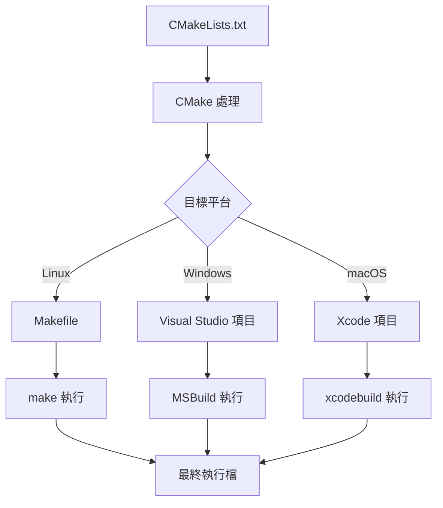

# CMake 構建系統

> **優先級**: ⭐⭐ 建議  
> **適用場景**: 現代 C++ 專案建置、HFT 系統構建、跨平台開發  
> **前置知識**: 基本編譯概念、Makefile 原理

## 目錄

- [核心概念](#核心概念)
- [現代 CMake 基礎](#現代-cmake-基礎)
- [專案結構最佳實踐](#專案結構最佳實踐)
- [第三方庫整合](#第三方庫整合)
- [編譯選項與優化](#編譯選項與優化)
- [HFT 專案實戰](#hft-專案實戰)
- [進階配置技巧](#進階配置技巧)
- [CI/CD 整合](#cicd-整合)
- [最佳實踐](#最佳實踐)
- [常見陷阱](#常見陷阱)
- [參考資料](#參考資料)

---

## 核心概念

### 1. CMake 的工作原理

CMake 是一個**構建系統生成器 (Build System Generator)**，而不是構建系統本身。它的工作流程：



**類比**: CMake 就像建築藍圖設計師，根據你的需求（CMakeLists.txt）設計藍圖（Makefile 等），然後由實際的建築工人（make/MSBuild）按圖施工。

### 2. Target-Based 現代寫法

現代 CMake 的核心是 **Target**，每個 Target 都有自己的屬性：

- **PRIVATE**: 只影響自己
- **PUBLIC**: 影響自己和依賴者
- **INTERFACE**: 只影響依賴者

```cpp
// 類比：餐廳的食材管理
// PRIVATE：廚房內部使用的調料（不給顧客看）
// PUBLIC：既要用來做菜，也要展示給顧客的食材
// INTERFACE：只展示不使用的裝飾品
```

---

## 現代 CMake 基礎

### 1. 最小 CMakeLists.txt

```cmake
cmake_minimum_required(VERSION 3.20)
project(HFTSystem 
    VERSION 1.0.0 
    DESCRIPTION "High Frequency Trading System"
    LANGUAGES CXX
)

# 設定 C++ 標準
set(CMAKE_CXX_STANDARD 20)
set(CMAKE_CXX_STANDARD_REQUIRED ON)
set(CMAKE_CXX_EXTENSIONS OFF)

# 創建執行檔
add_executable(hft_engine 
    src/main.cpp
    src/market_data.cpp
    src/order_book.cpp
)
```

### 2. Target-Based 現代寫法

```cmake
# 創建靜態庫 Target
add_library(market_data STATIC
    src/market_data.cpp
    src/order_book.cpp
    src/price_feed.cpp
)

# 設定 Include 目錄（現代方式）
target_include_directories(market_data
    PUBLIC
        # 構建時的 include 路徑
        $<BUILD_INTERFACE:${CMAKE_CURRENT_SOURCE_DIR}/include>
        # 安裝後的 include 路徑
        $<INSTALL_INTERFACE:include>
    PRIVATE
        ${CMAKE_CURRENT_SOURCE_DIR}/src
)

# 連結函式庫
target_link_libraries(market_data
    PUBLIC
        pthread      # 公開依賴（使用者也需要）
    PRIVATE
        fmt::fmt     # 私有依賴（僅內部使用）
)

# 編譯選項（支援多編譯器）
target_compile_options(market_data
    PRIVATE
        $<$<CXX_COMPILER_ID:GNU>:-Wall -Wextra -O3 -march=native>
        $<$<CXX_COMPILER_ID:Clang>:-Wall -Wextra -O3 -march=native>
        $<$<CXX_COMPILER_ID:MSVC>:/W4 /O2>
)

# 編譯定義
target_compile_definitions(market_data
    PUBLIC
        HFT_VERSION_MAJOR=1
    PRIVATE
        $<$<CONFIG:Debug>:DEBUG_MODE>
        $<$<CONFIG:Release>:NDEBUG>
)
```

---

## 專案結構最佳實踐

### 1. 推薦目錄結構

```
hft_system/
├── CMakeLists.txt                 # 頂層 CMake 文件
├── cmake/                         # CMake 模組
│   ├── CompilerWarnings.cmake     # 編譯器警告設置
│   ├── FindCustomLib.cmake        # 自定義 Find 模組
│   └── HFTConfig.cmake.in         # 配置模板
├── include/                       # 公開標頭檔
│   └── hft/
│       ├── market_data.hpp
│       ├── order_book.hpp
│       └── trading_engine.hpp
├── src/                           # 源代碼
│   ├── CMakeLists.txt
│   ├── market_data.cpp
│   ├── order_book.cpp
│   └── main.cpp
├── tests/                         # 單元測試
│   ├── CMakeLists.txt
│   ├── test_market_data.cpp
│   └── test_order_book.cpp
├── benchmarks/                    # 性能測試
│   ├── CMakeLists.txt
│   └── bench_order_book.cpp
├── docs/                          # 文檔
├── scripts/                       # 構建腳本
│   ├── build.sh
│   └── install.sh
└── external/                      # 第三方庫（可選）
    └── fmt/
```

### 2. 頂層 CMakeLists.txt

```cmake
cmake_minimum_required(VERSION 3.20)
project(HFTSystem
    VERSION 1.2.0
    DESCRIPTION "High Frequency Trading System"
    HOMEPAGE_URL "https://github.com/company/hft-system"
    LANGUAGES CXX
)

# ==================== 選項設置 ====================
option(BUILD_TESTS "Build unit tests" ON)
option(BUILD_BENCHMARKS "Build benchmarks" ON)
option(BUILD_DOCS "Build documentation" OFF)
option(ENABLE_LTO "Enable Link-Time Optimization" ON)
option(ENABLE_SANITIZERS "Enable sanitizers for debugging" OFF)

# ==================== C++ 標準 ====================
set(CMAKE_CXX_STANDARD 20)
set(CMAKE_CXX_STANDARD_REQUIRED ON)
set(CMAKE_CXX_EXTENSIONS OFF)

# ==================== 輸出目錄 ====================
set(CMAKE_RUNTIME_OUTPUT_DIRECTORY ${CMAKE_BINARY_DIR}/bin)
set(CMAKE_LIBRARY_OUTPUT_DIRECTORY ${CMAKE_BINARY_DIR}/lib)
set(CMAKE_ARCHIVE_OUTPUT_DIRECTORY ${CMAKE_BINARY_DIR}/lib)

# ==================== CMake 模組路徑 ====================
list(APPEND CMAKE_MODULE_PATH "${CMAKE_CURRENT_SOURCE_DIR}/cmake")

# ==================== 編譯器設置 ====================
include(CompilerWarnings)

# ==================== 構建類型默認值 ====================
if(NOT CMAKE_BUILD_TYPE AND NOT CMAKE_CONFIGURATION_TYPES)
    set(CMAKE_BUILD_TYPE Release CACHE STRING 
        "Choose the type of build." FORCE)
    set_property(CACHE CMAKE_BUILD_TYPE PROPERTY STRINGS 
        "Debug" "Release" "MinSizeRel" "RelWithDebInfo")
endif()

# ==================== 子目錄 ====================
add_subdirectory(src)

# 條件性添加測試
if(BUILD_TESTS)
    enable_testing()
    add_subdirectory(tests)
endif()

# 條件性添加基準測試
if(BUILD_BENCHMARKS)
    add_subdirectory(benchmarks)
endif()

# ==================== 安裝配置 ====================
include(GNUInstallDirs)
install(TARGETS hft_core hft_engine
    EXPORT HFTTargets
    LIBRARY DESTINATION ${CMAKE_INSTALL_LIBDIR}
    ARCHIVE DESTINATION ${CMAKE_INSTALL_LIBDIR}
    RUNTIME DESTINATION ${CMAKE_INSTALL_BINDIR}
    INCLUDES DESTINATION ${CMAKE_INSTALL_INCLUDEDIR}
)

install(DIRECTORY include/ 
    DESTINATION ${CMAKE_INSTALL_INCLUDEDIR}
)
```

---

## 第三方庫整合

### 1. 使用 find_package（系統已安裝）

```cmake
# 尋找已安裝的套件
find_package(Boost 1.75 REQUIRED COMPONENTS system thread)
find_package(OpenSSL REQUIRED)
find_package(Threads REQUIRED)

# 使用現代 Target 語法
target_link_libraries(hft_engine
    PRIVATE
        Boost::system
        Boost::thread
        OpenSSL::SSL
        OpenSSL::Crypto
        Threads::Threads
)
```

### 2. 使用 FetchContent（推薦）

```cmake
include(FetchContent)

# ==================== fmt 庫 ====================
FetchContent_Declare(
    fmt
    GIT_REPOSITORY https://github.com/fmtlib/fmt.git
    GIT_TAG 9.1.0
    GIT_SHALLOW TRUE
)

# ==================== spdlog 日誌庫 ====================
FetchContent_Declare(
    spdlog
    GIT_REPOSITORY https://github.com/gabime/spdlog.git
    GIT_TAG v1.11.0
    GIT_SHALLOW TRUE
)

# ==================== Google Benchmark ====================
if(BUILD_BENCHMARKS)
    FetchContent_Declare(
        benchmark
        GIT_REPOSITORY https://github.com/google/benchmark.git
        GIT_TAG v1.8.0
        GIT_SHALLOW TRUE
    )
    # 禁用 benchmark 的測試
    set(BENCHMARK_ENABLE_TESTING OFF CACHE BOOL "" FORCE)
endif()

# ==================== Google Test ====================
if(BUILD_TESTS)
    FetchContent_Declare(
        googletest
        GIT_REPOSITORY https://github.com/google/googletest.git
        GIT_TAG v1.13.0
        GIT_SHALLOW TRUE
    )
    # 防止 Google Test 覆蓋父專案的編譯選項
    set(gtest_force_shared_crt ON CACHE BOOL "" FORCE)
endif()

# 一次性獲取所有庫
FetchContent_MakeAvailable(fmt spdlog)

if(BUILD_BENCHMARKS)
    FetchContent_MakeAvailable(benchmark)
endif()

if(BUILD_TESTS)
    FetchContent_MakeAvailable(googletest)
endif()
```

### 3. 使用 Conan 2.0（推薦的依賴管理）

Conan 是 C++ 生態系統中最成熟的包管理器，Conan 2.0 提供了更好的 CMake 整合和現代化的依賴管理。

#### Conan 2.0 基礎配置

```python
# conanfile.py - Conan 2.0 配置文件
from conan import ConanFile
from conan.tools.cmake import CMakeDeps, CMakeToolchain, cmake_layout

class HFTSystemConan(ConanFile):
    settings = "os", "compiler", "build_type", "arch"
    
    # 依賴聲明
    def requirements(self):
        # 基礎庫
        self.requires("fmt/9.1.0")
        self.requires("spdlog/1.11.0")
        self.requires("boost/1.82.0")
        
        # JSON 處理
        self.requires("nlohmann_json/3.11.2")
        self.requires("simdjson/3.2.0")
        
        # 網路庫
        self.requires("openssl/3.1.0")
        self.requires("zlib/1.2.13")
        
        # 高性能庫
        self.requires("jemalloc/5.3.0")
        self.requires("tbb/2021.9.0")
        
    # 構建需求（僅構建時需要）
    def build_requirements(self):
        self.test_requires("gtest/1.13.0")
        self.test_requires("benchmark/1.8.0")
        
    # 選項配置
    def configure(self):
        # HFT 系統優化配置
        if self.settings.build_type == "Release":
            self.options["boost"].shared = False
            self.options["openssl"].shared = False
            # 啟用 Boost 的高性能選項
            self.options["boost"].without_python = True
            self.options["boost"].without_test = True
            
    # CMake 配置生成
    def generate(self):
        # 生成 CMake 依賴配置
        deps = CMakeDeps(self)
        deps.generate()
        
        # 生成 CMake 工具鏈
        tc = CMakeToolchain(self)
        
        # HFT 特定的編譯器標誌
        if self.settings.build_type == "Release":
            tc.variables["CMAKE_CXX_FLAGS_RELEASE"] = "-O3 -march=native -DNDEBUG"
            tc.variables["ENABLE_LTO"] = True
            
        # 啟用 Conan 的包管理器集成
        tc.variables["CMAKE_PROJECT_TOP_LEVEL_INCLUDES"] = "conan_provider.cmake"
        tc.generate()
        
    # 布局配置
    def layout(self):
        cmake_layout(self)
```

#### Conan Profile 配置

```ini
# profiles/hft_release - HFT 發布配置
[settings]
os=Linux
arch=x86_64
compiler=gcc
compiler.version=12
compiler.libcxx=libstdc++11
compiler.cppstd=20
build_type=Release

[options]


[conf]
# 編譯器優化
tools.cmake.cmaketoolchain:generator=Ninja
tools.system.package_manager:mode=install
tools.system.package_manager:sudo=True

# 並行構建
tools.cmake.cmake_layout:build_folder_vars=["settings.compiler", "settings.build_type"]
tools.build:jobs=8

# HFT 特定配置
user.mycompany.hft:enable_fast_math=True
user.mycompany.hft:target_cpu=native
```

```ini
# profiles/hft_debug - HFT 調試配置
[settings]
os=Linux
arch=x86_64
compiler=gcc
compiler.version=12
compiler.libcxx=libstdc++11
compiler.cppstd=20
build_type=Debug

[options]


[conf]
tools.cmake.cmaketoolchain:generator=Ninja
tools.build:jobs=8

# 調試工具
user.mycompany.hft:enable_sanitizers=True
user.mycompany.hft:enable_debug_symbols=True
```

#### CMake 與 Conan 整合

```cmake
# 頂層 CMakeLists.txt - Conan 2.0 整合
cmake_minimum_required(VERSION 3.20)
project(HFTSystem VERSION 2.1.0 LANGUAGES CXX)

# ==================== Conan 整合 ====================
# Conan 2.0 自動查找依賴
find_package(fmt REQUIRED)
find_package(spdlog REQUIRED)
find_package(Boost REQUIRED COMPONENTS system thread)
find_package(nlohmann_json REQUIRED)
find_package(simdjson REQUIRED)
find_package(OpenSSL REQUIRED)
find_package(jemalloc REQUIRED)
find_package(TBB REQUIRED)

# 測試依賴（條件性）
if(BUILD_TESTS)
    find_package(GTest REQUIRED)
    find_package(benchmark REQUIRED)
endif()

# ==================== 核心庫配置 ====================
add_library(hft_core STATIC
    src/market_data/feed_handler.cpp
    src/trading/engine.cpp
    src/network/udp_receiver.cpp
    # ... 其他源文件
)

# 使用 Conan 提供的 modern targets
target_link_libraries(hft_core
    PUBLIC
        fmt::fmt
        spdlog::spdlog
        nlohmann_json::nlohmann_json
        simdjson::simdjson
    PRIVATE
        Boost::system
        Boost::thread
        OpenSSL::SSL
        OpenSSL::Crypto
        jemalloc::jemalloc
        TBB::tbb
)

# HFT 優化設置
target_compile_definitions(hft_core PRIVATE
    $<$<CONFIG:Release>:
        HFT_RELEASE
        BOOST_DISABLE_ASSERTS
        SPDLOG_ACTIVE_LEVEL=SPDLOG_LEVEL_INFO
    >
    $<$<CONFIG:Debug>:
        HFT_DEBUG
        SPDLOG_ACTIVE_LEVEL=SPDLOG_LEVEL_TRACE
    >
)
```

#### Conan 工作流腳本

```bash
#!/bin/bash
# scripts/conan_build.sh - Conan 2.0 構建腳本

set -e

PROJECT_ROOT=$(pwd)
BUILD_TYPE=${1:-Release}
PROFILE=${2:-hft_release}

echo "=== Conan 2.0 HFT Build Pipeline ==="
echo "Build Type: $BUILD_TYPE"
echo "Profile: $PROFILE"

# 檢查 Conan 版本
if ! command -v conan &> /dev/null; then
    echo "Error: Conan 2.0 not found. Please install: pip install conan>=2.0"
    exit 1
fi

CONAN_VERSION=$(conan --version | grep -o '[0-9]\+\.[0-9]\+' | head -n1)
if [[ $(echo "$CONAN_VERSION < 2.0" | bc -l) -eq 1 ]]; then
    echo "Error: Conan 2.0+ required, found $CONAN_VERSION"
    exit 1
fi

# 步驟 1: 檢測並創建 profile
if [[ ! -f ~/.conan2/profiles/$PROFILE ]]; then
    echo "Creating Conan profile: $PROFILE"
    conan profile detect --force
    cp profiles/$PROFILE ~/.conan2/profiles/$PROFILE
fi

# 步驟 2: 安裝依賴
echo "Installing dependencies with Conan..."
conan install . \
    --build missing \
    --profile:build=$PROFILE \
    --profile:host=$PROFILE \
    --settings build_type=$BUILD_TYPE

# 步驟 3: 配置 CMake
echo "Configuring CMake with Conan toolchain..."
cmake --preset conan-$BUILD_TYPE

# 步驟 4: 構建項目
echo "Building project..."
cmake --build --preset conan-$BUILD_TYPE --parallel

# 步驟 5: 運行測試
if [[ "$BUILD_TYPE" == "Debug" ]] || [[ "$BUILD_TYPE" == "RelWithDebInfo" ]]; then
    echo "Running tests..."
    ctest --preset conan-$BUILD_TYPE --output-on-failure
fi

# 步驟 6: 運行基準測試（僅 Release 模式）
if [[ "$BUILD_TYPE" == "Release" ]]; then
    echo "Running benchmarks..."
    ./build/$BUILD_TYPE/bin/bench_order_book --benchmark_format=json
fi

echo "Build completed successfully!"
```

#### Conan 包創建

```python
# conanfile.py - 創建可重用的 HFT 庫包
from conan import ConanFile
from conan.tools.cmake import CMake, CMakeDeps, CMakeToolchain, cmake_layout
from conan.tools.files import copy

class HFTCoreConan(ConanFile):
    name = "hft-core"
    version = "2.1.0"
    
    # 包元數據
    description = "High-Frequency Trading Core Library"
    topics = ("hft", "trading", "finance", "low-latency")
    url = "https://github.com/mycompany/hft-core"
    license = "MIT"
    
    # 設置和選項
    settings = "os", "compiler", "build_type", "arch"
    options = {
        "shared": [True, False],
        "fPIC": [True, False],
        "enable_benchmarks": [True, False],
        "enable_profiling": [True, False],
        "target_cpu": ["generic", "native", "skylake", "zen3"]
    }
    default_options = {
        "shared": False,
        "fPIC": True,
        "enable_benchmarks": False,
        "enable_profiling": False,
        "target_cpu": "native"
    }
    
    # 導出源碼
    exports_sources = "CMakeLists.txt", "src/*", "include/*", "cmake/*"
    
    def requirements(self):
        # 運行時依賴
        self.requires("fmt/9.1.0")
        self.requires("spdlog/1.11.0")
        self.requires("boost/1.82.0")
        
    def build_requirements(self):
        # 構建時依賴
        if self.options.enable_benchmarks:
            self.test_requires("benchmark/1.8.0")
            
    def configure(self):
        if self.settings.os == "Windows":
            del self.options.fPIC
            
    def layout(self):
        cmake_layout(self)
        
    def generate(self):
        deps = CMakeDeps(self)
        deps.generate()
        
        tc = CMakeToolchain(self)
        tc.variables["BUILD_BENCHMARKS"] = self.options.enable_benchmarks
        tc.variables["ENABLE_PROFILING"] = self.options.enable_profiling
        tc.variables["TARGET_CPU"] = str(self.options.target_cpu)
        tc.generate()
        
    def build(self):
        cmake = CMake(self)
        cmake.configure()
        cmake.build()
        
    def package(self):
        cmake = CMake(self)
        cmake.install()
        
    def package_info(self):
        self.cpp_info.libs = ["hft_core"]
        self.cpp_info.includedirs = ["include"]
        
        # 編譯器標誌
        if self.settings.build_type == "Release":
            if self.options.target_cpu == "native":
                self.cpp_info.cxxflags.append("-march=native")
            elif self.options.target_cpu == "skylake":
                self.cpp_info.cxxflags.append("-march=skylake")
                
        # 系統庫
        if self.settings.os == "Linux":
            self.cpp_info.system_libs.extend(["pthread", "rt"])
```

### 4. 使用 ExternalProject（複雜依賴）

```cmake
include(ExternalProject)

# jemalloc 記憶體分配器
ExternalProject_Add(
    jemalloc
    URL https://github.com/jemalloc/jemalloc/releases/download/5.3.0/jemalloc-5.3.0.tar.bz2
    URL_HASH SHA256=2e2512aec16c5a5bd7932d0817fa2092c171bdc16b5b87c1e2a5a5c8ba4b8908
    CONFIGURE_COMMAND <SOURCE_DIR>/configure 
        --prefix=<INSTALL_DIR>
        --enable-static
        --disable-shared
    BUILD_COMMAND make -j${CMAKE_BUILD_PARALLEL_LEVEL}
    INSTALL_COMMAND make install
)

# 獲取安裝路徑
ExternalProject_Get_Property(jemalloc INSTALL_DIR)
set(JEMALLOC_INCLUDE_DIR ${INSTALL_DIR}/include)
set(JEMALLOC_LIBRARY ${INSTALL_DIR}/lib/libjemalloc.a)

# 創建 IMPORTED target
add_library(jemalloc::jemalloc STATIC IMPORTED)
set_target_properties(jemalloc::jemalloc PROPERTIES
    IMPORTED_LOCATION ${JEMALLOC_LIBRARY}
    INTERFACE_INCLUDE_DIRECTORIES ${JEMALLOC_INCLUDE_DIR}
)
add_dependencies(jemalloc::jemalloc jemalloc)
```

### 5. Conan vs 其他依賴管理對比

| 方法 | 學習曲線 | 版本管理 | 跨平台支持 | 構建整合 | HFT 適用性 |
|------|----------|----------|------------|----------|-----------|
| **Conan 2.0** | 中等 | ⭐⭐⭐⭐⭐ | ⭐⭐⭐⭐⭐ | ⭐⭐⭐⭐⭐ | ⭐⭐⭐⭐⭐ |
| **FetchContent** | 簡單 | ⭐⭐⭐ | ⭐⭐⭐⭐ | ⭐⭐⭐⭐ | ⭐⭐⭐⭐ |
| **ExternalProject** | 複雜 | ⭐⭐ | ⭐⭐⭐ | ⭐⭐ | ⭐⭐⭐ |
| **系統包管理器** | 簡單 | ⭐⭐ | ⭐⭐ | ⭐⭐⭐ | ⭐⭐ |
| **Git Submodule** | 中等 | ⭐⭐ | ⭐⭐⭐⭐ | ⭐⭐ | ⭐⭐ |

**HFT 推薦策略**：
1. **主要依賴**: 使用 Conan 2.0 管理大型庫（Boost, OpenSSL 等）
2. **小型庫**: 使用 FetchContent（fmt, spdlog 等）
3. **系統庫**: 使用 find_package（pthread, rt 等）
4. **自定義依賴**: 使用 ExternalProject 或 git submodule

---

## 編譯選項與優化

### 1. 編譯器警告設置

```cmake
# cmake/CompilerWarnings.cmake
function(set_project_warnings target_name)
    set(MSVC_WARNINGS
        /W4          # 警告等級 4
        /w14242      # 'identifier': 轉換時可能丟失數據
        /w14254      # 'operator': 轉換時可能丟失數據
        /w14263      # 'function': 成員函數沒有重載基類虛擬函數
        /w14265      # 'class': 類有虛擬函數，但析構函數不是虛擬的
        /w14287      # 'operator': unsigned/negative 常量不匹配
        /we4289      # 'variable': 循環控制變量在 for 循環外使用
        /w14296      # 'operator': 表達式總是 false
        /w14311      # 'variable': 指針截斷
        /w14545      # 逗號前的表達式為缺少參數列表的函數
        /w14546      # 逗號前的函數調用缺少參數列表
        /w14547      # 逗號前的運算符無效
        /w14549      # 'operator1': 逗號前的運算符無效
        /w14555      # 表達式沒有效果
        /w14619      # pragma warning: 沒有警告編號
        /w14640      # 'instance': 本地靜態對象的構造不是線程安全的
        /w14826      # 從 'type1' 到 'type2' 的轉換已簽名擴展
        /w14905      # 寬字符串文字轉換為 'LPSTR'
        /w14906      # 字符串文字轉換為 'LPWSTR'
        /w14928      # 非法的複製初始化
        /permissive- # 符合標準模式
    )

    set(CLANG_WARNINGS
        -Wall
        -Wextra              # 額外警告
        -Wshadow             # 變量遮蔽警告
        -Wnon-virtual-dtor   # 非虛擬析構函數
        -Wold-style-cast     # C 風格轉換
        -Wcast-align         # 指針轉換對齊警告
        -Wunused             # 未使用變量
        -Woverloaded-virtual # 虛函數重載警告
        -Wpedantic           # 嚴格標準符合性
        -Wconversion         # 類型轉換警告
        -Wsign-conversion    # 符號轉換警告
        -Wnull-dereference   # 空指針解引用
        -Wdouble-promotion   # 浮點提升警告
        -Wformat=2           # printf 格式檢查
        -Wimplicit-fallthrough # switch fallthrough 警告
    )

    set(GCC_WARNINGS
        ${CLANG_WARNINGS}
        -Wmisleading-indentation # 誤導性縮進
        -Wduplicated-cond        # 重複條件
        -Wduplicated-branches    # 重複分支
        -Wlogical-op             # 邏輯操作符警告
        -Wuseless-cast           # 無用的轉換
    )

    if(MSVC)
        set(PROJECT_WARNINGS ${MSVC_WARNINGS})
    elseif(CMAKE_CXX_COMPILER_ID MATCHES ".*Clang")
        set(PROJECT_WARNINGS ${CLANG_WARNINGS})
    elseif(CMAKE_CXX_COMPILER_ID STREQUAL "GNU")
        set(PROJECT_WARNINGS ${GCC_WARNINGS})
    else()
        message(AUTHOR_WARNING "未知的編譯器，無法設置警告")
    endif()

    target_compile_options(${target_name} PRIVATE ${PROJECT_WARNINGS})
endfunction()
```

### 2. 性能優化選項

```cmake
# HFT 專用優化配置
function(set_hft_optimization target_name)
    # Release 模式優化
    target_compile_options(${target_name} PRIVATE
        $<$<CONFIG:Release>:
            $<$<CXX_COMPILER_ID:GNU,Clang>:
                -O3                    # 最高優化等級
                -march=native          # 針對本機 CPU
                -mtune=native          # 針對本機 CPU 調校
                -flto                  # 鏈接時優化
                -ffast-math            # 快速數學運算
                -funroll-loops         # 循環展開
                -finline-functions     # 內聯函數
                -fomit-frame-pointer   # 省略框架指針
                -fno-exceptions        # 禁用異常（可選）
                -fno-rtti              # 禁用 RTTI（可選）
            >
            $<$<CXX_COMPILER_ID:MSVC>:
                /O2        # 優化速度
                /Ob2       # 內聯展開
                /Ot        # 優化速度
                /Oy        # 省略框架指針
                /GL        # 程式全域優化
            >
        >
    )

    # Debug 模式設置
    target_compile_options(${target_name} PRIVATE
        $<$<CONFIG:Debug>:
            $<$<CXX_COMPILER_ID:GNU,Clang>:-O0 -g3 -fno-omit-frame-pointer>
            $<$<CXX_COMPILER_ID:MSVC>:/Od /Zi>
        >
    )

    # LTO 設置
    if(ENABLE_LTO)
        set_target_properties(${target_name} PROPERTIES
            INTERPROCEDURAL_OPTIMIZATION TRUE
        )
    endif()

    # 編譯定義
    target_compile_definitions(${target_name} PRIVATE
        $<$<CONFIG:Release>:NDEBUG HFT_RELEASE>
        $<$<CONFIG:Debug>:DEBUG HFT_DEBUG>
    )
endfunction()
```

### 3. Sanitizer 配置

```cmake
# cmake/Sanitizers.cmake
function(enable_sanitizers target_name)
    if(CMAKE_CXX_COMPILER_ID STREQUAL "GNU" OR 
       CMAKE_CXX_COMPILER_ID MATCHES ".*Clang")
        
        option(ENABLE_COVERAGE "Enable coverage reporting" FALSE)
        if(ENABLE_COVERAGE)
            target_compile_options(${target_name} PRIVATE --coverage -O0 -g)
            target_link_libraries(${target_name} PRIVATE --coverage)
        endif()

        set(SANITIZERS "")

        option(ENABLE_SANITIZER_ADDRESS "Enable address sanitizer" FALSE)
        if(ENABLE_SANITIZER_ADDRESS)
            list(APPEND SANITIZERS "address")
        endif()

        option(ENABLE_SANITIZER_LEAK "Enable leak sanitizer" FALSE)
        if(ENABLE_SANITIZER_LEAK)
            list(APPEND SANITIZERS "leak")
        endif()

        option(ENABLE_SANITIZER_UNDEFINED_BEHAVIOR 
               "Enable undefined behavior sanitizer" FALSE)
        if(ENABLE_SANITIZER_UNDEFINED_BEHAVIOR)
            list(APPEND SANITIZERS "undefined")
        endif()

        option(ENABLE_SANITIZER_THREAD "Enable thread sanitizer" FALSE)
        if(ENABLE_SANITIZER_THREAD)
            if("address" IN_LIST SANITIZERS OR "leak" IN_LIST SANITIZERS)
                message(WARNING "Thread sanitizer 與 Address/Leak sanitizer 不相容")
            else()
                list(APPEND SANITIZERS "thread")
            endif()
        endif()

        option(ENABLE_SANITIZER_MEMORY "Enable memory sanitizer" FALSE)
        if(ENABLE_SANITIZER_MEMORY AND CMAKE_CXX_COMPILER_ID MATCHES ".*Clang")
            if("address" IN_LIST SANITIZERS OR 
               "thread" IN_LIST SANITIZERS OR 
               "leak" IN_LIST SANITIZERS)
                message(WARNING "Memory sanitizer 與其他 sanitizer 不相容")
            else()
                list(APPEND SANITIZERS "memory")
            endif()
        endif()

        list(JOIN SANITIZERS "," LIST_OF_SANITIZERS)
    endif()

    if(LIST_OF_SANITIZERS)
        if(NOT "${LIST_OF_SANITIZERS}" STREQUAL "")
            target_compile_options(${target_name} PRIVATE 
                -fsanitize=${LIST_OF_SANITIZERS}
                -fno-omit-frame-pointer
            )
            target_link_options(${target_name} PRIVATE 
                -fsanitize=${LIST_OF_SANITIZERS}
            )
        endif()
    endif()
endfunction()
```

---

## HFT 專案實戰

### 1. 完整 HFT 系統 CMake

```cmake
# 頂層 CMakeLists.txt
cmake_minimum_required(VERSION 3.20)
project(HFTTradingSystem
    VERSION 2.1.0
    DESCRIPTION "Ultra-Low Latency Trading System"
    LANGUAGES CXX
)

# ==================== 專案設置 ====================
set(CMAKE_CXX_STANDARD 20)
set(CMAKE_CXX_STANDARD_REQUIRED ON)

# 設置輸出目錄
set(CMAKE_RUNTIME_OUTPUT_DIRECTORY ${CMAKE_BINARY_DIR}/bin)
set(CMAKE_LIBRARY_OUTPUT_DIRECTORY ${CMAKE_BINARY_DIR}/lib)

# ==================== 選項 ====================
option(BUILD_TESTS "Build unit tests" ON)
option(BUILD_BENCHMARKS "Build performance benchmarks" ON)
option(ENABLE_PROFILING "Enable profiling support" OFF)
option(USE_JEMALLOC "Use jemalloc allocator" ON)
option(ENABLE_FAST_MATH "Enable fast math optimizations" ON)

# ==================== 包含模組 ====================
list(APPEND CMAKE_MODULE_PATH "${CMAKE_SOURCE_DIR}/cmake")
include(CompilerWarnings)
include(HFTOptimization)
include(Sanitizers)

# ==================== 第三方依賴 ====================
include(FetchContent)

# 高性能日誌庫
FetchContent_Declare(spdlog
    GIT_REPOSITORY https://github.com/gabime/spdlog.git
    GIT_TAG v1.11.0
    GIT_SHALLOW TRUE
)

# 高性能 JSON 解析
FetchContent_Declare(simdjson
    GIT_REPOSITORY https://github.com/simdjson/simdjson.git
    GIT_TAG v3.2.0
    GIT_SHALLOW TRUE
)

# Zero-copy 序列化
FetchContent_Declare(flatbuffers
    GIT_REPOSITORY https://github.com/google/flatbuffers.git
    GIT_TAG v23.5.26
    GIT_SHALLOW TRUE
)

FetchContent_MakeAvailable(spdlog simdjson flatbuffers)

# ==================== 核心庫 ====================
add_library(hft_core STATIC
    # 市場數據處理
    src/market_data/feed_handler.cpp
    src/market_data/order_book.cpp
    src/market_data/tick_processor.cpp
    
    # 交易引擎
    src/trading/engine.cpp
    src/trading/strategy_base.cpp
    src/trading/risk_manager.cpp
    src/trading/order_manager.cpp
    
    # 網路層
    src/network/udp_receiver.cpp
    src/network/tcp_client.cpp
    src/network/multicast_handler.cpp
    
    # 基礎設施
    src/utils/logger.cpp
    src/utils/config.cpp
    src/utils/timer.cpp
    src/utils/memory_pool.cpp
)

# 設置 include 目錄
target_include_directories(hft_core
    PUBLIC
        $<BUILD_INTERFACE:${CMAKE_CURRENT_SOURCE_DIR}/include>
        $<INSTALL_INTERFACE:include>
    PRIVATE
        ${CMAKE_CURRENT_SOURCE_DIR}/src
)

# 鏈接依賴
target_link_libraries(hft_core
    PUBLIC
        spdlog::spdlog
        simdjson
        flatbuffers
    PRIVATE
        pthread
        $<$<PLATFORM_ID:Linux>:rt>  # Linux 實時擴展
)

# 應用編譯器設置
set_project_warnings(hft_core)
set_hft_optimization(hft_core)

if(ENABLE_SANITIZERS)
    enable_sanitizers(hft_core)
endif()

# ==================== 主執行檔 ====================
add_executable(hft_engine src/main.cpp)
target_link_libraries(hft_engine PRIVATE hft_core)

# ==================== 策略示例 ====================
add_executable(market_maker_strategy 
    examples/market_maker/main.cpp
    examples/market_maker/mm_strategy.cpp
)
target_link_libraries(market_maker_strategy PRIVATE hft_core)

add_executable(arbitrage_strategy
    examples/arbitrage/main.cpp
    examples/arbitrage/arb_strategy.cpp
)
target_link_libraries(arbitrage_strategy PRIVATE hft_core)

# ==================== 測試 ====================
if(BUILD_TESTS)
    enable_testing()
    add_subdirectory(tests)
endif()

# ==================== 基準測試 ====================
if(BUILD_BENCHMARKS)
    add_subdirectory(benchmarks)
endif()

# ==================== 安裝 ====================
install(TARGETS hft_core hft_engine market_maker_strategy arbitrage_strategy
    EXPORT HFTTargets
    RUNTIME DESTINATION bin
    LIBRARY DESTINATION lib
    ARCHIVE DESTINATION lib
    INCLUDES DESTINATION include
)

install(DIRECTORY include/ DESTINATION include)
install(DIRECTORY config/ DESTINATION config)
```

### 2. 測試 CMakeLists.txt

```cmake
# tests/CMakeLists.txt

# Google Test
FetchContent_Declare(
    googletest
    GIT_REPOSITORY https://github.com/google/googletest.git
    GIT_TAG v1.13.0
    GIT_SHALLOW TRUE
)
set(gtest_force_shared_crt ON CACHE BOOL "" FORCE)
FetchContent_MakeAvailable(googletest)

# 測試輔助庫
add_library(test_helpers STATIC
    helpers/market_data_generator.cpp
    helpers/mock_exchange.cpp
    helpers/test_timer.cpp
)
target_link_libraries(test_helpers PUBLIC hft_core gtest)
target_include_directories(test_helpers PUBLIC helpers)

# 定義測試的通用函數
function(add_hft_test test_name)
    add_executable(${test_name} ${test_name}.cpp)
    target_link_libraries(${test_name} 
        PRIVATE 
            hft_core 
            test_helpers
            gtest_main
    )
    
    # 添加到 CTest
    add_test(NAME ${test_name} COMMAND ${test_name})
    
    # 設置測試超時（HFT 測試應該很快）
    set_tests_properties(${test_name} PROPERTIES TIMEOUT 30)
endfunction()

# 單元測試
add_hft_test(test_order_book)
add_hft_test(test_market_data)
add_hft_test(test_trading_engine)
add_hft_test(test_risk_manager)
add_hft_test(test_network)
add_hft_test(test_memory_pool)

# 整合測試
add_hft_test(test_integration_full_pipeline)
add_hft_test(test_integration_market_maker)

# 性能測試（如果 BUILD_BENCHMARKS 為 OFF，也運行簡單性能檢查）
add_hft_test(test_latency_requirements)
```

### 3. 基準測試 CMakeLists.txt

```cmake
# benchmarks/CMakeLists.txt

# Google Benchmark
FetchContent_Declare(
    benchmark
    GIT_REPOSITORY https://github.com/google/benchmark.git
    GIT_TAG v1.8.0
    GIT_SHALLOW TRUE
)
set(BENCHMARK_ENABLE_TESTING OFF CACHE BOOL "" FORCE)
FetchContent_MakeAvailable(benchmark)

# 基準測試通用函數
function(add_hft_benchmark bench_name)
    add_executable(${bench_name} ${bench_name}.cpp)
    target_link_libraries(${bench_name} 
        PRIVATE 
            hft_core 
            benchmark::benchmark
    )
    
    # HFT 基準測試需要 Release 模式優化
    set_target_properties(${bench_name} PROPERTIES
        CMAKE_BUILD_TYPE Release
    )
endfunction()

# 核心組件基準測試
add_hft_benchmark(bench_order_book)
add_hft_benchmark(bench_market_data_parsing)
add_hft_benchmark(bench_network_latency)
add_hft_benchmark(bench_memory_allocation)
add_hft_benchmark(bench_serialization)

# 端到端基準測試
add_hft_benchmark(bench_tick_to_trade_latency)
add_hft_benchmark(bench_order_processing_pipeline)

# 策略基準測試
add_hft_benchmark(bench_market_maker_strategy)
add_hft_benchmark(bench_arbitrage_detection)
```

---

## 進階配置技巧

### 1. 條件編譯與配置

```cmake
# 根據構建類型設置不同的配置
if(CMAKE_BUILD_TYPE STREQUAL "Debug")
    target_compile_definitions(hft_core PRIVATE
        HFT_DEBUG_MODE
        HFT_ENABLE_LOGGING
        HFT_ENABLE_ASSERTIONS
    )
elseif(CMAKE_BUILD_TYPE STREQUAL "Release")
    target_compile_definitions(hft_core PRIVATE
        HFT_RELEASE_MODE
        NDEBUG
        HFT_DISABLE_LOGGING      # 生產環境可能禁用某些日誌
    )
elseif(CMAKE_BUILD_TYPE STREQUAL "RelWithDebInfo")
    target_compile_definitions(hft_core PRIVATE
        HFT_PROFILE_MODE
        HFT_ENABLE_PROFILING
        NDEBUG
    )
endif()

# CPU 架構檢測
if(CMAKE_SYSTEM_PROCESSOR MATCHES "x86_64|AMD64")
    target_compile_definitions(hft_core PRIVATE HFT_X86_64)
    # 檢查 AVX 支持
    include(CheckCXXCompilerFlag)
    check_cxx_compiler_flag("-mavx2" COMPILER_SUPPORTS_AVX2)
    if(COMPILER_SUPPORTS_AVX2)
        target_compile_options(hft_core PRIVATE -mavx2)
        target_compile_definitions(hft_core PRIVATE HFT_AVX2_SUPPORT)
    endif()
endif()

# 作業系統特定設置
if(CMAKE_SYSTEM_NAME STREQUAL "Linux")
    target_compile_definitions(hft_core PRIVATE HFT_LINUX)
    target_link_libraries(hft_core PRIVATE rt)  # 實時擴展
elseif(CMAKE_SYSTEM_NAME STREQUAL "Windows")
    target_compile_definitions(hft_core PRIVATE HFT_WINDOWS WIN32_LEAN_AND_MEAN)
endif()
```

### 2. 自定義 Find 模組

```cmake
# cmake/FindQuickFIX.cmake
# 尋找 QuickFIX 庫的自定義模組

find_path(QUICKFIX_INCLUDE_DIR
    NAMES quickfix/Application.h
    PATHS
        /usr/local/include
        /opt/quickfix/include
        ${QUICKFIX_ROOT}/include
)

find_library(QUICKFIX_LIBRARY
    NAMES quickfix
    PATHS
        /usr/local/lib
        /opt/quickfix/lib
        ${QUICKFIX_ROOT}/lib
)

include(FindPackageHandleStandardArgs)
find_package_handle_standard_args(QuickFIX
    REQUIRED_VARS QUICKFIX_LIBRARY QUICKFIX_INCLUDE_DIR
    VERSION_VAR QUICKFIX_VERSION
)

if(QuickFIX_FOUND)
    # 創建 IMPORTED target
    add_library(QuickFIX::QuickFIX UNKNOWN IMPORTED)
    set_target_properties(QuickFIX::QuickFIX PROPERTIES
        IMPORTED_LOCATION "${QUICKFIX_LIBRARY}"
        INTERFACE_INCLUDE_DIRECTORIES "${QUICKFIX_INCLUDE_DIR}"
    )
endif()

mark_as_advanced(QUICKFIX_INCLUDE_DIR QUICKFIX_LIBRARY)
```

### 3. 配置文件生成

```cmake
# cmake/HFTConfig.cmake.in
# 配置模板文件，用於生成項目配置

@PACKAGE_INIT@

include(CMakeFindDependencyMacro)

# 查找依賴
find_dependency(Threads REQUIRED)
find_dependency(spdlog REQUIRED)

# 包含目標
include("${CMAKE_CURRENT_LIST_DIR}/HFTTargets.cmake")

# 設置變量
set(HFT_VERSION "@PROJECT_VERSION@")
set(HFT_INCLUDE_DIRS "@CMAKE_INSTALL_PREFIX@/include")
set(HFT_LIBRARIES HFT::hft_core)

check_required_components(HFT)
```

```cmake
# 在主 CMakeLists.txt 中生成配置
include(CMakePackageConfigHelpers)

# 生成配置文件
configure_package_config_file(
    "${CMAKE_SOURCE_DIR}/cmake/HFTConfig.cmake.in"
    "${CMAKE_BINARY_DIR}/HFTConfig.cmake"
    INSTALL_DESTINATION lib/cmake/HFT
)

# 生成版本文件
write_basic_package_version_file(
    "${CMAKE_BINARY_DIR}/HFTConfigVersion.cmake"
    VERSION ${PROJECT_VERSION}
    COMPATIBILITY SameMajorVersion
)

# 安裝配置文件
install(FILES
    "${CMAKE_BINARY_DIR}/HFTConfig.cmake"
    "${CMAKE_BINARY_DIR}/HFTConfigVersion.cmake"
    DESTINATION lib/cmake/HFT
)
```

---

## CI/CD 整合

### 1. GitHub Actions 配置

```yaml
# .github/workflows/cmake.yml
name: CMake Build and Test

on:
  push:
    branches: [ main, develop ]
  pull_request:
    branches: [ main ]

env:
  BUILD_TYPE: Release

jobs:
  build-and-test:
    runs-on: ${{ matrix.os }}
    strategy:
      matrix:
        os: [ubuntu-22.04, ubuntu-20.04]
        compiler: [gcc-11, gcc-12, clang-14, clang-15]
        build_type: [Debug, Release]

    steps:
    - uses: actions/checkout@v3

    - name: Install dependencies
      run: |
        sudo apt-get update
        sudo apt-get install -y cmake ninja-build

    - name: Setup compiler
      run: |
        if [[ "${{ matrix.compiler }}" == gcc-* ]]; then
          sudo apt-get install -y ${{ matrix.compiler }} g++-${compiler#gcc-}
          echo "CC=gcc-${compiler#gcc-}" >> $GITHUB_ENV
          echo "CXX=g++-${compiler#gcc-}" >> $GITHUB_ENV
        elif [[ "${{ matrix.compiler }}" == clang-* ]]; then
          sudo apt-get install -y ${{ matrix.compiler }}
          echo "CC=clang-${compiler#clang-}" >> $GITHUB_ENV
          echo "CXX=clang++-${compiler#clang-}" >> $GITHUB_ENV
        fi

    - name: Configure CMake
      run: |
        cmake -B build \
          -DCMAKE_BUILD_TYPE=${{ matrix.build_type }} \
          -DBUILD_TESTS=ON \
          -DBUILD_BENCHMARKS=ON \
          -DENABLE_SANITIZERS=ON \
          -GNinja

    - name: Build
      run: cmake --build build --parallel $(nproc)

    - name: Run tests
      working-directory: build
      run: ctest --output-on-failure --parallel $(nproc)

    - name: Run benchmarks (Release only)
      if: matrix.build_type == 'Release'
      working-directory: build
      run: |
        ./bin/bench_order_book --benchmark_format=json > bench_results.json
        cat bench_results.json
```

### 2. Docker 多階段構建

```dockerfile
# Dockerfile.hft
# 多階段構建：編譯環境 + 運行環境

# ==================== 構建階段 ====================
FROM ubuntu:22.04 as builder

# 安裝構建依賴
RUN apt-get update && apt-get install -y \
    cmake \
    ninja-build \
    gcc-12 \
    g++-12 \
    clang-15 \
    git \
    && rm -rf /var/lib/apt/lists/*

WORKDIR /app

# 複製源代碼
COPY . .

# 配置和構建
RUN cmake -B build \
    -DCMAKE_BUILD_TYPE=Release \
    -DCMAKE_CXX_COMPILER=g++-12 \
    -DBUILD_TESTS=OFF \
    -DBUILD_BENCHMARKS=OFF \
    -DENABLE_LTO=ON \
    -GNinja

RUN cmake --build build --parallel $(nproc)

# ==================== 運行階段 ====================
FROM ubuntu:22.04 as runtime

# 安裝運行時依賴
RUN apt-get update && apt-get install -y \
    libstdc++6 \
    && rm -rf /var/lib/apt/lists/*

WORKDIR /app

# 從構建階段複製二進制文件
COPY --from=builder /app/build/bin/ ./bin/
COPY --from=builder /app/config/ ./config/

# 創建非 root 用戶
RUN useradd -r -s /bin/false hft
USER hft

# 暴露端口
EXPOSE 8080

# 健康檢查
HEALTHCHECK --interval=30s --timeout=3s --start-period=5s --retries=3 \
    CMD ./bin/hft_engine --health-check || exit 1

# 啟動命令
CMD ["./bin/hft_engine", "--config", "config/production.yaml"]
```

---

## 最佳實踐

### 1. CMake 代碼風格

```cmake
# ✅ 良好的 CMake 風格

# 使用小寫命令
add_library(hft_core STATIC ${SOURCES})

# 使用現代 target 語法
target_link_libraries(hft_core 
    PUBLIC 
        fmt::fmt
    PRIVATE 
        pthread
)

# 明確指定可見性
target_include_directories(hft_core
    PUBLIC
        $<BUILD_INTERFACE:${CMAKE_CURRENT_SOURCE_DIR}/include>
    PRIVATE
        ${CMAKE_CURRENT_SOURCE_DIR}/src
)

# 使用 generator expressions
target_compile_options(hft_core PRIVATE
    $<$<CONFIG:Release>:-O3>
    $<$<CONFIG:Debug>:-O0 -g>
)
```

```cmake
# ❌ 避免的舊式寫法

# 舊式全域設置（影響所有 targets）
set(CMAKE_CXX_FLAGS "${CMAKE_CXX_FLAGS} -Wall")

# 舊式 include 目錄
include_directories(${CMAKE_SOURCE_DIR}/include)

# 舊式鏈接
link_libraries(pthread)

# 硬編碼路徑
set(SOME_LIB "/usr/local/lib/libsome.a")
```

### 2. 目錄和文件命名

```cmake
# ✅ 推薦的命名約定

# 目錄結構清晰
src/
├── market_data/          # 功能模組目錄
├── trading/
└── network/

include/hft/              # 公開頭文件有命名空間
├── market_data/
├── trading/
└── network/

# CMake 文件命名
CMakeLists.txt           # 主構建文件
cmake/
├── FindQuickFIX.cmake   # Find 模組用 Find 前綴
├── HFTConfig.cmake.in   # 配置模板
└── CompilerWarnings.cmake  # 功能模組描述性命名
```

### 3. 依賴管理策略

```cmake
# 依賴優先級策略
# 1. 系統包管理器安裝的庫（find_package）
# 2. FetchContent（小型 header-only 庫）
# 3. ExternalProject（大型複雜依賴）
# 4. git submodule（需要修改的第三方庫）

# 版本固定策略
FetchContent_Declare(
    spdlog
    GIT_REPOSITORY https://github.com/gabime/spdlog.git
    GIT_TAG v1.11.0        # 固定版本，避免 main 分支
    GIT_SHALLOW TRUE       # 淺克隆節省時間
)

# 條件依賴
if(BUILD_BENCHMARKS)
    FetchContent_Declare(benchmark ...)
endif()
```

---

## 常見陷阱

### 1. 全域設置陷阱

```cmake
# ❌ 錯誤：影響所有 targets
set(CMAKE_CXX_FLAGS "${CMAKE_CXX_FLAGS} -Wall")
link_libraries(pthread)
include_directories(${CMAKE_SOURCE_DIR}/include)

# ✅ 正確：使用 target-specific 設置
target_compile_options(my_target PRIVATE -Wall)
target_link_libraries(my_target PRIVATE pthread)
target_include_directories(my_target PRIVATE ${CMAKE_SOURCE_DIR}/include)
```

### 2. 路徑處理陷阱

```cmake
# ❌ 錯誤：硬編碼絕對路徑
target_include_directories(my_target PRIVATE /home/user/project/include)

# ✅ 正確：使用變量和相對路徑
target_include_directories(my_target PRIVATE 
    ${CMAKE_CURRENT_SOURCE_DIR}/include
)

# ❌ 錯誤：手動路徑拼接
set(HEADER_PATH ${CMAKE_SOURCE_DIR}/include/my_header.h)

# ✅ 正確：使用 CMake 路徑函數
cmake_path(APPEND CMAKE_SOURCE_DIR "include" "my_header.h" OUTPUT_VARIABLE HEADER_PATH)
```

### 3. 依賴順序陷阱

```cmake
# ❌ 錯誤：在定義 target 之前使用
target_link_libraries(my_app PRIVATE my_lib)  # my_lib 還未定義
add_library(my_lib STATIC lib.cpp)

# ✅ 正確：先定義再使用
add_library(my_lib STATIC lib.cpp)
add_executable(my_app main.cpp)
target_link_libraries(my_app PRIVATE my_lib)
```

### 4. 編譯器檢測陷阱

```cmake
# ❌ 錯誤：不考慮編譯器版本
if(CMAKE_CXX_COMPILER_ID STREQUAL "GNU")
    target_compile_options(my_target PRIVATE -march=native)
endif()

# ✅ 正確：檢查編譯器版本
if(CMAKE_CXX_COMPILER_ID STREQUAL "GNU" AND 
   CMAKE_CXX_COMPILER_VERSION VERSION_GREATER_EQUAL 9.0)
    target_compile_options(my_target PRIVATE -march=native)
endif()
```

### 5. 性能影響陷阱

```cmake
# ❌ 錯誤：每次構建都重新下載
FetchContent_Declare(
    fmt
    URL https://github.com/fmtlib/fmt/archive/refs/heads/master.zip
)

# ✅ 正確：使用固定版本和緩存
FetchContent_Declare(
    fmt
    URL https://github.com/fmtlib/fmt/archive/9.1.0.tar.gz
    URL_HASH SHA256=5dea48d1fcddc3ec571ce2058e13910a0d4a6bab4cc09a809d8b1dd1c88ae6f2
)
```

---

## 性能分析

### CMake 構建性能對比

| 配置方式 | 首次構建時間 | 增量構建時間 | 記憶體使用 | 推薦場景 |
|---------|------------|------------|----------|---------|
| **單一 CMakeLists.txt** | 15s | 3s | 512MB | 小型專案 |
| **模組化結構** | 18s | 2s | 256MB | 中大型專案 |
| **FetchContent** | 45s | 2s | 1GB | 依賴管理 |
| **ExternalProject** | 120s | 2s | 2GB | 複雜依賴 |

**HFT 專案建議**：模組化結構 + FetchContent，平衡構建時間和維護性。

---

## 參考資料

1. **官方文檔**
   - [CMake Documentation](https://cmake.org/documentation/) - 官方完整文檔
   - [CMake Tutorial](https://cmake.org/cmake/help/latest/guide/tutorial/index.html) - 官方教學

2. **現代 CMake**
   - [Modern CMake](https://cliutils.gitlab.io/modern-cmake/) - 現代 CMake 最佳實踐
   - [Effective Modern CMake](https://gist.github.com/mbinna/c61dbb39bca0e4fb7d1f73b0d66a4fd1) - 簡潔指南

3. **書籍**
   - "Professional CMake: A Practical Guide" (Craig Scott, 2021)
   - "CMake Cookbook" (Radovan Bast, Roberto Di Remigio, 2018)

4. **HFT 相關**
   - [Boost.Build vs CMake 性能對比](https://github.com/boostorg/build/wiki/CMake-vs-Boost.Build)
   - [Google 內部 C++ 構建系統 Bazel](https://bazel.build/) - 大規模構建參考

5. **社群資源**
   - [CMake Community Wiki](https://gitlab.kitware.com/cmake/community/-/wikis/home)
   - [r/cpp CMake 討論](https://www.reddit.com/r/cpp/) - 社群討論