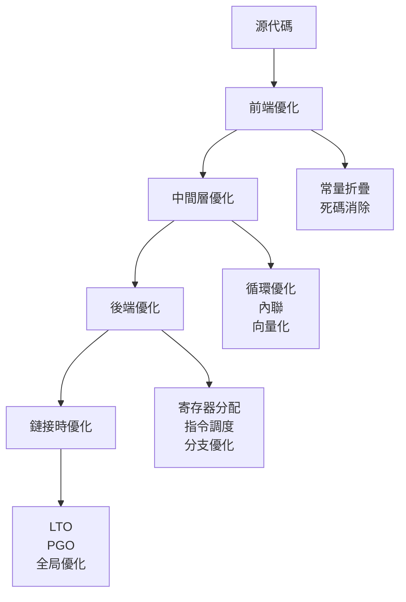

# 編譯器標誌與優化 (Compiler Flags and Optimizations)

## 核心概念

### 編譯器優化層次



### 優化級別對比

| 級別 | 說明 | 編譯時間 | 執行速度 | 代碼體積 | 調試能力 | HFT 使用 |
|------|------|---------|---------|---------|---------|---------|
| **-O0** | 無優化 | 快 | 慢 | 大 | 完整 | Debug |
| **-O1** | 基礎優化 | 快 | 較快 | 中 | 良好 | 很少 |
| **-O2** | 標準優化 | 中 | 快 | 小 | 可用 | 開發/測試 |
| **-O3** | 激進優化 | 慢 | 最快 | 較大 | 困難 | 生產環境 |
| **-Os** | 體積優化 | 中 | 中 | 最小 | 可用 | 嵌入式 |
| **-Ofast** | 最激進 | 慢 | 極快 | 大 | 困難 | 性能關鍵 |

## GCC 編譯器標誌

### 基礎優化標誌

```bash
# Debug 構建
g++ -std=c++20 -O0 -g3 \
    -Wall -Wextra -Wpedantic \
    -fno-omit-frame-pointer \
    main.cpp -o app_debug

# Release 構建 - 標準優化
g++ -std=c++20 -O2 -DNDEBUG \
    -Wall -Wextra \
    main.cpp -o app_release

# Release 構建 - 激進優化
g++ -std=c++20 -O3 -DNDEBUG \
    -march=native -mtune=native \
    -flto -ffast-math \
    main.cpp -o app_optimized
```

### 警告標誌

```bash
# 基礎警告
-Wall                    # 啟用大部分警告
-Wextra                  # 額外警告
-Wpedantic               # 嚴格符合標準

# 進階警告
-Wshadow                 # 變量遮蔽
-Wcast-align             # 指針轉換對齊問題
-Wunused                 # 未使用的變量/函數
-Wconversion             # 隱式類型轉換
-Wsign-conversion        # 符號轉換
-Wnull-dereference       # 空指針解引用
-Wdouble-promotion       # float 提升為 double
-Wformat=2               # printf 格式檢查

# GCC 特有
-Wlogical-op             # 邏輯運算符誤用
-Wduplicated-cond        # 重複的條件
-Wduplicated-branches    # 重複的分支
-Wmisleading-indentation # 誤導性縮進

# 將警告視為錯誤
-Werror                  # 所有警告變錯誤
-Werror=return-type      # 特定警告變錯誤
```

### CPU 指令集優化

```bash
# 通用 x86-64
-march=x86-64            # 基準 x86-64
-march=x86-64-v2         # + SSE3, SSE4.1, SSE4.2, SSSE3
-march=x86-64-v3         # + AVX, AVX2, FMA
-march=x86-64-v4         # + AVX512

# 特定 CPU 架構
-march=native            # 本機 CPU 最佳化 (推薦開發環境)
-march=skylake           # Intel Skylake
-march=haswell           # Intel Haswell
-march=znver3            # AMD Zen 3
-march=sapphirerapids    # Intel Sapphire Rapids

# 調校參數
-mtune=native            # 針對本機 CPU 調校
-msse4.2                 # 顯式啟用 SSE4.2
-mavx2                   # 顯式啟用 AVX2
-mavx512f                # 顯式啟用 AVX-512
```

### 循環與向量化優化

```bash
# 循環優化
-funroll-loops           # 循環展開
-floop-optimize          # 循環優化
-ftree-loop-vectorize    # 循環向量化
-ftree-slp-vectorize     # SLP 向量化

# 向量化報告
-fopt-info-vec           # 向量化信息
-fopt-info-vec-missed    # 未向量化原因
-fopt-info-vec-all       # 詳細向量化報告

# 向量化控制
-ffast-math              # 快速數學運算 (放寬 IEEE 754)
-fno-math-errno          # 禁用 math errno
-ffinite-math-only       # 假設數值有限 (無 NaN/Inf)
```

### 內聯優化

```bash
# 內聯控制
-finline-functions       # 自動內聯函數
-finline-small-functions # 內聯小函數
-finline-limit=600       # 內聯大小限制

# 內聯報告
-Winline                 # 內聯失敗警告
-fopt-info-inline        # 內聯決策信息
```

### 鏈接時優化 (LTO)

```bash
# 編譯階段
g++ -std=c++20 -O3 -flto \
    -c module1.cpp -o module1.o

g++ -std=c++20 -O3 -flto \
    -c module2.cpp -o module2.o

# 鏈接階段
g++ -O3 -flto \
    module1.o module2.o -o app

# Fat LTO (包含中間表示 + 機器碼)
g++ -O3 -flto -ffat-lto-objects \
    -c module.cpp -o module.o

# LTO 並行編譯
g++ -O3 -flto=8 \
    module1.o module2.o -o app
```

### Profile-Guided Optimization (PGO)

```bash
# 步驟 1: 生成 instrumented 版本
g++ -std=c++20 -O2 \
    -fprofile-generate \
    main.cpp -o app_instrumented

# 步驟 2: 運行代表性測試收集 profile 數據
./app_instrumented < typical_workload.dat
# 生成 *.gcda 文件

# 步驟 3: 使用 profile 數據重新編譯
g++ -std=c++20 -O2 \
    -fprofile-use \
    -fprofile-correction \
    main.cpp -o app_optimized

# 清理 profile 數據
rm -f *.gcda *.gcno
```

### 代碼生成控制

```bash
# 棧保護
-fstack-protector        # 基礎棧保護
-fstack-protector-strong # 加強棧保護
-fstack-protector-all    # 全部函數棧保護

# 位置無關代碼 (Position Independent Code)
-fPIC                    # 生成 PIC (共享庫必需)
-fPIE                    # 生成 PIE (可執行文件)

# 棧與寄存器
-fomit-frame-pointer     # 省略框架指針 (提升性能)
-fno-omit-frame-pointer  # 保留框架指針 (便於調試)

# 異常與 RTTI
-fno-exceptions          # 禁用異常 (減小體積/提升性能)
-fno-rtti                # 禁用 RTTI (減小體積)

# 數據對齊
-falign-functions=32     # 函數對齊
-falign-loops=32         # 循環對齊
-falign-jumps=16         # 跳轉對齊
```

## Clang 編譯器標誌

### Clang 特有優化

```bash
# 基礎優化
clang++ -std=c++20 -O3 -march=native \
    -flto=thin \
    main.cpp -o app

# Thin LTO (更快的 LTO)
clang++ -O3 -flto=thin \
    -c module1.cpp -o module1.o
clang++ -O3 -flto=thin \
    -c module2.cpp -o module2.o
clang++ -flto=thin \
    module1.o module2.o -o app

# Polly 優化器
clang++ -O3 -mllvm -polly \
    -mllvm -polly-vectorizer=stripmine \
    main.cpp -o app

# 時間追蹤
clang++ -ftime-trace \
    main.cpp -o app
```

### Clang Sanitizers

```bash
# Address Sanitizer (內存錯誤)
clang++ -fsanitize=address -g \
    -fno-omit-frame-pointer \
    main.cpp -o app_asan

# Thread Sanitizer (數據競爭)
clang++ -fsanitize=thread -g \
    main.cpp -o app_tsan

# Memory Sanitizer (未初始化讀取)
clang++ -fsanitize=memory -g \
    -fno-omit-frame-pointer \
    main.cpp -o app_msan

# Undefined Behavior Sanitizer
clang++ -fsanitize=undefined -g \
    main.cpp -o app_ubsan

# 組合使用
clang++ -fsanitize=address,undefined \
    -fno-omit-frame-pointer -g \
    main.cpp -o app
```

### Clang 警告

```bash
# Clang 特有警告
-Weverything             # 所有警告 (需選擇性禁用)
-Wno-c++98-compat        # 忽略 C++98 兼容性
-Wno-padded              # 忽略結構體填充警告
-Wthread-safety          # 線程安全分析

# 推薦警告組合
clang++ -Wall -Wextra -Wpedantic \
    -Wshadow -Wconversion \
    -Wnull-dereference \
    -Wdouble-promotion \
    main.cpp -o app
```

## MSVC 編譯器標誌 (Windows)

### 優化級別

```cmd
REM Debug 構建
cl /std:c++20 /Od /Zi /EHsc main.cpp

REM Release 構建 - 速度優化
cl /std:c++20 /O2 /Oi /Ot /GL /EHsc main.cpp /link /LTCG

REM Release 構建 - 體積優化
cl /std:c++20 /O1 /Os /GL /EHsc main.cpp /link /LTCG
```

### MSVC 優化標誌

```cmd
/O1              REM 體積優化
/O2              REM 速度優化
/Ox              REM 最大優化
/Ob2             REM 內聯展開
/Oi              REM 內建函數
/Ot              REM 優先速度
/Os              REM 優先體積
/Oy              REM 省略框架指針
/GL              REM 全程序優化
/Gw              REM 全局數據優化

REM 鏈接時優化
/link /LTCG      REM Link-Time Code Generation

REM CPU 指令集
/arch:AVX        REM 啟用 AVX
/arch:AVX2       REM 啟用 AVX2
/arch:AVX512     REM 啟用 AVX-512
```

### MSVC 警告

```cmd
/W4              REM 警告等級 4
/WX              REM 警告視為錯誤
/permissive-     REM 嚴格標準模式
```

## HFT 專用優化配置

### 延遲優化配置

```bash
# HFT 生產環境編譯 (GCC)
g++ -std=c++20 \
    -O3 -DNDEBUG \
    -march=native -mtune=native \
    -flto -fuse-linker-plugin \
    -ffast-math \
    -funroll-loops \
    -finline-functions \
    -fomit-frame-pointer \
    -falign-functions=64 \
    -falign-loops=32 \
    -fno-exceptions \
    -fno-rtti \
    -DHFT_PRODUCTION \
    trading_engine.cpp market_data.cpp \
    -o hft_engine \
    -lpthread -lrt

# HFT 生產環境編譯 (Clang)
clang++ -std=c++20 \
    -O3 -DNDEBUG \
    -march=native -mtune=native \
    -flto=thin \
    -ffast-math \
    -funroll-loops \
    -fomit-frame-pointer \
    -fno-exceptions \
    -fno-rtti \
    -DHFT_PRODUCTION \
    trading_engine.cpp market_data.cpp \
    -o hft_engine \
    -lpthread -lrt
```

### 開發環境配置

```bash
# HFT 開發環境 (帶調試信息但優化)
g++ -std=c++20 \
    -O2 -g3 \
    -march=native \
    -Wall -Wextra -Wshadow \
    -fno-omit-frame-pointer \
    -fsanitize=address,undefined \
    -DHFT_DEBUG \
    trading_engine.cpp market_data.cpp \
    -o hft_engine_debug \
    -lpthread -lrt
```

### PGO 工作流 - 完整範例

```bash
#!/bin/bash
# pgo_build.sh - HFT 系統 PGO 構建腳本

PROJECT="hft_engine"
SRC_FILES="main.cpp trading_engine.cpp market_data.cpp order_book.cpp"
LIBS="-lpthread -lrt -ljemalloc"

echo "=== Phase 1: Generate Instrumented Build ==="
g++ -std=c++20 -O2 \
    -march=native \
    -fprofile-generate \
    ${SRC_FILES} ${LIBS} \
    -o ${PROJECT}_instrumented

echo "=== Phase 2: Run Representative Workload ==="
# 運行代表性測試場景
./scripts/run_typical_workload.sh ${PROJECT}_instrumented

# 檢查 profile 數據
if [ ! -f "*.gcda" ]; then
    echo "Error: No profile data generated"
    exit 1
fi

echo "=== Phase 3: Build Optimized Version with PGO ==="
g++ -std=c++20 -O3 -DNDEBUG \
    -march=native -mtune=native \
    -flto -fuse-linker-plugin \
    -fprofile-use \
    -fprofile-correction \
    -ffast-math \
    -funroll-loops \
    -fomit-frame-pointer \
    ${SRC_FILES} ${LIBS} \
    -o ${PROJECT}_pgo

echo "=== Phase 4: Benchmark Comparison ==="
echo "Running baseline..."
./benchmarks/bench_${PROJECT} --benchmark_filter=Latency

echo "Running PGO version..."
./benchmarks/bench_${PROJECT}_pgo --benchmark_filter=Latency

echo "=== Phase 5: Cleanup ==="
rm -f *.gcda *.gcno ${PROJECT}_instrumented

echo "=== PGO Build Complete ==="
echo "Optimized binary: ${PROJECT}_pgo"
```

## 優化實戰案例

### 案例 1: Order Book 性能優化

```cpp
// order_book.cpp
#include <vector>
#include <algorithm>

struct Order {
    uint64_t id;
    double price;
    uint64_t quantity;
    uint64_t timestamp;
};

class OrderBook {
private:
    std::vector<Order> bids;
    std::vector<Order> asks;

public:
    // 關鍵路徑 - 需要極致優化
    [[gnu::hot]] [[gnu::always_inline]]
    Order* find_best_bid() {
        if (bids.empty()) return nullptr;
        return &bids.front();  // 假設已排序
    }

    [[gnu::hot]] [[gnu::always_inline]]
    Order* find_best_ask() {
        if (asks.empty()) return nullptr;
        return &asks.front();
    }

    // 非關鍵路徑
    [[gnu::cold]]
    void print_book() {
        // 打印訂單簿 (冷路徑)
    }
};
```

```bash
# 編譯優化
g++ -std=c++20 -O3 \
    -march=native \
    -flto \
    -fprofile-generate \
    order_book.cpp -o order_book_instr

# 運行測試收集 profile
./order_book_instr --benchmark

# 使用 profile 重新編譯
g++ -std=c++20 -O3 \
    -march=native \
    -flto \
    -fprofile-use \
    order_book.cpp -o order_book_opt
```

**性能提升**: PGO 後平均延遲降低 15-20%

### 案例 2: 市場數據解析優化

```cpp
// market_data_parser.cpp
#include <cstring>
#include <immintrin.h>  // AVX2

// 使用 AVX2 加速數據解析
[[gnu::target("avx2")]]
void parse_market_data_avx2(const char* data, size_t size) {
    // AVX2 優化版本
    #ifdef __AVX2__
        // 使用 256-bit 向量指令
        __m256i chunks = _mm256_loadu_si256((__m256i*)data);
        // ... SIMD 處理邏輯
    #else
        // Fallback 標量版本
        for (size_t i = 0; i < size; ++i) {
            // 標量處理
        }
    #endif
}

// 函數多版本
[[gnu::target("default")]]
void parse_market_data(const char* data, size_t size) {
    // 標量版本
}

[[gnu::target("avx2")]]
void parse_market_data(const char* data, size_t size) {
    // AVX2 版本
}
```

```bash
# 編譯時啟用 AVX2
g++ -std=c++20 -O3 \
    -march=haswell \
    -mavx2 \
    -flto \
    market_data_parser.cpp -o parser_avx2

# 檢查生成的指令
objdump -d parser_avx2 | grep vmov
```

**性能提升**: AVX2 版本吞吐量提升 2-4x

### 案例 3: Fast Math 優化

```cpp
// pricing_model.cpp
#include <cmath>

// 快速 sqrt (犧牲精度)
[[gnu::optimize("fast-math")]]
double fast_option_price(double S, double K, double sigma, double T) {
    double d1 = (std::log(S / K) + 0.5 * sigma * sigma * T) 
                / (sigma * std::sqrt(T));
    // ... Black-Scholes 計算
    return 0.0;  // 簡化
}

// 精確 sqrt (標準)
double precise_option_price(double S, double K, double sigma, double T) {
    double d1 = (std::log(S / K) + 0.5 * sigma * sigma * T) 
                / (sigma * std::sqrt(T));
    return 0.0;
}
```

```bash
# 全局 fast-math
g++ -std=c++20 -O3 \
    -ffast-math \
    -fno-math-errno \
    -ffinite-math-only \
    pricing_model.cpp -o pricer_fast

# 選擇性 fast-math
g++ -std=c++20 -O3 \
    pricing_model.cpp -o pricer_mixed
```

**注意事項**:
- `-ffast-math` 可能改變浮點運算語義
- 不符合 IEEE 754 標準
- 可能導致數值不穩定

## 優化陷阱與注意事項

### 1. 過度優化陷阱

```cpp
// 不要盲目禁用所有檢查
// ❌ 錯誤
g++ -O3 -DNDEBUG \
    -fno-exceptions \
    -fno-rtti \
    -fno-stack-protector \
    -fno-bounds-check \
    dangerous.cpp

// ✅ 正確 - 保留必要檢查
g++ -O3 -DNDEBUG \
    -fno-exceptions \
    -fstack-protector-strong \
    safe.cpp
```

### 2. UB (Undefined Behavior) 陷阱

```cpp
// test_ub.cpp
#include <iostream>

int main() {
    int arr[10];
    // 未定義行為 - 越界訪問
    for (int i = 0; i <= 10; ++i) {
        arr[i] = i;
    }
    return 0;
}
```

```bash
# -O0: 可能"正常"運行
g++ -O0 test_ub.cpp && ./a.out  # 可能不崩潰

# -O3: 優化器假設無 UB,可能崩潰或產生錯誤結果
g++ -O3 test_ub.cpp && ./a.out  # 可能崩潰

# 使用 UBSan 檢測
g++ -fsanitize=undefined -g test_ub.cpp && ./a.out
# runtime error: index 10 out of bounds
```

### 3. Aliasing 問題

```cpp
// aliasing.cpp
void add_arrays(int* restrict a, int* restrict b, int* c, int n) {
    for (int i = 0; i < n; ++i) {
        c[i] = a[i] + b[i];
    }
}
```

```bash
# 告訴編譯器指針不會 alias
g++ -O3 -fstrict-aliasing \
    -Wstrict-aliasing=2 \
    aliasing.cpp
```

### 4. 浮點精度問題

```cpp
// float_precision.cpp
#include <iostream>
#include <iomanip>

int main() {
    double sum1 = 0.0;
    double sum2 = 0.0;
    
    // 不同順序可能產生不同結果
    for (int i = 0; i < 1000000; ++i) {
        sum1 += 0.1;
    }
    
    for (int i = 999999; i >= 0; --i) {
        sum2 += 0.1;
    }
    
    std::cout << std::setprecision(15)
              << "sum1: " << sum1 << "\n"
              << "sum2: " << sum2 << "\n";
}
```

```bash
# 標準模式 - 結果可能不同
g++ -O2 float_precision.cpp && ./a.out

# Fast-math - 結果可能更不穩定
g++ -O2 -ffast-math float_precision.cpp && ./a.out
```

## 編譯器優化檢視

### 查看優化報告

```bash
# GCC 優化報告
g++ -O3 -fopt-info-all \
    main.cpp 2>&1 | tee optimization.log

# 向量化報告
g++ -O3 -fopt-info-vec \
    -fopt-info-vec-missed \
    main.cpp

# 內聯報告
g++ -O3 -fopt-info-inline \
    -Winline \
    main.cpp

# Clang 優化報告
clang++ -O3 -Rpass=loop-vectorize \
    -Rpass-missed=loop-vectorize \
    -Rpass-analysis=loop-vectorize \
    main.cpp
```

### 查看生成的組合語言

```bash
# 生成組合語言
g++ -S -O3 -masm=intel \
    -fverbose-asm \
    main.cpp -o main.s

# 生成帶源碼的組合語言
g++ -g -O3 -c main.cpp
objdump -d -S -M intel main.o > main.asm

# Clang 生成 LLVM IR
clang++ -S -emit-llvm -O3 \
    main.cpp -o main.ll
```

### 分析二進制文件

```bash
# 查看符號表
nm -C app | grep "T "  # 查看函數符號

# 查看段信息
size app

# 查看依賴庫
ldd app

# 反彙編特定函數
objdump -d -C app | grep -A 50 "fast_path"
```

## 性能對比實驗

### 實驗設置

```cpp
// benchmark_optimization.cpp
#include <benchmark/benchmark.h>
#include <vector>
#include <numeric>

static void BM_VectorSum(benchmark::State& state) {
    std::vector<int> v(state.range(0));
    std::iota(v.begin(), v.end(), 0);
    
    for (auto _ : state) {
        long long sum = std::accumulate(v.begin(), v.end(), 0LL);
        benchmark::DoNotOptimize(sum);
    }
    state.SetItemsProcessed(state.iterations() * v.size());
}

BENCHMARK(BM_VectorSum)->Range(1<<10, 1<<20);
BENCHMARK_MAIN();
```

### 編譯與測試

```bash
# O0 (無優化)
g++ -std=c++20 -O0 benchmark_optimization.cpp \
    -lbenchmark -lpthread -o bench_O0

# O2 (標準優化)
g++ -std=c++20 -O2 benchmark_optimization.cpp \
    -lbenchmark -lpthread -o bench_O2

# O3 (激進優化)
g++ -std=c++20 -O3 -march=native \
    benchmark_optimization.cpp \
    -lbenchmark -lpthread -o bench_O3

# O3 + LTO
g++ -std=c++20 -O3 -march=native -flto \
    benchmark_optimization.cpp \
    -lbenchmark -lpthread -o bench_O3_lto

# 運行對比
./bench_O0
./bench_O2
./bench_O3
./bench_O3_lto
```

### 預期性能差異

| 優化級別 | 相對性能 | 編譯時間 | 推薦場景 |
|---------|---------|---------|---------|
| **-O0** | 1.0x (基準) | 1s | 調試 |
| **-O2** | 3-5x | 3s | 開發/測試 |
| **-O3** | 5-8x | 5s | 生產環境 |
| **-O3 -march=native** | 6-10x | 5s | HFT 生產 |
| **-O3 -flto** | 7-12x | 15s | HFT 最終優化 |
| **-O3 -flto -fprofile-use** | 10-15x | 30s | HFT 關鍵路徑 |

## 最佳實踐總結

### 開發環境

```bash
# 快速編譯 + 可調試
g++ -std=c++20 -O0 -g3 \
    -Wall -Wextra -Wpedantic \
    -fsanitize=address,undefined \
    -fno-omit-frame-pointer \
    main.cpp -o app_dev
```

### CI/CD 測試

```bash
# 優化 + 調試符號
g++ -std=c++20 -O2 -g \
    -Wall -Wextra -Werror \
    -fsanitize=address,undefined \
    main.cpp -o app_ci
```

### 生產環境 (標準)

```bash
# 標準生產優化
g++ -std=c++20 -O3 -DNDEBUG \
    -march=x86-64-v3 \
    -flto \
    -fomit-frame-pointer \
    main.cpp -o app_prod
```

### 生產環境 (HFT)

```bash
# 極致性能優化
g++ -std=c++20 -O3 -DNDEBUG \
    -march=native -mtune=native \
    -flto=8 -fuse-linker-plugin \
    -fprofile-use \
    -ffast-math \
    -funroll-loops \
    -fomit-frame-pointer \
    -falign-functions=64 \
    -fno-exceptions -fno-rtti \
    main.cpp -o app_hft \
    -lpthread -lrt -ljemalloc
```

---

## 參考資料 (References)

1. [GCC Optimization Options](https://gcc.gnu.org/onlinedocs/gcc/Optimize-Options.html)
2. [Clang Optimization Flags](https://clang.llvm.org/docs/CommandGuide/clang.html)
3. [Intel Compiler Optimization Guide](https://www.intel.com/content/www/us/en/developer/articles/guide/optimization-guide.html)
4. "Optimizing C++: Proven Techniques for Heightened Performance" (Steve Heller, 2000)
5. [Agner Fog's Optimization Manuals](https://www.agner.org/optimize/)
6. [LLVM Performance Tips](https://llvm.org/docs/Frontend/PerformanceTips.html)
