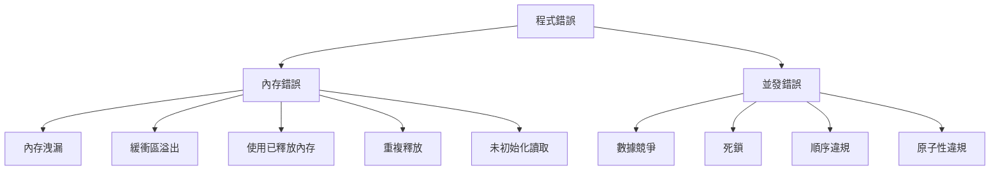

# 記憶體與並發檢測 (Memory and Concurrency Detection)

## 核心概念

### 常見內存與並發問題



### 檢測工具分類

| 工具 | 檢測類型 | 運行開銷 | 誤報率 | 學習曲線 | HFT 推薦 |
|------|---------|---------|--------|---------|---------|
| **AddressSanitizer** | 內存錯誤 | 2x | 極低 | 低 | ⭐⭐⭐⭐⭐ |
| **ThreadSanitizer** | 數據競爭 | 5-15x | 低 | 低 | ⭐⭐⭐⭐⭐ |
| **MemorySanitizer** | 未初始化讀取 | 3x | 低 | 中 | ⭐⭐⭐⭐ |
| **UBSanitizer** | 未定義行為 | 1.2x | 低 | 低 | ⭐⭐⭐⭐⭐ |
| **Valgrind/Memcheck** | 內存錯誤 | 10-50x | 中 | 低 | ⭐⭐⭐ |
| **Valgrind/Helgrind** | 數據競爭 | 20-100x | 高 | 中 | ⭐⭐ |
| **Static Analyzers** | 編譯時檢查 | 0 | 中 | 中 | ⭐⭐⭐⭐ |

## AddressSanitizer (ASan)

### 基礎用法

```bash
# 編譯時啟用 ASan
g++ -std=c++20 -g \
    -fsanitize=address \
    -fno-omit-frame-pointer \
    main.cpp -o app_asan

# Clang (推薦)
clang++ -std=c++20 -g \
    -fsanitize=address \
    -fno-omit-frame-pointer \
    main.cpp -o app_asan

# 運行
./app_asan
```

### 檢測能力

```cpp
// test_asan.cpp - ASan 檢測範例

#include <iostream>
#include <vector>

// 1. 堆溢出 (Heap Buffer Overflow)
void test_heap_overflow() {
    int* arr = new int[10];
    arr[10] = 42;  // ❌ 越界寫入
    delete[] arr;
}

// 2. 棧溢出 (Stack Buffer Overflow)
void test_stack_overflow() {
    int arr[10];
    arr[10] = 42;  // ❌ 越界寫入
}

// 3. 使用已釋放內存 (Use-After-Free)
void test_use_after_free() {
    int* ptr = new int(42);
    delete ptr;
    std::cout << *ptr << "\n";  // ❌ 使用已釋放內存
}

// 4. 重複釋放 (Double Free)
void test_double_free() {
    int* ptr = new int(42);
    delete ptr;
    delete ptr;  // ❌ 重複釋放
}

// 5. 內存洩漏 (Memory Leak)
void test_memory_leak() {
    int* ptr = new int(42);
    // ❌ 忘記 delete
}

// 6. 全局緩衝區溢出
int global_arr[10];
void test_global_overflow() {
    global_arr[10] = 42;  // ❌ 越界寫入
}

// 7. 容器迭代器失效
void test_iterator_invalidation() {
    std::vector<int> vec = {1, 2, 3};
    auto it = vec.begin();
    vec.push_back(4);  // 可能導致重新分配
    *it = 10;  // ❌ 潛在未定義行為
}

int main() {
    test_heap_overflow();
    return 0;
}
```

```bash
# 編譯並運行
clang++ -std=c++20 -g -fsanitize=address -fno-omit-frame-pointer \
    test_asan.cpp -o test_asan

./test_asan
```

**ASan 輸出範例**:
```
=================================================================
==12345==ERROR: AddressSanitizer: heap-buffer-overflow on address 0x602000000028 at pc 0x000000400b2c bp 0x7ffc12345678 sp 0x7ffc12345670
WRITE of size 4 at 0x602000000028 thread T0
    #0 0x400b2b in test_heap_overflow() test_asan.cpp:9
    #1 0x400c15 in main test_asan.cpp:45
    #2 0x7f1234567840 in __libc_start_main (/lib/x86_64-linux-gnu/libc.so.6+0x21840)

0x602000000028 is located 0 bytes to the right of 40-byte region [0x602000000000,0x602000000028)
allocated by thread T0 here:
    #0 0x7f1234567890 in operator new[](unsigned long) (/usr/lib/x86_64-linux-gnu/libasan.so.5+0xe0890)
    #1 0x400a8b in test_heap_overflow() test_asan.cpp:8
    #2 0x400c15 in main test_asan.cpp:45
```

### ASan 進階選項

```bash
# 環境變量配置
export ASAN_OPTIONS=\
detect_leaks=1:\
check_initialization_order=1:\
strict_init_order=1:\
detect_stack_use_after_return=1:\
detect_invalid_pointer_pairs=2:\
print_stats=1

# 內存洩漏檢測
export ASAN_OPTIONS=detect_leaks=1
./app_asan

# 僅在退出時報告洩漏
export ASAN_OPTIONS=detect_leaks=1:leak_check_at_exit=1
./app_asan

# 符號化堆棧
llvm-symbolizer --obj=./app_asan
```

## ThreadSanitizer (TSan)

### 基礎用法

```bash
# 編譯時啟用 TSan
clang++ -std=c++20 -g \
    -fsanitize=thread \
    -fno-omit-frame-pointer \
    main.cpp -o app_tsan \
    -lpthread

# 運行
./app_tsan
```

### 數據競爭檢測

```cpp
// test_tsan.cpp - TSan 檢測範例
#include <thread>
#include <vector>
#include <iostream>

// 1. 簡單數據競爭
int global_counter = 0;

void test_data_race() {
    auto increment = []() {
        for (int i = 0; i < 100000; ++i) {
            global_counter++;  // ❌ 數據競爭
        }
    };
    
    std::thread t1(increment);
    std::thread t2(increment);
    t1.join();
    t2.join();
    
    std::cout << "Counter: " << global_counter << "\n";
}

// 2. 數組數據競爭
void test_array_race() {
    std::vector<int> data(1000, 0);
    
    auto worker = [&data](int start, int end) {
        for (int i = start; i < end; ++i) {
            data[i]++;  // 可能正常,但如果範圍重疊則競爭
        }
    };
    
    std::thread t1(worker, 0, 600);
    std::thread t2(worker, 400, 1000);  // ❌ 重疊區域有競爭
    t1.join();
    t2.join();
}

// 3. 順序違規 (Happens-Before Violation)
int shared_value = 0;
bool ready = false;

void test_happens_before() {
    auto writer = [&]() {
        shared_value = 42;
        ready = true;  // ❌ 沒有同步,讀者可能看不到 42
    };
    
    auto reader = [&]() {
        while (!ready) {}  // 忙等
        std::cout << shared_value << "\n";  // ❌ 可能讀到舊值
    };
    
    std::thread t1(writer);
    std::thread t2(reader);
    t1.join();
    t2.join();
}

// 4. Lock-Order-Inversion (潛在死鎖)
#include <mutex>
std::mutex mutex1, mutex2;

void test_lock_order() {
    auto thread1 = [&]() {
        std::lock_guard<std::mutex> l1(mutex1);
        std::this_thread::sleep_for(std::chrono::milliseconds(10));
        std::lock_guard<std::mutex> l2(mutex2);
    };
    
    auto thread2 = [&]() {
        std::lock_guard<std::mutex> l2(mutex2);  // ❌ 相反順序
        std::this_thread::sleep_for(std::chrono::milliseconds(10));
        std::lock_guard<std::mutex> l1(mutex1);
    };
    
    std::thread t1(thread1);
    std::thread t2(thread2);
    t1.join();
    t2.join();
}

int main() {
    test_data_race();
    return 0;
}
```

```bash
# 編譯並運行
clang++ -std=c++20 -g -fsanitize=thread -fno-omit-frame-pointer \
    test_tsan.cpp -o test_tsan -lpthread

./test_tsan
```

**TSan 輸出範例**:
```
==================
WARNING: ThreadSanitizer: data race (pid=12345)
  Write of size 4 at 0x7b0000000000 by thread T2:
    #0 increment() test_tsan.cpp:11
    #1 void std::__invoke_impl<...>() <built-in>

  Previous write of size 4 at 0x7b0000000000 by thread T1:
    #0 increment() test_tsan.cpp:11
    #1 void std::__invoke_impl<...>() <built-in>

  Location is global 'global_counter' of size 4 at 0x7b0000000000 (test_tsan+0x000000201000)

  Thread T2 (tid=12347, running) created by main thread at:
    #0 pthread_create <null> (test_tsan+0x000000040000)
    #1 std::thread::_M_start_thread() <null>
    #2 test_data_race() test_tsan.cpp:15

  Thread T1 (tid=12346, finished) created by main thread at:
    #0 pthread_create <null> (test_tsan+0x000000040000)
    #1 std::thread::_M_start_thread() <null>
    #2 test_data_race() test_tsan.cpp:14
```

### TSan 配置選項

```bash
# 環境變量
export TSAN_OPTIONS=\
history_size=7:\
report_bugs=1:\
report_thread_leaks=1:\
report_destroy_locked=1:\
report_signal_unsafe=1:\
second_deadlock_stack=1

./app_tsan
```

## MemorySanitizer (MSan)

### 檢測未初始化讀取

```bash
# 編譯 (僅 Clang 支持)
clang++ -std=c++20 -g \
    -fsanitize=memory \
    -fno-omit-frame-pointer \
    -fPIE -pie \
    main.cpp -o app_msan
```

```cpp
// test_msan.cpp
#include <iostream>

void test_uninitialized_read() {
    int x;  // 未初始化
    if (x > 0) {  // ❌ 使用未初始化值
        std::cout << "Positive\n";
    }
}

void test_partially_initialized() {
    struct Data {
        int a;
        int b;
    };
    
    Data d;
    d.a = 42;  // 僅初始化 a
    
    if (d.b > 0) {  // ❌ b 未初始化
        std::cout << "b is positive\n";
    }
}

int main() {
    test_uninitialized_read();
    return 0;
}
```

## UndefinedBehaviorSanitizer (UBSan)

### 檢測未定義行為

```bash
# 編譯
g++ -std=c++20 -g \
    -fsanitize=undefined \
    -fno-omit-frame-pointer \
    main.cpp -o app_ubsan
```

```cpp
// test_ubsan.cpp
#include <iostream>
#include <limits>

void test_signed_overflow() {
    int max = std::numeric_limits<int>::max();
    int result = max + 1;  // ❌ 有符號整數溢出
    std::cout << result << "\n";
}

void test_null_pointer_deref() {
    int* ptr = nullptr;
    *ptr = 42;  // ❌ 空指針解引用
}

void test_misaligned_access() {
    char buffer[16];
    int* int_ptr = reinterpret_cast<int*>(buffer + 1);  // ❌ 未對齊
    *int_ptr = 42;
}

void test_division_by_zero() {
    int x = 10;
    int y = 0;
    int result = x / y;  // ❌ 除以零
}

void test_shift_overflow() {
    int x = 1;
    int result = x << 32;  // ❌ 移位超出範圍
}

void test_invalid_bool() {
    bool* ptr = reinterpret_cast<bool*>(new char(5));
    bool b = *ptr;  // ❌ 非 0/1 值轉 bool
    delete reinterpret_cast<char*>(ptr);
}

int main() {
    test_signed_overflow();
    return 0;
}
```

**UBSan 輸出範例**:
```
test_ubsan.cpp:6:20: runtime error: signed integer overflow: 2147483647 + 1 cannot be represented in type 'int'
```

### UBSan 完整檢查項

```bash
# 完整 UBSan 檢查
g++ -std=c++20 -g \
    -fsanitize=undefined \
    -fsanitize=float-divide-by-zero \
    -fsanitize=float-cast-overflow \
    -fsanitize=bounds \
    -fsanitize=alignment \
    -fsanitize=null \
    -fsanitize=return \
    -fsanitize=signed-integer-overflow \
    -fsanitize=vptr \
    main.cpp -o app_ubsan_full
```

## Valgrind Memcheck

### 基礎用法

```bash
# 內存檢查
valgrind --leak-check=full \
         --show-leak-kinds=all \
         --track-origins=yes \
         --verbose \
         --log-file=valgrind.log \
         ./myapp

# 快速檢查
valgrind --leak-check=yes ./myapp
```

### Memcheck 檢測能力

```cpp
// test_memcheck.cpp
#include <cstdlib>
#include <cstring>

void test_invalid_read() {
    int* arr = new int[10];
    int x = arr[10];  // ❌ 越界讀取
    delete[] arr;
}

void test_invalid_write() {
    int* arr = new int[10];
    arr[10] = 42;  // ❌ 越界寫入
    delete[] arr;
}

void test_uninitialized_value() {
    int x;
    if (x == 5) {  // ❌ 使用未初始化值
        // ...
    }
}

void test_memory_leak() {
    int* ptr = new int[100];
    // ❌ 忘記 delete[]
}

void test_invalid_free() {
    int* ptr = (int*)malloc(sizeof(int) * 10);
    free(ptr);
    free(ptr);  // ❌ 重複釋放
}

int main() {
    test_invalid_read();
    test_memory_leak();
    return 0;
}
```

```bash
# 運行 Memcheck
g++ -g test_memcheck.cpp -o test_memcheck
valgrind --leak-check=full --track-origins=yes ./test_memcheck
```

**Memcheck 輸出範例**:
```
==12345== Invalid read of size 4
==12345==    at 0x400B2C: test_invalid_read() (test_memcheck.cpp:7)
==12345==    by 0x400C15: main (test_memcheck.cpp:36)
==12345==  Address 0x5abcde28 is 0 bytes after a block of size 40 alloc'd
==12345==    at 0x4C2E0EF: operator new[](unsigned long) (vg_replace_malloc.c:433)
==12345==    by 0x400B1B: test_invalid_read() (test_memcheck.cpp:6)

==12345== LEAK SUMMARY:
==12345==    definitely lost: 400 bytes in 1 blocks
==12345==    indirectly lost: 0 bytes in 0 blocks
==12345==      possibly lost: 0 bytes in 0 blocks
==12345==    still reachable: 0 bytes in 0 blocks
```

## Valgrind Helgrind (數據競爭)

```bash
# 檢測數據競爭
valgrind --tool=helgrind ./myapp_threaded

# 檢測鎖順序問題
valgrind --tool=helgrind \
         --track-lockorders=yes \
         ./myapp_threaded
```

## 靜態分析工具

### Clang Static Analyzer

```bash
# 使用 scan-build
scan-build g++ -std=c++20 main.cpp -o myapp

# Clang-Tidy
clang-tidy main.cpp -- -std=c++20

# 帶修復建議
clang-tidy --fix main.cpp -- -std=c++20

# 特定檢查
clang-tidy --checks='modernize-*,performance-*,bugprone-*' \
           main.cpp -- -std=c++20
```

### Clang-Tidy 配置

```yaml
# .clang-tidy
Checks: >
  -*,
  bugprone-*,
  performance-*,
  modernize-*,
  readability-*,
  cppcoreguidelines-*,
  -modernize-use-trailing-return-type

CheckOptions:
  - key: readability-identifier-naming.ClassCase
    value: CamelCase
  - key: readability-identifier-naming.FunctionCase
    value: lower_case
  - key: readability-identifier-naming.VariableCase
    value: lower_case
```

### Cppcheck

```bash
# 安裝
sudo apt install cppcheck

# 基礎檢查
cppcheck --enable=all --inconclusive main.cpp

# 性能檢查
cppcheck --enable=performance,portability main.cpp

# 生成報告
cppcheck --enable=all --xml main.cpp 2> cppcheck.xml
```

## GCC/Clang 編譯器警告

### 激進警告配置

```bash
# GCC 激進警告
g++ -std=c++20 \
    -Wall -Wextra -Wpedantic \
    -Wshadow -Wcast-align -Wunused \
    -Wconversion -Wsign-conversion \
    -Wnull-dereference -Wdouble-promotion \
    -Wformat=2 -Wmisleading-indentation \
    -Wduplicated-cond -Wduplicated-branches \
    -Wlogical-op -Wuseless-cast \
    -Werror \
    main.cpp -o myapp

# Clang 激進警告
clang++ -std=c++20 \
    -Weverything \
    -Wno-c++98-compat \
    -Wno-c++98-compat-pedantic \
    -Wno-padded \
    -Werror \
    main.cpp -o myapp
```

## HFT 實戰檢測策略

### 開發階段

```bash
#!/bin/bash
# dev_sanitize.sh - 開發環境完整檢測

SOURCE="hft_engine.cpp market_data.cpp order_book.cpp"
OUTPUT="hft_engine_dev"

echo "=== Building with All Sanitizers ==="
clang++ -std=c++20 -O1 -g \
    -fsanitize=address,undefined \
    -fsanitize-address-use-after-scope \
    -fno-omit-frame-pointer \
    -fno-optimize-sibling-calls \
    -Wall -Wextra -Werror \
    ${SOURCE} -o ${OUTPUT} \
    -lpthread -lrt

echo "=== Running Tests ==="
export ASAN_OPTIONS=\
detect_leaks=1:\
check_initialization_order=1:\
detect_stack_use_after_return=1

export UBSAN_OPTIONS=\
print_stacktrace=1:\
halt_on_error=1

./${OUTPUT} --run-tests

echo "=== Static Analysis ==="
clang-tidy ${SOURCE} -- -std=c++20

echo "=== Development Checks Complete ==="
```

### CI/CD 階段

```bash
#!/bin/bash
# ci_sanitize.sh - CI/CD 管道檢測

# 階段 1: ASan + UBSan
echo "=== Phase 1: Memory Safety ==="
clang++ -std=c++20 -O2 -g \
    -fsanitize=address,undefined \
    -fno-omit-frame-pointer \
    ${SOURCE} -o app_asan \
    -lpthread

./app_asan --run-full-suite
ASAN_EXIT=$?

# 階段 2: TSan
echo "=== Phase 2: Thread Safety ==="
clang++ -std=c++20 -O2 -g \
    -fsanitize=thread \
    ${SOURCE} -o app_tsan \
    -lpthread

./app_tsan --run-concurrent-tests
TSAN_EXIT=$?

# 階段 3: Valgrind
echo "=== Phase 3: Deep Memory Analysis ==="
g++ -std=c++20 -O0 -g ${SOURCE} -o app_valgrind -lpthread
valgrind --leak-check=full \
         --error-exitcode=1 \
         ./app_valgrind --quick-test
VALGRIND_EXIT=$?

# 報告
if [ $ASAN_EXIT -eq 0 ] && [ $TSAN_EXIT -eq 0 ] && [ $VALGRIND_EXIT -eq 0 ]; then
    echo "✅ All Sanitizer Checks Passed"
    exit 0
else
    echo "❌ Sanitizer Checks Failed"
    exit 1
fi
```

### 生產前驗證

```bash
#!/bin/bash
# production_verify.sh - 生產前最終驗證

SOURCE="hft_engine.cpp market_data.cpp order_book.cpp"

# 1. Release Build + UBSan (低開銷)
echo "=== Production Build with UBSan ==="
g++ -std=c++20 -O3 -DNDEBUG \
    -march=native \
    -fsanitize=undefined \
    -fno-sanitize-recover=all \
    ${SOURCE} -o hft_engine_verify \
    -lpthread -lrt

# 2. 長時間壓力測試
echo "=== Running 24h Stress Test ==="
timeout 86400 ./hft_engine_verify --stress-test &
PID=$!

# 3. 監控性能與錯誤
while kill -0 $PID 2>/dev/null; do
    # 檢查 sanitizer 輸出
    if grep -q "Sanitizer" hft_engine.log; then
        echo "❌ Sanitizer Error Detected"
        kill $PID
        exit 1
    fi
    sleep 60
done

echo "✅ 24h Stress Test Passed"
```

## 性能開銷對比

### 實驗設置

```cpp
// benchmark_sanitizers.cpp
#include <benchmark/benchmark.h>
#include <vector>
#include <algorithm>

static void BM_VectorSort(benchmark::State& state) {
    std::vector<int> v(state.range(0));
    for (auto _ : state) {
        std::generate(v.begin(), v.end(), std::rand);
        std::sort(v.begin(), v.end());
        benchmark::DoNotOptimize(v);
    }
}

BENCHMARK(BM_VectorSort)->Range(1<<10, 1<<18);
BENCHMARK_MAIN();
```

### 編譯與測試

```bash
# 無 Sanitizer (基準)
g++ -std=c++20 -O3 benchmark_sanitizers.cpp \
    -lbenchmark -lpthread -o bench_baseline
./bench_baseline

# ASan
g++ -std=c++20 -O3 -fsanitize=address benchmark_sanitizers.cpp \
    -lbenchmark -lpthread -o bench_asan
./bench_asan

# TSan
clang++ -std=c++20 -O3 -fsanitize=thread benchmark_sanitizers.cpp \
    -lbenchmark -lpthread -o bench_tsan
./bench_tsan

# UBSan
g++ -std=c++20 -O3 -fsanitize=undefined benchmark_sanitizers.cpp \
    -lbenchmark -lpthread -o bench_ubsan
./bench_ubsan
```

### 性能開銷總結

| Sanitizer | CPU 開銷 | 內存開銷 | 適用階段 |
|-----------|---------|---------|---------|
| **無** | 1.0x | 1.0x | 生產環境 |
| **UBSan** | 1.1-1.2x | 1.0x | 生產環境可接受 |
| **ASan** | 1.5-3.0x | 2-3x | 開發/測試 |
| **MSan** | 2-3x | 2x | 測試 |
| **TSan** | 5-15x | 5-10x | 測試 |
| **Valgrind** | 10-50x | 1.5-2x | 深度分析 |

## 最佳實踐檢查清單

### 內存安全檢查

- [ ] 編譯時啟用 ASan (`-fsanitize=address`)
- [ ] 運行完整測試套件
- [ ] 檢查 Valgrind 無洩漏
- [ ] 靜態分析無警告
- [ ] 所有 `new` 有對應 `delete`
- [ ] 智能指針優先於裸指針
- [ ] RAII 管理資源

### 並發安全檢查

- [ ] TSan 測試通過
- [ ] 無數據競爭
- [ ] 正確使用互斥鎖
- [ ] 避免死鎖 (lock ordering)
- [ ] 原子操作正確使用
- [ ] 線程局部存儲考慮完備
- [ ] 無順序違規

### 未定義行為檢查

- [ ] UBSan 測試通過
- [ ] 無有符號溢出
- [ ] 無未對齊訪問
- [ ] 無空指針解引用
- [ ] 無除以零
- [ ] 無非法移位
- [ ] 無非法類型轉換

---

## 參考資料 (References)

1. [AddressSanitizer Wiki](https://github.com/google/sanitizers/wiki/AddressSanitizer)
2. [ThreadSanitizer Documentation](https://github.com/google/sanitizers/wiki/ThreadSanitizerCppManual)
3. [Valgrind User Manual](https://valgrind.org/docs/manual/manual.html)
4. [Clang-Tidy Documentation](https://clang.llvm.org/extra/clang-tidy/)
5. "Effective Debugging" (Diomidis Spinellis, 2016)
6. [Google C++ Style Guide - Testing](https://google.github.io/styleguide/cppguide.html#Testing)
