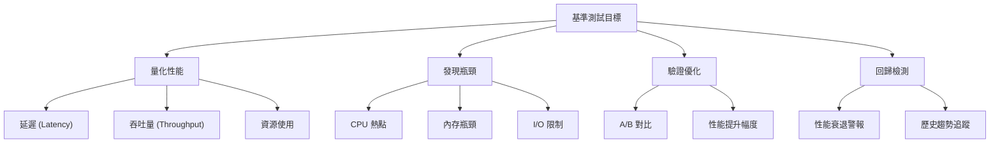

# 基準測試與回歸測試 (Benchmarking and Regression Testing)

## 核心概念

### 基準測試目的



### 測試類型對比

| 類型 | 目標 | 粒度 | 持續時間 | 變異性 | HFT 關鍵度 |
|------|------|------|---------|--------|-----------|
| **Microbenchmark** | 單一函數 | 納秒級 | 毫秒-秒 | 高 | ⭐⭐⭐⭐⭐ |
| **Component Benchmark** | 模塊 | 微秒級 | 秒-分鐘 | 中 | ⭐⭐⭐⭐ |
| **System Benchmark** | 端到端 | 毫秒級 | 分鐘-小時 | 低 | ⭐⭐⭐⭐⭐ |
| **Stress Test** | 極限負載 | 秒級 | 小時-天 | 低 | ⭐⭐⭐⭐ |

## Google Benchmark

### 安裝與基礎用法

```bash
# 安裝 (Ubuntu)
sudo apt install libbenchmark-dev

# 或從源碼編譯
git clone https://github.com/google/benchmark.git
cd benchmark
cmake -E make_directory "build"
cmake -E chdir "build" cmake -DBENCHMARK_DOWNLOAD_DEPENDENCIES=on -DCMAKE_BUILD_TYPE=Release ../
cmake --build "build" --config Release
sudo cmake --build "build" --config Release --target install
```

### 基礎範例

```cpp
// basic_benchmark.cpp
#include <benchmark/benchmark.h>
#include <vector>
#include <algorithm>
#include <numeric>

// 範例 1: 簡單函數基準測試
static void BM_StringCreation(benchmark::State& state) {
    for (auto _ : state) {
        std::string empty_string;
        benchmark::DoNotOptimize(empty_string);
    }
}
BENCHMARK(BM_StringCreation);

// 範例 2: 帶參數的基準測試
static void BM_VectorPushBack(benchmark::State& state) {
    for (auto _ : state) {
        std::vector<int> v;
        v.reserve(state.range(0));  // 預留空間
        for (int i = 0; i < state.range(0); ++i) {
            v.push_back(i);
        }
        benchmark::DoNotOptimize(v);
    }
    state.SetItemsProcessed(state.iterations() * state.range(0));
}
BENCHMARK(BM_VectorPushBack)->Range(8, 8<<10);

// 範例 3: 複雜度分析
static void BM_Sort(benchmark::State& state) {
    std::vector<int> v(state.range(0));
    for (auto _ : state) {
        state.PauseTiming();
        std::generate(v.begin(), v.end(), std::rand);
        state.ResumeTiming();
        
        std::sort(v.begin(), v.end());
        benchmark::DoNotOptimize(v);
    }
    state.SetComplexityN(state.range(0));
}
BENCHMARK(BM_Sort)->RangeMultiplier(2)->Range(1<<10, 1<<18)->Complexity();

BENCHMARK_MAIN();
```

```bash
# 編譯並運行
g++ -std=c++20 -O3 -DNDEBUG \
    basic_benchmark.cpp -lbenchmark -lpthread -o bench
./bench

# 輸出範例:
# -----------------------------------------------------------------------
# Benchmark                             Time             CPU   Iterations
# -----------------------------------------------------------------------
# BM_StringCreation                  2.13 ns         2.13 ns    328547584
# BM_VectorPushBack/8                15.2 ns         15.2 ns     45981696
# BM_VectorPushBack/64               91.3 ns         91.2 ns      7680000
# BM_VectorPushBack/512               693 ns          693 ns      1008000
# BM_Sort/1024                      11234 ns        11229 ns        62222
# BM_Sort/2048                      24567 ns        24562 ns        28495
# BM_Sort_BigO                      12.34 NlogN     12.34 NlogN
```

### HFT 關鍵路徑基準測試

```cpp
// hft_benchmark.cpp
#include <benchmark/benchmark.h>
#include <chrono>
#include <thread>
#include <atomic>

// 1. 訂單簿更新延遲
struct Order {
    uint64_t id;
    double price;
    uint64_t quantity;
};

class OrderBook {
private:
    std::vector<Order> bids;
    std::vector<Order> asks;
    
public:
    void insert_bid(const Order& order) {
        auto it = std::lower_bound(bids.begin(), bids.end(), order,
            [](const Order& a, const Order& b) { return a.price > b.price; });
        bids.insert(it, order);
    }
    
    void insert_ask(const Order& order) {
        auto it = std::lower_bound(asks.begin(), asks.end(), order,
            [](const Order& a, const Order& b) { return a.price < b.price; });
        asks.insert(it, order);
    }
    
    Order get_best_bid() const { return bids.empty() ? Order{} : bids.front(); }
    Order get_best_ask() const { return asks.empty() ? Order{} : asks.front(); }
};

static void BM_OrderBookInsert(benchmark::State& state) {
    OrderBook book;
    uint64_t order_id = 0;
    
    for (auto _ : state) {
        Order order{order_id++, 100.0 + (order_id % 10), 100};
        
        auto start = std::chrono::high_resolution_clock::now();
        book.insert_bid(order);
        auto end = std::chrono::high_resolution_clock::now();
        
        auto elapsed = std::chrono::duration_cast<std::chrono::nanoseconds>(end - start);
        state.SetIterationTime(elapsed.count() / 1e9);
    }
    state.SetLabel("Order Book Insert Latency");
}
BENCHMARK(BM_OrderBookInsert)->UseManualTime();

// 2. 市場數據解析延遲
struct MarketDataMessage {
    char symbol[8];
    double price;
    uint64_t volume;
    uint64_t timestamp;
};

static void BM_MarketDataParsing(benchmark::State& state) {
    const char* raw_data = "AAPL    00150.2500001000000123456789";
    MarketDataMessage msg;
    
    for (auto _ : state) {
        // 手動解析 (模擬 FIX/FAST 協議)
        std::memcpy(msg.symbol, raw_data, 8);
        msg.price = std::atof(raw_data + 8);
        msg.volume = std::atoll(raw_data + 18);
        msg.timestamp = std::atoll(raw_data + 26);
        
        benchmark::DoNotOptimize(msg);
    }
    state.SetLabel("Market Data Parsing");
}
BENCHMARK(BM_MarketDataParsing);

// 3. 風險檢查延遲
struct Position {
    std::string symbol;
    int64_t quantity;
    double avg_price;
};

class RiskManager {
private:
    std::unordered_map<std::string, Position> positions;
    double max_position_value = 1000000.0;
    
public:
    bool check_risk(const std::string& symbol, int64_t quantity, double price) {
        auto it = positions.find(symbol);
        if (it == positions.end()) {
            return quantity * price < max_position_value;
        }
        
        double new_value = (it->second.quantity + quantity) * price;
        return new_value < max_position_value;
    }
};

static void BM_RiskCheck(benchmark::State& state) {
    RiskManager rm;
    
    for (auto _ : state) {
        bool approved = rm.check_risk("AAPL", 100, 150.25);
        benchmark::DoNotOptimize(approved);
    }
    state.SetLabel("Risk Check Latency");
}
BENCHMARK(BM_RiskCheck);

// 4. Tick-to-Trade 端到端延遲
static void BM_TickToTrade(benchmark::State& state) {
    OrderBook book;
    RiskManager rm;
    
    for (auto _ : state) {
        auto start = std::chrono::high_resolution_clock::now();
        
        // 步驟 1: 接收市場數據
        MarketDataMessage tick;
        std::strcpy(tick.symbol, "AAPL");
        tick.price = 150.25;
        tick.volume = 100;
        benchmark::DoNotOptimize(tick);
        
        // 步驟 2: 更新訂單簿
        Order best_ask = book.get_best_ask();
        benchmark::DoNotOptimize(best_ask);
        
        // 步驟 3: 風險檢查
        bool risk_ok = rm.check_risk("AAPL", 100, 150.25);
        
        // 步驟 4: 發送訂單 (模擬)
        if (risk_ok) {
            Order new_order{1, 150.25, 100};
            book.insert_bid(new_order);
        }
        
        auto end = std::chrono::high_resolution_clock::now();
        auto elapsed = std::chrono::duration_cast<std::chrono::nanoseconds>(end - start);
        state.SetIterationTime(elapsed.count() / 1e9);
    }
    state.SetLabel("Tick-to-Trade Latency");
}
BENCHMARK(BM_TickToTrade)->UseManualTime();

BENCHMARK_MAIN();
```

```bash
# 編譯 HFT 基準測試 (最大優化)
g++ -std=c++20 -O3 -DNDEBUG \
    -march=native -mtune=native \
    -flto \
    hft_benchmark.cpp -lbenchmark -lpthread -o hft_bench

# 運行並輸出 JSON
./hft_bench --benchmark_format=json > results.json

# 運行並過濾特定測試
./hft_bench --benchmark_filter=OrderBook
```

### 進階配置

```cpp
// advanced_benchmark.cpp
#include <benchmark/benchmark.h>

// 1. 自定義參數
static void BM_CustomArgs(benchmark::State& state) {
    int size = state.range(0);
    int threads = state.range(1);
    
    for (auto _ : state) {
        // 測試邏輯
    }
}
BENCHMARK(BM_CustomArgs)->Args({1024, 4})->Args({2048, 8})->Args({4096, 16});

// 2. 參數範圍生成
BENCHMARK(BM_CustomArgs)->Ranges({{8, 8<<10}, {1, 16}});

// 3. 線程數測試
static void BM_MultiThreaded(benchmark::State& state) {
    std::atomic<int> counter{0};
    for (auto _ : state) {
        counter.fetch_add(1, std::memory_order_relaxed);
    }
}
BENCHMARK(BM_MultiThreaded)->ThreadRange(1, 16);

// 4. 設置與拆卸
class MyFixture : public benchmark::Fixture {
public:
    void SetUp(const ::benchmark::State& state) override {
        // 初始化
    }
    
    void TearDown(const ::benchmark::State& state) override {
        // 清理
    }
};

BENCHMARK_F(MyFixture, Test)(benchmark::State& state) {
    for (auto _ : state) {
        // 測試
    }
}

// 5. 內存計數器
static void BM_MemoryUsage(benchmark::State& state) {
    for (auto _ : state) {
        std::vector<int> v(state.range(0));
        benchmark::DoNotOptimize(v);
    }
    state.SetBytesProcessed(state.iterations() * state.range(0) * sizeof(int));
}
BENCHMARK(BM_MemoryUsage)->Range(8, 8<<20);

BENCHMARK_MAIN();
```

### 統計與過濾

```bash
# 統計分析
./bench --benchmark_repetitions=10

# 最小時間過濾
./bench --benchmark_min_time=5

# 指定 CPU
taskset -c 0 ./bench

# 禁用 CPU 頻率調整
sudo cpupower frequency-set --governor performance
./bench
sudo cpupower frequency-set --governor powersave
```

## Catch2 - 單元測試與基準測試

### 安裝與配置

```cpp
// catch2_benchmark.cpp
#define CATCH_CONFIG_MAIN
#define CATCH_CONFIG_ENABLE_BENCHMARKING
#include <catch2/catch.hpp>
#include <vector>
#include <algorithm>

TEST_CASE("Vector operations", "[benchmark]") {
    std::vector<int> v = {1, 2, 3, 4, 5};
    
    BENCHMARK("std::sort") {
        auto copy = v;
        std::sort(copy.begin(), copy.end());
        return copy;
    };
    
    BENCHMARK("std::stable_sort") {
        auto copy = v;
        std::stable_sort(copy.begin(), copy.end());
        return copy;
    };
}

TEST_CASE("String operations", "[benchmark]") {
    BENCHMARK("std::string construction") {
        return std::string("hello world");
    };
    
    BENCHMARK("std::string concatenation") {
        std::string s1 = "hello";
        std::string s2 = "world";
        return s1 + " " + s2;
    };
}
```

## 回歸測試框架

### CI/CD 集成

```yaml
# .github/workflows/benchmark.yml
name: Performance Regression Tests

on:
  pull_request:
  push:
    branches: [main]

jobs:
  benchmark:
    runs-on: ubuntu-latest
    
    steps:
    - uses: actions/checkout@v3
    
    - name: Install dependencies
      run: |
        sudo apt-get update
        sudo apt-get install -y cmake ninja-build libbenchmark-dev
    
    - name: Configure CMake
      run: cmake -B build -G Ninja -DCMAKE_BUILD_TYPE=Release
    
    - name: Build benchmarks
      run: cmake --build build --target benchmarks
    
    - name: Run benchmarks
      run: |
        cd build
        ./benchmarks/hft_bench --benchmark_format=json > results.json
    
    - name: Compare with baseline
      run: |
        python3 scripts/compare_benchmarks.py \
          baseline_results.json \
          build/results.json \
          --threshold=0.05
    
    - name: Upload results
      uses: actions/upload-artifact@v3
      with:
        name: benchmark-results
        path: build/results.json
```

### 基準對比腳本

```python
# scripts/compare_benchmarks.py
import json
import sys

def load_results(filename):
    with open(filename, 'r') as f:
        data = json.load(f)
    return {b['name']: b for b in data['benchmarks']}

def compare_benchmarks(baseline_file, current_file, threshold=0.05):
    baseline = load_results(baseline_file)
    current = load_results(current_file)
    
    regressions = []
    improvements = []
    
    for name, current_bench in current.items():
        if name not in baseline:
            print(f"⚠️  New benchmark: {name}")
            continue
        
        baseline_bench = baseline[name]
        baseline_time = baseline_bench['cpu_time']
        current_time = current_bench['cpu_time']
        
        change = (current_time - baseline_time) / baseline_time
        
        if change > threshold:
            regressions.append((name, change))
            print(f"❌ REGRESSION: {name}")
            print(f"   Baseline: {baseline_time:.2f}ns")
            print(f"   Current:  {current_time:.2f}ns")
            print(f"   Change:   {change*100:+.2f}%\n")
        elif change < -threshold:
            improvements.append((name, change))
            print(f"✅ IMPROVEMENT: {name}")
            print(f"   Baseline: {baseline_time:.2f}ns")
            print(f"   Current:  {current_time:.2f}ns")
            print(f"   Change:   {change*100:+.2f}%\n")
    
    if regressions:
        print(f"\n🚨 {len(regressions)} performance regression(s) detected!")
        sys.exit(1)
    else:
        print(f"\n✅ No performance regressions detected")
        if improvements:
            print(f"🎉 {len(improvements)} improvement(s) found!")
        sys.exit(0)

if __name__ == '__main__':
    if len(sys.argv) < 3:
        print("Usage: compare_benchmarks.py <baseline.json> <current.json> [--threshold=0.05]")
        sys.exit(1)
    
    baseline = sys.argv[1]
    current = sys.argv[2]
    threshold = 0.05
    
    if len(sys.argv) > 3 and sys.argv[3].startswith('--threshold='):
        threshold = float(sys.argv[3].split('=')[1])
    
    compare_benchmarks(baseline, current, threshold)
```

## 微基準測試最佳實踐

### 1. 避免編譯器優化干擾

```cpp
#include <benchmark/benchmark.h>

// ❌ 錯誤: 可能被優化掉
static void BM_Bad(benchmark::State& state) {
    for (auto _ : state) {
        int result = 1 + 1;  // 編譯器可能直接優化為常量
    }
}

// ✅ 正確: 防止優化
static void BM_Good(benchmark::State& state) {
    for (auto _ : state) {
        int result = 1 + 1;
        benchmark::DoNotOptimize(result);  // 防止優化
    }
}

// ✅ 更好: 使用 volatile
static void BM_Better(benchmark::State& state) {
    volatile int a = 1;
    volatile int b = 1;
    for (auto _ : state) {
        int result = a + b;
        benchmark::DoNotOptimize(result);
    }
}
```

### 2. 預熱與緩存效應

```cpp
static void BM_CacheWarm(benchmark::State& state) {
    std::vector<int> data(state.range(0));
    std::iota(data.begin(), data.end(), 0);
    
    // 預熱緩存
    long long sum = 0;
    for (int x : data) sum += x;
    benchmark::DoNotOptimize(sum);
    
    // 實際測試
    for (auto _ : state) {
        long long result = std::accumulate(data.begin(), data.end(), 0LL);
        benchmark::DoNotOptimize(result);
    }
}
BENCHMARK(BM_CacheWarm)->Range(1<<10, 1<<20);
```

### 3. 系統噪聲隔離

```bash
#!/bin/bash
# isolate_benchmark.sh - 隔離系統噪聲

# 1. 設置 CPU Governor
echo performance | sudo tee /sys/devices/system/cpu/cpu*/cpufreq/scaling_governor

# 2. 禁用 Turbo Boost (Intel)
echo 1 | sudo tee /sys/devices/system/cpu/intel_pstate/no_turbo

# 3. 禁用 ASLR
echo 0 | sudo tee /proc/sys/kernel/randomize_va_space

# 4. 設置 CPU 親和性
taskset -c 0 ./bench

# 5. 提高優先級
sudo nice -n -20 taskset -c 0 ./bench

# 6. 恢復設置
cleanup() {
    echo powersave | sudo tee /sys/devices/system/cpu/cpu*/cpufreq/scaling_governor
    echo 0 | sudo tee /sys/devices/system/cpu/intel_pstate/no_turbo
    echo 2 | sudo tee /proc/sys/kernel/randomize_va_space
}
trap cleanup EXIT
```

### 4. 百分位數分析

```cpp
// percentile_benchmark.cpp
#include <benchmark/benchmark.h>
#include <vector>
#include <algorithm>

class LatencyBenchmark : public benchmark::Fixture {
public:
    std::vector<double> latencies;
    
    void SetUp(const ::benchmark::State& state) override {
        latencies.reserve(state.max_iterations);
    }
    
    void TearDown(const ::benchmark::State& state) override {
        std::sort(latencies.begin(), latencies.end());
        
        size_t p50_idx = latencies.size() * 0.50;
        size_t p95_idx = latencies.size() * 0.95;
        size_t p99_idx = latencies.size() * 0.99;
        size_t p999_idx = latencies.size() * 0.999;
        
        std::cout << "\nLatency Percentiles:\n";
        std::cout << "  P50:  " << latencies[p50_idx] << "ns\n";
        std::cout << "  P95:  " << latencies[p95_idx] << "ns\n";
        std::cout << "  P99:  " << latencies[p99_idx] << "ns\n";
        std::cout << "  P999: " << latencies[p999_idx] << "ns\n";
        std::cout << "  Max:  " << latencies.back() << "ns\n";
    }
};

BENCHMARK_F(LatencyBenchmark, CriticalPath)(benchmark::State& state) {
    for (auto _ : state) {
        auto start = std::chrono::high_resolution_clock::now();
        
        // 關鍵路徑代碼
        volatile int x = 0;
        for (int i = 0; i < 100; ++i) {
            x += i;
        }
        
        auto end = std::chrono::high_resolution_clock::now();
        auto elapsed = std::chrono::duration_cast<std::chrono::nanoseconds>(end - start);
        latencies.push_back(elapsed.count());
    }
}
```

## 壓力測試與長時間穩定性

### 壓力測試腳本

```bash
#!/bin/bash
# stress_test.sh - 24小時壓力測試

APP="./hft_engine"
DURATION=86400  # 24小時
LOG_DIR="stress_logs_$(date +%Y%m%d_%H%M%S)"
mkdir -p $LOG_DIR

echo "=== Starting 24h Stress Test ==="
echo "Application: $APP"
echo "Duration: ${DURATION}s (24h)"
echo "Log Directory: $LOG_DIR"

# 啟動應用
$APP --stress-mode &
APP_PID=$!

# 監控腳本
monitor() {
    while kill -0 $APP_PID 2>/dev/null; do
        TIMESTAMP=$(date +%Y-%m-%d_%H:%M:%S)
        
        # CPU使用率
        CPU=$(ps -p $APP_PID -o %cpu= | awk '{print $1}')
        
        # 內存使用
        MEM=$(ps -p $APP_PID -o rss= | awk '{print $1}')
        
        # 線程數
        THREADS=$(ps -p $APP_PID -o nlwp= | awk '{print $1}')
        
        # 記錄
        echo "$TIMESTAMP,$CPU,$MEM,$THREADS" >> $LOG_DIR/metrics.csv
        
        # 檢查內存洩漏 (RSS 持續增長)
        if [ -f "$LOG_DIR/last_mem" ]; then
            LAST_MEM=$(cat $LOG_DIR/last_mem)
            MEM_DIFF=$((MEM - LAST_MEM))
            if [ $MEM_DIFF -gt 10000 ]; then
                echo "⚠️  Memory growth detected: +${MEM_DIFF}KB"
            fi
        fi
        echo $MEM > $LOG_DIR/last_mem
        
        sleep 60
    done
}

# 啟動監控
monitor &
MONITOR_PID=$!

# 等待測試完成或超時
timeout $DURATION wait $APP_PID
EXIT_CODE=$?

# 清理
kill $MONITOR_PID 2>/dev/null

# 生成報告
python3 scripts/analyze_stress_test.py $LOG_DIR

echo "=== Stress Test Complete ==="
echo "Exit Code: $EXIT_CODE"
echo "Results: $LOG_DIR/"
```

## 性能回歸檢測清單

### 關鍵指標

- [ ] **延遲 (Latency)**
  - P50 < 100ns
  - P99 < 500ns  
  - P99.9 < 2μs
  - Max < 10μs

- [ ] **吞吐量 (Throughput)**
  - Orders/sec > 100,000
  - Messages/sec > 1,000,000

- [ ] **資源使用**
  - CPU < 80%
  - Memory < 2GB
  - 無內存洩漏

- [ ] **穩定性**
  - 24h 無崩潰
  - 無性能衰退
  - 無資源洩漏

### 回歸測試檢查清單

- [ ] 每次 PR 自動運行基準測試
- [ ] 與 baseline 對比
- [ ] 5% 性能衰退視為失敗
- [ ] 記錄歷史性能數據
- [ ] 可視化性能趨勢
- [ ] 定期更新 baseline

---

## 參考資料 (References)

1. [Google Benchmark Documentation](https://github.com/google/benchmark)
2. [Catch2 Benchmarking](https://github.com/catchorg/Catch2/blob/devel/docs/benchmarks.md)
3. "Every Programmer Should Know About Performance" (Martin Thompson)
4. [LLVM Performance Benchmarking](https://llvm.org/docs/Benchmarking.html)
5. "Systems Performance: Enterprise and the Cloud" (Brendan Gregg, 2020)
6. [Performance Testing Guidance](https://github.com/google/benchmark/blob/main/docs/user_guide.md)
